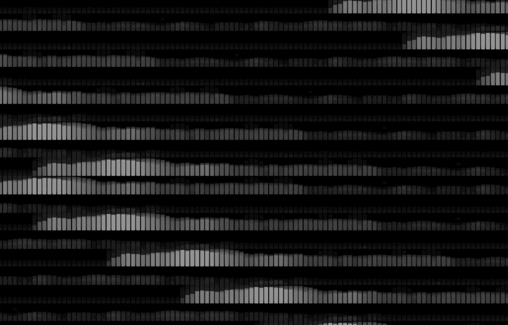
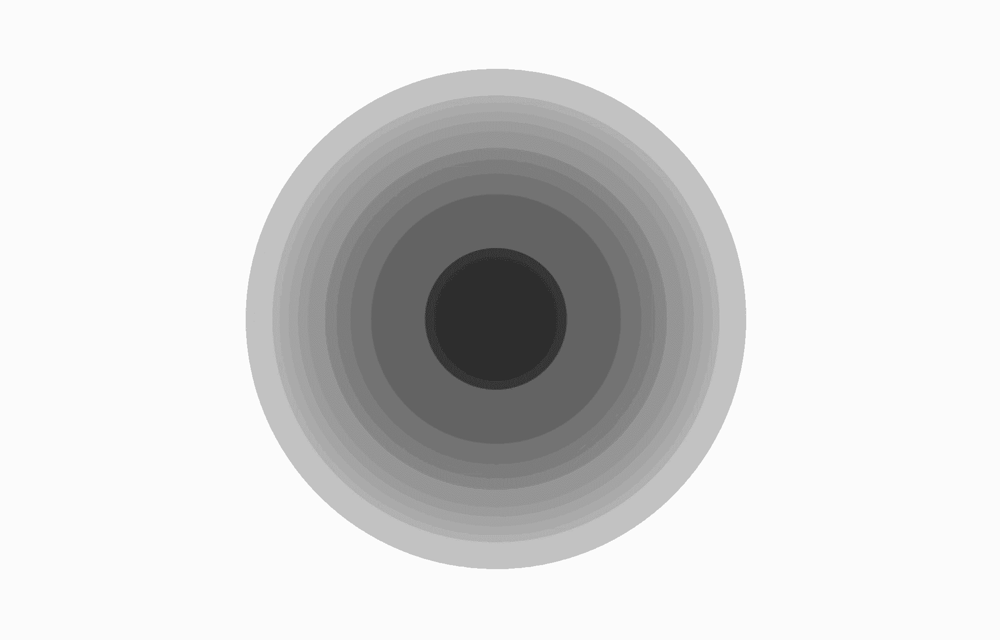
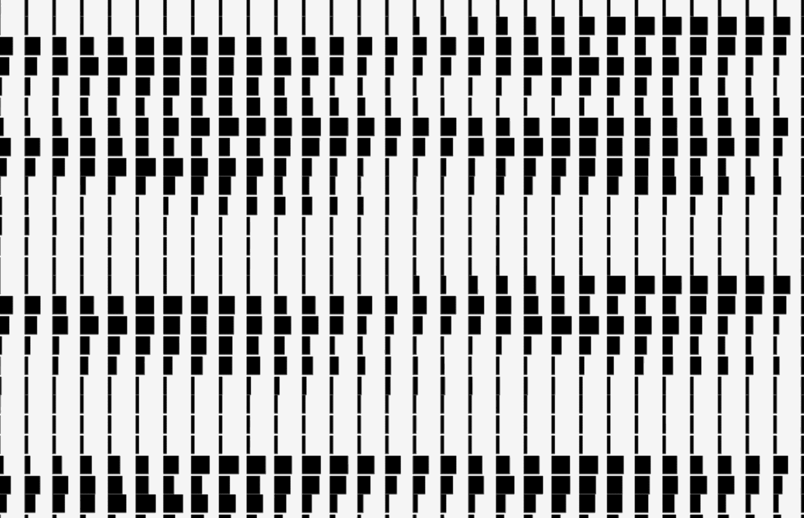
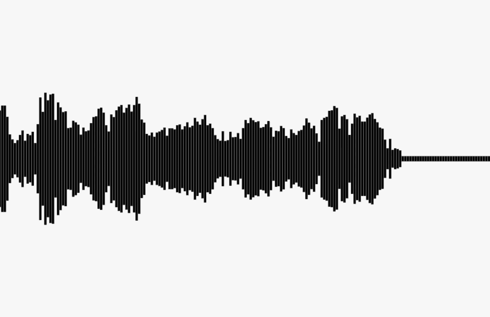
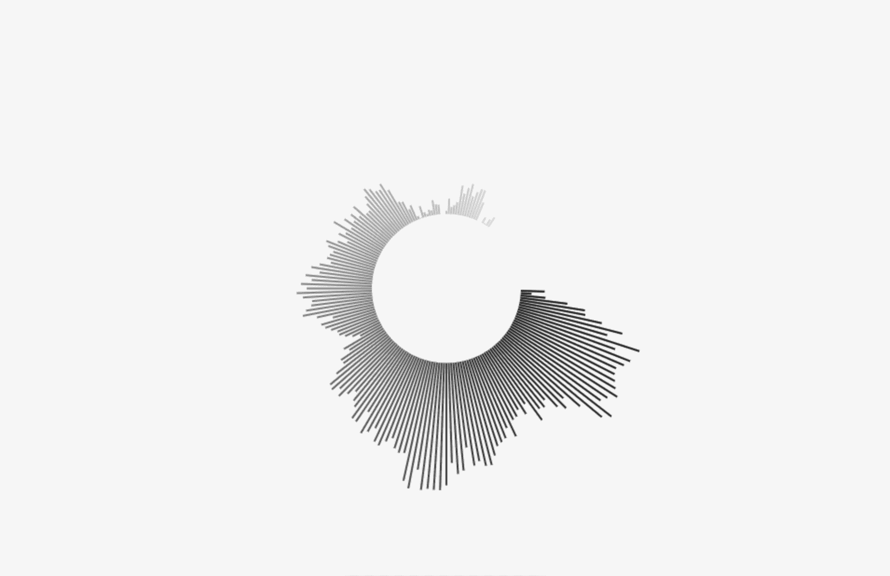
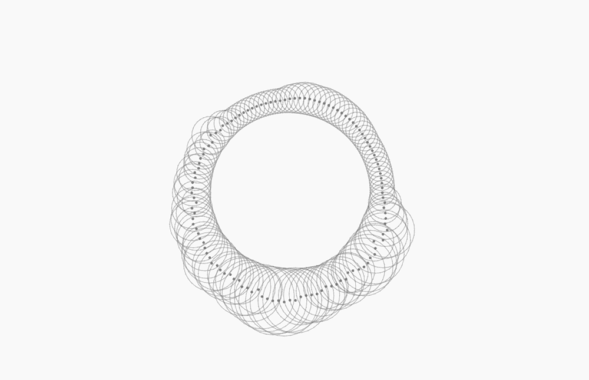

# 使用麦克风在 Javascript 中制作声音反应艺术

> 原文：<https://medium.com/hackernoon/creative-coding-using-the-microphone-to-make-sound-reactive-art-part1-164fd3d972f3>



## 利用声音制作生殖艺术作品的技巧

欢迎来到创造性[编码](https://hackernoon.com/tagged/coding)基础的下一期。这里可以看到以前的教程[。](/@radarboy3000)

和往常一样，我的 github 上有完整的代码:【https://github.com/GeorgeGally/creative_coding 

设置一个麦克风对象是非常基本的，尽管乍一看似乎很复杂。不要有压力。即使你没有完全理解，你也不需要理解。因为一旦它开始运行，你就再也不用写它了…有很多教程可以更深入地解释它。但是我还没有真正看到从基本的 hello world 到下一个级别的提示。这就是我想给你们展示的。

让我直截了当地说，这在 Safari 中不起作用。从来没有。有后退，使它能够工作…但真的，我已经完成了低于标准的浏览器的工作区，所以你应该。

**另外请注意:从去年开始，要使用麦克风，您需要使用 https 连接。如果你使用的是类似于** [**Atom 的**](https://atom.io/)**[**Live Server**](https://atom.io/packages/atom-live-server)**(你应该相信我)那么它会自动为你设置一个。****

**所以首先，非常无聊的事情，设置麦克风对象…不要害怕…**

```
function Microphone (_fft) { var FFT_SIZE = _fft || 1024; this.spectrum = [];
  this.volume = this.vol = 0;
  this.peak_volume = 0; var self = this;
  var audioContext = new AudioContext();
  var SAMPLE_RATE = audioContext.sampleRate;

  *// this is just a browser check to see
  // if it supports AudioContext and getUserMedia*
  window.AudioContext = window.AudioContext ||  window.webkitAudioContext;
  navigator.getUserMedia = navigator.getUserMedia || navigator.webkitGetUserMedia; *// now just wait until the microphone is fired up*
  window.addEventListener('load', init, false); function init () {
      try {
        startMic(new AudioContext());
      }
      catch (e) {
        console.error(e);
        alert('Web Audio API is not supported in this browser');
      }
  } function startMic (context) { navigator.getUserMedia({ audio: true }, processSound, error); function processSound (stream) { *// analyser extracts frequency, waveform, etc.*
     var analyser = context.createAnalyser();
     analyser.smoothingTimeConstant = 0.2;
     analyser.fftSize = FFT_SIZE; var node = context.createScriptProcessor(FFT_SIZE*2, 1, 1); node.onaudioprocess = function () { *// bitcount returns array which is half the FFT_SIZE*
       self.spectrum = new Uint8Array(analyser.frequencyBinCount); *// getByteFrequencyData returns amplitude for each bin*
       analyser.getByteFrequencyData(self.spectrum);
       *// getByteTimeDomainData gets volumes over the sample time*
       // analyser.getByteTimeDomainData(self.spectrum);

       self.vol = self.getRMS(self.spectrum);
       *// get peak - a hack when our volumes are low*
       if (self.vol > self.peak_volume) self.peak_volume = self.vol;
       self.volume = self.vol; }; var input = context.createMediaStreamSource(stream);
     input.connect(analyser);
     analyser.connect(node);
     node.connect(context.destination); } function error () {
     console.log(arguments);
  }}*//////// SOUND UTILITIES  ////////**///// ..... we going to put more stuff here....*return this;};var Mic = new Microphone();
```

**这将给我们一个跨频率的振幅数组(512 是我的默认值)，显示为 *Mic.spectrum* 。**

**好，那么我们开始玩吧…**

# **获取总体积:**

****

**Make some noise!**

**我并不经常使用这个工具，但是它很方便，并且将会在许多其他实用程序中使用。为了获得我们的总音量或级别，我们使用了一个 *getRMS()* 函数。RMS 是声音输入总音量的一个更好的指标，它只是所有频谱平方的所有音量的总和。因此，我们添加到我们的 *Mic()* 对象的函数将如下所示:**

```
*// A more accurate way to get overall volume*
this.getRMS = function (spectrum) {var rms = 0;
  for (var i = 0; i < vols.length; i++) {
    rms += spectrum[i] * spectrum[i];
  }
  rms /= spectrum.length;
  rms = Math.sqrt(rms);
  return rms;
 }
```

**所以我们可以创建上面这样简单的动画:**

```
var ctx = createCanvas("canvas1");
ctx.background(235);function draw(){var s = Mic.getRMS();
  ctx.fillStyle = rgb(s*2);
  ctx.HfillEllipse(w/2, h/2, s*5, s*5);
}
```

# **获得声谱:**

****

**我们的 *Mic()* 对象公开了 *Mic.spectrum* ，其中是我们频谱上的振幅或音量数组(或 FFT_SIZE，512 是我的默认值)。我们可以像这样使用它们..**

```
var ctx = createCanvas("canvas1");// make a grid 200 wide
// *I covered how to make grids* [*here*](https://hackernoon.com/creative-coding-grids-2e6bcaa07596#.u4zyrccxr)
var grid = new Grid(200, 1);function draw(){ctx.background(235);for (var i = 0; i < grid.length; i++) {
    **var s = Mic.spectrum[i];**
    ctx.fillStyle = hsl(map(i, 0, grid.length, 0, 360), 80, 50);
    ctx.fillRect(grid.x[i], h - s, grid.spacing_x-1, s);
  }}
```

**然而，我发现通过建立一个简单的声音映射函数，它会更方便，并得到更好的结果…**

# **映射声音:**

****

**例如，如果我们只有 20 个对象，但我们的频谱返回 512 个频率(这是 *Mic()* 对象的默认设置)，分配振幅以更准确地反映我们的声音会更有意义。所以让我们重新映射我们的光谱。**

**首先，我会经常使用一个简单的 *map()* 函数，它在我的主 [creative_coding.js](https://github.com/GeorgeGally/creative_coding) 文件中，看起来就像这样:**

```
function map(value, min1, max1, min2, max2) {
 var returnvalue = ((value-min1) / (max1 - min1) * (max2-min2)) + min2;
 return returnvalue;
};
```

**在此基础上，我们可以构建一个 *mapSound()* 函数来最终分配这些值。这可能是你最有价值的声音分析工具。我几乎每天都用这个。超级方便简单:**

```
this.mapSound = function(_me, _total, _min, _max){if (self.spectrum.length > 0) {
   // map to defaults if no values given
   var min = _min || 0;
   var max = _max || 100;
   //actual new freq
   var new_freq = Math.floor(_me * self.spectrum.length /_total);
   // map the volumes to a useful number
   return map(self.spectrum[new_freq], 0, self.peak_volume, min, max);
  } else {
    return 0;
  }

}
```

**我们可以很容易地创建一个这样的光谱:**

****

**Testing, testing, 1, 2, 3.**

**频谱可视化由网格组成，声音映射到网格的长度(*我讲述了如何制作网格* [*这里*](https://hackernoon.com/creative-coding-grids-2e6bcaa07596#.u4zyrccxr) *)。*我还将返回值( *_min* 和 *_max* )映射为 5 和 height/4，这样看起来更好:**

```
var ctx = createCanvas("canvas1");*// make a grid 200 wide* var grid = new Grid(200, 1);function draw(){ctx.clearRect(0,0,w,h);for (var i = 0; i < grid.length; i++) {
    *// Mic.mapSound(_me, _total, _min, _max)*
    **var s = Mic.mapSound(i, grid.length, 5, h/4);**
    ctx.fillStyle = rgb(0);
    ctx.fillRect(grid.x[i], grid.y[i] - s/2, grid.spacing_x-0.5, s);
  }}
```

**真的， *mapSound()* 会照顾你的大部分音频分析需求。通常有了声音观想，简单效果最好。创造性编码的诀窍实际上是在彼此的基础上构建简单的比特，以制造看起来更复杂的东西。因此，举例来说，我们可以使用一些我们之前学过的 [Math.cos 和 Math.sin 技巧](https://hackernoon.com/math-sin-and-math-cos-the-creative-coders-best-friend-597d69000644#.hs4cfjno1)来获得一个漂亮的径向光谱:**

****

**Look mom, a radial spectrum**

**下面是代码，如果你一直在跟随这个系列，它一点也不复杂，只需创建一堆粒子，并将每个粒子的线的长度映射到其各自的体积:**

```
var ctx = createCanvas("canvas1");var num_items = 200;
var radius = 100;
ctx.lineWidth = 2;
var particles = [];// working out the angles 
for (var i = 0; i < num_items; i++) {
  var angle = radians(distributeAngles(i, num_items));
  particles[i] = {
    x: w/2 + Math.cos(angle) * radius,
    y: h/2 + Math.sin(angle) * radius,
    angle: angle
  }
} function draw(){ ctx.background(0); for (var i = 0; i < num_items; i++) { var p = particles[i];
  **var s = Mic.mapSound(i, num_items, 5, 100);**
  // map to greyscale
  //ctx.strokeStyle = rgb(map(i, 0, num_items, 0, 255));

  **x2 = w/2 + Math.cos(p.angle) * (s + radius);
  y2 = h/2 + Math.sin(p.angle) * (s + radius);**
  ctx.line(p.x, p.y, x2, y2); }}
```

**这些代码可以被改编成类似这样的东西，这是我最早的 Javascript 声音反应作品之一…**

****

****就这样。我们完了。下一次，我们将添加一大堆更有用的工具来获得低音、中音、高音、调等等，让你的声音可视化更加容易...快乐编码……****

**像往常一样，我的 github 上有完整的代码:[https://github.com/GeorgeGally/creative_coding](https://github.com/GeorgeGally/creative_coding)**

**你可以在这里看到我之前所有的教程[。](/@radarboy3000)**

****如果你愿意，跟我来:****

**[**https://www.instagram.com/radarboy3000/**](https://www.instagram.com/radarboy3000/)**

**[**https://twitter.com/radarboy_japan**](https://twitter.com/radarboy_japan)**

**[**https://www.facebook.com/radarboy3000**](https://www.facebook.com/radarboy3000)**

**[](http://bit.ly/HackernoonFB)****[](https://goo.gl/k7XYbx)****[](https://goo.gl/4ofytp)**

> **[黑客午间](http://bit.ly/Hackernoon)是黑客们下午的开始。我们是 [@AMI](http://bit.ly/atAMIatAMI) 家族的一员。我们现在[接受提交](http://bit.ly/hackernoonsubmission)并很高兴[讨论广告&赞助](mailto:partners@amipublications.com)的机会。**
> 
> **如果您喜欢这个故事，我们建议您阅读我们的[最新科技故事](http://bit.ly/hackernoonlatestt)和[趋势科技故事](https://hackernoon.com/trending)。直到下一次，不要把世界的现实视为理所当然！**

****