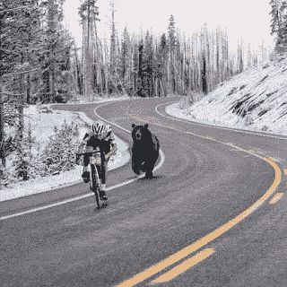
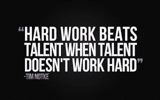

# 创造性破坏席卷翻译行业:现在就进军高端市场，否则就有被淘汰的风险

> 原文：<https://medium.com/hackernoon/creative-destruction-engulfs-the-translation-industry-move-upmarket-now-or-risk-becoming-obsolete-a6acb9ed4eb9>

*这是一篇由* [*凯文·亨泽尔*](https://www.blogger.com/profile/13134174901029466746) *发表的客座博文，他之前在* [*翻译市场*](https://kv-emptypages.blogspot.com/2014/09/the-translation-market-is-it-really.html) *发表的博文，就长期受欢迎程度和在该博客上的广泛读者群而言，仅次于编辑后补偿博文。这篇新帖经许可转载，也可在 Kevin 的博客* *上看到，并附有更多照片。对于我经常关注的问题，我总是有兴趣听到不同的观点，因为我相信学习就是这样发生的。*然而，结果是凯文先写了他的帖子，世界末日帖子可能是对它的回应。史蒂夫提出了一个相当严峻的前景，看不到多少希望。他的帖子上的一些评论建立在这种悲观和令人生畏的前景之上，也值得一看。我自己觉得《世界末日邮报》的作者(史蒂夫·维特克)真的需要放松一下，也许可以做一些跳跃运动，唱一首“嘿，裘德”(一首众所周知可以振奋精神的歌曲)，但我真的不想减少他的痛苦或以任何方式嘲笑他。我也有 [*尝试用我自己的方式教育译者*](https://kv-emptypages.blogspot.com/2017/01/the-driving-forces-behind-mt-technology.html) *如何处理 MT 的误用和滥用，了解后期编辑的“机会”和一般的翻译技术，因为我见过的大多数译者都是非常好的，世俗的人。*

无论如何，凯文对机器翻译采取死记硬背、低质量、远离翻译人员的“批量翻译”工作的情况做出了更务实、更不顺从的回应，并建议翻译人员“提高自己的水平”并获得深入的专业知识。此外，他还提供了一些非常具体的例子，为其他翻译人员提供一些可靠的线索，帮助他们制定更好的未来专业策略，而不是翻译大量机器翻译可以轻松处理的内容，或者等待 LSP 给你打电话。如果你在他的博客上错过了，这里是全文，减去一些照片。

— — — — — — — — — — — — — — —

想象一下，你从事数码相机的生产。事实上，让我们更进一步，说你发明了数码摄影。这些相机一开始有点贵，最初的图像很糟糕，但它们的创新之处在于它们取消了胶片和胶片处理；这些照片立即可见，可以存储、分享和张贴到几乎任何地方，照片质量最终变得惊人地好。然后智能手机出现了。五年前，它们异常昂贵，但白热化的智能手机市场是苹果和三星等创新公司之间残酷竞争的代名词，价格、功能、寿命和物理弹性都有了显著增长。因此，今天这样的创新导致了智能手机市场的快速发展，图片分辨率、像素存储容量和共享能力都有了突飞猛进的增长。今天的智能手机相机比数码相机更小巧，更容易使用，传输和存储图像更快，几乎可以放在每个人的口袋里。答案是:非常非常少的人有。《福布斯》称数码相机市场的崩溃是现代商业市场最快、最令人震惊的毁灭之一。智能手机市场一直在狂奔，不仅是为了夺取市场份额，也是为了摧毁整个数码相机市场，这一过程始于 2010 年，最终导致发明数码摄影的公司柯达破产。1975 年发明数码摄影的柯达工程师史蒂夫·萨森(Steve Sasson)被柯达高管告知“保持沉默”，因为这危及了他们的主要收入来源——胶片的销售。“保持沉默”策略是对破坏性创新的可怕防御。柯达留下的一堆瓦砾和陈旧的专利就是这一现实的有力证明。

与翻译市场的相似之处显而易见。在过去的 15 年中，谷歌翻译(GT)一直在不断提高质量，在其庞大的语料库中包含了数十亿个成对语言字符串的单词，这些语料库当然是由我们在联合国、欧盟、欧洲专利局、加拿大政府等国际组织以及其他多个组织的同事提供的人工翻译。这些是很好的人工翻译，甚至不需要统计机器翻译。具有讽刺意味的是，呼吁译者合作以产生更高的质量——这些呼吁通常被忽视——是 GT 实际上正在做的事情。它是在大规模的全球范围内利用你所有同事的工作，并作为捆绑产品免费提供。

GT 已经成为现代翻译版的智能手机。大宗市场上的翻译仍在试图销售数码相机，并疯狂地看着价格继续下降，在那里销售“足够好的质量”。这是同一个市场，客户认识到 GT 往往是错误的，但它是即时的，免费的和“足够好的质量。”现在 GT 完美了吗？当然不是。但智能手机也不是。灯光经常关着，或者让人觉得不受宠若惊，就拍几张，挑一张自己最喜欢的。Snapchat 等平台提供滤镜，让人变好看，或者变瘦，或者调整脸部颜色甚至变成各种可爱的生物。全部免费。

*(KV——实际上，谷歌从广泛使用其移动终端服务中获得了可观的广告收入，并通过分析移动终端使用产生的大数据揭示了国际商务活动的趋势。)*

人们接受智能手机的这些不完美，而不是一台非常好的高端数码相机能够产生的效果——就像他们耸耸肩接受翻译的不完美一样——因为人们的预期发生了重大转变。即时、免费、方便、“够好”改变了人们的期待。这就是为什么 GT 每天翻译的单词比所有人类翻译人员一年翻译的单词多几百万的原因。这里有一个有趣的问题。作为一名拥有智能手机的翻译，你会花几百美元买一台数码相机来拍摄你现在用智能手机拍摄的照片吗？我想我们可以有把握地说，这个问题的答案是“不”。然而，这正是大量“好到足以理解”市场上的翻译每天都在要求他们的客户做的事情。付钱给他们，让他们翻译 GT 实际上可能会做得更好的文本(请记住，GT 通常只是利用你的非常熟练的同事的现有翻译)。

***客户清醒到新的现实***

现在，我们正在见证大宗市场的客户——代理商、小企业，甚至大公司——开始意识到这一现实。“只需要知道文档内容”的客户甚至开始反对人类需要带头的想法。如果他们在 GT 上看到不同的翻译，他们经常会质疑译者的翻译。他们要求较低的个位数的翻译率，这几乎需要使用 GT，这使得翻译成为不情愿的后期编辑。摄影师肯·洛克威尔的一句名言反映了这些客户的观点:“你能使用的最好的相机就是你随身携带的那台。”在翻译界，越来越多的人选择 GT——那些没有提高自己技能以进入高端市场的翻译们感觉到了这股逆流。而且情况越来越糟，翻译费率持续下降，翻译感觉像商品一样，每个人都被认为与其他人没有什么区别。继续我们对智能手机的类比，让我们认识到，总会有一些市场，智能手机根本无法像相机一样工作。在这些领域，质量确实很重要，摄影师的专业技能非常关键，而且报酬丰厚。例如:

*   从汽车到食品的各种产品的专业照片拍摄，供公司高端专业使用；
*   专业投资组合的头像；
*   摄影新闻，其中图像的影响需要非凡的才能来捕捉；
*   婚礼和特别活动摄影；
*   出于商业目的对媒体、体育和娱乐进行现场报道；
*   灯光的演播室设置，高端设备以及使用它们的技巧。

换句话说，同样的市场也存在，但它们位于“好到足以理解”的大宗市场之上几英里。这些市场被称为“增值市场”和“溢价市场”(区别将在下面讨论)，典型的产品包括:

*   法律要求的由跨国公司发布的年度报告和正式财务披露声明，翻译人员必须掌握监管问题和复杂的财务规则；
*   世界 500 强企业、投资银行、高端消费品公司等高调广告。在高声望的场所；
*   科学和工程领域专业出版的期刊、文章和文献，要求翻译人员接受高级技术培训；
*   对国家安全至关重要的广泛领域中的外交和情报数据，包括机密和非机密数据，在这些领域中，翻译往往与分析混在一起，需要特殊的专业知识；
*   翻译适应了不同的文化，两种产品最终成为完全不同的艺术作品。

就像一个非常有才华的摄影师可以在上面的例子中“让魔法变得生动”一样，一个非常有才华的译者也可以在翻译的例子中“让信息变得生动”。注意，我没有说让“文本”或“单词”活起来。这些往往是译者最大的敌人，因为他们被困在翻译单词而不是翻译思想——那些单词所表达的。正如我一直认为的那样:“翻译不仅仅是文字。这是关于单词的内容。”摄影师肯·洛克威尔也有一句名言:“相机唯一的工作就是不妨碍拍摄。”这表明了我们一直以来都知道的事情——是摄影师和翻译的天赋、专业知识、经验和合作才能让这些艺术家有可能创造艺术:能够在增值市场和行业的最顶端工作:高端市场。很快，这将是这个行业中仅有的几个为专业摄影师或翻译而存在的领域。大宗市场。GT 构成单一威胁并已经对费率产生巨大有害影响的市场是我们所谓的“批量市场”，估计 60%的商业翻译是“出于信息目的”，或者是“传达基本信息”，其中“足够好”是标准，价格是选择的主要依据，因为 GT(免费)被认为是一个严肃的选择。未受过教育的客户也越来越多地使用 GT 进行“对外”翻译:翻译成他们客户的语言，以便在广阔的普通消费者市场上向他们自己的客户销售他们的产品，或者使用未受过教育的客户不理解的语言进行软件和 web 内容本地化。这种方法的缺陷是显而易见的，因为客户无法判断结果，但谷歌的品牌力量和 GT 对其翻译观点的思想共享已经将“供参考”的译者挤出了画面。例如，联合航空公司(United Airlines)最近使用 GT 和一点点后期编辑来翻译他们有关乘客被暴力拖下飞机的道歉信，导致翻译虽然可以理解，但在目标语言中远非完美或有说服力。把这看作是联合航空公司试图提升形象的又一次公关失误。人们可能会认为，这种敏感而微妙的沟通会直觉地迫使管理层要求最好的，但我们看到，谷歌巨大的品牌影响力就像平面上的水一样——它会找到裂缝，然后流入所有裂缝。

“增值市场”是一个高端领域，需要特殊的专业知识、经验和敏感性。虽然还不是高端市场，但它比批量市场迈出了坚实的一步，在进入高端市场之前，译者通常会在那里工作多年，磨练自己的才能和专业知识。增值市场是翻译通常在一个专门的主题领域，对客户来说足够敏感以至于一想到使用 GT 或任何机器翻译就停下来。这个问题的复杂性足以让客户产生怀疑。翻译错误的风险可能很大。在这些市场工作的翻译(典型的价格在 0.15 美元到 0.20 美元之间)已经完成了大学水平的专业培训，是杰出的作家，并且在很大程度上已经完成了向直接客户和最好的精品代理的转变，同时终止了他们与低端批量市场代理的关系，并且不再考虑随机的代理询问。主题领域的示例包括:

*   医疗、制药和保健翻译的整个范围，包括临床试验、医疗设备和仪器、病历和图表、医生笔记；医师评价人培训、监管和合规以及其他卫生保健专业；
*   IT 和电信，主要关注创新和下一代技术解决方案；
*   公司、机构和法律层面的会计和审计；
*   环境科学、石油和工业工程；
*   娱乐:全国网络和媒体层面的字幕、画外音和 A/V。

虽然这显然是一个有代表性的列表，但它很难做到面面俱到，并且在一些领域与上面提供的列表重叠，以与散装市场形成对比。但是，这个增值市场不是多面手或大宗市场翻译的领域——那些在这些领域推销自己而没有真正专业知识来取得成功的人肯定会失败。在这个市场取得成功的门票来之不易，成功需要天赋、承诺、对主题的透彻了解和出色的表现记录。要想成为一名不情愿的后期编辑或陷入较低的个位数翻译率，铁定的办法是成为一名专业翻译。一个专家。真正的艺术家。这需要非凡的学科领域知识，精湛的写作技巧，以及与你最有才华的同事们的终生合作。这里有一些关于散装和溢价市场的残酷事实。这将有助于翻译人员避开长期低价竞争的大市场陷阱。人们一眼就能看出专业高端市场译者的工作和普通大众市场非专业人士的工作之间的区别。这是毕加索和第五代黑白照片的对比。现在，很明显，我们都是从制作这些颗粒状影印件的新手开始的，花了一生的时间工作、研究、合作和发展主题专业知识，才进入毕加索的范围——弄清楚这一点很重要。这些“并列”翻译可以追溯到十年前。一些来自“神秘顾客”实验，另一些来自翻译工作室，我们在高端市场的大多数人已经教了至少十年，所以我们实际上看到了房间里质量的巨大差异！这在整个行业中并不是一个谜或未知。甚至一些原始的 GT 比许多年轻的，没有经验的，不会写作的，或者不知道他们在翻译什么的译者更早完成。从事翻译抨击或其他竞争的译者，他们采用相同的文本，然后公开比较他们的翻译，数百名其他译者见证了这一过程，中间有一名严厉的评委，讨论备选翻译、含义的细微差别、法律和金融解释等细节。展示当对自己的工作有信心的翻译者——既高度专业化，也由同事定期修改——愿意将他们的翻译放在那里让所有同事看到时，你看到的巨大差异。

在大多数情况下，这些比赛发生在高端市场的活动中，如专门针对法国的“翻译…”系列，以及由法国 SFT 赞助的一些比赛，以及最近的 ITI 会议。

这里有一个铁一般的规则:如果你的翻译没有被你的同事“冒着风险”评估，你就没有做好。你需要动手实践、硬技能协作研讨会；翻译骂人；分享你的作品给每个人看。打入这些市场的方法不仅仅是孤立地进行翻译，没有主题培训或合作，因为支付高额费用(每字 0.5 美元以上)的客户都深入从事法律、银行、工业和技术方面的工作，通常不在翻译世界与翻译人员交谈。

我不能告诉你有多少律师——只是随机挑选一个职业——我知道谁成为了翻译，因为他们厌恶和厌倦了多年来从大量不同的翻译那里定期获得的“质量”,这些翻译翻译翻译了一份合同，然后将自己推销为“法律翻译”因此，要想获得更高的回报率，首先要有专业知识。你必须了解法律的细微之处，比如说，提供一个短语的五种不同翻译，并向你的客户准确解释它们在你的源语言中有什么不同，以及你作为专家认为在他们的语言(你的目标语言)中什么是重要的。没错——你可以向一个用母语讨论文本的律师解释法律的细节。这就是高端市场。如果你不能做到这一点——如果你不能用 5 种不同的翻译方案详细地讨论法律，并与律师(或工程师、或银行家、或物理学家、或注册金融分析师)就该主题提出充分的理由——那么你还没有到那一步。所以你的专业水平应该和那个领域的从业者相当。这需要真正的专业知识，而不是轻量级的 CPD，所以希望在大学辅修这些科目，或者回去接受正式培训。这意味着正规的大学培训。没有这种水平的知识和专业技能，你不会看到你每天在文本中犯的错误，而真正的学科专家会立即发现这些错误(几个在社交媒体上很容易认出名字的译者最近出版了包含大量科学错误的书籍——他们没有任何线索。不要成为他们。)跳过这一步意味着你不仅向你的客户交付了一个不合格的产品，而且你的竞争对手在这一领域拥有专业知识，很快就会把你的客户抢走。在这个阶梯上还有很多步骤，其中大部分涉及到与其他更有经验的同事的日常协作。我知道人们一定厌倦了听我说这些，但是如果没有其他聪明的、有创造力的、有思想的和积极投入的同事的专业知识，就没有其他方法可以达到这个行业的顶峰。找一个专家审校(或更多)来审核你翻译的每一个单词。与那些技能与你互补，但经验比你丰富的翻译建立审校伙伴关系。理想情况下，它们应该来自一个制度框架，所以如果你把物理学翻译成英语，应该由美国物理研究所的其他比你更有专业知识的物理学家翻译来修改。让他们在每次作业中与你分享他们的标记副本。没有其他方法可以避免存在于你头脑中的翻译的“回音室”，或者避免重复犯甚至是明显的错误，因为下游没有人费心去纠正你。然后你必须走出去，参加和你的客户一样的活动。你还必须公开分享你的翻译——也许可以练习一下——看看你和其他 20、30 或 50 名自称“专家”的译者相比如何有一天——如果你这样做的时间足够长——你会发现你的工作在很长一段时间内取得了增量改进，五年或十年前你所生产的产品与今天你所生产的产品之间的差距将为你在高端市场取得成功指明正确的方向。其他看到你有多优秀的翻译人员会开始把他们难以处理的工作转交给你。在相反方向工作的其他翻译也会听说过你，并且会很高兴有一个值得信赖的名字推荐给他们在相反方向工作的客户。人才、经验、专业知识和您的最终产品决定了价格。而不是相反。随着你通过专业化、协作和磨练写作技巧而提高，定期提高你的费率。如果你需要用耳罩来对抗低球客户的痛苦嚎叫，就用耳罩。一旦工作流上升到无法以高质量的方式提供服务的程度，就使用费率作为控制工作流的一种方式。如果你进入了高端市场，要知道每字 0.50 美元是一个普通价格，而项目价格正在成为主要的报价惯例。此外，需求很大，因为根本没有足够的翻译人员能够进行这种水平的翻译。翻译很多。每天都是。就像职业运动员每天刻苦训练一样，你在市场上的成功将取决于你对定期翻译、定期审查、定期修改/更正、定期提高费率、为客户提供卓越服务以及以这种方式提升自己的执着追求。

最后，微笑。笑吧。友善点。你非常幸运能在你热爱的领域取得成功。有多少人能这样评价自己的作品？

你可以在这里得到更多关于他的信息。

*原载于 2017 年 7 月 19 日*[*【kv-emptypages.blogspot.com*](https://kv-emptypages.blogspot.com/2017/05/creative-destruction-engulfs.html)*。*