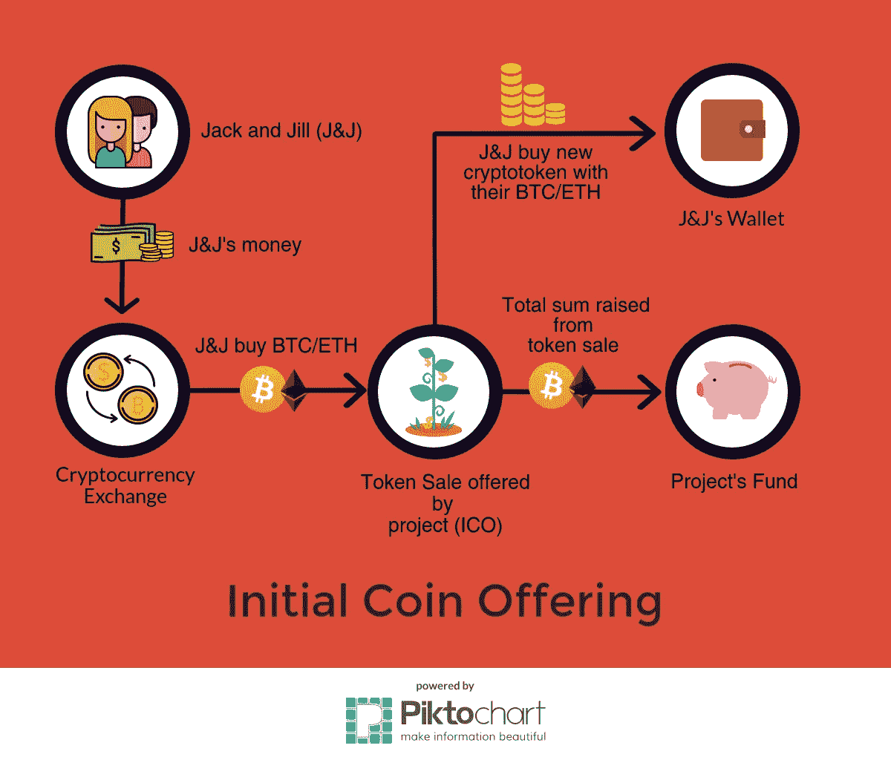

# 如何识别欺骗性代币销售

> 原文：<https://medium.com/hackernoon/criteria-to-evaluate-icos-spot-scams-a48492067b62>

## 批判性评估 ICO 的终极清单

*文章最后更新于 2019 年 10 月。*

这场 [ICO](https://hackernoon.com/tagged/ico) 风暴才刚刚开始。今天，首次公开募股(ico)是许多早期阶段(通常是区块链)平台用来筹集众包资金的一种技术。

**如何？**通常，有问题的平台/项目将其底层加密令牌公开出售，以换取现有的加密或法定货币。

**谁购买？**谁都可以。你，我，你的朋友，你在世界各地的笔友，任何人！与公司向天使投资人和风险投资人分发股份的首次公开募股不同，ico 向公众开放。

虽然项目/平台出售一定比例的代币来筹集资金，但每个看到潜力并购买这些代币的人都希望市场飙升——给他们带来巨大的投资回报。通过这种方式，承担潜在大项目投资风险的早期买家(如早期投资者)将获得最大收益。

A flowchart depicting the basic mechanism of an ICO. Copyright reserved.

此外，由于在大减价期间象征性的价格通常很低，这使得它更加有利可图。结合流行的猜测，你就有了非常真实的 FOMO！

## 还有一大笔钱

随着公司筹集到破纪录的金额[、Filecoin 的 2.52 亿美元](https://www.coindesk.com/200-million-60-minutes-filecoin-ico-rockets-record-amid-tech-issues/)和 Tezos 的 2.32 亿美元，越来越多的项目更倾向于寻求 ICO，而不是无数轮的风险投资。

目前，市场上大约有 600 种加密硬币，几乎每天都有新的硬币诞生。

## 那是什么问题呢？

> 由于缺乏法规和法律标准，项目经常精心策划[泵送和倾卸](https://venturebeat.com/2017/08/26/the-ico-world-is-full-of-pump-and-dump-schemes-dont-be-a-victim/)方案，在从公众那里获得 **$$$$之后就销声匿迹**或者根本无法渡过难关和扩大规模。

虽然没有来自第三方、银行机构或政府的干预被视为任何去中心化系统的 USP，但事实上贪婪已经占据了许多人的心。一次又一次，你会看到，随着公司试图滥用这一惊人的技术，重新浮出水面！

不用说，分析一个给定 ICO 的所有方面是非常重要的。

# 识别 ICO 骗局:清单📝

在制定法规或有更成熟的标准和框架来评估 ICO(我相信这将在未来几年出现)之前，我们必须在购买代币之前对 ICO 的各个方面进行分析，特别是如果我们想收回我们闪亮的美元。

在我开始之前，这里有一个关于 HelpTap 上密码爱好者和专业人士用来评估 ICO 的标准的[深刻线索](https://helptap.com/q/what-criteria-do-you-use-to-evaluate-an-ico-investment-1507983351799)(*完全披露:我在 HelpTap 的产品驱动型增长方面工作，这是一个成员围绕* [*【区块链*](https://hackernoon.com/tagged/blockchain) *、ICO 和私人一对一聊天的密码空间*分享他们的知识和意见的平台。

虽然已经有很多关于必读的[技术细节](https://www.coindesk.com/evaluate-blockchain-initial-cryptocurrency-offering/)的精彩文章，但我将通过这份清单来尝试简化评估 ico 的过程，以便来自非技术背景的任何人都可以更好地权衡他们的选择。以下是一些因素:

# 1.🛠️项目的阶段

几个月前，即使是一个稍微有点创新的项目也会(就像现在一样)引起足够的轰动，从而筹集到巨额资金。然而，随着最初的喧嚣逐渐平息，人们对骗局越来越怀疑，如果一个人希望进行合理的投资，项目的阶段已经成为一个决定性的标准。

通常，项目在三个不同阶段提供 ICO:

👉**仅网站项目(=创意)**

👉**白皮书支持的网站(=想法+计划)**

👉**由用户群支持的工作产品(=想法+计划+概念验证)**

1.  **纯网站项目**

与处于创意阶段的初创公司相比，纯网站项目是投资风险最大的。如果你想确保物有所值，单纯的登陆页面(无论多么美观)不应该进入你的投资组合。

**2。白皮书支持的网站**

最通俗的说，ICO 项目就属于这个阶段。他们通常有一份结构良好的白皮书，清楚地解释了:

*   项目背后的技术
*   他们在相当大的市场中的潜在地位
*   他们颁发的令牌的核心用途，以及
*   可行的路线图。

如果白皮书给人的印象是缺乏可操作的里程碑的计划外汇编，不透明，没有增加任何明确的价值，你可能会想要退出。

读完白皮书后，问问你自己:这个项目需要建立在区块链吗？还是现在在区块链更好？

^The last feeling you should get after reading a whitepaper. Source: Giphy.

此外，您可以检查 Github 库中的代码漏洞。即使你不是技术人员，也要检查他们开源软件的提交数量——这显示了项目的持续发展。不言而喻——缺少提交，通常是一个不好的迹象，表明停滞不前。

**3。用户群支持的工作产品**

到目前为止，最安全的赌注是，具有经验证的用例和用户基础的项目往往是最可靠的。[例如，Tezos](https://www.tezos.com/) 早在 2014 年年中就发布了他们的白皮书，从那以后，他们一直处于开发模式，Github repo 上有近 600 次提交，显示-

a)透明度 b)在开发人员社区中有良好的追随者 c)工作产品。

> **警告信号:**Github 上没有出现，这是一个复杂的登录页面，有有力的文字但没有真实的数据，杂乱的白皮书没有提供长期的可扩展价值。

# 2.硬币的类型和用途💰

由于一个特定的 ICO 表示一种全新硬币的创造，所以评估正在发行的硬币的类型和内在目的是关键。

Gil Penchina 在这里精彩地概述了评估一枚硬币用途的重要性[。](/breathe-publication/rules-i-use-to-evaluate-icos-e79e206cbe40)

分析正在发行的令牌的价值主张是第一步。有明确的主张吗？

硬币是否为项目的生态系统增加了核心价值？这个项目绝对需要一枚新硬币吗？

重点是:一个人必须客观地评估硬币是否给平台的价值主张增加了任何实际价值。

另一个需要考虑的关键因素是代币的供应是否有硬性规定。分散货币的一个重要特征是，与货币相反，代币的价值永远不会随时间贬值。

在代币网络中，新的硬币不断被创造出来并加入到经济中，这往往会降低每枚硬币的价值(就像纸币一样)！

> **警告信号:**硬币是不必要的，不能解决任何现实世界的问题。

# 3.路标📍

*“短期来看，市场是一场人气的较量。从长期来看，市场是一台称重机。”——沃伦·巴菲特。*

可扩展的、结构良好的路线图是另一个需要考虑的因素。评估路线图时，询问一些重要问题，如:

*   他们是否制定了募集资金的使用计划？他们的计划包括市场营销、R&D 等吗？
*   他们是否有清晰的产品构建渠道？
*   他们的用户获取策略是什么？
*   他们计划如何发展他们的团队？

> **警告信号:**路线图不清晰或千篇一律，计划中的太少或太多。

# 4.组💪

在评估了项目的阶段、象征性效果和路线图之后，评估支持项目的团队的专业知识是明智的。可以肯定地说，如果一个车队有区块链的经验，那就没有什么比这更好的了。这意味着他们知道自己将面临什么，并将(希望)像老板一样处理。

如果没有，对他们以前的项目做一个背景调查。他们以前成功过吗？他们带来了什么体验？这个团队在 Bitcointalk 这样的区块链社区上活跃吗？

这些通常是团队是否能够(更重要的是，想要)完成项目的良好指标。

另一方面，骗子会使用假的或根本没有的身份，因为他们显然不想把自己的名誉置于危险之中。

> **警告信号:**没有提到团队，团队成员没有 LinkedIn/Github 存在。

# 5.ICO 动力公司💱

最后但并非最不重要的一点是，ICO 的动态本身可以告诉你很多关于项目意图(透明度、信任和道德方向)的信息——无论一个项目是否是为了实际的长期改善而建造的，或者可悲的是，只是一个庞氏骗局。

通常情况下，项目总收入的 20 %- 40%用于销售，20 %- 40%用于网络，其余部分留给核心团队。

值得信赖的项目更进一步，将它们的令牌分发与路线图联系起来。

最好检查一下这些问题是否已经回答:代币的总供应量是多少？他们打算何时以及如何分发？谁得到未售出的代币？

> **警告信号:**核心团队或顾问持有的硬币占绝大多数，这违背了分布式经济的整体目标。

# 结果

就像现在的初创公司一样，随着评估标准变得更加严格，我们变得更加挑剔，加密货币筹集资金将变得更加困难。话虽如此，ICOs 可能会成为一种主流的融资方式——对于那些不打算放弃自己股份、相信自己在拍卖中可以持续发展的公司来说，这是一种更透明、更民主、更容易的机制。

如果你认为清单中应该包括其他标准，请在评论区分享你的想法。

*/*/***这里一拍，那里一拍，走了很远:*** *如果你已经走了这么远/发现了有价值的信息，请点击*👏为了帮助这篇文章接触到更多可能成为 ICO 骗局牺牲品的人 *//*