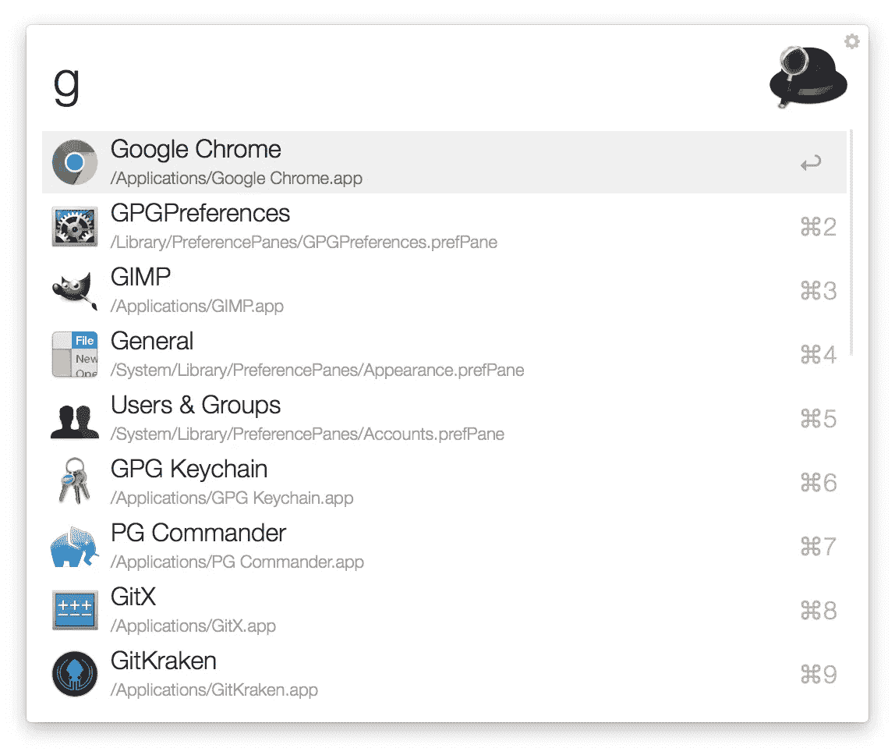
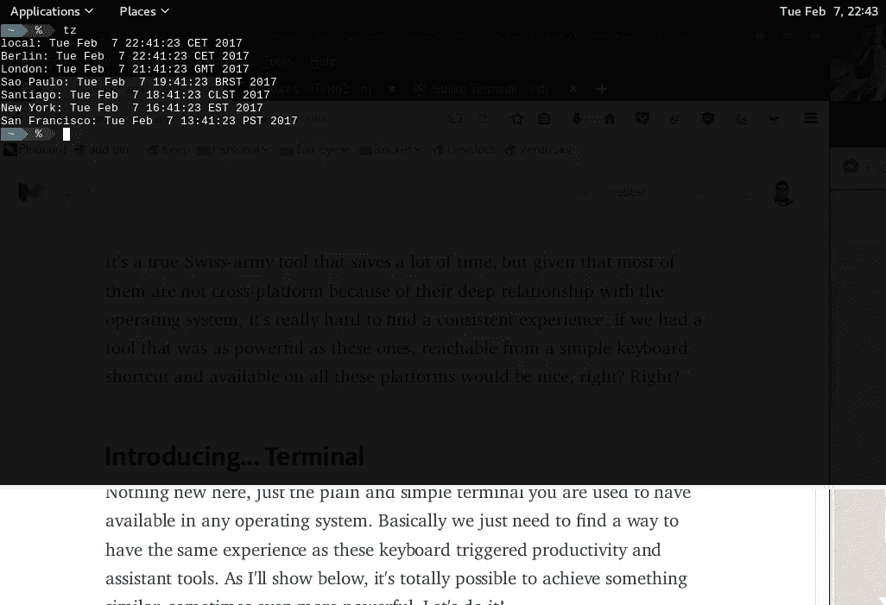
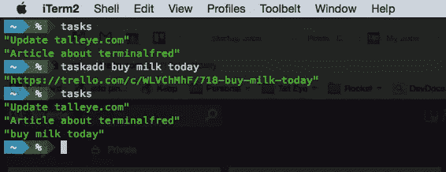

# 终端的跨平台生产力

> 原文：<https://medium.com/hackernoon/cross-platform-productivity-tool-with-terminal-7dd0487ead93>

在工作中，我使用 Mac 电脑，在家里，我有一台安装了 ArchLinux 的联想笔记本电脑。人们，尤其是开发人员，同时采用不同的平台有几个原因，这没有什么错，事实上，我们只是为正确的工作或预算采用了正确的工具。

然而，当您依赖并非在所有平台上都可用的生产力工具时，这可能会很烦人。在购买某个工具的许可证之前，你也会开始三思，因为这个工具在你所采用的平台上是不可用的。跨平台一致的用户体验很难，但我们可以找到解决这个问题的方法。本文将重点介绍如何改善一种工具的体验:

# 键盘触发的生产力和辅助工具

上面的标题是我对类似 [Mac Alfred](https://en.wikipedia.org/wiki/Alfred_(software)) 、 [Ubuntu Unity Dash](https://en.wikipedia.org/wiki/Unity_(user_interface)#Dash) 、 [Gnome Shell overview](https://en.wikipedia.org/wiki/GNOME) 和[其他](http://alternativeto.net/software/alfred/)等工具的试探性分类。



Screenshot of Alfred in action.

他们的工作方式很简单。用户点击全局键盘快捷键后，他们可以键入命令来:

*   启动应用程序
*   搜索桌面
*   打开 URL 并搜索特定站点
*   计算一些东西
*   管理剪贴板
*   甚至触发可以定制的更复杂的工作流

这是一个真正的瑞士军队工具，可以节省大量时间，但鉴于他们大多数人因为与操作系统的深厚关系而不是跨平台的，所以真的很难找到一致的体验。如果我们有一个像这些一样强大的工具，从一个简单的键盘快捷键就可以到达，并且可以在所有这些平台上使用，那就太好了，不是吗？对吗？

# 介绍…终端

这里没有什么新东西，只是你习惯于在任何操作系统中都可以使用的简单终端。基本上，我们只需要找到一种方法，拥有与这些键盘触发的生产力和辅助工具相同的体验。正如我将在下面展示的，完全有可能实现类似的东西，有时甚至更强大。我们开始吧！

## **键盘快捷键**

第一件重要的事情是有一个通过点击简单的键盘快捷键弹出的终端，幸运的是这是一个可以在最流行的终端应用程序中很容易找到的功能。

在 Mac 上，我使用 [**iTerm2**](http://iterm2.com/features.html) 支持热键窗口和`CMD+space`触发终端。

在 Linux 上，我使用[](http://guake.org/)**和`Super+space`快捷键。**

**例如，我通常会将这些终端配置为在失去焦点时隐藏，以便您在执行打开浏览器的命令时有更好的体验。您还可以根据自己的需要调整终端字体和颜色。**

****

**Guake terminal screen on ArchLinux with a Timezone custom command I created**

**到目前为止，我们已经有了一个快速打开终端的方法，现在我们需要一组好的命令和包来重现我们用其他工具得到的良好行为。**

## **Unix Shell**

**在 Mac 和 Linux 上，我都使用 [**zsh**](http://www.zsh.org/) 和 [**oh-my-zsh**](http://ohmyz.sh/) 这种组合是完美的，因为它已经提供了一种很好的方式来组织我想要在我的生产力工具集上拥有的特性。通过创建一个 [oh-my-zsh 插件](https://github.com/robbyrussell/oh-my-zsh/wiki/Customization)你可以把所有的配置保存在一个地方，并且可以很容易地编辑它们来调整现有的或者添加新的特性。**

**我在我的 oh-my-zsh 安装中有这个文件(有一个很有暗示性的名字):**

```
$ ~/.oh-my-zsh/custom/plugins/terminalfred/terminalfred.plugin.zsh
```

**当您打开终端时，您添加到该文件的所有替身和功能都将在您的路径中可用。在接下来的部分中，我将展示我在这个文件中的内容。如果你没有耐心，你可以看看这个[要点](https://gist.github.com/lfcipriani/f6baa463fa1c600a5bf7ce3ecf764321#file-terminalfred-plugin-zsh)。**

**我还会把这个文件保存在 Dropbox 上，并在我使用的所有机器上用符号链接到它。如果你的内容中没有任何敏感信息，那也没关系。**

**我相信，无论您使用什么 Unix Shell，您都可以找到类似的解决方案，因为最终，您需要的只是**已安装的软件包、别名和函数**。**

## **搜索网页**

**这是最常用的功能，oh-my-zsh 有一个名为`[web-search](https://github.com/robbyrussell/oh-my-zsh/blob/master/plugins/web-search/web-search.plugin.zsh)`的完美插件，允许我这样做:**

```
$ ddg how to ride a bicycle   # search duckduckgo
$ image beautiful bicycle     # search for images
$ map bicycle store           # search on a map
```

**这些命令将打开一个浏览器并进行搜索，这是不可能的。如果你想添加你自己的自定义搜索，我的方法是在我的自定义插件中复制这个功能，然后手动添加:**

```
alias urban=’terminalfred urban’
alias regex=’terminalfred regex’
alias shell=’terminalfred shell’
alias jsonb=’terminalfred jsonb’
alias aur=’terminalfred aur’function terminalfred() {
 emulate -L zsh # define search engine URLS
 typeset -A urls
 urls=(
   urban “[http://www.urbandictionary.com/define.php?term=](http://www.urbandictionary.com/define.php?term=)"
   regex “[https://regex101.com/library?orderBy=RELEVANCE&search=](https://regex101.com/library?orderBy=RELEVANCE&search=)"
   shell “[http://explainshell.com/explain?cmd=](http://explainshell.com/explain?cmd=)"
   jsonb “[http://codebeautify.org/jsonviewer](http://codebeautify.org/jsonviewer)"
   aur “[https://www.archlinux.org/packages/?q=](https://www.archlinux.org/packages/?q=)"
 ) if [[ -z “$urls[$1]” ]]; then
  echo “Check available searches"
  return 1
 fi
 if [[ $# -gt 1 ]]; then
  url=”${urls[$1]}${(j:+:)@[2,-1]}”
 else
  url=”${(j://:)${(s:/:)urls[$1]}[1,2]}”
 fi
 open_command “$url”
}
```

***参见* [*语法彩色版*](https://gist.github.com/lfcipriani/f6baa463fa1c600a5bf7ce3ecf764321#file-terminalfred-plugin-zsh-L26-L58) *。***

## **快速计算器**

**有时我需要快速计算，为此我使用[Calc-C 风格的任意精度计算器](http://www.isthe.com/chongo/tech/comp/calc/):**

```
$ calc 24 * 4
     96
$ calc
C-style arbitrary precision calculator (version 2.12.5.0)
Calc is open software. For license details type:  help copyright
[Type "exit" to exit, or "help" for help.]; 365/12
 ~30.41666666666666666667
; .*12
 365
; exit
```

## **词典**

**很少有人知道 [DICT](https://en.wikipedia.org/wiki/DICT) ，一个字典网络协议和它的命令行伴侣`[dictd](http://linuxcommand.org/man_pages/dictd8.html)`，一个字典数据库服务器。安装词典后，使用起来相当简单，结果却令人生畏:**

```
$ dict formidable
3 definitions foundFrom WordNet (r) 3.0 (2006) [wn]:formidable
      adj 1: extremely impressive in strength or excellence; "a
             formidable opponent"; "the challenge was formidable";
             "had a formidable array of compositions to his credit";
             "the formidable army of brains at the Prime Minister's
             disposal"
      2: inspiring fear; "the formidable prospect of major surgery";
         "a tougher and more redoubtable adversary than the heel-
         clicking, jackbooted fanatic"- G.H.Johnston; "something
         unnerving and prisonlike about high grey wall" [syn:
         {formidable}, {redoubtable}, {unnerving}]
...
```

**为了便于使用一些字典，并使结果更简短，我使用了以下别名:**

```
$ alias | grep dict
define='dict -d gcide'          # english definitions
dicts='dict -d moby-thesaurus'  # synonym dictionary
```

**如果你想安装它，请遵循这些说明。**

## **翻译**

**作为一名生活在柏林的巴西人，我经常使用翻译服务。翻译外壳是最好的工具。**

```
$ trans -brief ‘Super fácil traduzir com essa ferramenta!’
Super easy to translate with this tool!
```

**当然，使用别名来缩短命令总是好的:**

```
$ alias | grep trans
tre=’trans -b’                 # translate with brief output
trep=’trans -b :pt’            # translate to Portuguese
tres=’trans -shell -brief’     # open a REPL to translate
trev=’trans -v’                # view translation in terminal pager
```

## **任务管理**

**我用 Trello 作为任务管理器，我有一个简单的记录板来记录我每天的待办事项，也就是我一天中应该专注的任务。另一个想要的功能是能够轻松地将任务添加到该板上。**

****

**Sample execution, now on Mac.**

**使用 [API](https://developers.trello.com/apis) 实现。我本来可以安装一个 Trello 命令行工具，但我决定保持简单，我有以下内容:**

```
alias tasks='curl -s -X GET -H "Cache-Control: no-cache" -H "Terminalfred" "[https://api.trello.com/1/lists/569623d6blablabla309c4d301?cards=open&card_fields=name&fields=cards&key=`cat](https://api.trello.com/1/lists/569623d660005cf309c4d301?cards=open&card_fields=name&fields=cards&key=`cat) ~/.secrets/trello.key.secret`&token=`cat ~/.secrets/trello.token.secret`" | jq ".cards[].name"'function taskadd {
    str="$*"
    if [ -z "$str" ]; then
        echo usage: $0 task
    else
        curl -s -X POST -H "Cache-Control: no-cache" --data-urlencode "name=${str}" -H "Terminalfred" "[https://api.trello.com/1/cards/?idList=569623d660blablablad301&key=`cat](https://api.trello.com/1/cards/?idList=569623d660005cf309c4d301&key=`cat) ~/.secrets/trello.key.secret`&token=`cat ~/.secrets/trello.token.secret`" | jq ".url"
    fi
}
```

***你可以在这里看到一个* [*语法的彩色版本*](https://gist.github.com/lfcipriani/f6baa463fa1c600a5bf7ce3ecf764321#file-terminalfred-plugin-zsh-L120-L129) *。***

**在上面的代码中，我有一个别名，它基本上请求从我的一个板上的特定列表中获取卡片。结果是 json 格式的，然后我使用 [jq 工具](https://stedolan.github.io/jq/)，一个 JSON 命令行处理器，得到一个很好的输出，就像上面的快照一样。添加任务的功能基本上是执行另一个请求，在同一个列表上创建一个卡片，结果，我只是在响应上添加了链接。**

**假设我想在 Dropbox 上同步 zsh 插件文件，代码期望用正确的权限从我的机器上的特定文件夹中获取 Trello API 秘密。注意安全！**

## **启动应用程序**

**提到单独使用终端的一个限制，我没有找到一个好的方法来取代 GUI 应用程序启动，有时我仍然依赖 Alfred、Gnome Dash 或简单的全局快捷方式来打开它们。即便如此，我在一个 [StackOverflow 线程](http://stackoverflow.com/questions/13384139/elegant-and-efficient-way-to-start-gui-programs-from-terminal-without-spamming-i)中发现了一个函数，如果 GUI 应用程序命令在路径上可用，这个函数就可以工作:**

```
o() {
    if [ $# -gt 0 ] ; then
        # Expand if $1 is an alias
        if [ $(alias | awk -F "[ =]" '{print $2}' | grep -x $1) > 0 ] ; then
            set -- $(alias $1 | awk -F "['']" '{print $2}') "${@:2}"
        fi
        ($@ &) &>/dev/null
    else
        echo "missing argument"
    fi
}
```

**最大的好处是你可以从终端上启动 GUI 应用程序，避免`stdout`淹没你的外壳。不过，说实话，我用的没那么多。**

# **一切皆有可能**

**如果你在文章中达到了这一点，我相信你已经明白了这一点，我们只是触及了终端所能做的事情的表面，基本上，你可以做什么来自动化任务和提高生产力是没有限制的。你可以在 [**我的插件文件**](https://gist.github.com/lfcipriani/f6baa463fa1c600a5bf7ce3ecf764321#file-terminalfred-plugin-zsh) 中找到我使用的其他工具，比如咨询时区或者查找文件。**

**我希望跨平台用户的生活可以通过这种方式得到一点改善。如果你有任何奇怪的方法来提高你的生产力，请留下你的评论。最后一点，我故意忽略了 Windows，因为我不是一个活跃的用户，但如果你能有一个类似的设置使用它让我知道，我可以更新这篇文章或链接到你的。**

**[](http://bit.ly/HackernoonFB)****[](https://goo.gl/k7XYbx)****[](https://goo.gl/4ofytp)**

> **[黑客中午](http://bit.ly/Hackernoon)是黑客如何开始他们的下午。我们是这个家庭的一员。我们现在[接受投稿](http://bit.ly/hackernoonsubmission)并乐意[讨论广告&赞助](mailto:partners@amipublications.com)机会。**
> 
> **如果你喜欢这个故事，我们推荐你阅读我们的[最新科技故事](http://bit.ly/hackernoonlatestt)和[趋势科技故事](https://hackernoon.com/trending)。直到下一次，不要把世界的现实想当然！**

****