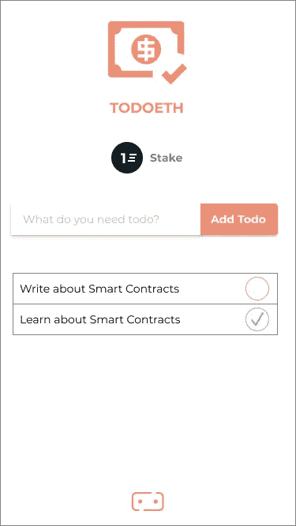
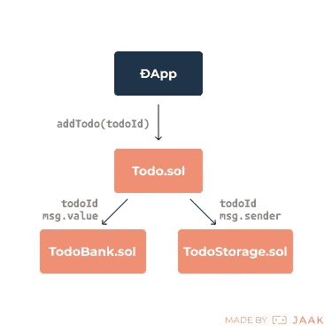

# 过渡到 web 3–02 智能合同

> 原文：<https://medium.com/hackernoon/crossing-over-to-web3-02-smart-contracts-d93b898b4b9>

## 从 web2 到 web3 的最终开发者指南第 2 期

> 最初作为 JAAK 的[开发博客系列](https://blog.jaak.io/)的一部分发布

## 🙌

*欢迎回到博客系列文章，该系列文章旨在让 web 开发者以最简单的方式***在以太坊上构建去中心化的应用和智能合约。**

**如果你错过了第一期——*[*时光倒流读一读*](https://hackernoon.com/crossing-over-to-web3-an-introduction-to-decentralised-development-5eb09e95edb0) *。这第二期将是所有关于写以太坊智能合同，伴随着一个例子项目。**

# *什么是智能合同？*

*如本系列第一期所述:*

> *以太坊环境中的智能合约是在全球公共节点网络(EVM(以太坊虚拟机))上执行的脚本，可以从/向区块链读取/写入交易。*

****合同*** 是“双方或多方之间的自愿安排”([维基百科](https://en.wikipedia.org/wiki/Contract))。*

*那么， ***智能合同*** 就是“一种旨在促进、核实或执行合同谈判或履行的计算机协议”([维基百科](https://en.wikipedia.org/wiki/Smart_contract))。*

*早在 90 年代，密码学家 Nick Szabo 就首次提出了智能合约的概念，并在许多基于加密货币的项目中发挥了重要作用，最著名的是以太坊。*

> *智能合约的原始祖先是不起眼的自动售货机。在有限的潜在损失金额内(钱柜中的金额应小于违反该机制的成本)，该机器接收硬币，并通过一个简单的机制，根据显示的价格分配零钱和产品。*

*因此，将我们的定义扩展到以太坊的上下文之外:**智能契约可以用于以编程方式和*自主地*执行协议**。这当然意味着取消集中的中介机构。因此在分散软件中是有用的。*

# *设置*

*事不宜迟，继续获取示例项目代码库:*

```
*git clone [https://github.com/lukehedger/todoeth.git](https://github.com/lukehedger/todoeth.git)
cd todoeth
git checkout issue#2-smart-contracts*
```

*我们将看看**一个加密经济激励的待办事项列表**——姑且称之为**待办事项**🤑。在接下来的两个问题中，我们将开始构建一个待办事项应用程序，它将迫使用户完成他们的待办事项，并有可能失去他们的钱！*

**

*Wireframe for Todoeth. Icon by [Hea Poh Lin](https://thenounproject.com/charlenehea/).*

*运行以下命令来安装项目的依赖项，然后我们将开始智能合同开发:*

```
*npm install*
```

> *让我们看看智能合同开发的各个阶段*

# *设计*

*每一个健壮的程序都从一个清晰完整的架构设计开始，这在撰写智能合同时尤为重要。鉴于以太坊区块链合约的不可更改性，必须考虑所有可能发生的情况。*

*在客户机-服务器 web 应用程序中，当发现一个 bug 时，我们可以简单地(！)将一个补丁部署到生产服务器上，所有将来访问我们网站的人都会收到这个补丁。以太坊上永久的、可验证的、防篡改的数据记录不能简单地以这种方式升级——否则，所有这些记录都将丢失！*

*设计可升级合同系统的关键是**将存储合同与代理合同**分开(我们稍后将更详细地讨论这一点)。*

*我们的分散式 todo 应用程序需要三个契约:*

*   *存储每个用户及其待办事项的主存储合同*
*   *跟踪针对 todos 的存款的二级存储合同*
*   *一个代理契约，用于促进来自 web 应用程序的交互*

# *写*

> *关于**可靠性**的说明:虽然有几种语言可以编写以太坊智能合约，但我们将使用可靠性来编写我们的合约，因为它是目前使用最广泛的。我们将使用 0.4.18 版本，这是撰写本文时最新的稳定版本。有针对 [Atom](https://atom.io/packages/language-ethereum) 和 [Sublime](https://packagecontrol.io/packages/Ethereum) 的语法高亮器。*

*让我们从无处不在的“Hello，World”的例子开始，但是，我们不是问候整个世界，我们只是向调用该函数的人问好:*

```
*pragma solidity ^0.4.18;// import './SomeContract.sol';contract HelloYou {
  event Hello(address you);

  function sayHello() public {
    address _person = msg.sender;

    Hello(_person);
  }
}*
```

*契约顶部的**杂注**只是一个[指令](https://en.wikipedia.org/wiki/Directive_(programming))，告诉 Solidity 编译器使用哪个版本。*

*该契约没有任何导入，但如果有，我们将使用相对文件路径在 pragma 下定义这些导入。*

*接下来是**合同申报**。要声明一个契约，可以在契约的名称中使用`contract`关键字，在本例中为“HelloYou”。*

*该契约由一个**事件**和一个**功能**组成。事件只是用关键字`event`和函数签名声明:事件名和带括号的类型化参数。在上面的例子中，事件被称为“Hello”并接受一个类型为“address”的参数“you”(`address`只是 Solidity 中描述以太坊公共地址的一个特殊类型)。*

> *关于**类型**的说明:与 JavaScript(动态类型)不同，Solidity 是一种静态类型的语言，因此必须指定每个变量的类型。如果您一直在使用 Typescript 或 Flow 编写 JavaScript(或者使用其他静态类型的语言)，那么您会感觉很舒服。不然你很快就会习惯的。*

*`sayHello`函数使用 Solidity 的一个[全局名称空间变量](https://solidity.readthedocs.io/en/develop/units-and-global-variables.html) `msg.sender`。这个值和其他有用的值对所有契约方法都可用。`msg.sender`变量(也许，可以预见)包含消息发送者的以太坊地址。因此，我们将该值存储在`_person`变量中(不需要`var`关键字，只需要类型、名称和`=`)，并将其传递给`Hello`事件，该事件将触发 EVM 上的事件。*

*就是这样！我们刚刚通过智能合约向某人问好。可以在 web 应用程序中调用这个函数并监听事件，但我们将把它留到下一期讨论！正如古老的以太坊谚语所说:*“如果没有人听，EVM 上的事件会发出声音吗？”*。*

## *模式*

*如前所述，我们必须以一种能够在不丢失数据的情况下进行**代码升级的方式来构建我们的契约。这是通过将包含永久状态(数据存储在契约中的任何时候)的代码与代理分离来实现的，代理将数据汇集到这些契约中以供外部来源使用，如 web 应用程序。存储合同可以非常简单，并且服务于不太可能需要升级的单一目的。我们将在几段时间内详细了解存储合同。***

**

*Data flow for adding a new todo*

*`**Todo.sol**`*

*`Todo`合同是我们的存储合同的“代理”,也是唯一将向我们的 web 应用程序公开的合同。它不会存储任何数据。这样，**所有操作都通过此合同**进行，任何升级都不会丢失数据。*

*它有三种方法:*

*   *`addTodo(todoId)`将 todo ID 与作为用户 ID 的`msg.sender`一起传递给`TodoStorage`合同，并将`msg.value`(一些令牌)作为存款金额传递给`TodoBank`合同*
*   *`getTodo(index)`通过用户的 todo 数组中的索引从`TodoStorage`契约中获取 todo*
*   *`getTodoCount()`获取用户存储的待办事项数量*

*从存储中检索 todo 分为两个方法的原因是由于当前的可靠性限制，限制了动态大小值的返回，如数组。因此，我们首先必须获得 todos 数组的长度，然后通过索引分别获得每个 todo🙈。不用担心，这个限制将在下一个小版本`0.5.0`中被移除。*

## *储存；储备*

*智能合约可以用来在以太坊区块链上存储不可变的、可验证的数据。这是一个超级强大的工具，可以用来实现一系列有趣的数字交易和协议形式。*

*在我们的 todo 示例中，我们将永久存储对每个任务的引用！我们还将针对每个 todo 存储一些 Ether(以太坊的本地令牌)。*

> *关于**元数据存储**的一个注意事项:在以太坊上存储数据是故意昂贵的，因为涉及到持久性和计算能力。针对这一限制，出现了许多创新的解决方案。我们将在这里采用的一种常见模式是将元数据存储在分布式存储系统中(如 [Swarm](http://swarm-gateways.net/bzz:/theswarm.eth/) 或 [IPFS](https://ipfs.io/) )，并将对元数据的引用存储在以太坊上。我们将在下一期讨论如何做到这一点。*

*`**TodoStorage.sol**`*

*`TodoStorage`契约只包含获取和设置 todos 的方法。关于 todo 的元数据将存储在 Swarm 上，因此，我们实际存储在合同中的唯一数据将是对该元数据的 Swarm 引用(在 Swarm 网络中找到数据的地址)。*

*我们将使用这些引用作为`todoId`，它们存储在一个数组中，并由`TodoStore`对象中的`userId`(todo 所有者的以太坊地址)作为键。*

*这给了我们一个这样的数据结构:*

```
*TodoStore: {
  userId: [
    todoId
  ]
}*
```

*`**TodoBank.sol**`*

*另一个用于存储的合同是`TodoBank`。这是我们存放每笔托多存款的地方——资金将在这里得到保护，直到它们被合法提取。同样，这个契约只包含获取和设置存款的方法。*

*数据结构如下所示:*

```
*TodoVault: {
  todoId: deposit
}*
```

*这超出了本例的范围，但是您可以看到如何将激励机制构建到这个系统中。例如，如果 todo 在某个时间完成，存款将返回到所有者的地址，但如果错过了截止日期，资金将被发送到另一个地址，该地址可能打赌所有者不会完成它！*

*因此，您必须完成待办事项，否则将面临存款损失💸。我们将把这篇文章留到以后发表！*

## *安全性*

*当涉及到个人数据和资金时，软件安全至关重要。鉴于智能合约固有的经济本质，以及用于编写智能合约的语言的不成熟性，它们的安全性尤为重要——安全机制必须构建到合约的设计和代码中。*

*在对可靠性进行实验的同时，记住这一点就足够了，并且要意识到契约可能面临的一些攻击。当你准备钻研安全问题时，[以太坊智能合约安全最佳实践](https://consensys.github.io/smart-contract-best-practices/)指南是一个很好的资源。*

## *林挺*

*你可以用[sol ium](https://github.com/duaraghav8/Solium)lint 你的合同，这是一个遵循类似 ESLint 惯例的整洁工具。*

*要 lint 示例项目中的合同，请运行以下命令:*

```
*npm run lint*
```

## *证明文件*

*Solidity 契约可以用[以太坊自然规范格式](https://github.com/ethereum/wiki/wiki/Ethereum-Natural-Specification-Format)(或者，NatSpec)的注释进行文档化，类似于 JSDoc。*

```
*/*
 * [@notice](http://twitter.com/notice) TodoAdded event
 * [@param](http://twitter.com/param) {bytes32} todoId
 */
event TodoAdded(bytes32 todoId);*
```

# *编制*

*契约需要用 Solidity 编译器**编译成 EVM 可以读取的字节码**。*

*可以通过一个名为`[solc-js](https://github.com/ethereum/solc-js)`的 JavaScript 工具直接使用 Solidity 编译器，该工具由以太坊基金会开发人员维护。*

*编译器接受一个契约名称和该契约的字符串化内容的对象，[返回编译后的字节码](https://solidity.readthedocs.io/en/develop/using-the-compiler.html#output-description)和[一个用于与契约代码交互的接口，称为 ABI](https://solidity.readthedocs.io/en/develop/abi-spec.html) (或者，应用程序二进制接口)。*

*我发现可以通过将重复的任务(解析合同输入并将输出写到磁盘)抽象到一个库中，并用一个配置文件控制输入/输出，来简化这个工作流。这个工具叫做[](https://github.com/lukehedger/sulk)****😂！*****

*****Sulk 采用一个简单的配置文件，最简单的形式如下:*****

```
*****module.exports = {
  contracts: [
    'Todo',
  ],
  inputPath: './path/to/contracts',
}*****
```

*****并将一个`[contracts.json](https://github.com/lukehedger/todoeth/blob/issue%232-smart-contracts/contracts/contracts.json)`文件写入您的项目，该文件包含字节码和 ABI，可以在“部署”您的合同时使用。*****

*****要编译示例项目中的协定，请运行以下命令:*****

```
*****npm run compile*****
```

# *****部署*****

*****为了公开你的契约及其方法，你需要**将它部署到以太坊区块链**。这类似于将微服务部署到服务器上，与服务器基础设施一样，以太坊有生产、开发和本地网络的概念。生产网络(显然只有一个)通常被称为“mainnet ”,而开发网络(有几个，每个都有不同的属性和功能)被称为“testnets”。*****

*****开始与您的合同交互的最简单方法是将其部署到本地以太网。`[**ganache-cli**](https://github.com/trufflesuite/ganache-cli)`(以前称为`testrpc`)是一个基于 Node.js 的“以太坊开发个人区块链”，它简化了这个过程。*****

*****从示例项目中，您可以运行下面的命令，它只是运行本地安装的`ganache-cli`二进制文件，没有任何参数(并且**让您感觉像神一样**):*****

```
*****npm run blockchain*****
```

*****一旦`ganache`运行，您就可以使用示例项目中包含的部署脚本将契约部署到本地以太坊节点:*****

```
*****npm run deploy*****
```

*****[部署脚本](https://github.com/lukehedger/todoeth/blob/issue%232-smart-contracts/scripts/deploy-contracts.js)使用 [**Web3.js**](https://github.com/ethereum/web3.js) 库与以太坊节点进行交互。通读代码和注释，查看部署契约所需的步骤。请关注这一领域，寻找简化这一过程的工具👀。*****

> *****关于 **Web3.js** 的一个说明:Web3.js 库由以太坊基金会维护，并且已经成为流行的库，但是还有其他库，例如 [ethers.js](https://github.com/L4ventures/ethers.js) 和 [ethjs](https://github.com/ethjs/ethjs) ，当您使用这个栈时，它们是值得探索的。*****

*****部署脚本还将把**部署的契约地址**存储在一个 JSON 文件中，以备后用(`[addresses.json](https://github.com/lukehedger/todoeth/blob/issue%232-smart-contracts/contracts/addresses.json)`)。每个部署的契约都有一个以太坊地址(就像一个 API 有一个 HTTP 端点一样)，当实例化契约以通过测试和应用程序与它们交互时，需要这些地址。*****

## *****气体*****

*****您可能听说过术语“gas ”,或者注意到在部署脚本和示例代码中提到了它。**气简单来说就是以太坊运营收取的交易费**；EVM 的燃料。最终，需要 gas 来防止虚拟机的过度使用。*****

> *****气体:大致相当于计算步骤的度量。每笔交易都必须包括一个汽油限额和愿意支付的费用。如果事务产生的计算使用的 gas 总数小于或等于 gas 限制，则事务处理。如果总气体量超过气体量限制，则所有更改都将恢复。*****

*****[https://github.com/ethereum/wiki/blob/master/Glossary.md](https://github.com/ethereum/wiki/blob/master/Glossary.md)*****

# *****试验*****

*****用 JavaScript 编写智能契约单元测试是可能的。然而，这带来了一个开销，对于习惯于为传统的客户机-服务器应用程序编写单元测试的开发人员来说，这似乎是违反直觉的:必须运行一个本地以太坊节点来执行来自 JavaScript 测试的契约方法。*****

*****围绕模拟或存根网络响应的工具(如 [Sinon。JS【以太坊的 会很棒，而且肯定会随着需求的增加而发展——Go 和 Python 已经有了这样的工具。但是现在，我们必须打破单元测试的基本规则，触发网络活动。](http://sinonjs.org/)*****

*****示例项目测试可以通过以下方式运行:*****

```
*****npm test*****
```

*******我们将在下一期**中详细探讨如何从 web 应用程序中与智能合约交互，但现在你可以通读测试，了解如何使用 Web3.js 执行合约方法*****

# *****调试*****

*****更新合同代码、编译、部署和运行单元测试的过程过于繁琐，不利于有效的调试。因此，为了调试，你可以使用 **Remix** ，一个用于编写、编译、部署和执行方法的 web IDE。*****

*****还有一个名为`remixd`的 CLI 工具，可以用来与 Remix IDE 共享您的本地合同。该示例项目包含一个启用该功能的命令，然后单击🔗Remix 工具栏中的按钮进行连接:*****

```
*****npm run remix*****
```

*****你也可以从这个要点中[加载合同到 Remix 中。](https://gist.github.com/lukehedger/8e0169c74080f44c3752568a03d51f15)*****

## *****下次…*****

*****我们将介绍如何构建一个与 todo 智能合约交互的分散式 web 应用程序。*****

## *****一些进一步的阅读*****

*   *****📖[正式的可靠性文件](http://solidity.readthedocs.io/en/develop/introduction-to-smart-contracts.html)*****
*   *****🏊[更深入地了解可靠性](https://github.com/androlo/solidity-workshop)*****
*   *****🏪[固体污垢](/@robhitchens/solidity-crud-part-1-824ffa69509a)*****
*   *****☝️ [撰写可升级合同](https://blog.colony.io/writing-upgradeable-contracts-in-solidity-6743f0eecc88)*****

## *****项目更新*****

*****由热衷于去中心化应用程序的人运营的项目的一个令人敬畏的副产品是绝大多数代码是开源的。这是一个在回购中挖掘灵感和最佳实践的绝佳机会——更不用说贡献了！*****

*****在 JAAK，我们正在构建[元网络和协议](https://github.com/meta-network/docs)，目前正在[的私有 alpha](https://cointelegraph.com/news/jaak-announces-meta-decentralized-network-backed-by-ethereum-and-swarm) 中进行试点，用来自我们行业合作伙伴的数据填充网络。花一个[看看我们的代码](https://github.com/meta-network)并跳到我们的[松弛频道](https://community.meta-network.io/)来谈论你发现的任何事情！*****

## *****在[推特](https://twitter.com/jaak_io)和[脸书](https://www.facebook.com/JAAK.io/)上找到[美国](https://jaak.io)。*****

******原载于 2017 年 11 月 27 日*[*blog . jaak . io*](https://blog.jaak.io/crossing-over-to-web3-smart-contracts-3a295e35e5c0)*。******