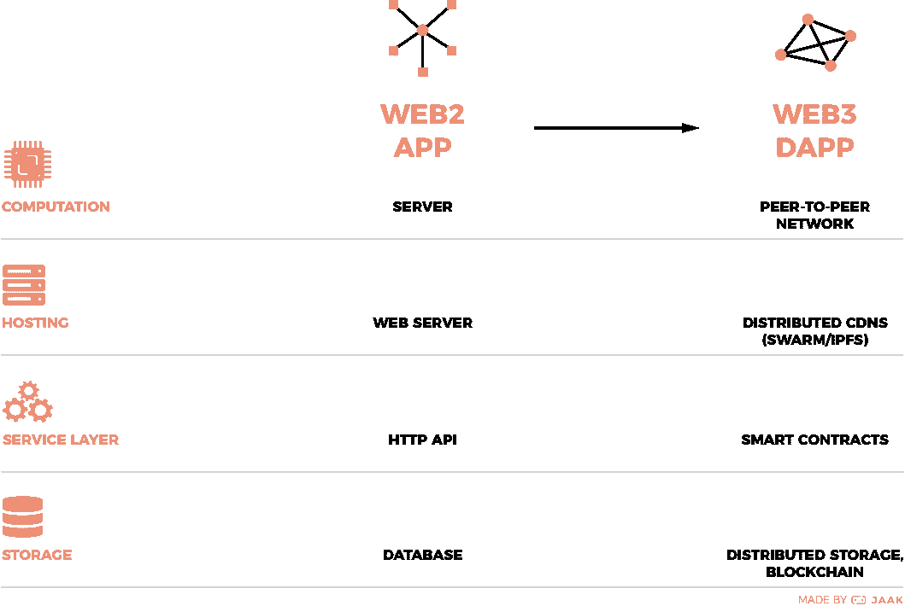

# 跨越到 web 3——分散化开发的介绍

> 原文：<https://medium.com/hackernoon/crossing-over-to-web3-an-introduction-to-decentralised-development-5eb09e95edb0>

## 从 web2 到 web3 之旅的最终开发者指南中的第 1 期

> 最初作为 JAAK 的[开发博客系列](https://blog.jaak.io/)的一部分发布

## 👋

*欢迎来到系列博客的第一篇，这篇博客旨在让 web 开发者以最简单的方式***在以太坊上构建去中心化的应用和智能合约。**

**我们将通过一个示例项目，了解如何在以太坊区块链上构建、测试、保护和部署由智能合约支持的分散式应用。**

## *这个系列是关于什么的？*

*2017 年 1 月，在一次关于最新热潮的例行网上冲浪中，我遇到了这个叫做以太坊的奇怪东西。我的大脑无法理解它所读到的大部分内容，但我的“酷屎”感却响个不停。*

*到 2017 年 3 月，我开始理解这种神话般的去中心化的涅槃，并在 [JAAK](https://jaak.io/) 找到了一份工作，致力于[将音乐行业过渡到这个新的堆栈](https://blog.jaak.io/the-meta-network-lowering-the-barriers-for-developers-in-the-music-industry-b0a0431c3528)。在过去的六个月里，有两件事变得很明显:*

1.  *外面有很多复杂的教程和糟糕的建议*
2.  *推进生态系统所必需的高质量的网络开发者非常稀缺*

*我写这个系列的动机很明确:去中心化对网络和其他领域有着巨大的潜力。通过降低进入门槛，生态系统可以充满开发者，导致创新想法、工具和高质量产品的快速迭代。*

*A recent poll revealed a lack of tutorials is hindering web3 developers*

## *那么是给谁的呢？*

*如果你是一个 web/JavaScript 开发人员，听说了去中心化未来的宣传，并想积极学习如何在 web3 架构上构建，这是为你准备的。此外，任何被现有教程或 Truffle/Meteor 样板所迷惑，并且正在寻找更简单的入口点的人。*

## *在开始之前，让我们先来看一些定义*

*大多数教程将许多不同的术语混为一谈，并试图教导未来的 web3 开发者密码经济学的复杂性，以及 Vitalik 早餐喜欢吃什么。本系列不会涉及这些内容。*

*区分堆栈的不同级别对于建立每个部分的角色和机制的清晰概念至关重要。这样，开发人员可以避免迷失在猜测中，并开始了解他们的应用程序可以在哪里使用这个堆栈。*

***Web3***

*Web3 通常指的是下一代万维网。它已经被以太坊生态系统所采用，并被用来指代一个去中心化的网络。简而言之，web3 就是没有中央服务器和数据仓库的 web2。如果一切按计划进行，web3 将成为 web 的一部分，web3 开发者将再次成为 web 开发者。*

*随着时间的推移，去中心化的架构将简单地成为基础设施的选择，就像 MongoDB vs Firebase 或 REST vs GraphQL 一样——你的 EC2 实例可能会被以太坊取代，你的静态资产可能会存储在 [Swarm](http://swarm-gateways.net/bzz:/theswarm.eth/) 上。*

> *转变将是渐进的，在 Web 2.0 上，我们将越来越多地看到网站的后端使用类似 Web 3.0 的组件，如比特币、BitTorrent、NameCoin。这一趋势将会继续，真正的 Web-3.0 平台以太坊将会被那些希望提供其内容交易证据的网站所使用，例如投票网站和交易所。*

*[*【http://gavwood.com/web3lt.html】*](http://gavwood.com/web3lt.html)*(2014 年 4 月 23 日)**

***Dapp***

*dapp 是一个去中心化的应用。对于我们这些老派的 web 开发者来说，这可能很难理解:[没有服务器](http://matrix.wikia.com/wiki/Spoon_Boy)。相反，“后端”代码运行在分散的点对点节点网络上，“前端”代码由分布式 CDN 提供服务。*

**

*Web2 → Web3*

***区块链***

*您可以将区块链视为一个仅附加的数据库，它不是存储在单个服务器上，而是分布在一个节点网络中，每个节点存储网络的全部事务历史。*

*顾名思义，区块链是数据包(块)的不可变记录(链)，它包含一组操作，这些操作记录了与区块链(事务)相关联的一些特定操作。*

*在比特币区块链，这些交易是纯金融的(X 发送 Y N 个比特币)。在以太坊区块链中，通过使用包含交易处理规则的程序(智能合同)，可以执行各种交易类型。*

*[Lauri Hartikka](/@lhartikk?source=user_popover) 写了一篇关于区块链的[最小实现的伟大文章，描述了原始机制。](/@lhartikk/a-blockchain-in-200-lines-of-code-963cc1cc0e54)*

***以太坊***

*以太坊是一个基于区块链的分布式计算平台，通过智能合约提供脚本功能。Dapps 可以利用以太坊和相关技术，我们将在本系列中重点讨论它。*

*但是，请注意，这不是一个基本要求:BitTorrent、Popcorn Time 和 Tor 都是不使用以太坊的去中心化应用程序的例子。*

***智能合约***

*以太坊环境中的智能合约是在全球公共节点网络(EVM(以太坊虚拟机))上执行的脚本，可以从/向区块链读取/写入交易。智能合约可以被认为是 dapp 的去中心化计算；充当与数据存储交互的 HTTP API 的类似角色，只是不在集中式服务器上。*

*区分 dapp 和智能合约是很重要的:事实上，通过合约与数据和服务交互可能是 dapp 的一个重要部分，但是，正如你可以有一个静态应用程序一样，dapp 可以没有合约接口。*

## *web3 的发展状况*

*框架之战在 JavaScript 生态系统中肆虐多年，见证了各种掩盖 web 开发细微差别的尝试。它在没有一个成功的框架的情况下结束了——事实是模块化库的流行和偏好赢得了胜利。*

*在 Web3 时代的开端，有一种[倾向于大型](https://github.com/ethereum/wiki/wiki/Dapp-using-Meteor)、[整体框架](http://truffleframework.com/)。依赖像 Meteor 和 Truffle 这样的框架的诱惑限制了学习 web3 开发的基本原理的机会，并且从长期来看，创建了一个不可维护的项目。*

*相比之下，自动化与 dapps 和智能合约相关的复杂、离散和重复任务的工具可以促进良好的实践，并导致更温和的学习曲线。*

*还有一个新出现的危险是，在追求“新互联网”的过程中，当丢弃 Web 2.0 的坏部分时，最新的进步和技术就会丢失。目前在 web3 生态系统中，可以经常观察到库创作和前端架构模式的回归。*

## *构建 web3 项目*

*web3 项目设置有两个支柱:[web 3 . js](http://web3js.readthedocs.io/en/1.0/)(dapp 通向以太坊区块链和智能合约的门户)和 [TestRPC](https://github.com/ethereumjs/testrpc) (您本地的以太坊区块链)。Web3.js 是目前最先进的以太坊 js 库，TestRPC 是目前运行本地节点最简单的方法。*

*本指南和附带的代码将利用 Web3.js 和 TestRPC 以及最简单的工具来最小化认知负荷。我们将在接下来的帖子中开始构建一个示例项目，但请在评论中提出任何问题或意见，或者与 JAAK 和其他 web3 开发人员在元网络松弛通道上聊天💬。*

## *下次…*

*我们将讨论如何设计、编写、保护和部署智能合约。*

## *一些进一步的阅读*

*   *📔[好词汇随手可得](https://github.com/ethereum/wiki/blob/master/Glossary.md)*
*   *🤑[密码经济学的精彩介绍](https://thecontrol.co/cryptoeconomics-101-e5c883e9a8ff)*
*   *3️⃣ [三个区块链的好处](https://blog.bigchaindb.com/three-blockchain-benefits-ae3a2a5ab102)*
*   *🏭以太坊到底是如何运作的？*

## *项目更新*

*由热衷于去中心化应用程序的人运营的项目的一个令人敬畏的副产品是绝大多数代码是开源的。这是一个在回购中挖掘灵感和最佳实践的绝佳机会——更不用说贡献了！*

*在 JAAK，我们正在构建[元网络和协议](https://github.com/meta-network/docs)，目前[正在私有 alpha](https://cointelegraph.com/news/jaak-announces-meta-decentralized-network-backed-by-ethereum-and-swarm) 中进行试点，使用来自我们行业合作伙伴的数据填充网络。看一看我们的代码，然后进入我们的松弛频道，谈论你发现的任何事情。*

## *在[推特](https://twitter.com/jaak_io)和[脸书](https://www.facebook.com/JAAK.io/)上找到[美国](http://jaak.io)。*

**原载于 2017 年 10 月 12 日*[*blog . jaak . io*](https://blog.jaak.io/crossing-over-to-web3-an-introduction-to-decentralised-development-53de470da331)*。**