# 加密审查— Siacoin (SC)

> 原文：<https://medium.com/hackernoon/crypto-review-siacoin-sc-b1d0f0a5c78f>

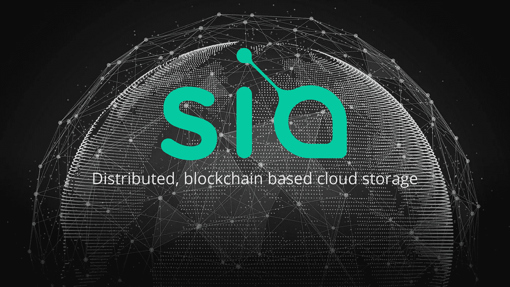

在我的第一次审查中，我将考察 Sia——分散存储领域的参与者之一。云存储行业规模庞大，像 Sia 这样的公司希望削弱亚马逊、微软和谷歌在过去十年中享有的主导地位。

 [## 希雅·凯特·伊索贝尔·富勒

### Sia 的分散式云平均比当前的云存储提供商便宜 10 倍。在 Sia 上存储 1TB

新航科技](http://sia.tech/) 

这花了一段时间，但我终于拿起我的加密审查系列。如果你没看过我之前的文章，请看看我对[比特币](https://hackernoon.com/tagged/bitcoin)的介绍。

 [## 比特币入门

### 如何从非技术角度涉猎…

medium.com](/@jon.tomp/getting-started-with-bitcoin-e5ba9cb9ecce) 

我对加密评论系列的介绍

 [## 加密评论系列—简介

### “但是我不想和疯子在一起，”爱丽丝说。“哦，你没办法，”猫说，“我们都疯了…

medium.com](/@jon.tomp/crypto-review-series-introduction-b3c0eefd3347) 

我会写一些我感兴趣的硬币，很可能我会拥有一些(我现在拥有大约 40 种不同的硬币，所以它们并不特别),但这绝不是投资建议——这通常是我整理思路的一种方式——在投资前做自己的研究！！

什么是 Sia？基本上是存储——想想 dropbox、google drive 等。其特点是它是分散的、加密的、点对点的存储——尽管没有一方持有你所存储的信息——它被加密、倍增、分割成小比特，然后所有这些小比特被发送到一堆不同的主机。当你想访问你的文件时，适当的位被重新编译，你得到你的文件。将您的文件想象成处于 T-1000 类型状态。

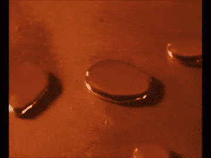

“Please SIA, can I have my photo of aunt Judy?” Sia: “One moment” ::ominous noises::

通过构建框架并将存储外包给任何有硬盘和互联网连接的人，Sia 大幅降低了开销，并可以收取更低的费用。它们会将这些位相乘，以防保存您的文件的某个节点碰巧离线(即使它们被激励不离线)。

现在做一些尽职调查

# **人**

> Sia 是由波士顿风投资助的初创公司 Nebulous Inc .的大卫·沃里克(David Vorick)和卢克·钱皮恩(Luke Champine)创建的。Sia 的想法最初是在 HackMIT 2013 上构思的。

关于大卫·沃里克的信息真的不多，但不是说这些诈骗硬币有可疑的创始人，而是我认为他更低调，专注于产品。这家风投公司看起来是合法的，但他们的投资组合中真的没有任何其他秘密(当我检查的时候)。看起来他们需要一个营销/传道者类型的人。

大卫在网上的存在基本上可以归结为他的媒体帖子和一些 youtube 视频。这还有一个额外的好处，那就是可以讨论不同的[区块链](https://hackernoon.com/tagged/blockchain)存储协议。大卫在第 13 分钟跳了进去。我非常喜欢他的语气。

# **产品**

他们有一个产品&用户！！

有两个因素使 Sia 在价格方面有别于其他分散存储(STORJ，IPFS)。我对 STORJ 有一个合理的了解，仍在调查 IPFS，所以这些假设可能不是 100%。

1.  价格—主机(有存储的主机)设置他们想要的价格。这很好，因为理想情况下，市场力量会发现价格。不好，因为它增加了一个步骤，可能会关闭一些用户。
2.  文件合同—(跳转到 vid 中与此相关的收入模型的 min 29)该结构很有意义，尽管我认为它牺牲了一些易用性来获得更好的激励结构。我想我们可能会看到新航的一个主题……

产品细节可以从他们的网站上获得，但我认为他们正在最大限度地分散这一切。这对分权至上主义者来说很好，但我认为这可能会限制他们的接受程度。

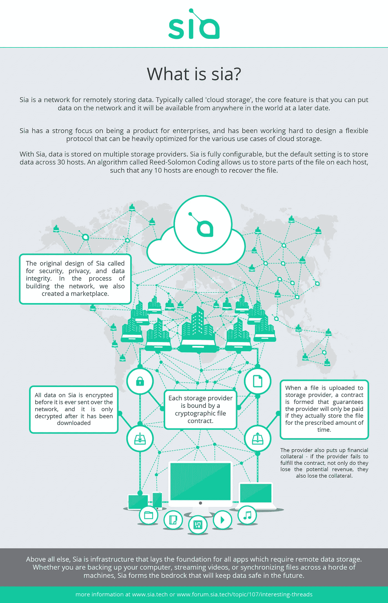

他们还吹捧他们从在多台机器上存储文件位和激励主机保持在线中获得的冗余。

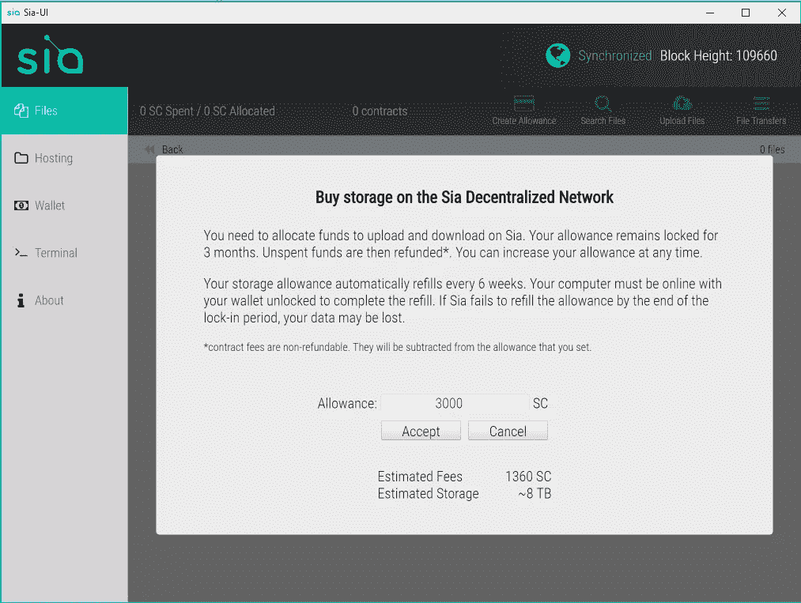

A blockchain company with a live product? something is amiss

我还没有存储任何东西，但是这让我们对这个结构有了一些有趣的了解。你需要锁定一些资金，然后用你能接受的任何利率来保护存储。随着收养的进行，大量的硬币将会从交易所中取出并被锁起来。可能会导致未偿债券的波动，或者它可能会找到一个很好的平衡。一些需要关注的事情。

# **硬币**

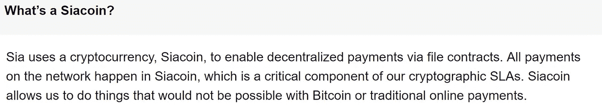

Duh

所有这些项目的最大问题是——它们真的需要自己的令牌吗？Sia 在区块链发行，他们在那里发行智能合约。我敢肯定，还有一些更具体的细节，但这似乎是一个独立货币的足够合理的理由。

# **财务**

这是他们所吹捧的，直接来自他们的首页

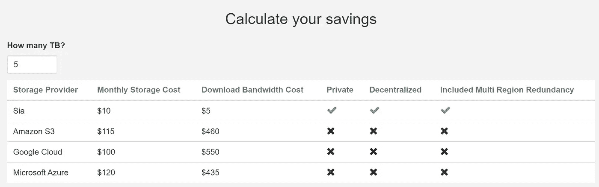

现在，这真的只是一个投影，因为主机(那些有高清空间出租)设置自己的价格(因为它的分散！！！)

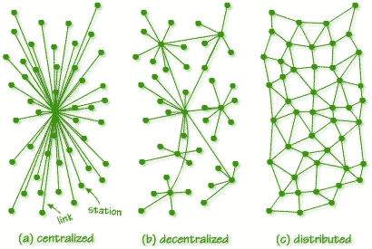

从活动主机列表来看，现行价格为每月每 TB 约 2k SC，按当前价格计算(. 00000570 BTC @ BTC = 2700 美元)，价格略高于 30 美元。我认为这主要是因为过去一个月 SC 的价格大幅上涨(相对于美元大约上涨了 6 倍，相对于比特币上涨了 4 倍)，并且我认为这些都是长期合同。我认为时间越长，价格会变得越稳定，但正如你所看到的，它确实是全球性的，所以对美元的波动仍将存在。我确实认为他们在上面的图表中的说法有点误导，因为他们假设主持人愿意以那个比率支付。

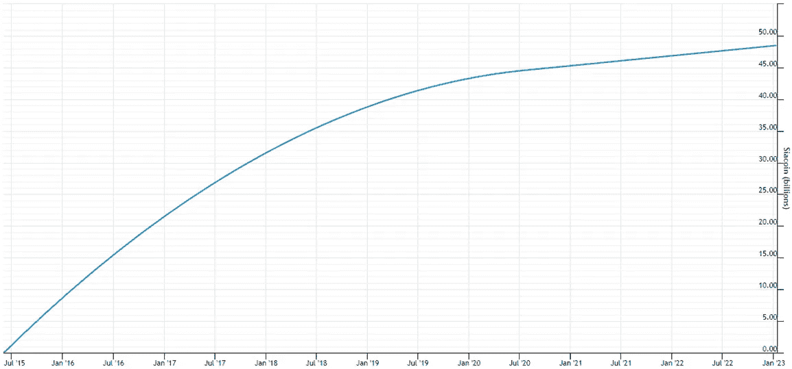

Coin creation

现在大约有 260 亿个供应链，到 2023 年将最终达到 480 亿个。快速铸造现在有点令人担忧，但它们似乎正在以相当快的速度被采用。当所有 48，460，000，000 枚硬币被开采时，以每月每太字节 2k SC 的当前价格，它们将具有 24.23 艾字节的容量。

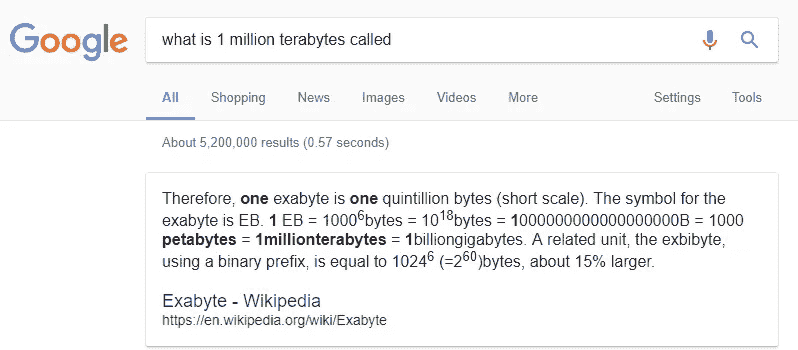

totally knew that

我找不到亚马逊目前存储总量的确切信息，但我不认为这是一个疯狂的数字。无人驾驶汽车，图像识别，虚拟现实，人工智能，机器学习，其他很酷的流行语——它们都有什么共同点？对大量数据的需求。

# **活动/透明度**

喜欢这个——一个公共的 Trello 板和他们的路线图

 [## 特雷罗

### 一起组织任何事情。Trello 是一个协作工具，可以将您的项目组织成多个板块。一眼看去…

trello.com](https://trello.com/b/Io1dDyuI/sia-public-roadmap) 

在它们的[脉动网站](http://siapulse.com/page/main)上有很多有用的信息，比如宿主的分布。

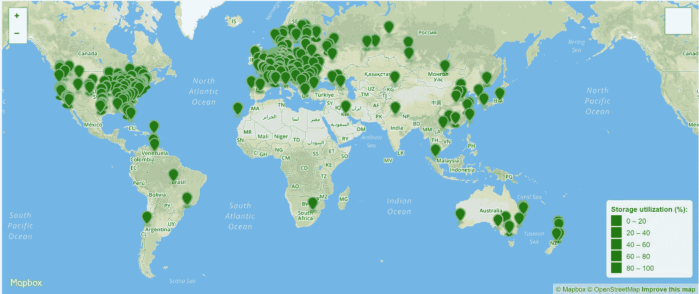

以及当前价格(我相信这些是每月价格)

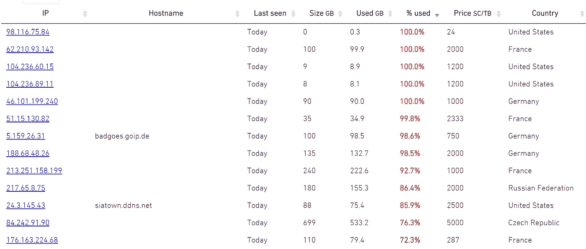

他们似乎也非常积极地回答问题。看起来大卫现在做得更多了，但要实现飞跃，他们可能需要引入一些营销人员。他们对该项目非常开放，社区对此表示赞赏，所以如果他们交付了，我相信我们会继续听到他们的更多信息。

# 结论

在我看来，Sia 的下一步是获得一个大的合作伙伴或一些基于它的应用程序来获得一些名声。我的猜测是，STORJ 将更加关注消费者，IPFS 将获得企业项目，而 Sia 将介于两者之间，但受争取真正全栈分散化的项目的欢迎。

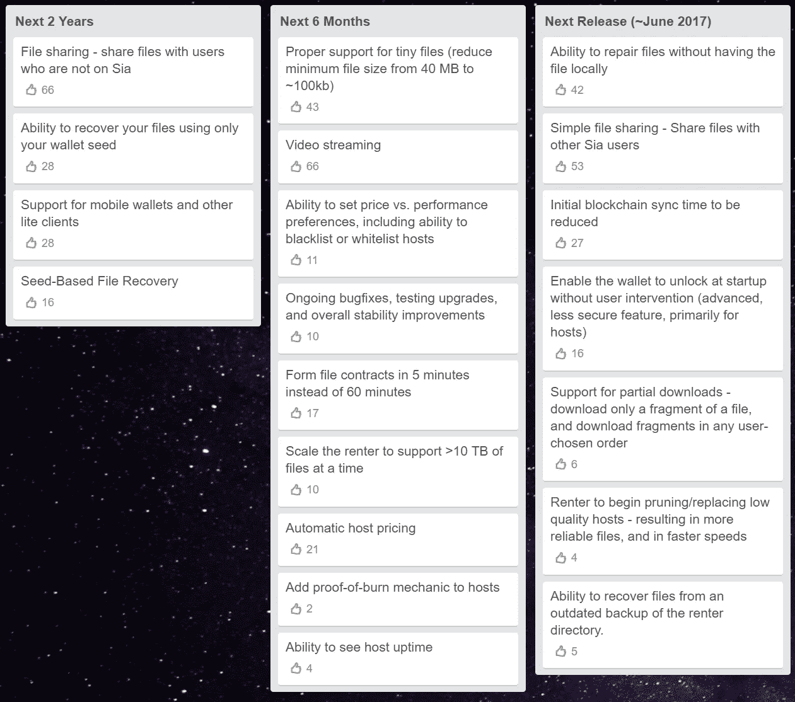

我真的认为一些“未来 6 个月”的项目可能会引发一场跳跃——视频流让人们兴奋，自动主机定价将减少手动操作，一次支持超过 10 TB 应该允许更多的应用程序在其上构建。

你可以随意推荐一枚硬币，然后像往常一样，请你自己做研究，只投资你能承受的损失。

投资愉快！

> [黑客中午](http://bit.ly/Hackernoon)是黑客如何开始他们的下午。我们是 [@AMI](http://bit.ly/atAMIatAMI) 家庭的一员。我们现在[接受投稿](http://bit.ly/hackernoonsubmission)，并乐意[讨论广告&赞助](mailto:partners@amipublications.com)机会。
> 
> 如果你喜欢这个故事，我们推荐你阅读我们的[最新科技故事](http://bit.ly/hackernoonlatestt)和[趋势科技故事](https://hackernoon.com/trending)。直到下一次，不要把世界的现实想当然！

