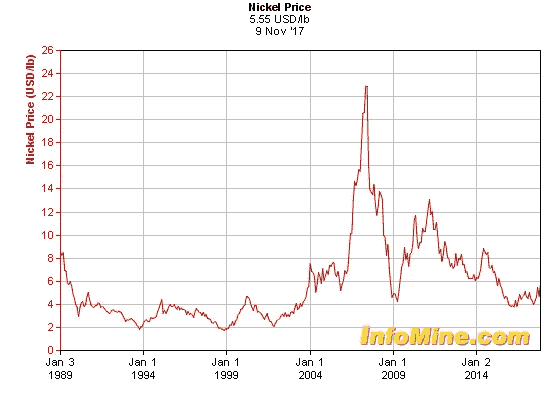
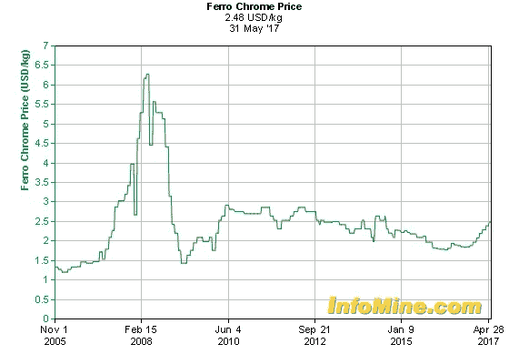
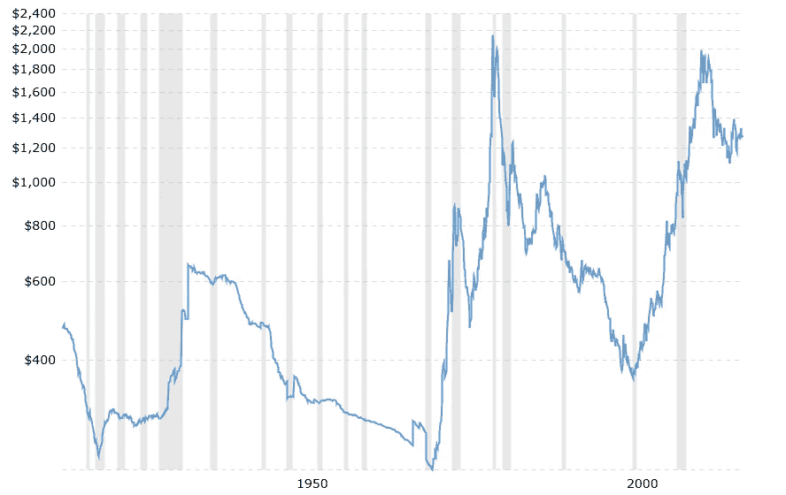

# 作为长期投资的加密货币

> 原文：<https://medium.com/hackernoon/cryptocurrencies-as-a-long-term-investment-a141fe227f3b>

在过去的 7 年里，Crypto 已经提供了所有资产类别中最好的回报。加密在长期投资者的投资组合中应该扮演什么角色？一方面，完全忽略 crypto 的发展意味着忽略 7 年的数据并错过赚取丰厚回报的机会。另一方面，今年加密价格的大幅上涨引发了一个问题:加密有长期预期回报吗？或者，更确切地说，加密的长期回报应该与什么样的已知资产类别最相似？

比特币的倡导者有一个简单而有力的故事:比特币是一个去中心化的健全的货币系统。在硬币供应量固定的情况下，价格会随着采用的增加而上涨。其他加密货币可能有不同的技术规范，在安全性和更快的交易时间、网络计算能力、匿名性和其他技术特征之间进行权衡，但它们都有一个基本的故事:一个不受任何中央银行或政府控制的分散金融系统。

我不想反驳或争论这个故事。相反，我的目标是从根本上理解 crypto 最类似于哪种资产类别。这将有助于思考投资加密和预期回报的长期影响。

一种看待以太坊(ethereum)、比特币(bitcoin)及其复制品的方式是，将它们视为运行去中心化开放支付网络所需的成分。我们可以将硬币视为一种商品，作为构建支付网络的一种投入，就像镍是一种用于制造电动汽车电池的商品，石油是一种为化石燃料驱动的经济提供动力的商品。

加密货币是商品。它们是数字化的现代商品，但仍然是商品。它们不是最终产品，而是一种成分，一种投入。因此，我认为，从长远来看，加密货币将拥有与大宗商品相似的回报率。让我们来看看一些图表:

镍:

Cromium:

金色:

因此，出于投资组合配置策略的目的，投资者应将加密货币视为商品。本分析的目的是严格理解加密技术的预期收益，而不是分析加密技术或区块链技术的有用性。