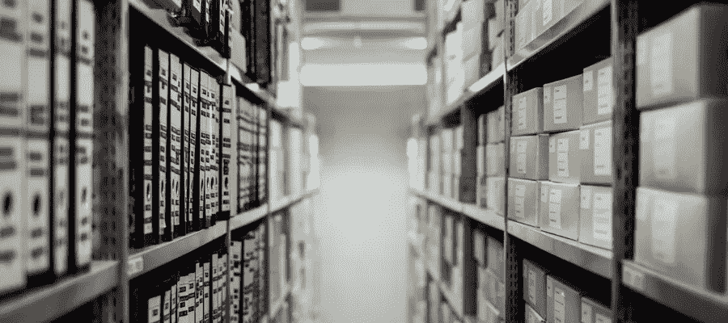
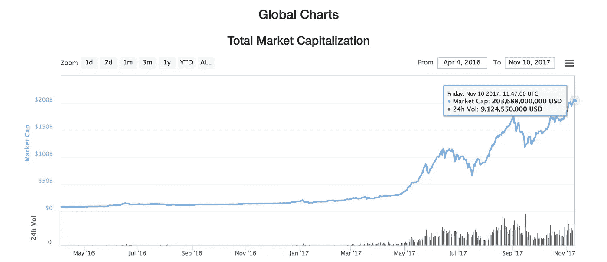
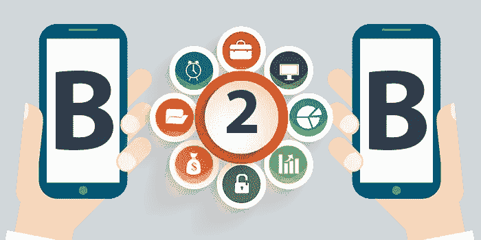

# 加密货币交易所。创新即将到来！

> 原文：<https://medium.com/hackernoon/cryptocurrency-exchange-innovations-are-on-the-way-265ade544585>

一旦[比特币](https://hackernoon.com/tagged/bitcoin)被创造出来，它就开启了市场参与者的全新生态系统。交易所开始出现，收取你的法定货币，并将比特币发送到交易者的钱包里。这使得人们能够进入加密货币领域，并开始使用比特币基础设施，进行支付和点对点转移价值。

在过去几年中，由于市场上出现了新的代币，交易量急剧增加。[例如，加密货币最近 24 小时的交易额为 9214118751 美元](https://coinmarketcap.com/currencies/volume/24-hour/)！

因此，[技术](https://hackernoon.com/tagged/technology)也在推动这个领域的创新。已经创建或正在开发各种新项目来革新和优化交换过程。从我个人的兴趣出发，我做了一个快速的研究，总结出 3 个有趣且有前途的交流。

## 分散交换

去中心化是秘密经济的关键驱动因素。这就是为什么没有中间人提成的加密货币交换的想法被创造出来。

[以太代币](http://etherdelta.com)让你直接与其他用户交易以太代币和以太坊代币(ERC-20)。这意味着，你不需要任何经纪人来促进交易。以太坊智能合约可以帮助你做到这一点。智能合约匹配想要买卖代币的人。这种交换不受任何人控制，实现这种交换的代码可以在 Etherscan 中免费找到[。](https://etherscan.io/address/0x8d12a197cb00d4747a1fe03395095ce2a5cc6819#code)

在撰写部署到以太坊主网的以太 Delta 智能合同时，存储了价值 6，658，038，560 美元的令牌，其中包含价值 14，417，712 美元的以太加密货币。

数字说明了一切。去中心化的交换将在未来的密码社会中占据很大一部分。

## 分散流动性网络

[班科尔。协议](https://www.bancor.network/#/) —正在创建一个分散的流动性网络。这意味着，以太坊智能合约可以成为 ERC 20 代币的做市商。它允许人们持有任何以太币令牌，并将其转换为网络中的任何其他令牌，没有交易方，自动计算价格。

从非常高的层面来看，Bancor 开发的智能合约使项目团队能够将他们的 ICO 令牌和 BNT 令牌转移到合约中。多亏了一个非营利性的自动做市商，该合约使得代币的买卖价格完全相同。而且它可以在任何时候转换任何代币，而不管买方和卖方或交易量。

项目团队在他们的 ICO 期间筹集了[1.5 亿美元。金额是不可思议的，所以让我们希望在不久的将来看到更多伟大的事情发展！](https://www.coindesk.com/150-million-tim-draper-backed-bancor-completes-largest-ever-ico/)

## B2B 行业的交易所

目前，大多数交易所没有得到适当的监管，这不适合真正的企业。缺乏不确定性使他们远离加密货币交易和投资。

Source: [http://www.dqindia.com/](http://www.dqindia.com/how-a-b2b-business-app-is-trying-to-be-the-whatsapp-for-local-businesses/)

这时 [B2BX](https://www.b2bx.pro) 开始发挥作用。该团队计划开发首个官方 B2B 加密货币市场，在该市场中，他们将连接 Forex/DMA 和股票经纪人，并为他们提供向客户提供加密货币交易的机会。

B2BX 将专注于机构客户:股票和加密交易所、外汇和 DMA 经纪人、加密货币经纪人和交易所、对冲基金和其他专业市场参与者。所有参与者都将受到交易所和金融监管机构的控制。

该产品已经在开发中，并被一些客户使用，所以让我们希望他们能够兑现承诺，通过向市场引入更多的机构参与者来推动加密货币的采用，因为他们的 [ICO 已经筹集了近 700 万美元](https://www.b2bx.pro/)！

**最安全的**加密货币硬件**钱包**是[账本纳米](https://www.ledger.com/collections/all-products?r=397c335e147c)。它只为€59 的每个用户提供硬件安全。了解更多 [**在这里**](https://www.ledger.com/collections/all-products?r=397c335e147c) **。**

**喜欢这篇文章吗？请点击下面的绿色按钮让我知道，或者给朋友发一封推荐信。谢谢大家！**