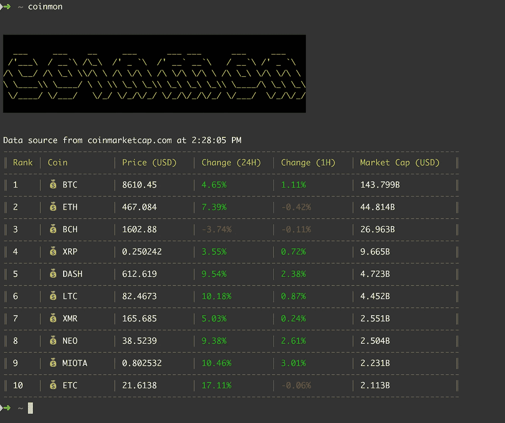
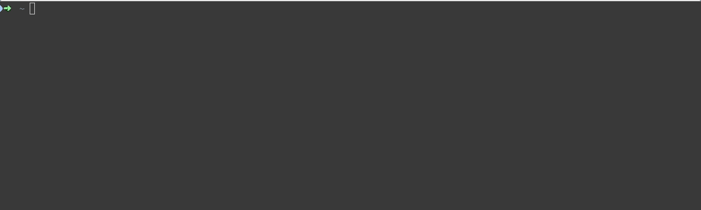
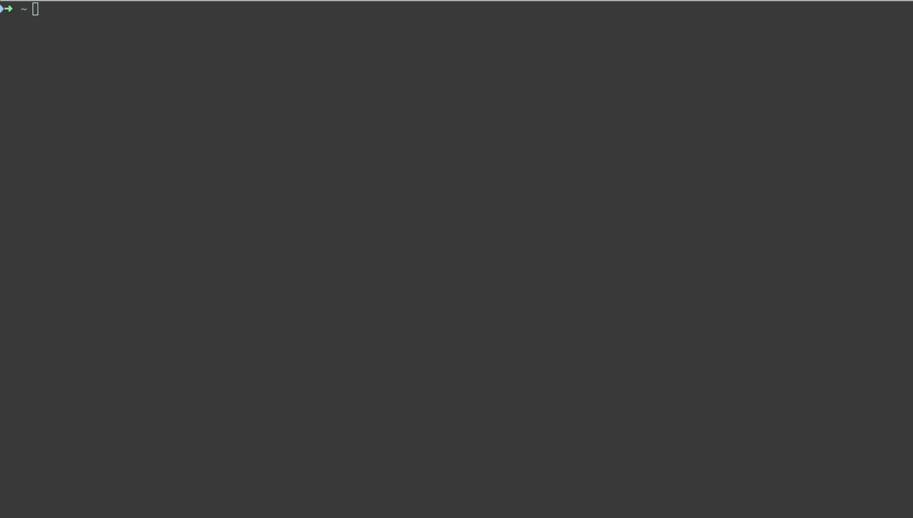

# 加密货币价格直出 CLI💰

> 原文：<https://medium.com/hackernoon/cryptocurrency-prices-straight-outta-cli-2b2be5c58c5a>



Cryptocurrency prices with a simple command

> *coimon——加密货币报价器 CLI。*

*在您的控制台上查看加密货币的价格和变化。对于加密投资者和工程师来说，这是最好的 CLI 工具。*

*所有数据来自*[*coinmarketcap.com*](https://coinmarketcap.com/)*API。*


## 安装

```
$ npm install -g coinmon
```



## 使用

`$ coinmon`



厉害！不再有 ui—只有原始 CLI！非常适合我们这样的工程师！

[](https://cleversonder.com/)

[确保签出 Github 库！](https://github.com/bichenkk/coinmon)——也可查看该包作者——[陈](https://github.com/bichenkk)。

如果你觉得这很有用，请给我一些掌声，这样会有更多的人看到它！

感谢阅读！❤