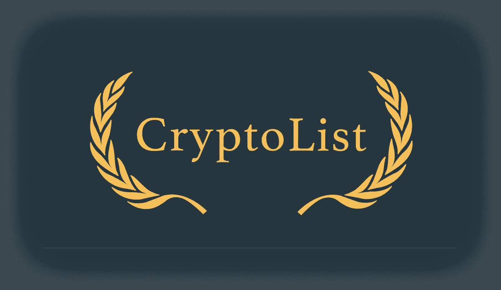

# 加密货币资源列表(109+链接🔗)

> 原文：<https://medium.com/hackernoon/cryptocurrency-resources-list-109-links-e10aed48dfeb>

## 比特币生态系统很容易迷失在其中，不是吗？

问候！

我叫亚历山大·伊索拉。我是一名网络开发人员和企业家。我正在建立自己的创业公司，并在[电报频道](https://t.me/serene_startup)上写下这段旅程。

这个列表是我个人收集的关于[加密货币](https://hackernoon.com/tagged/cryptocurrency)的最佳网络资料。尽情享受吧！

> 请注意这个列表只是[密码列表](https://github.com/coinpride/CryptoList)项目的一部分。

# ✒️媒体

## 杂志和博客

*   [密码黑客](https://cryptohackers.party/) —密码世界超级英雄访谈。迷人的事实，团队内部和成功的故事。
*   [CoinTelegraph](https://cointelegraph.com/) —提供最新新闻、分析、专家意见和社区评论的领先出版物。成立于 2013 年。
*   [CoinDesk](https://www.coindesk.com/) — CoinDesk 是数字货币新闻和信息的全球领导者。1700 万月度用户。
*   [密码币新闻](http://www.cryptocoinsnews.com/) —新鲜新闻与分析。这个巨大的博客帖子非常频繁。近似的每月 700 万读者。
*   [比特币杂志](https://bitcoinmagazine.com/) —《比特币杂志》是最古老、最成熟的新闻、信息和专家评论来源。有时候会发很有深度很有意思的文章。
*   [99 比特币](https://99bitcoins.com/) — 99 比特币是非技术新手最大的信息来源。
*   [Coin Speaker](https://www.coinspeaker.com/) —成立于 2014 年的 Coin Speaker 是最具影响力的新闻来源之一。

## 中等

*   [维塔利克·布特林](/@VitalikButerin)—— [Electrum](https://medium.com/u/587a00dbce51#home) —瘦比特币客户端。麻省理工学院的开源有 100 多个贡献者。
*   [Exodus](https://www.exodus.io/) — Exodus 是首款内置 ShapeShift 的桌面多资产钱包。
*   [MyEtherWallet](https://www.myetherwallet.com/) —开源 webapp 访问以太坊。老可靠。ERC20 支持。深受钓鱼者的喜爱！
*   [Coinomi](https://coinomi.com/) —开源，支持多种 altcoins，速度快，UI 完美。

# 替代🛍

*   [Blockfolio](https://www.blockfolio.com/) —加密货币管理，使用易于使用的工具来跟踪您所有的加密货币投资。不错的配件。简单。安卓/iOS。
*   [ACrypto](https://dworks.in/acrypto) —追踪比特币和替代币价格、自定义警报、详细图表。灵活，设置多，信息量大。仅限安卓系统。
*   [Altpocket](http://www.altpocket.io/) —展示、跟踪和分享您的加密货币投资所需的唯一工具。
*   [Coinfyi](https://coin.fyi/) —跟踪你的表现，与你的加密货币投资相关的新闻&市场信号。匿名。简单。免费。

# 有用的工具🛠

*   [二维码生成器](https://bitcoinqrcodegenerator.win/)——使用这个免费工具，你可以立即为你的比特币/莱特币/以太币/Dogecoin 地址生成二维码。
*   [区块探索者](https://tradeblock.com/bitcoin/) —在线发现比特币区块链区块。包括费用和矿工信息。
*   [以太扫描](https://etherscan.io/) —以太坊的数据块浏览器和分析平台。

# 录像🎥

## YouTube 频道

*   你的加密货币新闻剂量。
*   [世界加密网络](https://www.youtube.com/user/WorldCryptoNetwork) —信息丰富的新闻摘要。
*   [Crypt0](https://www.youtube.com/user/obham001) — Omar 是最受欢迎的加密博客作者之一。他创造了引人入胜的采访。
*   [Ameer Rosic](https://www.youtube.com/user/AmeerRosic)——新闻、采访、播客和评论。
*   [aantonop](https://www.youtube.com/user/aantonop/featured)——《掌握比特币》作者安德里亚斯的演讲、讨论、问答。
*   [CoinSummit](https://www.youtube.com/channel/UCr4QRCZDXrCecaV2w4nuLeQ/) — CoinSummit 记录:创业公司展示、讨论和演示。
*   [BitcoinFilm](https://www.youtube.com/channel/UC42Y8ajCzQ_rjS_wVTamglQ)——关于人们使用比特币的短片。
*   [比特币与加密货币课程](https://www.youtube.com/channel/UCNcSSleedtfyDuhBvOQzFzQ/videos) —比特币与加密货币技术课程。12 个视频，每个 45-90 分钟。

## 电影

*   [不可告人的状态](http://www.iamsatoshi.com/)——与比特币生态系统中一些思想领袖的真实对话。这部电影花了 3 年时间才完成。
*   [比特币 Doco](https://vimeo.com/112223859)——聚焦新全球货币出现的迷人故事。
*   [中国秘密比特币矿场的生活](https://www.youtube.com/watch?v=K8kua5B5K3I)——关于新千年矿工的有趣故事。

# 学问📝

## 书

*   掌握比特币——主要面向开发者。第二版于 2017 年 6 月出版。
*   [货币互联网](https://www.amazon.com/Internet-Money-Andreas-M-Antonopoulos/dp/1537000454)——通过一系列跨越令人振奋的比特币技术成熟过程的文章，探讨比特币的意义。
*   [以太坊](https://www.amazon.com/Ethereum-Blockchains-Decentralized-Autonomous-Organizations/dp/1523930470)——了解区块链的非技术性指南。大多集中在以太坊。
*   [加密货币时代](https://www.amazon.com/Age-Cryptocurrency-Blockchain-Challenging-Economic/dp/1250081556) —洞察现代金融体系和比特币行业。

## 课程

*   [Coursera 课程](https://www.coursera.org/learn/cryptocurrency)——讲述比特币的特别之处，以及它在技术层面的工作原理。由普林斯顿大学创建。
*   [Udemy 课程](https://www.udemy.com/bitcoin-or-how-i-learned-to-stop-worrying-and-love-crypto)——理解比特币是什么以及我们为什么应该关注比特币的权威指南。

## 其他的

*   最重要的加密新闻和事件。每周一封手工制作的电子邮件。
*   [比特币维基](https://en.bitcoin.it/wiki/Main_Page) —协议的技术规范以及更多关于如何购买、出售或使用比特币的基本信息。
*   [区块链演示](http://blockchaindemo.io/) —这个互动演示将引导你一步一步地了解区块链的每个组成部分。
*   [MyCryptoGuide](https://mycrypto.guide/) —该指南旨在简单易懂地介绍加密货币世界。
*   [坏比特币](http://www.badbitcoin.org/) —已知骗局、骗局和庞氏骗局列表。

# 对于开发人员🤖

## 应用程序接口

*   [条纹比特币](https://stripe.com/bitcoin/)——轻松接受比特币支付。来自 Stripe 的出色集成。
*   [Shapeshift](https://info.shapeshift.io/api) —在你的应用中嵌入 exchange。受到数百个应用的信任。
*   [微软 BaaS](https://azure.microsoft.com/en-in/solutions/blockchain/) —微软 Azure 的区块链即服务(BaaS)。
*   [CoinMarketCap](https://coinmarketcap.com/api/) —强大的 JSON API，覆盖 1000+硬币。限制:每 6 秒 1 个请求。
*   [CoinCap](https://github.com/CoinCapDev/CoinCap.io) —简单且信息丰富。很多代用币。历史数据。没有限制。

## 其他的

*   使用 Bitpay 的零售、电子商务、账单和捐赠工具来接受支付。
*   [Gekko](https://github.com/askmike/gekko) —免费开源的交易机器人。GUI，CLI，NodeJS，漂亮的文档。18 家交易所(包括 Bitfinex、Bitstamp 和 Poloniex)。
*   [Zenbot](https://github.com/carlos8f/zenbot) —免费开源的交易机器人。CLI，NodeJS。GDAX，Poloniex，北海巨妖，Bittrex，Quadriga 和 Gemini。
*   [Web3.js](https://github.com/ethereum/web3.js) —以太坊 JS API。需要 nodejs、nmp 和 being 节点。
*   OpenZeppelin — OpenZeppelin 是 Solidity 语言中可重用且安全的智能合约的开放框架。1500+ Slack 社区成员。

# 播客🎙

*   [震中](https://epicenter.tv/)——处于去中心化技术革命前沿的播客。
*   [比特币知识](http://www.bitcoin.kn/) —了解区块链和金融科技。
*   [block channel](https://soundcloud.com/blockchannelshow)——致力于教育世界基于区块链的技术的力量，如比特币、以太坊和 ZCash。
*   [以太评论](https://etherreview.info/tagged/podcast) —透过以太坊的镜头探索可验证的计算空间。
*   [未经审查的比特币](https://etherreview.info/tagged/podcast) —透过以太坊的镜头探索可验证的计算空间。
*   [ICO 提醒播客](https://www.icoalert.com/podcast) —来自流行的 ICO 追踪平台的播客。

# ⛏矿业公司

*   CoinWarz —采矿盈利能力计算器。帮助我选择完美的硬币。
*   什么托明？ —寻找最有利可图的加密货币进行开采。

# 吃掉整个蛋糕！🎂

这个列表只是 CryptoList 的**一小部分**:[https://github.com/coinpride/CryptoList](https://github.com/coinpride/CryptoList)**查看这个项目，找到更多精彩的比特币资源！**

**您可以 [**成为 CryptoList 的赞助商**](https://opencollective.com/cryptolist) ，推广您的项目。**