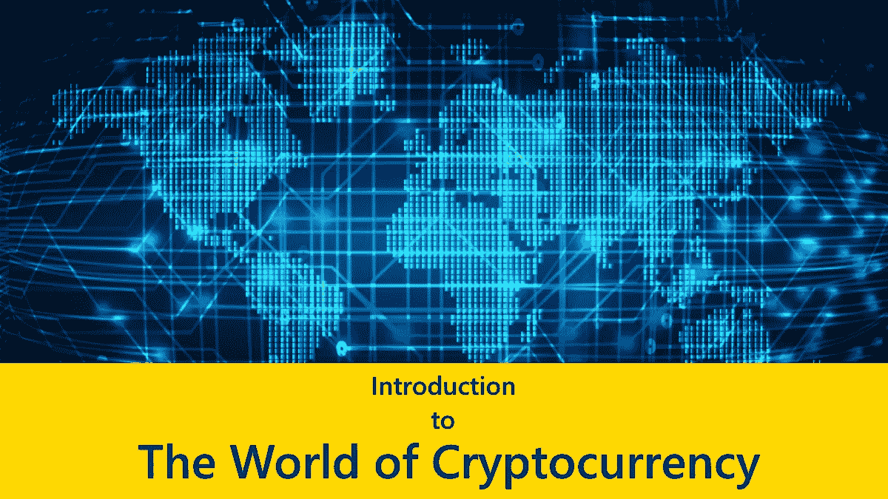

# 加密货币世界:入门所需的一切

> 原文：<https://medium.com/hackernoon/cryptocurrency-world-all-you-need-to-get-started-7df01b2b83ee>

今天，(2018 年 12 月 17 日)，比特币的价格现在差不多是 20000 美元。今年年初，价格还不到 1000 美元。不仅仅是围绕比特币，整个加密货币市场都有很多炒作。以太、莱特币、XRP、米欧塔和 BTG 只是因其价格和不断增长的市值而成为头条新闻的一些加密硬币。今年，ico 成为大多数区块链初创公司的首选众筹方式。综上所述，加密货币市场从来没有像今天这样吸引人。

所有这些统计数据和数字表明，加密市场正在蓬勃发展，毫无疑问，有些人不知道从哪里开始。有时，互联网上大量的技术和商业信息会使一些人对市场失去兴趣。作为一名潜在的投资者，你不需要计算机编程或工商管理的高级学位就能进入市场。你所需要的只是一些基本的东西和一些重要的信息。

# 入门:创建您的加密钱包

加密货币钱包是参与市场的基本入门要求。无论你个人希望投资哪个领域的市场，拥有一个钱包都是最重要的。

加密货币钱包只是加密货币的存储介质。有四种类型的钱包，即:

## 1.硬件钱包

硬件钱包被认为是所有钱包选项中最安全的。它们看起来像 USB 设备，可以用来离线存储加密硬币。一旦你将这些设备插入电脑，你就可以访问存储在其中的加密硬币。受欢迎的品牌包括 Trezor 和 Ledger 硬件钱包。

## 2.软件钱包

这些是为加密货币提供存储的计算机程序。它们通常是可以下载并安装在计算机上的客户端软件。软件钱包是一种冷藏选择，因为硬币可以离线存储在上面。

## 3.纸质钱包

纸质钱包是一张纸，其中保存着与加密货币地址的私钥和公钥相关的信息。把加密货币地址想象成一个银行账号。私钥和公钥就像访问代码。纸质钱包可以从许多网站服务中创造出来，比如 Bitaddress.org 的[和 Liteaddress.org 的](http://Bitaddress.org)。

## 4.在线存储钱包

虽然其他 3 种存储方法被认为是冷存储选项，但在线钱包是热存储选项。它们基本上是基于网络的服务，为加密货币提供存储。在线存储钱包提供了更快的交易速度，但它们容易被黑客攻击。一些受欢迎的服务提供商包括我的以太钱包和 T2 比特币基地。

# 前进

## 购买您的第一种加密货币

要参与加密货币场景，你必须获得一些加密货币。其中一个方法是从网上的[交易所](http://news.fundyourselfnow.com/2017/09/19/heard-about-cryptocurrency-exchange/)购买，比如比特币基地、 [Gemini](http://news.fundyourselfnow.com/2017/12/19/beginners-guide-trading-gemini/) 或 [Bittrex](http://news.fundyourselfnow.com/2017/12/19/learn-trade-bittrex-beginners-guide/) 。这些在线服务中的大多数都有一些他们接受的支付选项，如银行转账和信用卡/借记卡支付。如果你有一个朋友或亲戚有一些加密硬币，可以给你一些或愿意出售，你也可以从他们那里购买。

## 投资 ico

ico 是在市场上获得立足之地的名副其实的手段。通过投资 ICO，你成为了下一个比特币或以太坊的早期采用者。这里必须非常小心，因为有许多欺诈性的 ICO 活动，对未来的经济潜力毫无帮助。

如果一个 ICO 发展成为一个可行的项目，你购买的代币将会增值，甚至可能与比特币和以太等大玩家的价值持平。这有点像赌博，或者用更专业的术语来说，推测一个代币会随着时间的推移而升值，从而使它成为一个好的投资。

## 参与采矿

个人也可以选择参与挖掘加密货币。如今，一些比特币巨鳄成为了第一批积极挖掘比特币的人之一。回到使用普通的日常笔记本电脑或台式机挖掘比特币的时代。如今，集成采矿设备运行着最先进的 ASIC 单元。然而，也有联营采矿服务，人们可以注册，以便参与分散采矿和赚取佣金。

还有其他可开采的加密货币，如以太，不需要高级硬件设置就可以成功开采。预算紧张的投资者可以购买这种加密货币，并从中获得丰厚利润。

# 有用的提示

拥有多种类型的钱包是个好主意。为了方便交易，网上钱包是必备资源。然而，不建议将你的硬币长时间存放在网上钱包里，甚至不建议在网上钱包里存放大量硬币。在这种情况下，拥有一个用于批量存储和安全保护的配套冷藏选项就派上了用场。当您希望进行交易时，您可以从您的大容量存储器转移到您的在线钱包。

警惕欺诈性 ico 和池矿服务。确保在分析 ICO 产品时进行尽职调查，以确保它值得投资。至于池采矿服务，其中一些只不过是庞氏骗局。在注册之前在网上搜索这些服务的信息是一个好主意。

渴望了解更多关于 FundYourselfNow 的信息吗？在我们的 [Telegram](https://t.me/fundyourselfnow) 群组上加入我们的众筹革命对话，或者在 [Twitter 上关注我们。](https://twitter.com/fundyourselfnow)