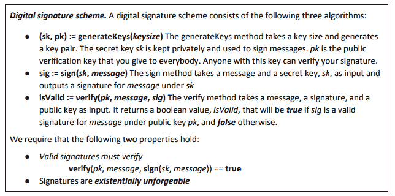
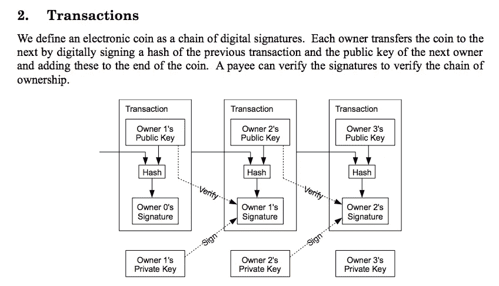
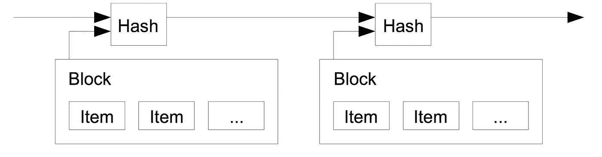
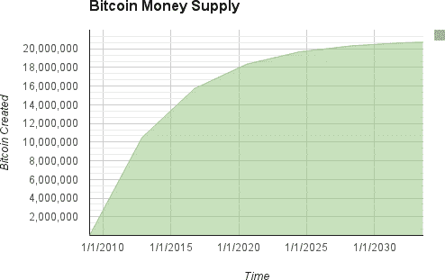

# 语境中的密码经济学

> 原文：<https://medium.com/hackernoon/cryptoeconomics-in-context-6435ad6839be>

## 诞生了比特币、区块链和名为 Web 3.0 的新兴生态系统的学科

“加密经济学”这个词听起来很酷，但它本身并没有明确的定义。对于那些寻找理解比特币、区块链以及你的[技术](https://hackernoon.com/tagged/technology)朋友和可疑投资顾问所说的一切的人来说，密码经济学是一个好的起点。在这里，你会明白“”产业是如何从头开始运作的——不仅是技术上，还通过经济激励。

本文的目的是定义密码经济学，指出一些当前可用的工具，并回顾这些设计在实际项目中的一些有趣的用例。站在像 **Kahneman** ( [《思考的快慢》](https://en.wikipedia.org/wiki/Thinking,_Fast_and_Slow))和 **Munger** ( [心智模型](https://www.farnamstreetblog.com/mental-models/))这样的思考巨人的肩膀上，这篇文章的目标将是开启关于用来创造比特币的基本工具的对话，以及它们在其他区块链是如何被重新使用和构建的。

推进加密经济研究是确保社区在设计下一代万维网时了解可用工具的最佳方式。现在是构建和迭代这些工具的时候了——当用户数以百万计，而不是以十亿计的时候(*感谢* [*杰夫·科尔曼*](https://medium.com/u/759b9cb7f0dd?source=post_page-----6435ad6839be--------------------------------) *，出于这个想法*)。

# **一点史前史**

顾名思义，“密码经济学”是密码学、计算机科学和经济学等领域的结合。

## **密码术**

密码学是从希伯来学者、斯巴达军队和其他早期文明书写的古代密码演变而来的。一个著名的早期密码是“凯撒密码”，其中字符串中的每个字母向前移动一个固定的量。举个例子，如果移位是 3，字母是‘c’，就变成了‘f’。

> *在这个凯撒密码中，“密码学”→“fubswrjudskb”。*

这个简单的例子展示了密码学的主要特征:**防御者的优势**。密码系统比使用起来更难破解。*测试*:给你的朋友“fubswrjudskb”，告诉他们弄明白你的意思。

今天的密码系统已经进化。现在密码系统的目标是抵抗攻击，即使它们的内部工作是已知的。虽然有人可以通过威胁一个人很容易地找出“fubswrjudskb ”,但是即使这个人(或者甚至，比方说，网络的 25%)被独立地破坏，密码安全系统也应该存在。这样的力量导致 ***不愿意*** 去尝试破解密码。*说到激励…*

## **机构设计**

机制设计是经济学的一个领域，致力于研究激励行为的机制。如果说博弈论是对一个游戏中不同可能行动的研究，**机制设计就是对创造一个游戏的研究。**

一个游戏设计者必须考虑 a)有什么工具可以用来创建一个游戏，b)在游戏中激励什么，c)如何从这些规则中学习，以及 d)如何一路迭代。游戏设计者的工作是引导游戏走向公平、安全的游戏。

为了说明这一点，我将带来我最喜欢的游戏— **篮球**。

你们中一些自豪的加拿大人可能知道詹姆斯·奈史密斯。1891 年，奈史密斯创造了“篮球”的十三条原始规则。第一场比赛是 9 对 9，没有运球，半场 15 分钟，中场休息 5 分钟。游戏的主要目标？比其他队投进更多的球。第一局以强势比分结束:**1–0。**

“Hooping”, circa 1891.

最初的规则鼓励球员把球投进篮筐。球员们被他们只能通过传球来移动球的能力所限制。在最初的版本中，18 名篮球运动员共享物理空间，忍受运动压力，与队友交流…所有这些都是为了得分和赢得比赛。

随着时间的推移，篮球的“测试版”已经发生了很大的变化。桃篮被换成了一个金属环，篮板和篮网(*读作:*基础设施更新)。规则被改变了。增加了运球，增加了球员在球场上移动的能力，增加了比赛的复杂性(和美感)。球场上的 18 名球员减少到了 10 名。引入了三分线，给球员增加了一分的奖励，鼓励他们练习、投篮和远投。最近，犯规规则变得更加严格。这一更新使得防守者的角色更加困难，从而增加了游戏中的得分。

Black magic…

这些“机制更新”是 NBA 不断改善观众体验和游戏本身的方式。我们所知道的篮球已经随着游戏规则的改变而改变。我们会发现设计一个像比特币这样的区块链协议和设计篮球比赛并没有太大的区别。

虽然经济学显然有着悠久的历史，但机制设计领域却是相当新的——大约有 50 年的历史。仅在 2007 年，中本聪发布比特币白皮书的前一年，[莱昂尼德·赫维奇](https://en.wikipedia.org/wiki/Leonid_Hurwicz)、[埃里克·马斯金](https://en.wikipedia.org/wiki/Eric_Maskin)和[罗杰·迈尔森](https://en.wikipedia.org/wiki/Roger_Myerson)因“奠定了机制设计理论的基础”而获得了诺贝尔经济学奖这是一个有趣的领域，我希望在未来进一步深入研究。

 [## 诺贝尔奖:什么是机制设计，为什么重要？

### 周一，莱昂尼德·赫维奇、埃里克·马斯金和罗杰·迈尔森被授予 2007 年诺贝尔经济学奖，以表彰他们…

voxeu.org](http://voxeu.org/article/nobel-prize-what-mechanism-design-and-why-does-it-matter) 

## **密码经济学**

现在我们已经更广泛地定义了“机制设计”和“密码学”，我们可以定义密码经济学了。我引用弗拉德的话:

> *“密码经济学就是应用* ***的激励机制设计*** *到* ***的信息安全问题。***

*密码经济学的观点是，通过密码学和适当的激励，我们可以保护比特币和以太坊等协议。*

*比特币是密码经济学的耀眼橱窗。第一次，有人回答了如何将这些重要、抽象的拼图( ***工具*** )组合在一起，以创造出一种可行的数字货币。*

*但是……在我们到达那里之前，我们还要学习一些东西。首先，加密原语。然后，他们在比特币中是如何协同工作的。*

# ***密码原语***

*对密码原语的判断是基于它们实现三个品质的能力:*

*   ***真实性:**消息确实来自指定的发件人*
*   ***保密性:**私人数据在传输过程中保持不变*
*   ***完整性:**数据(公共或私有)没有改变*

*一个很好的例子，从一个很好的堆栈溢出答案稍加修改:*

> *假设爱丽丝和鲍勃正在互相交谈。真实性意味着爱丽丝收到的消息实际上是鲍勃发送的。**完整性**意味着在从 Bob 到 Alice 的路由上，消息在其间没有改变。*
> 
> *一般来说，真实性意味着完整性，但完整性并不意味着真实性。例如，消息可能保持其完整性，但是它可能是由马洛里而不是鲍勃发送的。*
> 
> *【由我添加】:**保密**认为，在整个过程中，爱丽丝和鲍勃的私人信息保持不变。*

*我们将从允许比特币工作的基本要素开始，这些要素已经存在了几十年。*

## ***加密哈希***

*一个[加密哈希](https://en.bitcoin.it/wiki/Hash)接受一个输入(比如“hello”)并把它变成一个复杂的、难以重新创建的输出(比如`2cf24dba5f0a30e26e83b2ac5b9e9e1b161e5c1f984`，但是更长)。要测试你自己，在此链接处键入“hello”，然后键入“hello…”[。几乎就像收到一个重要的人的“你好”和“你好……”一样重要。](http://www.xorbin.com/tools/sha256-hash-calculator)*

*如果您知道输入，就很容易验证散列。如果你不知道你要找什么，即使有大型计算机的帮助，也不容易找到。在计算机科学中，这被称为[单向函数](https://en.wikipedia.org/wiki/One-way_function)，是我们今天使用的许多系统的安全基础。*

> *对于每个输入，单向函数很容易计算，但是对于随机输入的图像，很难求逆。*

*有许多类型的加密散列，由于它们在领域中的不同用途而被称为加密的瑞士军刀。上面的例子是一个“SHA-256”散列——我们的第一个比特币加密原语。*

## ***数字签名***

*数字签名是一种加密证明，证明签署交易的人确实是其声称的那个人。类似于我们现实生活中的签名(正式名称为*涂鸦*)，签名应该是不可伪造的。*

***公钥加密**就是这样做的。每个演员，Alice 和 Bob 都有一个公开密钥和一个秘密(私人)密钥。*

*三个重要的算法是 **a)** **生成公钥-私钥对，b)用私钥签署**和 **c)验证**以证明交易**。***

**

*From Arvind Narayanan’s seminal book, [‘Bitcoin & Cryptocurrencies’](https://d28rh4a8wq0iu5.cloudfront.net/bitcointech/readings/princeton_bitcoin_book.pdf?a=1)*

*例如，爱丽丝给鲍勃寄了 10 美元。为此，她将她的数字签名(10 美元信息+她的私钥的组合)发送到他的公钥。*

*当 Bob 收到消息时，Alice 的签名被交叉引用到她的公钥。如果匹配被验证，10 美元交换手。*

# *设计比特币*

*仅使用哈希和数字签名，就可以进行交易并安全地从一方发送到另一方。我们正在这里建造一些东西...*

**

*From Satoshi’s [Bitcoin White Paper](https://bitcoin.org/bitcoin.pdf)*

*从这里开始，计算机科学——[链表和 Merkle 树](http://chimera.labs.oreilly.com/books/1234000001802/ch07.html)——帮助将这些事务整齐地组织成“块”，并将它们链接在一起形成**区块链**。同样的“散列”信息的能力在这里也很方便:每个块由一个散列来表示，散列将它与下一个块联系起来。即使是最微小的数据修改，散列也会发生剧烈的变化，这一事实使我们能够(非常容易地)检查数据是否被更改过。*

**

*既然我们已经看到了密码学和计算机科学中允许区块链发挥作用的基本原理，让我们看看经济学是如何将这个模型带回家的。*

## *游戏中的游戏:工作证明共识*

*比特币的创造者 Satoshi 必须为比特币网络中的每一台计算机创造一种方法，以便就这一账本中的交易历史达成一致。他还必须决定如何将新的比特币引入网络。雄辩地说，“工作证明”([改编自 Hashcash](https://en.wikipedia.org/wiki/Hashcash) )实现了这两个目标。*

*Proof-of-work 使用上面的原语——严重依赖哈希(+[nonces](https://en.bitcoin.it/wiki/Nonce))——为比特币网络上的所有计算机创建一个游戏。该游戏创造了 a)对将下一个区块添加到比特币区块链的机会的竞争，以及 b)为被提议持有准确交易的区块提供经济激励。*

*比赛从使用你的计算机能力解决一个难以置信的数学难题开始，目标是找到一个比目标难度更小的散列值。要解决这个难题，你的计算机能做的不多，但每秒迭代数百万次散列**才能得到答案。当你的电脑玩这个游戏时，所有的电脑也在玩。总的来说，这些电脑就是比特币的“矿工”，为数字黄金(比特币)工作。***

***如果矿工赢得了比赛，那么他们的块是有效的，可以发送给其他矿工。获胜的矿工有很大机会赢得奖励——*x*比特币(2017 年为 12.5 比特币——价值约 75000 美元)！然而，要获得这种奖励，你的区块应该只包括有效的交易:没有有趣的业务。如果你在区块中提出哪怕一个无效的交易，你的区块很可能不会进入比特币区块链，因为没有人想在无效的区块上建立交易。这意味着你再也没有比特币了…谁知道你什么时候会有下一次机会呢？你就是这样 ***强烈地*** ***激励着*** 去进行一次诚实、准确的格挡。矿工们诚实的激励使得比特币网络真实而诚实地向前发展。***

## ***货币供应量***

***每 21 万个区块，挖掘和提出准确区块的比特币奖励减半。Satoshi 和他的团队还决定，2100 万比特币将成为这种货币的总供应量。***

********* [## 比特币区块奖励减半倒计时

### 比特币区块奖励减半倒计时网站

www.bitcoinblockhalf.com](http://www.bitcoinblockhalf.com/) 

和其他决定一样，这个决定也需要权衡。丢失的比特币——只是丢失了，货币缓慢地、长期地贬值。以太坊是一个与比特币目标不同的协议，它决定了一个 ***反通胀*** 的货币基础，该基础每年都会向系统中添加以太，但逐年略有减少。Joseph Lubin 在早期的以太坊博客中解释了他们的思维过程:

> 比特币最大的价值主张之一是货币发行总量的算法固定，规定只能创造 21，000，000 BTC。在大肆印刷传统货币以试图掩盖全球经济体系中债务过多(债务越来越多)这一注定以指数形式注定失败的时代，普遍接受的加密货币最终可以作为相对稳定的价值储存手段的前景是有吸引力的。以太坊认识到了这一点，并试图效仿这一核心价值主张。
> 
> 以太坊还认识到，一个旨在作为全球经济和社会系统的分布式、基于共识的应用平台的系统，必须大力强调包容性。我们打算促进包容性的许多方法之一是维持一个拥有一些变动的发行系统。该系统的新参与者将能够购买新的 ETH 或我的新 ETH，无论他们是生活在 2015 年还是 2115 年。我们认为，我们已经在促进包容性和保持稳定的价值储存这两个目标之间取得了良好的平衡。

采矿不再是以太坊的长期愿景，但作为一个例子，增加货币供应(越来越慢)的最初选择仍然存在。设计一款游戏只需要一天的时间…

## **经济成本**

出于安全原因，采矿的竞争方面也很重要。这使得攻击该系统的成本很高。为了有效地“接管”，攻击者需要购买足够的设备并承担足够的电费，以控制超过 51%的网络。看看今天 51%的攻击成本会是多少(超过**30 亿美元**)。

 [## 51%攻击的成本— GoBitcoin

### 比特币网络遭受 51%攻击的成本计算

gobitcoin.io](https://gobitcoin.io/tools/cost-51-attack/) 

请注意，一些矿商已经接近花费 30 亿美元，所以这可能不像我们希望的那样可靠。除了这个货币底线**、**之外，还有针对攻击者的[额外防线](https://www.cryptocoinsnews.com/4-lines-defence-51-attack/)。

## 一本巨大的交易记录

最终结果是一本由全球社区维护的巨著——其中每个人都同意交易历史的状态(感谢 [Naval](https://medium.com/u/67f5049293c7?source=post_page-----6435ad6839be--------------------------------) ，这个类比)。这本书以不可篡改的方式讲述了“金钱的故事”。

为什么这很重要？因为今天的钱也是一个故事，我们相信它是不可篡改的，因为我们信任我们的政府——发行和控制钱的政府。这些政府在很多情况下都做得很好。[在其他情况下](http://www.foxnews.com/world/2017/08/11/venezuelas-currency-now-worth-less-than-world-warcraft-gold.html)，也许没那么严重。

# 下一代游戏

比特币游戏是许多区块链游戏中的第一个。[以太坊](http://ethereum.org)出现于 2014 年，处于许多加密经济“更新”的前沿，包括[利益相关者共识](/@VitalikButerin/a-proof-of-stake-design-philosophy-506585978d51)、分片和国家渠道。如果你对密码经济学感兴趣，这里有来自以太坊联合创始人 [Vitalik](https://medium.com/u/587a00dbce51?source=post_page-----6435ad6839be--------------------------------) 的 **Cryptoeconomics 307** 。

以太坊和比特币是基础层协议(游戏)，**两者都还在修补密码经济学，寻找正确的方法。**许多工具正在被构建(等离子、闪电、0x 协议)以直接影响和围绕这个基础层。人们还在顶部构建代币，并提供加密经济激励。考虑到基层还有很多工作要做，许多人还为时过早——但有些人会准时到达。从这里开始，有许多工作要做。

 [## 以太坊/研究

### 为以太坊的研究发展做出贡献。

github.com](https://github.com/ethereum/research/wiki/Problems) 

在 [**安德的游戏**](https://smile.amazon.com/Enders-Ender-Quintet-Orson-Scott/dp/0812550706/ref=sr_1_1?ie=UTF8&qid=1510677532&sr=8-1&keywords=enders+game) 中，主角安德玩了一个大规模塑造现实的“游戏”。正如所有伟大的科幻小说一样，这已经被证明是现实中的真实故事。

密码经济学正在帮助我们创造游戏，这些游戏依赖于人的(半)理性+计算机提供的安全性。对于保护游戏规则的人，给予奖励。对于攻击者来说，巨大的金融墙是用来阻止不良行为的。我们记得，对于每一个坏演员，加密技术帮助我们**更倾向于防守者**。

在未来的帖子中，我们将探索新协议中的密码经济学，并深入到新的研究中。理想情况下，我们找到新的方法，以新的、有趣的方式使用旧的、经过测试的经济学和密码学。深入研究过去设计良好的经济体系，并从这里的第一批应用中快速学习，将非常重要。

区块链宇宙的未来正在今天被建造。有一天，这些系统可能会像今天的美联储一样根深蒂固。总有一天，未来的团队会坐下来，审视 2017 年前后完成的工作，并就我们的决策对资金和信息流动的影响提出问题。在我们达到临界质量之前，最好现在就犯错误。

因此，对于一个不断壮大的群体来说，加密经济学似乎是一个值得关注的地方。在这个阶段，所有的观点和想法都是有帮助的——分歧越多越好。希望这篇文章能让你有机会参与其中。

*多亏了*[*L4 Ventures*](https://medium.com/u/405fc689e478?source=post_page-----6435ad6839be--------------------------------)*创始人乔什·斯塔克和杰夫·科尔曼对这一职位的灵感，以及* [*内特·拉什*](https://medium.com/u/9accc392b07d?source=post_page-----6435ad6839be--------------------------------) *、* [*阿迪·坎切拉*](https://medium.com/u/d268162ba3b9?source=post_page-----6435ad6839be--------------------------------) *和康纳·戴维斯的早期反馈。*

**《T21》讲述作者:** *维韦克·辛格开启了* [*氪星工作室*](http://medium.com/kryptosstudio) *来分享关于密码经济学的思想并突出研究区块链的项目和思想家。他在区块链空间写作和创作，他的笑声更像是长时间的笑声。跟随他，在推特上随时伸出援手*[*@ vsinghdothings*](https://twitter.com/vsinghdothings)*！****