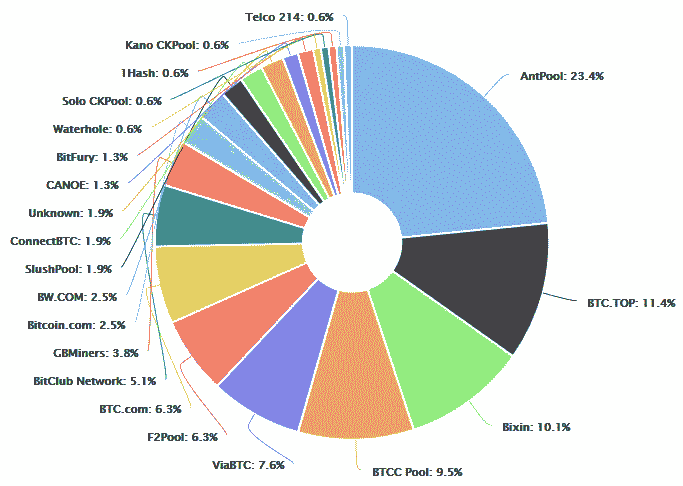
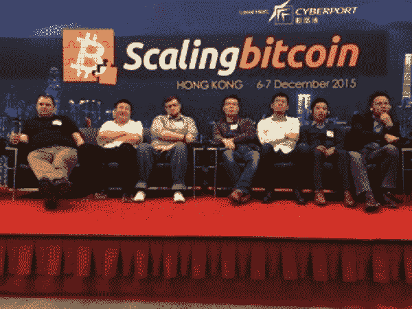
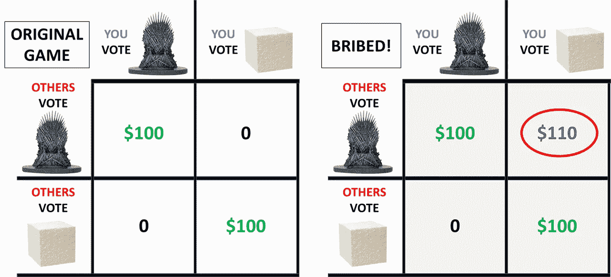

# 密码经济学:铺设区块链技术的未来

> 原文：<https://medium.com/hackernoon/cryptoeconomics-paving-the-future-of-blockchain-technology-13b04dab971>

> 如果你不能从中得到乐趣，那么发疯就没有意义了。——《美丽心灵的约翰·纳西》(2001 年)

翻阅今天关于区块链的文章，你会看到关于其应用的健康讨论和关于某人最喜欢的加密货币未来价格走势的无休止的辩论。然而，在所有这些话题中，很少有人提到这场运动最令人着迷的核心概念——区块链作为一种新奇的手段**来激励人们渴望的行为**。

在许多方面，区块链理工大学的奇迹在于它让我们能够在沙漠中种植作物，在散兵坑里养鸡。使用**密码术**，区块链概念允许我们明确地证明过去*实际发生了什么交易*。通过将博弈论和经济学结合到区块链协议的设计中，该系统鼓励稳定和这种共同利益将*保持到未来*。所有这一切都发生在一个充满黑客、骗子、海盗和巨魔的匿名、充满敌意的数字世界中！

这是**密码经济学**，一个如此新鲜的术语[以至于你需要在运行拼写检查时选择“添加到字典”。当你足够深入地挖掘区块链技术的基本概念和基于它构建的特定系统时，你会发现它们大量集成了专门设计用于最小化作恶者和敌对行为者影响的加密经济工具。](https://www.febreze.com/en-us)

虽然有许多定义略有不同，但出于本文的目的，我将我们的讨论基于以太坊 wiki 上发布的[定义。](https://theethereum.wiki/w/index.php/Cryptoeconomics)

> 密码经济学指的是密码学、计算机网络和博弈论的结合，它们提供了展示某种经济动机的安全系统。

在这篇文章中，我将讨论这些与区块链相关的**经济激励**，探索密码经济学背后的一些**安全假设**，并描述以太坊平台的新 **Casper“友好的幽灵”**协议是如何根据这些想法设计的。

# 激励和拜占庭容错

激励是博弈论和经济学的核心组成部分，它塑造了人类追求共同利益的行为。虽然密码学，或者说对链中的块进行加密和解密以有效地创建可证明的过去，已被普遍接受，但当涉及到**是否真的需要激励系统**来创建成功的加密货币或平台时，仍然存在一些分歧和争论。

我们不能不简短地讨论一下支撑去中心化数字经济的一个问题，**拜占庭将军的问题**。

光荣的拜占庭军队包围并围攻了一座城堡。将军们，实际上是分开的，指挥着军队的不同单位，意识到他们需要决定是**协同进攻**还是**协同撤退**。重要的是**多数将**交付给一方或另一方，因为不合时宜或半心半意的攻击对拜占庭人来说意味着重大损失和更糟糕的结果。

不幸的是，拜占庭军队中有数目不详的叛变将军，他们不希望这场战役以灾难性的方式结束。他们可能会向不同的将军发出相互矛盾的信息，企图破坏这一努力。此外，由于消息必须由信使传递，所以也不可能辨别这些消息是伪造的还是真实的。

核心问题是:在一个共识绝对必要的体系中，在缺乏信任的情况下，如何通过良好的程序达成一致的协议？换句话说，这些将军们如何才能战胜内部的叛徒，达成一个协调的、多数人同意的决定？

在计算机科学中，系统抵御故障组件导致的故障的能力被称为**拜占庭容错(BFT)** 。那么这和区块链以及围绕激励的讨论有什么关系呢？

在像比特币这样的加密货币中，如果没有一个针对 BFT 的协议，我们将完全处于黑暗之中，没有一些集中的权力机构。就像将军们一样，比特币节点(共享和传播区块链的计算机)需要知道哪些交易是有效的。例如，就像卖国将军和他们可疑的信息一样，人们可以花比特币，并简单地告诉其他节点他们从未花过比特币。去中心化数字货币的关键问题是**没人知道该信任谁或什么**。

比特币对拜占庭将军问题的答案是区块链之上的**工作证明(PoW)协议**。正如你会发现大量关于 PoW 的讨论和[其他材料](https://hackernoon.com/understanding-bitcoin-transaction-verification-a-childrens-story-3d877eb2641c)一样，该协议背后的总体思想是，由于所需的资源(时间、电力和处理能力)的巨大支出，它使某人尽可能难以操纵投票。为了登记投票，每个“将军”必须完成一个非常困难的数学问题，然后立即与其他人分享，其他人必须解决另一个困难的问题。这种“工作”链创建了一个铁证交易历史，同时使攻击者操纵任何东西都非常昂贵和耗时。

**激励措施开始发挥作用，以鼓励参与者维护协议**——比特币“矿工”，即记录这些交易的人，每当他们运用自己的计算能力，成功将验证的交易发布到区块链上，就会获得 12.5 比特币的奖励和交易费。通过这种方式，他们为比特币提供了一项关键服务，即传播充满有效、经过验证的交易的数据块，从而获得了回报。

在以太坊平台中，提议的利害关系证明(PoS)协议更进一步，通过**惩罚**来阻止恶意活动。在 PoS 中，为了加入系统，验证者必须提供相当大的以太币赌注来代替电力和计算能力。如果验证者的行为不符合系统的利益，他们就有失去全部股份或存款的风险。

那么，引入激励措施有什么缺点吗？由于密码领域两大主要参与者的协议都非常关注密码经济学，因此设计良好的激励系统似乎对任何区块链科技的成功都至关重要。麻省理工学院教授希尔维奥·米卡利是密码学领域的权威，他不同意这个观点。

正如这篇 [Coindesk 文章](http://www.coindesk.com/no-incentive-algorand-blockchain-sparks-debate-cryptography-event/)中所报道的，Micali 认为**激励应该被用作最后手段**，因为它们会导致许多负外部性，并以比特币为例。比特币 PoW 系统中的激励措施导致了“工业规模的矿池”，比特币矿工将他们的资源集中在一起，并分割奖励。观察下图中这些池的优势:

Incentives gone awry? [Bitcoin Hashrate Distribution](https://blockchain.info/pools), July 2017

这些大规模矿池的出现以及随之而来的赋予其背后组织的权力真正开始**挑战比特币作为去中心化加密货币的想法**，同时增加了 51%的攻击可能性，这一点我们将在稍后讨论。简而言之，如果这种趋势继续下去，我们可能会达到一种状态，即新的比特币发现几乎完全由最大的矿商主导。

米卡里转而提出了[algrand](https://people.csail.mit.edu/nickolai/papers/gilad-algorand-eprint.pdf)，一种无激励的公共区块链，通过随机过程交换每轮将军来解决拜占庭将军的问题。虽然我不会在这里详细讨论这种机制，但是这种方法避免了工作验证所需的大量计算资源，并因此产生了更快的事务。

不同的方法围绕着一个有趣的哲学问题，即**人类总体上是被利他还是自私的欲望所支配。Micali 的支持者指出 Bittorrent 上的长期利他种子和像 [Genome@Home](https://web.stanford.edu/group/pandegroup/genome/using.html) 这样的分布式计算项目证明我们并不总是需要激励来促进利他行为。与此同时，以太坊基金会的 Vitalik Buterin 和 Vlad Zamfir 坚定地站在相反的阵营，认为如果没有激励和惩罚，人们充其量只能是无动于衷(为什么还要登录？)和最坏的恶意。**

尽管区块链运动的大部分都信奉激励和加密经济学的理念，但米卡里的系统及其变体绝对有可能平行扎根。

> 你是否需要激励是一个公开的问题，我不认为它可以在一个学术模型中确定。这实际上是由证据决定的。你发射一些东西，然后看看会发生什么。——查尔斯·霍斯金森，以太坊前首席执行官

尽管比特币的 PoW 系统并不完美，但事实仍然是，它所基于的范式转变、加密经济原则(加密保护过去，经济学确保未来)已经让它存活并被采用了近十年。

# 行为的秘密经济假设

关于密码经济学令人兴奋的事情是，它的术语和理论正被区块链的开发者和思想领袖们日复一日地开创。为了强调这一领域的前沿创新，在撰写本文时，一些与加密经济学相关的术语在谷歌上搜索不到 100 个结果！虽然这一领域的许多想法都非常理论化，但请放心，它们的应用将对区块链技术的发展和采用产生难以置信的影响。

也就是说，密码经济学的重点是**设计健壮的协议**来管理分散的 P2P 系统和数字经济。换句话说，应该应用秘密经济学的概念和技术来塑造导致预期结果的行为。

如今，由于中本聪的创新，比特币运行在权力激励系统的基础上，该系统几乎克服了拜占庭将军的问题，并促进了参与者维护这一问题的努力。然而，对于 Micali 确定的负外部性，如推动具有重大影响的集中式采矿池， **PoW 协议不能被认为是密码经济有效的。**虽然米卡里指出这是激励系统总体上有害的证据，但密码经济学的支持者会提出**激励或惩罚还不够，没有得到最佳应用。**

那么我们应该通过什么样的镜头来评估一个协议呢？以太坊基金会的开发人员在他们的分析中利用了以下安全模型。参与者行为的这些假设是协议设计的基础。

## 安全模型

**诚实多数模型** —传统的容错假设，即 51%或更多的参与者基本上是诚实的，“好人”。这种模式在很大程度上被密码经济社区所拒绝，并且在一个假名的、去中心化的数字世界中经常被认为是一厢情愿的想法。

相反，在秘密经济研究中，我们要愤世嫉俗得多。我们纠结于关于攻击者的假设——即**如何协调**,他们必须发动攻击的**预算**,以及攻击导致的实际**成本**

**协调选择模型** — 假设所有协议参与者联合在同一个联盟或代理下。

大型比特币矿池就是一个很好的例子。由于大部分比特币权力由一小撮人控制，合谋是一种非常现实且具有威胁性的情况。随着采矿池的兴起，51%攻击在现实中是非常可行的，在这种攻击中，单个代理(或合谋代理)能够通过控制超过一半的采矿池来操纵比特币区块链。

虽然代理人不能重写以前的交易，从钱包里偷硬币，或造成任何严重的破坏，但他或她可以阻止其他矿工使用两条链张贴区块和“双重花费”比特币。总的来说，威慑似乎是这一行动本身弄巧成拙的影响——这种串通或大规模的努力只会让比特币整体贬值，因为参与者会对系统失去信任，并拒绝承认这段时间的交易。

Rare sighting of 90% of Bitcoin mining power in one room.

**不协调选择模型** —假设所有协议参与者彼此不协调，小于特定规模，并且有自己的目标。

这是“去中心化”背后的真实想法。比特币协议是建立在一个小宇宙的假设之上的，这个小宇宙中自私自利的参与者不会或不能协调一致。

**贿赂攻击者模型** —该假设建立在不协调选择模型的基础上，但也假设攻击者拥有足够的资源来激励其他参与者通过有条件的贿赂采取某些行动。

这个模型已经在维塔利克和[其他作者](/blockchain-at-berkeley/understanding-crypto-economic-security-through-game-theory-526e810c7736)提出的谢林科恩案中详细描述过了。出于有趣的目的，我将提供一个简短的例子:

假设在不协调选择模型的宇宙中存在一个**权力的游戏**。游戏参与者将投票决定他们是想坐在铁王座上还是泡沫塑料王座上。多数派投票的每个人都将赢得 100 美元，而少数派则一无所获。

在这个游戏中，假设你会投票坐在铁王座上，因为你想统治七大王国，因为坐在泡沫塑料块上很糟糕。你也相信大多数人会出于同样的原因这样做。因为其他人都和你得出了相同的结论，大多数人会投票坐上铁王座，每个人都会得到 100 美元。

然而，让我们假设一个恶意的泡沫聚苯乙烯主管出来推销他的非生物降解产品。他狡猾地给每个人发了一个有条件的提议:“**为泡沫聚苯乙烯投票，如果你是少数派，我个人会给你 110 美元！**”。因为他长期以来总是偿还债务，每个人都知道他对这个承诺很好，并且有**预算**来支付。

Diagrams showing your payout depending on the actions taken in the game of thrones

突然间，平衡发生了变化。现在，你有理由为泡沫聚苯乙烯宝座投票了——如果你是多数派，你会得到 100 美元，但如果你是少数派，更好的是，你会带着 110 美元回家。因为其他人又一次得出了和你一样的结论，大多数人会投票支持泡沫聚苯乙烯，这位主管会开怀大笑，根本不用付钱，实现他零成本的目标。的确，他的*善意威胁*是他的绝招。

这被正式称为 [**P + epsilon 攻击，**](https://blog.ethereum.org/2015/01/28/p-epsilon-attack/) 而比特币协议也同样容易受到这种策略的影响！用铁王座代替主区块链，用聚苯乙烯泡沫塑料王座代替攻击者的链条，你应该能够看到漏洞——一个恶意的行为者刺激大多数其他矿工接受一个异常的链条。尽管如此，由于攻击者为了进行这样的攻击必须能够可信地披露大量预算，尽管存在这一缺陷，比特币的工作证明协议仍然存在。

# 以太坊的利害关系证明:下一个实验

我想让你们记住，区块链理工大学的发展是由这些安全模型的含义推动的。正如[控制](https://thecontrol.co/)的[尼克·托马伊诺](https://medium.com/u/882245aa5d8e?source=post_page-----13b04dab971--------------------------------)所写，“密码经济学是整个运动的基本催化剂。”

为了评估协议的设计能力，以减轻这些安全模型中现有的和理论上的缺陷，开发人员利用了两个概念:

第一个是**加密经济安全边际**，它衡量违反协议保证的后果(以美元损失计)。理论上，由于攻击者只要有预算就可以零成本执行 P + epsilon 攻击，所以比特币的 PoW 系统可以说是加密经济安全边际为零！

**密码经济证明**有些类似；它是来自网络参与者的保证或消息，表明某事是真实的。如果事实证明这不是真的，参与者将会损失一定数量的钱。

因此，让我们来看看区块链理工大学今天最雄心勃勃的项目——即将到来的 [**Casper 更新**](https://blog.ethereum.org/2015/08/01/introducing-casper-friendly-ghost/) **到以太坊**，该项目试图通过将平台工作证明转换为利益证明来钻取这些问题的核心。虽然关于 Casper 的**利害关系证明(PoS)系统**的复杂性的讨论超出了本文的范围，但简而言之，PoS 试图通过强制以太坊的大量安全存款代替计算能力来提供非常大的加密经济安全裕度，以便充当验证器。这种保证金，或称加密经济凭证，是一种强有力的威慑。信息很明确——惹事生非，血本无归！

Casper 强迫参与者进入一个 SchellingCoin 游戏(如我们的铁聚苯乙烯泡沫塑料王座示例所示),在这个游戏中，他们被迫将他们的保证金赌在大多数人身上。使用我们在铁王座游戏中讨论的相同递归逻辑，大多数参与者将准确地对哪些交易有效进行投票，因为每个参与者都希望其他人得出相同的结论。因此， **PoS 可以抵抗 P + epsilon 攻击**，因为攻击者必须可信地展示一笔巨额预算，以补贴参与者的保证金，以防他们最终以少数派身份投票。

在安全模型的上下文中，我们可以看到 **Casper 在不协调选择模型**中的弹性，以及贿赂攻击者。理论上，Casper 也容易受到源于协调选择模型的 51%攻击。然而，像比特币一样，随着以太坊的发展，进行这种攻击的成本是如此之高，以至于几乎完全阻止了它。在 Casper 的案例中，失去所有相关利益的威胁是一个更强的威慑。要阅读关于 Casper 发展的更多信息，请查看 [Vlad Zamfir](https://medium.com/u/aa9bb0a9d2ad?source=post_page-----13b04dab971--------------------------------) 的[系列](/@Vlad_Zamfir/the-history-of-casper-part-1-59233819c9a9)。

虽然 Casper 的许多元素都是高度理论化的，并且利害关系证明协议本身[也引发了相当多的争论](/@VitalikButerin/this-statement-is-misleading-because-he-is-really-only-talking-about-what-a-51-attacker-could-65cd02a2389e)，但很明显，这种转变几乎完全是出于密码经济学的考虑，旨在解决 PoW 系统的许多缺点。缓慢但肯定的是，区块链空间的思想家们让我们进一步理解了在去中心化的数字经济中最优协议设计是什么样子。

区块链技术的一些批评者整体上对这样一种观点感到不安，即今天有如此多的攻击媒介在理论上是合理的。我认为值得注意的是，**只要有足够的金钱和时间，攻击者总是能够破坏任何系统**。密码经济学是一个重要的壁垒，在最坏的情况下，它试图使这些攻击尽可能昂贵、困难和不受欢迎。

随着我们进入一个[图灵完成](https://hackernoon.com/ethereum-turing-completeness-and-rich-statefulness-explained-e650db7fc1fb)智能合约的时代，这个领域肯定会变得更加复杂和令人兴奋。

我希望这能让你对新兴的、非常肥沃的密码经济学领域有所了解。因此，没有太多的资源，所以我想分享一些对我极具启发性的链接。

[**密码经济学 101**](https://thecontrol.co/cryptoeconomics-101-e5c883e9a8ff) 作者[尼克·托马伊诺](https://medium.com/u/882245aa5d8e?source=post_page-----13b04dab971--------------------------------)——本文灵感来源之一。他也有一些很棒的链接。

****作者 [K](https://medium.com/u/237777a9f910?source=post_page-----13b04dab971--------------------------------) —关于如何理解这个主题的有趣文章。****

****[**密码经济学简介**(视频)](https://www.youtube.com/watch?v=pKqdjaH1dRo)——直截了当。维塔利科·布特林喷火。****

****[**为什么密码经济学和 X-Risk 研究人员应该更多地相互倾听**](/@VitalikButerin/why-cryptoeconomics-and-x-risk-researchers-should-listen-to-each-other-more-a2db72b3e86b)—[Vitalik buter in](https://medium.com/u/587a00dbce51?source=post_page-----13b04dab971--------------------------------)关于密码经济学和人工智能研究的交集的文章。****

****[**以太坊的基本问题**](https://github.com/ethereum/research/wiki/Problems) —当前以太坊领域的挑战清单。包含一些关于密码经济学的精彩讨论。****

****[**纳什均衡和谢林观点**](http://lesswrong.com/lw/dc7/nash_equilibria_and_schelling_points/) :与[相关 Buterin 的这篇文章](https://blog.ethereum.org/2014/03/28/schellingcoin-a-minimal-trust-universal-data-feed/)本身就是一本关于博弈论的好书。****

********—核战略大师托马斯 C·谢林的老一套博弈论金书(我是认真的！)********

******感谢 Ethfans 的翻译:[https://goo.gl/BxNaDn](https://goo.gl/BxNaDn)******