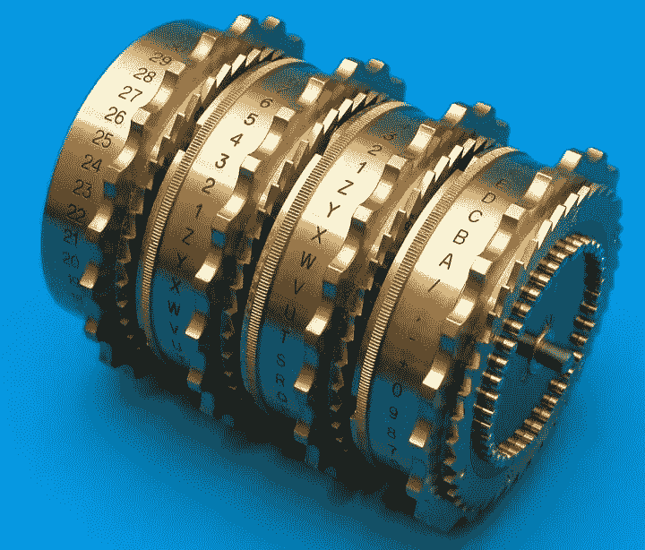

# 密码散列法

> 原文：<https://medium.com/hackernoon/cryptographic-hashing-c25da23609c3>

## 哈希函数是网络安全和一些加密货币协议(如比特币)的重要组成部分。

An Enigma machine’s rotors.

**什么是哈希？**

哈希是一种加密方法，可以将任何形式的数据转换为唯一的文本字符串。任何数据都可以被散列，无论其大小或类型如何。在传统的散列法中，不管数据的大小、类型或长度如何，任何数据产生的散列总是相同的长度。哈希旨在充当单向函数，您可以将数据放入哈希算法并获得唯一的字符串，但如果您遇到新的哈希，您将无法破译它所代表的输入数据。一条唯一的数据将总是产生相同的散列。

**它是如何工作的？**

哈希是一种数学运算，易于执行，但极难逆转。(哈希和加密的区别在于，加密可以使用特定的密钥进行反转或解密。)最广泛使用的散列函数是 MD5、SHA1 和 SHA-256。一些散列过程比其他过程更难破解。例如，SHA1 比 bcrypt 更容易破解。

Some examples of data run through SHA1 hashes. The SHA1 hashes will always be the same for this data.

**谁使用哈希算法？**

普通用户每天都会遇到密码哈希运算。例如，当您创建电子邮件地址和密码时，您的电子邮件提供商可能不会保存您的密码。相反，提供商通过哈希算法运行密码，并保存密码的哈希。每次您尝试登录您的电子邮件时，电子邮件提供商都会对您输入的密码进行哈希处理，并将该哈希与它保存的哈希进行比较。只有当两个哈希值匹配时，你才有权访问你的电子邮件。

**加密货币中的散列法**

在比特币区块链中，“挖掘”本质上是通过运行一系列 SHA-256 哈希函数来进行的。在今天的加密货币区块链中，散列被用于写入新的交易，给它们加时间戳，并最终在前一个块中添加对它们的引用。当一组交易被添加到区块链中，并且在不同节点的操作者之间达成共识(验证他们都具有整个分类帐的正确和真实版本)时，由于任何试图篡改区块链的人都需要巨大的计算能力，以及散列的单向性质，所以几乎不可能撤销交易。因此，哈希对于维护区块链的加密完整性至关重要。

**哈希和网络安全**

当一个组织发现一个平台的密码已经被破坏，这通常意味着黑客已经获得了代表密码的散列。然后，黑客运行常用词的散列和常用词与数字的组合来破译用户保存的一些密码。网络安全行业现在使用一种叫做“加盐”的机制。Salting 包括在哈希之前向密码添加随机数据，然后将“salt 值”与哈希一起存储。这一过程使得黑客更难使用预计算技术和破解他们获得的散列数据的密码。

加密哈希技术长期以来一直在网络安全中发挥着作用，现在已经准备好为即将到来的区块链应用浪潮提供动力。

[沙恩雷](http://www.shaanray.com/)

关注 [Lansaar Research](https://medium.com/lansaar) on Medium，了解最新的新兴技术和新的商业模式。

 [## 沙恩·雷

### 来自 Shaan Ray 的最新推文(@ShaanRay)。创造新价值和探索新兴技术| ENTJ | #科学…

twitter.com](https://twitter.com/shaanray) 

**资源:**

在线哈希生成器。您可以在此处对您的数据运行 MD5、SHA1、SHA-256 和其他散列函数:

*   [http://onlinemd5.com](http://onlinemd5.com)
*   [http://www.sha1-online.com](http://www.sha1-online.com)