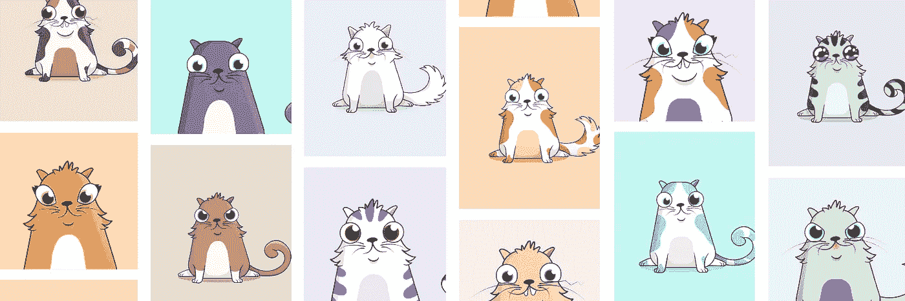

# CryptoKitties &趣味层技术

> 原文：<https://medium.com/hackernoon/cryptokitties-fun-tier-technologies-8e73903b98fc>

Credit: [CryptoKitties](https://www.cryptokitties.co)

就在你认为 crypto 不能吸引更多注意力的时候，一个名为 [ERC-721 令牌标准](https://medium.com/u/c8b1419b5d28#issuecomment-343246872)由团队成员之一编写)。这与许多区块链项目形成了鲜明的对比，这些项目似乎以领域专长和学科范围的排他性为荣。CryptoKitties 团队的 DNA 是从一个机构中诞生的一个令人高兴的副产品([公理](http://axiomzen.co))，但是没有理由这样的团队不能在其他环境中形成，无论是更大的公司还是新的创业公司。

他们的过程也彻底改变了当前的 ICO 废话，加入了一个具有相同心态的项目列表。他们从好玩的灵感开始，然后专注于产品和用户，而不是白皮书和象征性的销售。当他们在产品市场匹配中导航的时候(现在已经超过 1000 万美元的小猫交换了！)，可以说这个过程对他们很有好处。

产品应该符合目的。实用工具代币销售，即使相关，也应该遵循产品(或者可以说，产品与市场的匹配)。这些代币应该主要流向参与设计良好的经济的用户和合作伙伴，而不仅仅是投机。几乎从定义上来说，即使加密浪潮退去，ico 失宠，这种方法也会有回报。

[Benny Giang](https://medium.com/u/7f818915abef?source=post_page-----8e73903b98fc--------------------------------) 在这里分享了更多关于 CryptoKitties 的背景故事和方法[，非常值得一读。我早就向朋友和同事大声疾呼，最令人兴奋的加密(以及一般来说，新兴技术)项目将恰恰来自这些类型的团队、文化和过程。不管 CryptoKitties 是否粉碎它，这个项目背后的机器才是真正的故事。](https://hackernoon.com/why-were-not-doing-an-initial-coin-offering-ico-5a6d6dfedca1)

## 趣味层技术

我要说的最后一件事比 CryptoKitties 或 crypto 本身更广泛:**谢天谢地，人们终于对前沿技术感兴趣了**。

过去几年里发生了一件奇怪的事情。在上一次技术浪潮(云、社交、移动等)之间的间歇。)以及下一个(crypto、AI、机器人、AR/VR 等。)，硅谷变得痴迷于登月、颠覆工业和拯救世界——或许是受到了埃隆·马斯克(Elon Musk)等传教士的启发，他们没有任何事业是遥不可及的。

所以现在，随着前沿技术变得成熟，创始人和投资者很快就会利用它们为人类最基本的问题服务:饥饿(农业)、疾病和衰老(生命科学)、气候(能源)等等。这是，嗯，一些严重的狗屎。非常重要的工作。

但是停止我们的工作会有损失。作为人类有太多的东西。乐趣，玩耍，惊奇，想象力，创造力，学习，知识。前沿技术对于这些需求来说将会是完全变革性的，我对专注于它们的创始人和项目感到无比兴奋。毕竟，一旦我们解决了人类所有的问题，我们要做什么？