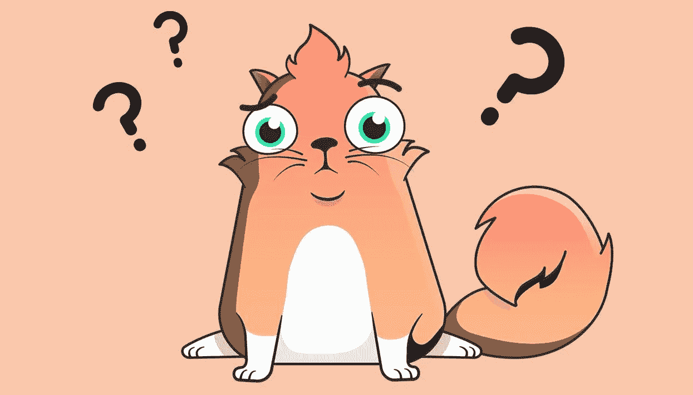

# 数字加密货币:流行的数字加密货币游戏

> 原文：<https://medium.com/hackernoon/cryptokitties-the-popular-cryptocurrency-game-ca60d1bffd0b>

数字加密货币和基于区块链的应用程序已经在公共场合无处不在。过去只有业余爱好者和狂热爱好者对市场感兴趣的日子已经一去不复返了，现在似乎有很多人想参与进来。因此，多年来出现了在人类生活的不同领域中提供多种服务解决方案的过多的应用。

数字加密货币的革命和数字加密货币的诞生并没有把游戏行业排除在外。市场上最令人兴奋的基于加密的游戏之一就是本文的主题。这款游戏如此受欢迎，甚至导致区块链以太坊的网络中断。也有巨大的销售记录内的游戏和所有这一切都发生在很短的时间内。这篇文章将试图呈现有关游戏的所有相关信息，Cryptokitties。

## 什么是加密货币？是谁开发的？

Cryptokitties 是一款允许玩家使用以太坊区块链上的智能合约收集、繁殖和“饲养”猫(数字 kitties)的游戏。该游戏于 2017 年感恩节当天推出，凭借每天迅速上升的受欢迎程度，已经成为一大轰动事件。数字猫是通过以太坊网络上的代码生成的。游戏中的每只猫都是独一无二的，而且会像加密货币一样永远存在。

这个游戏是由位于加拿大的科技公司 Axiom Zen 开发的。据该公司称，该游戏背后的动机很大程度上是为了介绍一种有趣的方式，让人们了解区块链技术和智能合同。

## 你怎么玩加密货币？

为了能够玩 Cryptokitties，有一些基本的要求，每个玩家都需要。具体如下:

## 1.计算机

你需要一台装有 Chrome 或 Firebox 浏览器的电脑或笔记本电脑。这样做的原因是，您可以使用基于 web 的钱包服务。

## 2.元掩码

MetaMask 是以太坊加密货币的数字钱包，用作浏览器扩展。

## 3.醚

这个游戏不是免费的，游戏中的货币是以太，以太坊区块链的本地货币。

一旦满足了所有这些要求，个人就可以开始玩这个游戏。

## 初步步骤

*   在 chrome 或 Firefox 浏览器上安装元掩码扩展，并保存种子短语。
*   将主钱包中的一部分以太币转入元蒙版钱包。
*   登录元蒙版，导航到 Cryptokitties 市场，其中显示了所有的 kitty 销售。

## 如何买卖加密货币

购买过程非常简单，你所要做的就是检查市场，寻找一只小猫来买。除了展示出售的小猫，玩家还可以选择购买“第 0 代”小猫。这些特殊类型的小猫每一刻钟被释放一次。每隔一刻钟发布一次新的第 0 代小猫将持续到 2018 年 11 月。

## 繁殖隐猫

繁殖特征是获得隐猫的另一种方式。它包括让两只小猫一起繁殖，创造一只新的小猫。这两只猫可以是玩家拥有的猫，或者是玩家可以和另一只来自赛林区的猫繁殖。繁殖需要以太来处理交易。以下是一个典型隐猫繁殖的简化描述。

1.  导航到游戏面板的“我的小猫”部分。
2.  选择一只小猫作为“父亲”
3.  点击“品种按钮”
4.  选择另一只猫作为“夫人”(母亲)
5.  确认交易以完成育种过程。

一段时间后，新繁殖的小猫将出现在玩家游戏仪表盘的“我的小猫”部分。这种新繁殖的小猫可以被饲养或在市场上以一定的价格出售。

## 杂项信息

这些小猫都有独特的基因，这些基因以代码的形式出现，在游戏中被称为“属性”游戏中每只小猫的基因组基本上是一个 256 位的加密数字，它提供了决定小猫物理属性的信息。有时，作为繁殖过程的结果而产生的小猫与母猫(公猫和母猫)有一些共同的属性。其他时候，新繁殖的小猫可能与母猫完全不同。

这个系统是完全随机的。没有脚本或固定的算法来决定猫的价格。游戏玩家根据市场动态来决定一只小猫的售价。在某些时候，一些特征变得比其他人更令人垂涎，这就增加了对具有这些特征的猫的需求。

## 最后的话

到目前为止，Cryptokitties 取得的成功已经让许多人意识到了加密收藏品市场的增长潜力。它就像多年前非常流行的神奇宝贝卡片和电子鸡一样吸引人。还有一个额外的好处是让更多的人参与到加密货币的场景中，这可能会大大提高主流社会对该技术的接受程度。

渴望了解更多关于 FundYourselfNow 的信息吗？在我们的 [Telegram](https://t.me/fundyourselfnow) 群组上加入我们的众筹革命对话，或者在 [Twitter 上关注我们。](https://twitter.com/fundyourselfnow)