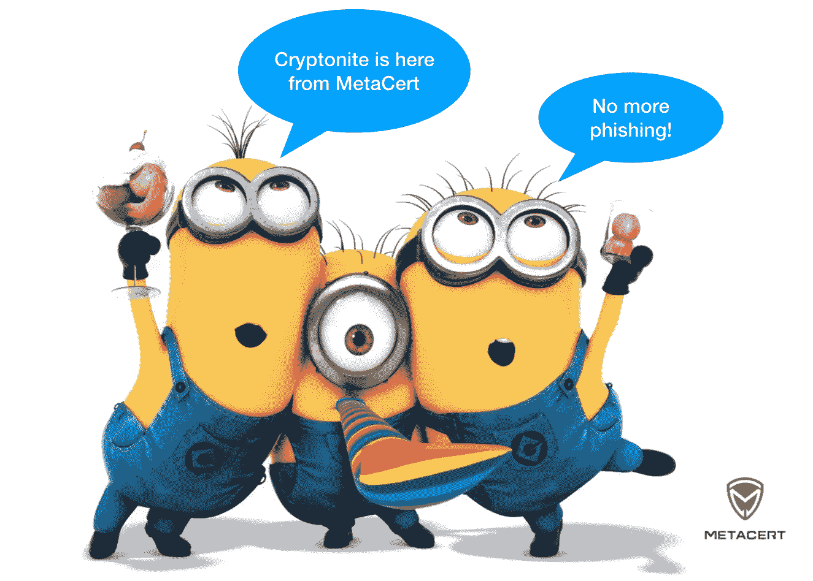
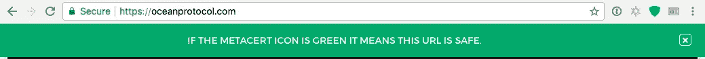

# Cryptonite，一种为加密货币爱好者设计的新型安全浏览器插件

> 原文：<https://medium.com/hackernoon/cryptonite-a-new-kind-of-security-browser-add-on-for-cryptocurrency-enthusiasts-c2a1216946ed>

你怎么知道什么时候打开电子邮件中的链接，或者通过 Telegram、Slack、Twitter 或任何其他信息服务是安全的？简而言之，你没有。不完全是。除非您使用正确的工具来保护您免受恶意攻击，如网络钓鱼诈骗。

MetaCert 的 Slack 安全应用程序在打开 Slack 内部的链接时可以保护许多加密社区。但是我们觉得需要更多的保护。隐石将为已经被[元认证](http://metacert.com)保护的松散社区提供终极保护，但是他们可以被任何人使用。

## 通过安装 Cryptonite，您不太可能陷入网络钓鱼骗局。🎣 💣

*   **安装** [**铬玄铁**](https://chrome.google.com/webstore/detail/cryptonite-by-metacert/keghdcpemohlojlglbiegihkljkgnige)
*   **为火狐安装** [**密码**](https://addons.mozilla.org/en-US/firefox/addon/cryptonite-by-metacert/)

# 它是如何工作的

一个工具。两个特点。

*   该软件会阻止已知的钓鱼网站。那很简单。 [MetaMask](https://metamask.io/) 在这方面也做得很好——同时还提供了其他独特的好处。我们推荐 MetaCert 的 MetaMask 这不是我们的浏览器软件，尽管它的名字可能暗示了别的意思。顺便说一下，MetaCert 拥有世界上最先进的威胁情报系统，以及世界上最大的安全分类网址数据库。即使您已经使用元掩码，您也应该为最重要的功能安装 Cryptonite。见下文。

*   神奇的是。🎩当你安装这个软件时，它会在你的浏览器工具栏上添加一个黑色的小盾。每当你访问一个已经“被 MetaCert 验证”的加密网站，这个盾就会从黑色变成绿色。这表明该网站 100%保证是真实的网站，而不是仿冒网站。所以，如果它不是绿色的，假设它是不安全的，直到你证明不是这样。

> 使用 Cryptonite 应该使任何人都不可能陷入 MyEtherWallet 网络钓鱼骗局。

# 为什么绿盾很重要

从上面的屏幕截图可以看出，OceanProtocol.com 有一个 SSL 证书——浏览器看到这个证书后会在地址栏放一把挂锁。这意味着网站是安全的，因此传输敏感信息是安全的。挂锁并不表明这个网站是真的。基本的 SSL 证书是免费的，并且已经被钓鱼网站使用了一段时间。

为了向你证明一个网站确实属于 x 公司，他们必须购买所谓的扩展验证证书。这些是昂贵的，劳动密集型的，并且需要时间来处理。在我个人看来，EV 证书几乎没有任何价值，因为绝大多数消费者不知道基本 SSL 和扩展 SSL 之间的区别。这就是为什么我们认为在工具栏上放置一个可视指示器是很重要的。

# 观看下面的视频演示，了解 Cryptonite 的工作原理。

# 为什么你可以相信隐石

Cryptonite 是由给你带来 digg，Delicious，Yahoo！、易贝、贝宝和谷歌。在 Mozilla 开源项目的早期，他们还负责修复 Firefox 的 bug。

这些附加组件是免费的，并将很快开源。

# MetaCert 验证了什么样的站点？

我们已经验证并标记了尽可能多的加密钱包和交易所，因为我们可以在短时间内找到我们看。如果我们错过了任何 info@metacert.com，请告诉我们，或者在这个帖子上留下评论。或者发推特给我们[twitter.com/metacert](http://twitter.com/metacert)

对于加密社区，如令牌发布和 ico 背后的社区，我们只验证 MetaCert 客户。在很大程度上，我们希望通过提供免费服务为他们提供尽可能多的价值。如果你是一个客户，你发现你的网站或社交媒体账户没有变绿，请联系 customer@metacert.com

如果您想成为为您的 Slack 社区安装我们的安全软件的客户，请访问 slacksecurity.metacert.com**T2**

# 您的隐私对我们来说极其重要

在 MetaCert，我们不**也不**使用任何针对隐铜矿的监控或分析软件。这意味着我们无法知道谁在搜索什么。MetaCert 不会传输或存储您的个人浏览器历史记录。诚然，我们的软件会分析你访问的所有网址，但我们无法识别你是谁或你使用的任何设备。我们不会因为任何原因跟踪任何人。你对我们来说是完全匿名的。

我们认为您的隐私与您的安全同等重要，甚至可能更重要。

*   **安装** [**铬玄石**](https://chrome.google.com/webstore/detail/cryptonite-by-metacert/keghdcpemohlojlglbiegihkljkgnige)
*   **为火狐** 安装 [**密码**](https://addons.mozilla.org/en-US/firefox/addon/cryptonite-by-metacert/)

*☚****请轻点或点击*** 👏“在屏幕左侧的*让 Paul 和其他人知道你很欣赏这篇文章。我们希望看到加密社区和其他利益相关者推广这些插件，以帮助保护更多的人免受网络钓鱼欺诈。请在 Twitter 和你的社区内与你的朋友和同事分享这篇文章。*

鼓掌的次数表明你有多喜欢这个帖子，有多支持它的内容，所以尽可能多的把你的手放在一起。🔒

