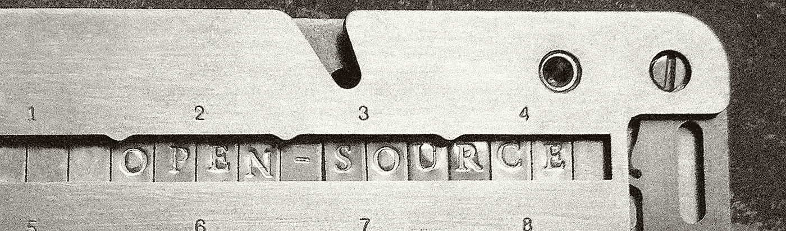
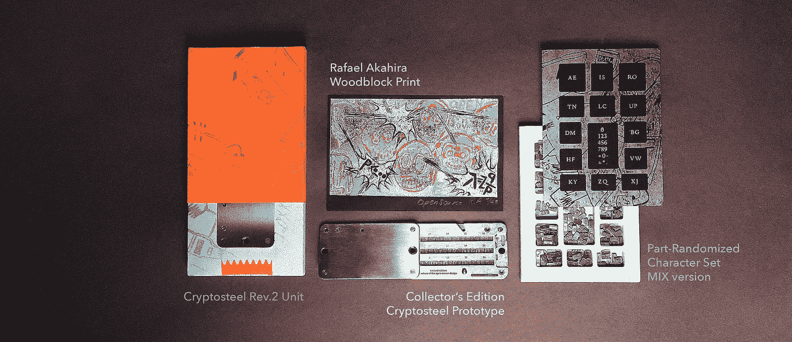

# Cryptosteel 脱离 beta 进入火海！

> 原文：<https://medium.com/hackernoon/cryptosteel-is-out-of-beta-and-into-the-fire-7f5bf6368654>

大新闻，各位！Cryptosteel 现已退出测试版[，特别版将在有限时间内推出](http://cryptosteel.com/product/limited-edition-open-source/)。

经过无数次的头脑风暴、演示和优化，我们期待已久的装配线终于准备就绪，可以开始运行了。我们非常感谢所有的朋友、粉丝、先锋顾客和早期支持者。你们让我们有可能走到这一步，我们很激动地宣布我们旅程的下一阶段。

截至目前，开源的 Cryptosteel 项目原理图已经可以在 [Github](https://github.com/cryptosteel/cryptosteel) 上永久下载。为了庆祝这一事件，我们提供了限量版的独一无二的试运行原型，每个原型都有签名，与众不同，是珍藏版的一部分，由 Cryptosteel 的特约艺术家 Rafael Akahira 签名。为了纪念我们的开源发布，Akahira 将他标志性的简化木刻技术与生动的图像相结合，后者的灵感来自中本聪臭名昭著的宣言。每一个打印，就像每一个限量版的 Cryptosteel 坚不可摧的备份工具，是完全独特的，只在有限的时间内可用。

Limited Edition Cryptosteel Open Source Launch Bundle

我们也很高兴地报告，我们最新最改进的 Cryptosteel 蓝图已经更新，可以在开源的基础上供[下载](https://github.com/cryptosteel/cryptosteel)。与我们的[限量优惠](http://cryptosteel.com/product/limited-edition-open-source/)不同，这不是临时安排。事实上，我们保证永远支持开源方式。

# 关于我们:

Cryptosteel 是首屈一指的坚不可摧的备份工具，用于在没有任何第三方参与的情况下，优化私钥、密码和钱包恢复种子的离线存储。该技术将古老的雕刻理念与 DIY 组装格式和不锈、不锈、耐火温度高达 1200°C/2100°F 的材料相结合，能够在极端条件和不可想象的滥用情况下生存。

> 我们的目标是为比特币用户和所有对互联网时代的安全隐患敏感的人解决第三方参与的问题。— Wojtek Stopiński，Cryptosteel 首席执行官

在测试阶段得到数百名加密货币用户的认可后，Cryptosteel 将全面生产，并向公众提供最终产品。

> 直到我实际拥有了自己的 Cryptosteel 工具，我才知道我必须参与比特币的体验。— Cryptosteel beta 用户

Cryptosteel 坚不可摧的备份工具兼容众多比特币高清钱包，包括 Trezor、Ledger 和 KeepKey。

Cryptosteel 公司总部位于英国，所有 Cryptosteel 产品都在波兰矿产丰富的下西里西亚组装，这里是公司创始人和加密货币爱好者 Wojtek Stopiński 的家乡。

> 我们认为有必要赋予加密货币一个坚实、具体的形状和重量。我们的客户告诉我们，他们喜欢 Cryptosteel 像钱一样的感觉。
> — Wojtek Stopiński，Cryptosteel 首席执行官

每个 Cryptosteel 工具都使用户能够即时和秘密地存储多达 96 个字符的机密序列。使用提供的优化(部分随机化)切片库手动组装备份。应用包括存储兼容 BIP39 的私钥、账号、主密码、pin、GPS 坐标和其他敏感信息。

# 链接

密码钢店:[Cryptosteel.com](http://www.cryptosteel.com)开源蓝图:[github.com/cryptosteel/cryptosteel](http://github.com/cryptosteel/cryptosteel)

> [黑客中午](http://bit.ly/Hackernoon)是黑客如何开始他们的下午。我们是 [@AMI](http://bit.ly/atAMIatAMI) 家庭的一员。我们现在[接受投稿](http://bit.ly/hackernoonsubmission)并乐意[讨论广告&赞助](mailto:partners@amipublications.com)机会。
> 
> 如果你喜欢这个故事，我们推荐你阅读我们的[最新科技故事](http://bit.ly/hackernoonlatestt)和[趋势科技故事](https://hackernoon.com/trending)。直到下一次，不要把世界的现实想当然！

