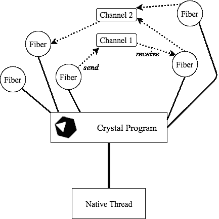

# 水晶——你从未听说过的红宝石

> 原文：<https://medium.com/hackernoon/crystal-the-ruby-youve-never-heard-of-57bad2efac9c>

## 一种速度极快的编程语言，具有 Ruby 风格的语法


# *什么*？

[Crystal](https://crystal-lang.org/) 是一种新的、优雅的、多范例的编程语言，高效且快速。它有 R̶u̶b̶y̶'̶s 的 Ruby 风格的语法，可以编译成本地代码。这种语言看起来和 Ruby 有多相似是不真实的。
这种语言结合了高效的代码和开发人员的生产力，增加了完整的 OOP，一个伟大的并发模型和一个握着你手的编译器。

本文旨在向您提供一个简短的概述，一个与 Ruby 的直接性能比较，并展示一些使它与众不同的东西。建议你在继续阅读之前至少了解一些 Ruby。

# 从有趣的东西开始——一个表演的例子

让我们实际感受一下 Crystal 的性能。
我在[水晶](https://github.com/Enether/crystal-aa-tree/blob/master/AA_Tree.cr)和[红宝石](https://github.com/Enether/crystal-aa-tree/blob/ruby-conversion/AA_Tree.rb)中都写了一个 [AA 树](https://en.wikipedia.org/wiki/AA_tree)。
*注意:代码质量可能不是一流的。Crystal 代码的一些行被有意写得更加明确*

我们将运行这段代码来对每个实现进行基准测试:

这实际上是将数字添加到我们的树中(内部排序)，然后一个接一个地删除每个数字。每次添加/删除时，我们还检查树是否包含给定的数字两次。

上面的代码片段实际上是水晶代码。
就像我说的，这些语言乍一看是一样的。对于一个 360 行的文件，从 Crystal 到 Ruby 重写代码总共花费了我 50 行的修改。 [*27 如果你是贪婪的*](https://github.com/Enether/crystal-aa-tree/pull/2/files)
值得注意的是，那些改变仅仅是移除`.as()`方法调用和类型注释。

## 好吧，它们看起来一样，但是 Crystal 快多少呢？

让我们构建可执行文件并开始测试

```
> enether$ crystal build AA_Tree.cr -o crystal_tree — release# 100 elements
> enether$ ./crystal_tree 100
Time it took: 0.0006560 seconds.
> enether$ ruby AA_Tree.rb 100
Time it took: 0.00172 seconds.# 10K elements
> enether$ ./crystal_tree 10000
Time it took: 0.0044000 seconds.
> enether$ ruby AA_Tree.rb 10000
Time it took: 0.288619 seconds.# 100K elements
> enether$ ./crystal_tree 100000
Time it took: 0.0498230 seconds.
> enether$ ruby AA_Tree.rb 100000
Time it took: 3.414404 seconds.# 1 million elements
> enether$ ./crystal_tree 1000000
Time it took: 0.5007820 seconds.
> enether$ ruby AA_Tree.rb 1000000
Time it took: 39.370083 seconds.# 10 million elements
> enether$ ./crystal_tree 100000000
Time it took: 5.6283920 seconds.
> enether$ ruby AA_Tree.rb 100000000
# Still running
```

正如你所看到的，它绕着 Ruby 跑了几圈，如果我们以 100 万个元素为例来判断的话，它被证明要快 **~80** 倍。

# Ruby 的怪癖和不同之处

尽管有相似之处，但与 Ruby 还是有很大的不同，这里我们将重点介绍最明显和最有趣的一些。

## 类型、类型检查和类型联合

最明显的区别是 Crystal 使用并强制变量的类型。它有很强的类型推断能力——如果你没有明确定义变量的类型，编译器会自己计算出来。

这种语言打字的方式是静态和动态打字的一种混合。它允许你改变变量的类型

但是它也允许你强制变量的类型

## 类型联合

您是否想知道上面的错误消息中的`(Int32 | String)`类型是什么？
这是所谓的类型联合，是多个类型的集合。
如果我们将`a`强制成为`Int32`和`String`的并集，编译器将允许我们将其中一种类型赋给该变量，因为它知道这两种类型都有可能出现。

## 类型推理和类型检查

在大多数情况下，编译器可以自己判断出变量的类型。类型推断算法是专门构建的，当变量的类型对人类读者来说显而易见，并且不需要深究特定类型时就可以工作。

在多个条件似乎合理的情况下，编译器对变量使用联合类型。如果可能的类型不支持在其上调用的给定方法，Crystal code **不会编译**。

Does not compile!

这是编译器保护你避免类型不匹配的愚蠢错误的方法，这在动态语言中很常见。这就像拥有自己的编程助手一样！

编译器足够聪明，可以判断出一个变量何时明显来自给定的类型

有一些方法可以确保编译器设置了适当的类型。
`puts a.as(String).camelcase`
检查`a`变量是否是字符串，如果不是，抛出错误。

## 强制类型

正如我们所说的，我们可以选择强制变量的类型或者让它成为其他类型。
这也适用于方法的参数。

不强制变量通常是一种好的做法，因为它会导致更通用的代码。

## 并发

其并发模型受 Go 的启发，即 [CSP](https://en.wikipedia.org/wiki/Communicating_sequential_processes) (通信顺序处理)。
它使用轻量级线程(称为纤程),其执行由运行时调度程序管理，而不是操作系统。所述线程之间的通信是通过通道完成的，这些通道可以是缓冲的或无缓冲的。



A lot of fibers who communicate between each other through channels

Crystal 目前在单线程中运行，但是他们的路线图打算实现多线程。这意味着它目前还不支持并行性(除了进程分叉)，但这可能会改变。

因为此时只有一个线程在执行你的代码，所以在不同的纤程中访问和修改一个变量就可以了。然而，一旦语言中引入了多线程，它可能会崩溃。这就是为什么推荐的数据通信机制是通过通道。

## 元编程

Crystal 对通过宏进行元编程有很好的支持。宏是在编译期间将代码粘贴到文件中的东西。

让我们定义我们自己版本的 Ruby 的`attr_writer`

调用`attr_writer(foo, Int32)`将评估为

```
def foo(foo : Int32)
 [@foo](http://twitter.com/foo) = foo
end
```

Crystal 宏支持迭代和条件，并且可以访问常量。

## 多方面的

Crystal 从其他语言中吸取了很多很酷的特性，并提供了各种语法糖，真是太棒了！

## 直接在方法中初始化类实例变量

`def initialize(@name, @age, @gender, @nationality)`
等于

```
def initialize(name, age, gender, nationality)
 @name = name
 @age = age
 @gender = gender
 @nationality = nationality
enddef initialize(name, age, gender, nationality)
 [@name](http://twitter.com/name) = name
 [@age](http://twitter.com/age) = age
 [@gender](http://twitter.com/gender) = gender
 [@nationality](http://twitter.com/nationality) = nationality
end
```

## 隐式对象符号

Switch 语句支持调用给定对象上的方法，而无需重复指定其名称。

## 外部关键字参数

我个人最喜欢的——Crystal 允许你为外部世界命名一个函数的参数，为方法体命名一个函数的参数

Hooray, readability!

## 编译程序

正如您前面看到的，这种语言被编译成可执行文件。不管怎样，它仍然有一个类似于 REPL 的东西，被证明与我们心爱的`irb`—[https://github.com/crystal-community/icr](https://github.com/crystal-community/icr)
你也可以直接运行一个文件，而不必编译它，然后通过`crystal`命令运行它。

```
> enether$ crystal AA_Tree.cr 200000
Time it took: 0.536102 seconds.
```

这运行起来有点慢，因为我们没有利用`- release`构建标志本身带来的优化。

## c 绑定

有一种方法可以在 Crystal 中编写一个可以在 Ruby 代码中运行的性能库。你这样做的方法是将 Crystal 绑定到 C，这允许你从 Ruby 中使用它。
我没有深究这个问题，但显然它很简单，你不用写一行 C 代码[就能做到。太棒了。](https://crystal-lang.org/docs/syntax_and_semantics/c_bindings/)

# 结论

如果您编写 Ruby，使用 Crystal 是很自然的，并且可以很快发现自己在其中编写性能关键的软件。我相信它有很大的潜力，可以给我们的社区带来很多好处，也可以给非 ruby 程序员带来很多好处，因为语法太容易错过了。写作是一种享受，运行速度也快得惊人，这是很少有语言能与之媲美的独特组合。我希望这些简短的例子已经引起了你的兴趣！我强烈建议你自己看一看这种语言，如果我遗漏了什么，请通知我。

以下是一些可以进一步阅读的资源:
[谷歌集团](https://groups.google.com/forum/#!forum/crystal-lang)
[Gitter Chat](https://gitter.im/crystal-lang/crystal)
[IRC](https://webchat.freenode.net/?channels=%23crystal-lang)
[Subreddit](https://www.reddit.com/r/crystal_programming/)
[时事通讯](http://crystalweekly.com)