# 初学者的 CSS 盒子模型:释放 CSS 的魔力

> 原文：<https://medium.com/hackernoon/css-box-model-45ecf4ac219e>

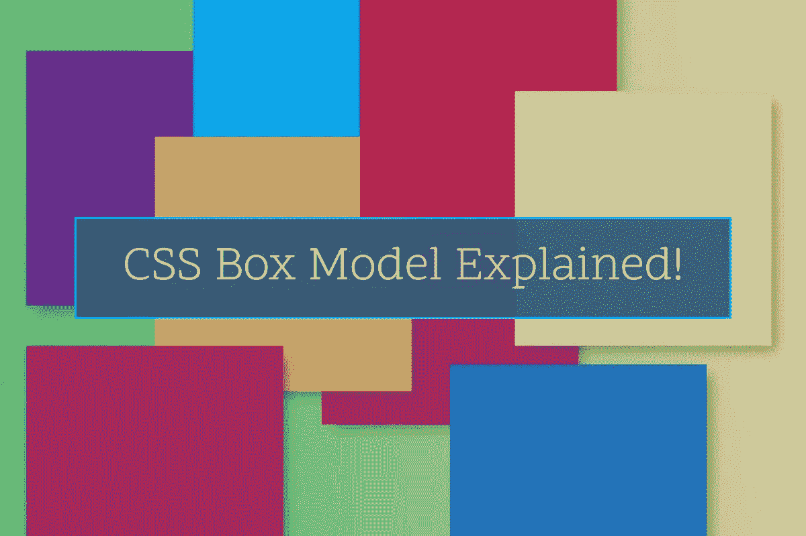

如果有人问我，掌握 CSS 或设计页面布局需要了解什么，我会毫不犹豫地回答:盒子模型，CSS 的构建模块。我希望，现在你知道它有多重要了。如果你是 CSS 初学者，在继续学习之前，花点时间掌握 CSS 盒子模型的概念。这不难，但有点棘手。忍耐一下！

# 世界是由盒子组成的！

在网页上，我们可以看到现实世界中所有可能的形状。但是如果我告诉你你在网页上看到的一切都是长方形，你会相信吗？信不信由你，的确如此！

我再重复一遍:**你在网络上看到的一切都是长方形。**你在设计时需要记住这一点，就像你睡觉时需要记住呼吸一样。如果我的比喻没有意义，不要担心，盒子模型会有意义。

# CSS 盒子模型的结构

因此，网页上的每一部分内容，或者说，每一个 HTML 元素都是由一个矩形构成的。每个矩形都有 5 个主要方面。它们是:

*   宽度
*   高度
*   填料
*   边境
*   边缘

所有这五个方面决定了元素的大小、位置和表示。多亏了 CSS，我们可以控制所有这些，让一个元素完全按照我们想要的方式出现在网页上。所以，让我们试着去理解它们。

# 元素级别

理解 CSS 盒子模型需要对 HTML 元素有基本的了解。我最近在一篇文章中讨论了 [HTML 内联级和块级元素](/ux-art/html-block-and-inline-elements-b65775e86599)。回顾一下，块级内容占据了它所获得的所有水平空间，不管它的内容实际需要多少。另一方面，内联级元素是那些只占用其内容所需空间的元素。详细解释参考帖子。

就其本质而言，内联级元素处理盒子模型的某些方面与块级元素略有不同。我将一路提到这些异常。所以，要注意这一点。

# 宽度

宽度就是一个元素的宽度，一个元素从左到右占据的空间量。默认情况下，块级元素的宽度是其容器的 100%。对于内联级元素，默认宽度是它的内容需要多少。

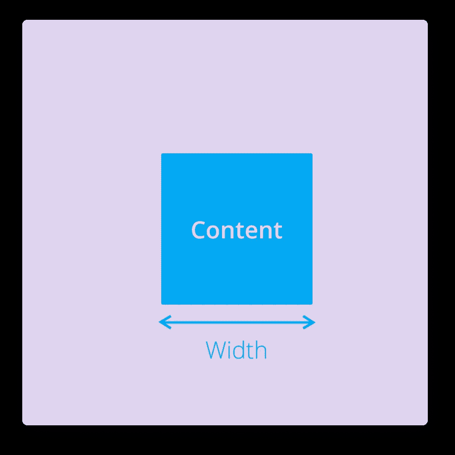

CSS box-model — Width

我们可以使用 CSS `width`属性来控制元素的宽度。但是请记住，因为 inline 元素没有任何预先确定的宽度(因为它的宽度是由其内容决定的)，所以不可能在这些元素上设置固定的宽度。因此，inline 元素不接受 CSS width 属性。

然而，我们可以通过改变元素的类型来克服这个限制，我们将在本文的最后讨论这一点。现在，只需要知道内联元素通常不支持 CSS 宽度属性。

好了，代码时间到了，让我们看看`width`属性的作用。

```
<!DOCTYPE html><html> <head> <title>CSS Box Model</title> <link rel=”stylesheet” type=”text/css” href=”style.css”> </head> <body> <div class=”box”>&nbsp;</div> </body></html>
```

所以，我创建了一个非常简单的 HTML 页面，只有一个`div`元素。`div`是块级元素。所以它将支持盒子模型的所有 CSS 属性。

> **注意:**这是一个空的 div。我加了一个不破空格(&nbsp；)中，因为 div 不会显示在页面上，除非它们有内容。但本质上是空的。

作为块级元素，这个 div 的默认宽度为 100%。为了让眼睛看得见，我要给它加一个背景色。

```
.box { background-color: darkviolet;}
```

在浏览器中看起来是这样的:

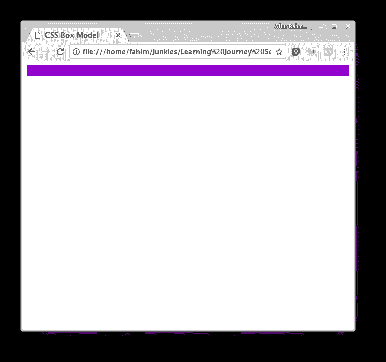

Default width of an element

`div`元素占据了从左到右的所有空间。现在，让我们用我们想要的宽度来覆盖宽度。我们可以在 CSS 中使用像素、百分比等单位来指定宽度。我们将在这里使用像素(px ),因为这是最常用的一个。

```
.box { width: 200px; background-color: darkviolet;}
```

所以，我们简单地使用 CSS `**width**`属性声明了我们想要的宽度。现在让我们来看看我们的元素。

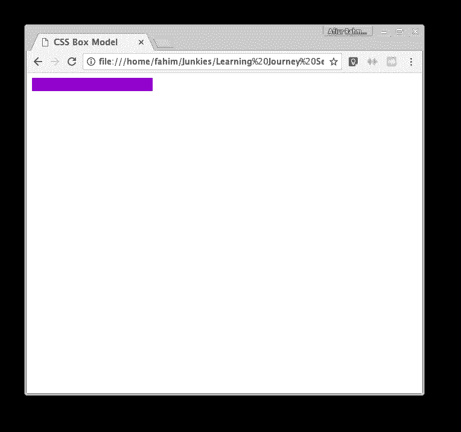

Custom width of an element

嘣！现在我们的元素没有占据整个水平空间。只需要我们指定的数量。这样，我们可以创建我们想要的精确尺寸的元素。

# 高度

就像宽度一样，高度也是一个元素的大小，但是在垂直方向上。我们创建的 div 有一个字符的高度。因为严格来说我们有一个角色在里面。

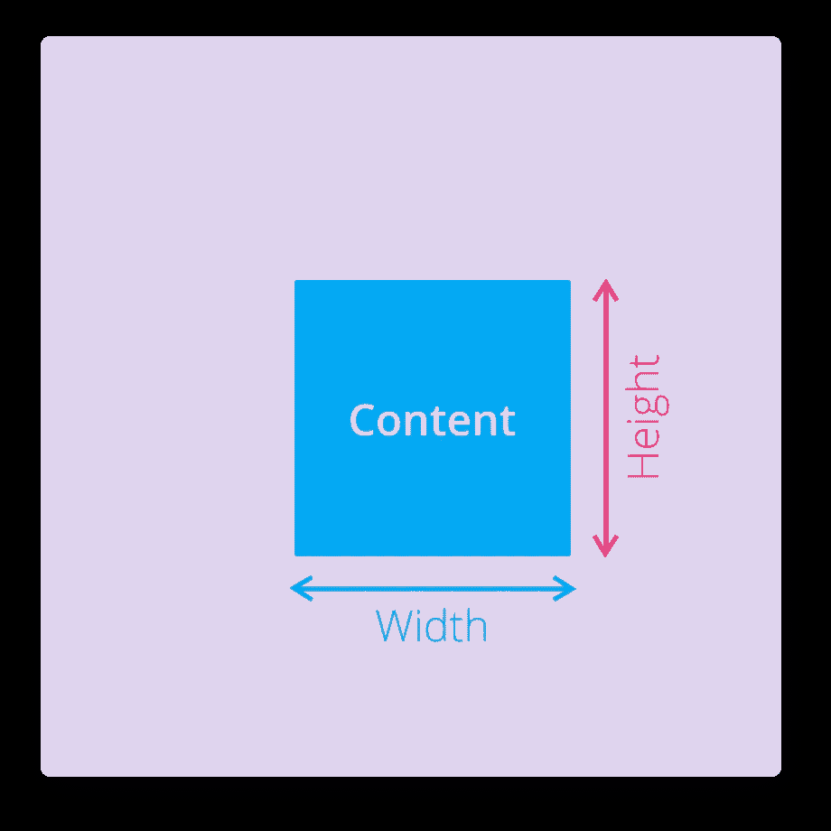

CSS box-model — Height

在块级和内联级元素中，元素的高度由元素的内容决定。高度会自动调整，为内容腾出空间。但是当然，我们可以使用 CSS `**height**`属性指定任何元素的高度。

```
.box { width: 200px; height: 200px; background-color: darkviolet;}
```

在同一个 div 上，我们应用了 200 像素的高度。现在应该比上次高了不少。我们来看看吧！


Custom height of an element

是的，我们的盒子现在是一个完美的矩形。因此，我们可以通过一起使用`**width**`和`**height**`属性来获得几乎任何大小的元素。

但是请注意，CSS `**height**`属性，出于和 width 一样的原因，不能应用于内联级别的元素。

# 边境

边界的意思正如其词所描述的那样。它让我们在主要内容周围加上边框。这是可选的。但是即使你可能有或者没有边框，根据 CSS 盒子模型，每个元素仍然有边框。你没有使用任何边框仅仅意味着你的元素的边框值为零。

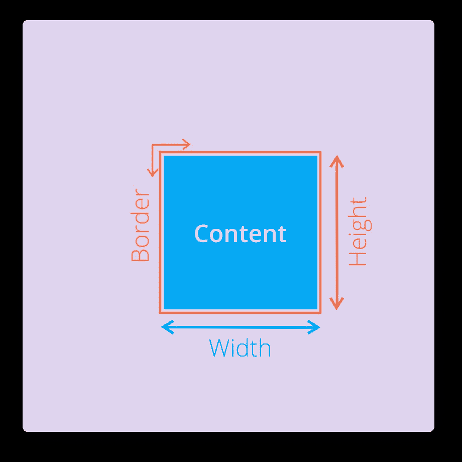

CSS box-model — Border

我们可以使用 CSS `**border**`属性来指定边框。该属性需要三个值来正确显示边框。它们是:边框的宽度、边框的样式和边框的颜色。

宽度可以是任何像素大小。样式决定了边框的视觉呈现。它可以是实线、虚线、虚线、双点等之一。尝试它们，并根据你的相关性使用它们。最后，我们需要设置边框的颜色。

所以，让我们在 div 上应用一个边框，看看它看起来怎么样。

```
.box { width: 200px; height: 200px; background-color: darkviolet; border: 5px solid hotpink;}
```

输出:

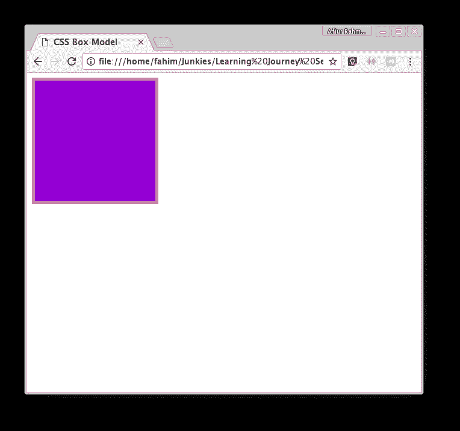

Element with border applied on it

我们盒子周围的 5px 边框看起来很棒！属性为我们提供了很多可定制性。我们可以指定框的每一边的边框样式、大小、颜色。但那是另一天的话题。

# 衬垫

填充是内容和边框之间的空间。你可以让你的边界远离你的主要元素。虽然这听起来不像是非常有用的东西，但它实际上是。

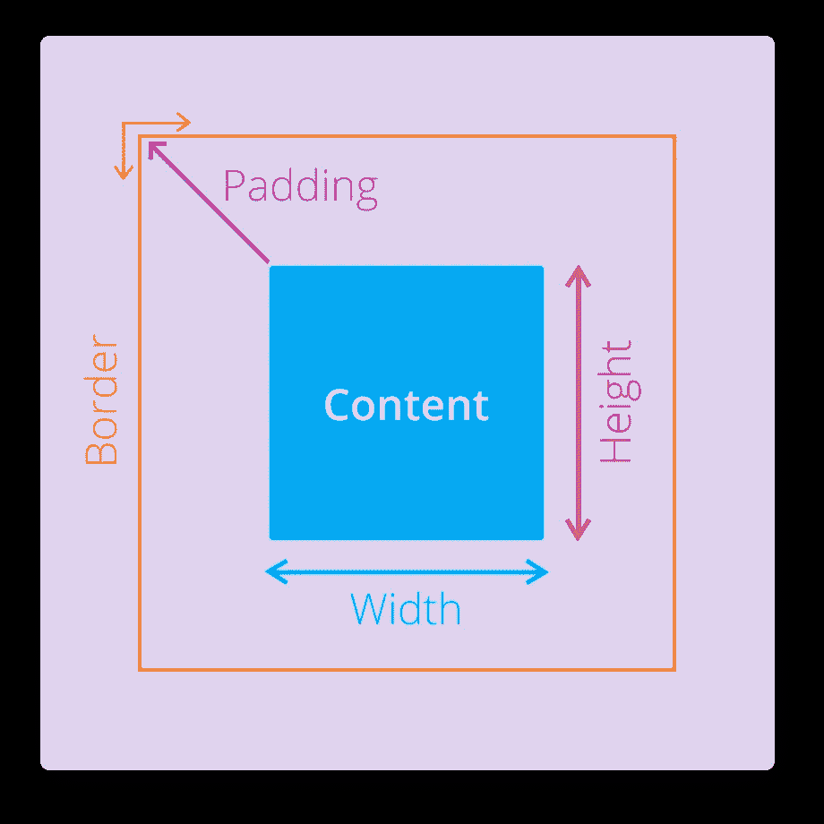

CSS box-model — Padding

填充在元素的视觉设计中起着重要的作用。他们使内容容易被用户理解。它们还有助于在元素之间创造空间。我们可以使用 CSS `**padding**`属性指定填充。

让我们在盒子上应用一些填充来使这个概念更清楚。

```
.box { width: 200px; height: 200px; background-color: darkviolet; border: 5px solid hotpink; padding: 25px;}
```

因此，我们在内容周围应用了 25px 的填充。这看起来如何？

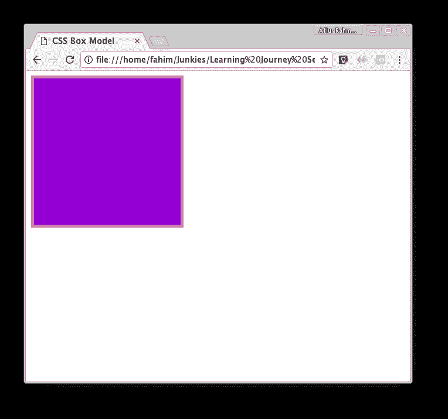

Element with padding

不，我没有包括错误的屏幕截图。这是它现在的样子。迷惑？不要让自己成为！尽管它看起来和没有任何填充时一模一样(除了现在稍微大了一点)，但它实际上并不一样。

它在盒子和每边的边框之间有 25px 的空间。但它是不可见的，因为填充的本质是它从其父背景色中采用颜色。这就是衬垫不可见的原因。

填充本身没有任何颜色，也不可能对填充空间应用任何颜色。它总是从其父代继承颜色。为了说明这个小技巧，我将在我们的盒子里放一些文本，然后再看一看！

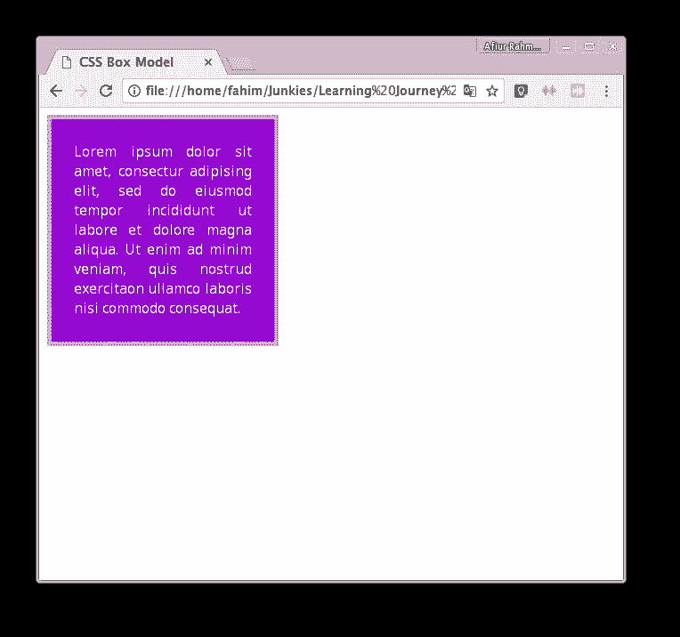

Padding (with text inside the box)

现在，你看到文本和边框之间的空白了吗？那是我们的衬垫。这正好是我们指定的 25px。想知道没有填充物会是什么样子吗？给你:

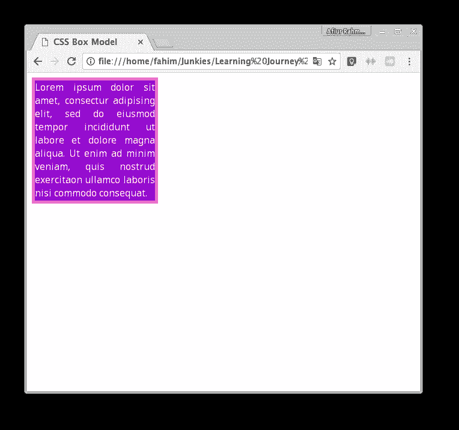

Padding removed

看到边框和文字之间没有空格！希望它能澄清你的困惑。我们也可以通过使用`padding-left`、`padding-top`、`padding-right`、`padding-bottom` CSS 属性在不同的边上应用不同的填充量。

填充也可以应用于行内元素的所有四边。但是，内联元素的顶部和底部填充可能会渗透到其他元素中。所以小心点。

# **边距**

CSS 盒子模型最后也是最麻烦的一点是边距。但是你已经明白了其他四个方面。杀了其他四个再杀第五个 boss 无非是更刺激！玩过死亡之屋吗？；)

总之，Margin 是元素边界之外的保留空间。或者，你也可以这样说:边距是不同元素之间的空间。也就是说，如果有一个空间被声明为元素的边距，那么这个空间中就不能有其他元素。即使这个空间位于你的元素之外。

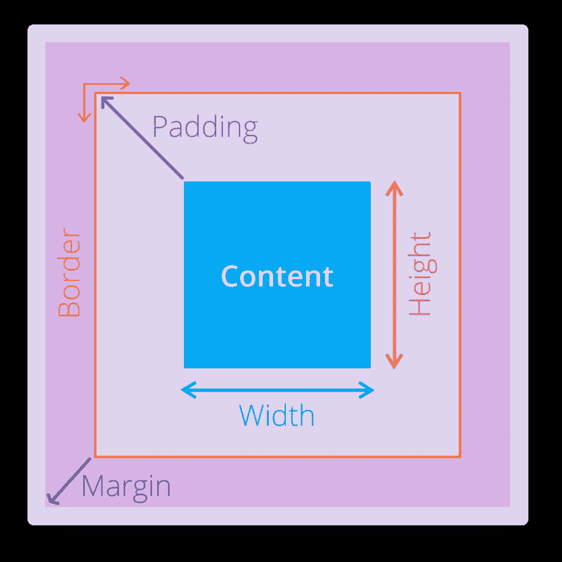

CSS box-model — Margin

就创建页面布局、定位元素和在元素之间创建空白空间而言，边距非常重要。为了演示边距，我将复制现有的 div，并将新的 div 放在旧的 div 旁边，中间留有一些边距。

两个 div 的 CSS:

```
.box { width: 200px; height: 200px; background-color: darkviolet; border: 5px solid hotpink; padding: 25px; margin: 20px;}
```

输出是:

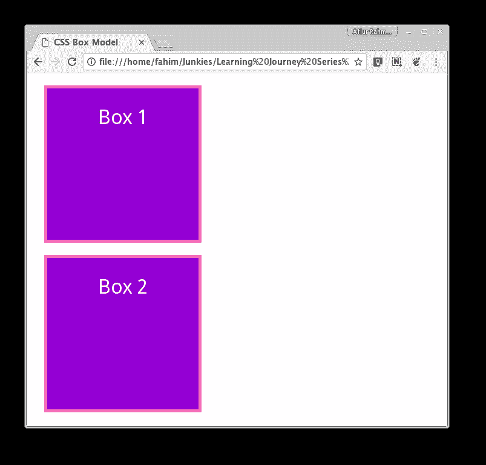

Two boxes with margin in between

如果我没有保证金呢？这个:

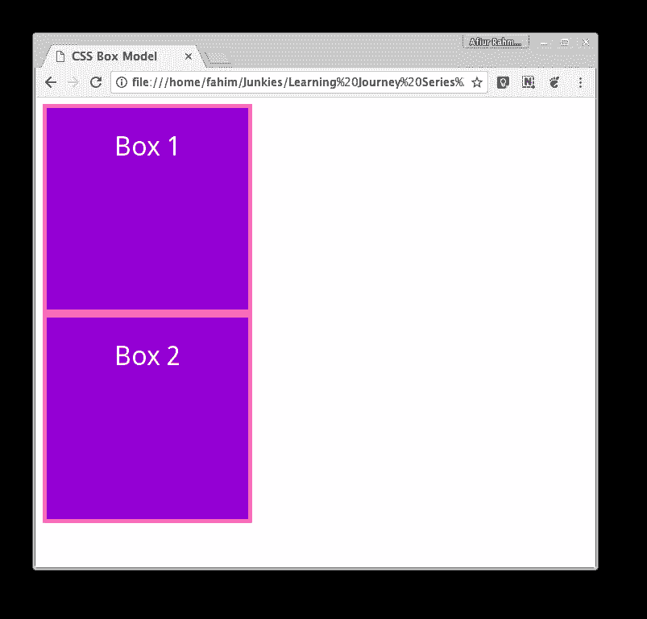

Two box without margin inbetween

请注意，两个框之间没有空间。但是当我们有边距时，它在盒子的所有四个边上都创建了 20px 的空间。我们还可以使用`margin-left`、`margin-top`、`margin-right`、`margin-bottom`属性在不同的边上应用不同的边距。

对于行内元素，边距只能应用于元素的左侧和右侧。内联级元素不支持顶部和底部的边距。

这就是盒子模型。我知道，所有这些数字和截图导致了一点额外的加载时间，消耗了一些额外的数据字节，但我真的希望它们能帮助你理解关键概念。

# 两根 CSS 魔棒

现在你已经知道了什么是 CSS 盒子模型，并且理解了它的所有关键方面，但是你还没有完成。为了最大限度地利用它的力量，您需要知道盒子或元素的度量是如何工作的。否则，它可能会让你头痛，因为你会试图找出为什么你的元素没有留在适当的位置，打破了布局。

原谅我，这将是短暂而甜蜜的。

## **测量**

再看一下我们在 box 元素上使用的 CSS 代码。现在告诉我这个盒子的宽度是多少？200px 吧？不，错了。尽管我们已经指定 200 像素作为盒子的宽度，但是盒子的实际宽度却大不相同。计算公式如下:

> 总宽度=左边距+左边界+左边距+内容宽度+右边距+右边界+右边距

我们的盒子两边有 20 像素的边距，5 像素的边框和 25 像素的填充。让我们根据公式计算盒子的宽度:

总宽度= 20px+5px+25px+200px+25px+5px+20px

= 300px。

那就是多了 100px！当基于网页上的可用空间创建元素时，你必须非常小心元素的尺寸，除非你想最终拉伸你自己的头发。计算器是你的老朋友。

为你的每一个元素做数学运算听起来是不是太复杂了？我给你介绍一下第一根 CSS 魔棒！

## **`**box-sizing**`**属性****

**CSS3 引入了一个名为`box-sizing`的新属性，它允许我们改变元素宽度的测量方式。它支持两种不同的值。它们是:**

*   **`content-box`**
*   **`border-box`**

**内容框是我们已经讨论过的默认内容框。如果你改变你的元素的框大小为`border-box`，那么你指定的元素宽度也将包括你的边框空间。**

**例如，让我们拿我们的盒子。我们有 200 像素的指定宽度。当我们在两边添加 25px 的填充时，它就变成了 250px。但是如果我们使用`border-box`，那么盒子和它的填充加在一起的宽度将是 200px。**

**在这种情况下，我们的主要内容的宽度将是 150 像素，其余的 50 像素将是我们的填充。如果我们改变填充的大小，内容的宽度也会自动改变，以适应指定宽度内的填充。**

**正如您可能已经理解的那样，`border-box` sizing 属性可以使我们的生活比每个人都必须使用计算器来创建他们的元素的时代要容易得多。**

## ****CSS 显示属性****

**我们今天要讨论的最后一个重要的 CSS 属性是`display`属性，对于许多初学者来说这是一个“啊哈”的发现。网页的所有元素都由浏览器根据它们的显示类型来呈现。猜猜元素显示类型有哪些？您已经知道的相同的旧的内联和块级元素。**

**`display`房产有什么酷的？酷的部分是它让你转换任何元素的显示类型。这意味着您可以将块级元素转换为内联级元素，反之亦然！另外，您可以将它们转换成一种叫做`inline-block`的特殊类型。**

**属性可以将任何内联或块级元素转换成显示内联级内容行为的元素，但是它们支持 CSS box 模型的每一个方面。inline-block 属性为我们提供了 inline 元素的效率和块级元素的可定制能力，这使它成为我们的第二根 CSS 魔棒。**

**想一想。几乎任何给定元素的所有行为都主要取决于它的显示类型。您可以更改元素的显示类型，这意味着您可以调整该元素的所有内容。对一个元素的所有方面进行像素级的完美控制，这难道不是很强大吗？你可以建造任何东西！想象力是唯一的限制。**

# ****重述****

**所以，现在你已经准备好掌握 CSS 的所有其他概念了。在你离开之前，让我们确保你已经掌握了主要思想。**

*   **我们在网上看到的每一个元素本质上都是一个矩形框。**
*   **这些盒子有五个主要方面。它们是宽度、高度、填充、边框和边距。**
*   **通过 CSS 改变这些方面，我们可以把任何元素变成任何大小和任何形状。**
*   **元素的默认测量系统有点复杂。但是，我们可以通过使用一根叫做**边框**的魔杖，将它变成我们最喜欢的东西，告别计算器。**
*   **我们必须记住，内联元素通常不支持调整盒子模型的某些方面。我们可以将它们转换成块或内联块元素，然后做我们想做的任何事情！我们是国王！**

**现代神经科学发现，类比和回忆是学习新事物的两种最有效的方法，也是最好的方法。考虑到这一点，我从 google images 上偷了这张图片，让你在 CSS 盒子模型上练习。**

**仔细看图像。这是对 CSS 盒子模型的真实类比。它拥有 CSS 盒子模型所拥有的所有方面。试着回忆这些概念，找出图片中盒子模型的各个方面。然后在评论里给我解释一下他们是怎么联系在一起的。**

**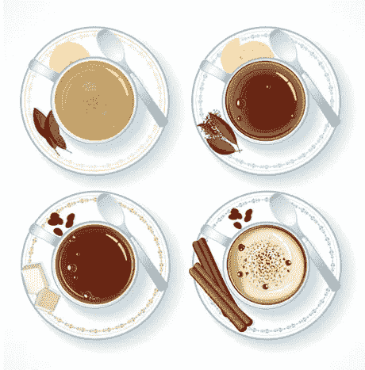**

**A real life analogy of CSS box model**

## ****结论****

**谢谢你陪我到最后。我希望它值得你花时间。我自己也是一个初学者，我知道当什么都没有意义的时候是什么感觉。如果你没有完全理解 CSS 盒子模型，不要沮丧。试着创造一些东西，再读一遍，犯很多错误，最终，一切都会变得有意义。**

**盒子模型是 CSS 的构建模块。这就是为什么我觉得有必要投入我的时间和精力把这些放在一起，这样你就可以从一篇文章中获得最大的收益。如果你从这篇文章中发现了任何价值，请点击下面的心形来表达你的爱。**

***我正在学习 web 开发，我在这里写下我所学的一切*[](/@afiur.fahim)**[*UX 艺术*](http://uxart.io) *。你可以在这里* *加入我的旅程* [*。随时戳我*](http://uxart.io/learning-journey-to-web-development/) [*推特*](https://twitter.com/AfiurRahman) *！*****