# CTRL + G

> 原文：<https://medium.com/hackernoon/ctrl-g-d94c88cd4475>

## 一条彻底改变我工作方式的捷径。

这一切都是从视频开始的:

(you don’t really need to watch it to understand this post, I will explain everything you need to know, although if some day you find some time for it, I would highly suggest you do, there’s a lot of awesome stuff there)

当我到达大约 7:23 时，我开始听说我以前从未听说过的 Android Studio [功能](https://hackernoon.com/tagged/feature)，我变得非常非常好奇。

**多光标。**

**CTRL+G***(Windows/Linux 下 ALT + J)。*

这是一个很棒的功能，一个随时可以随身携带的很酷的想法。我立刻想到:

> 天啊，我又得到了一些抄袭代码的活计。我会点击我的 CTRL 和 G 键。

在那一刻，我甚至没有想到它会如此改变我的编码风格。

# 多光标工具包。你真的要知道什么才能感受到它的真正力量？

## 捷径本身。

**CTRL+G** 。如果您在选择特定文本时使用它，它将选择该文本在您的代码中的下一次出现(创建一个新光标)。

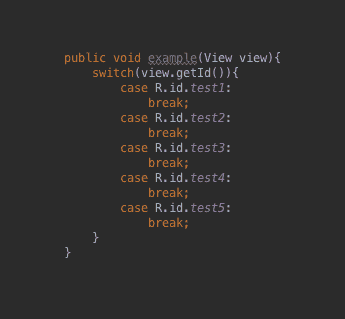

CTRL + G

重要的是， [Multicursor](https://hackernoon.com/tagged/multicursor) 特性将您的代码视为文本，因此您也可以选择特定于 java 的关键字，并基于此构建您的 Multicursor。

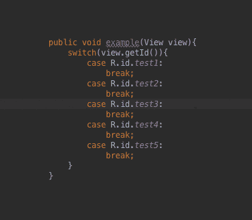

CTRL + G (on the case keyword)

## 选择快捷方式

在这里学习三个捷径:

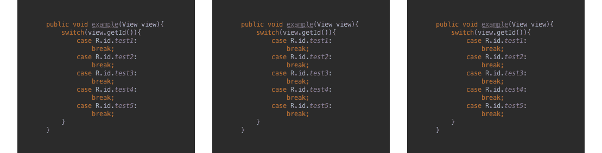

(我可以试着解释它们是做什么的，但如果你只是尝试一下，那会是最好的…说真的，这将花费你 30 秒的时间…最多)

> ***重要的*** :我也是不用 SHIFT 直接使用它们只是为了在代码间跳来跳去。

## 字符串操作 Android Studio 插件(可选)

这个并不是必须的，但是它可以显著加快你的工作速度。

我发现自己使用最多的是**创建序列**特性，但是还有更多你可以在日常工作中使用的。一个很棒的插件，已经安装在你的 Android 工作室。

# **现实生活中的用法举例**

我一直在用 Multicursor。有时为了更大的任务，有时为了更小的任务。以下是我使用这种快捷方式的一些案例。

## @IntDef

我是支持注释的超级粉丝。我一直在用它们。由于@IntDef 唾手可得，我有时会放弃使用 enum，而只使用少量的 int。看看 Multicursor 如何帮助我。

我想知道的是:

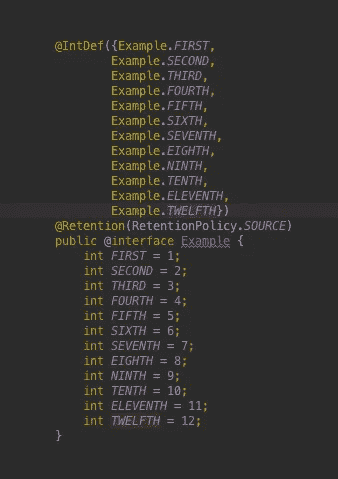

我可以这样去那里:

**设置:**

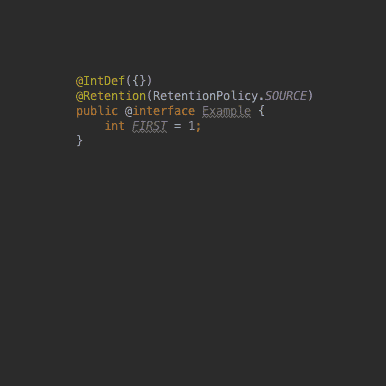

Just a regular copy-pasting

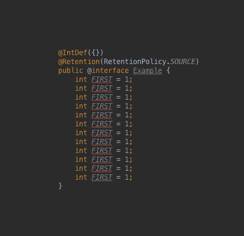

And renaming

**多光标:**

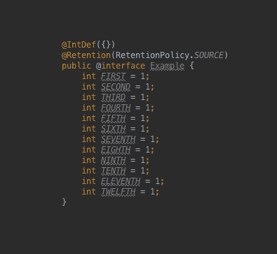

CTRL + G

我可以用在多种不同的事情上(" *=* "，" *1* "，"*)；*"或其中的某种集合)，出于某种未知的原因，我选择了" *int "。*

**创建序列:**

如果你不想使用字符串操作插件，你可以手动操作。下面是插件:

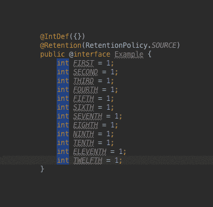

The last could’ve been just SHIFT + ← as well

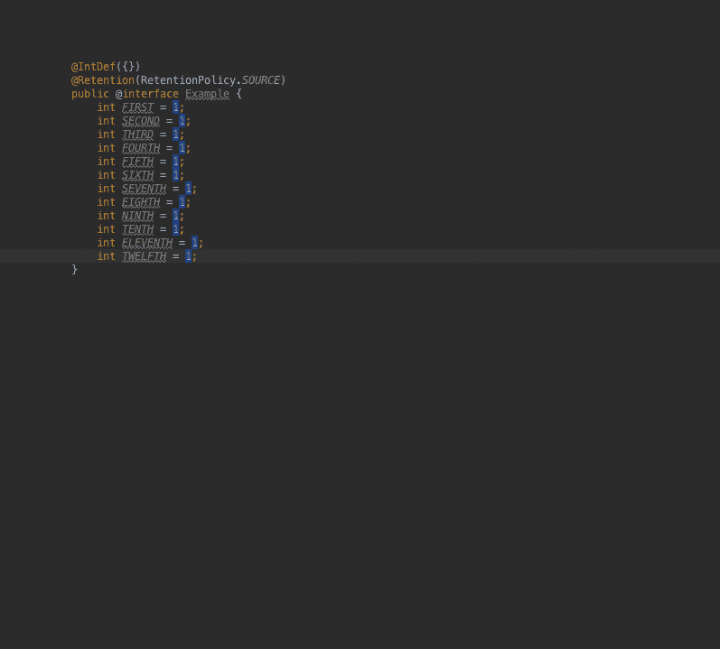

(I usually just click **C** and **5** in the plugin menu, here using mouse for better readability)

**复制行的修改版本:**

真正的奇迹就发生在这里:

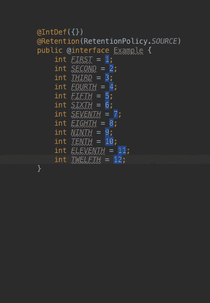

@IntDef 已经启动并运行。完成了。

**从布局 xml 中提取样式**

Multicursor 也可以轻松地在布局 xml 中工作。我的具体情况有点复杂，但主要问题是一样的。我决定从布局 xml 文件的几个视图中提取一个样式。

在这个例子中，我使用了两次 Multicursor。以两种不同的方式。

让我们假设这是布局:

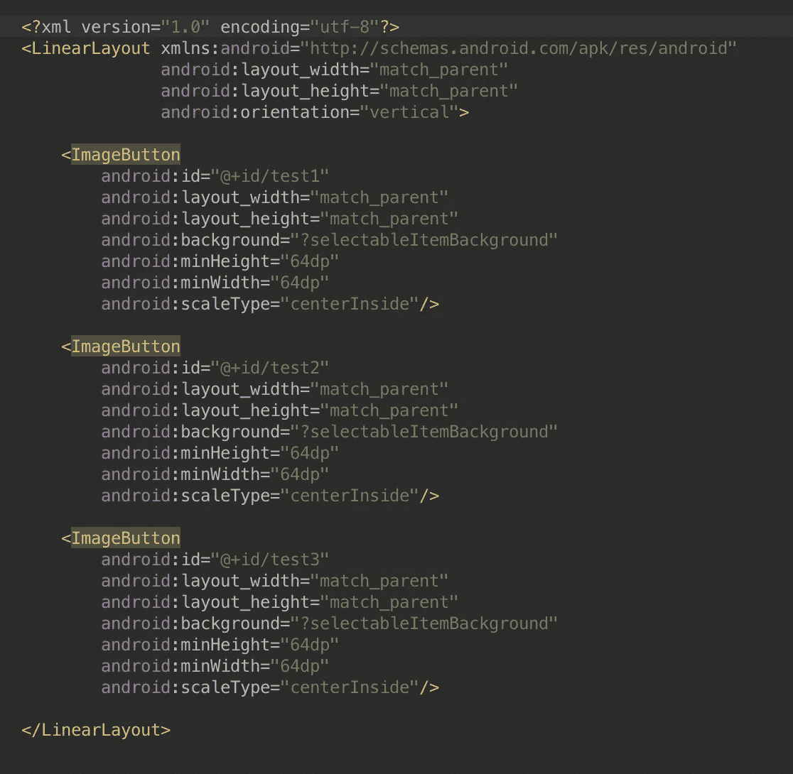

这就是 Multicursor 如何帮助我完成提取过程的:

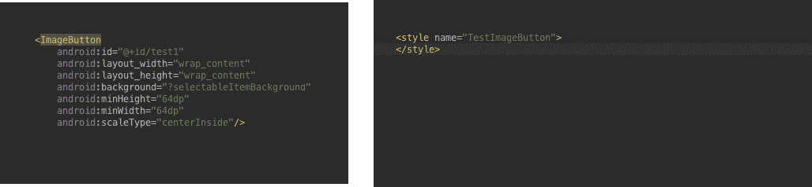

这就是我如何将提取的样式应用于 xml(也是用 Multicursor):

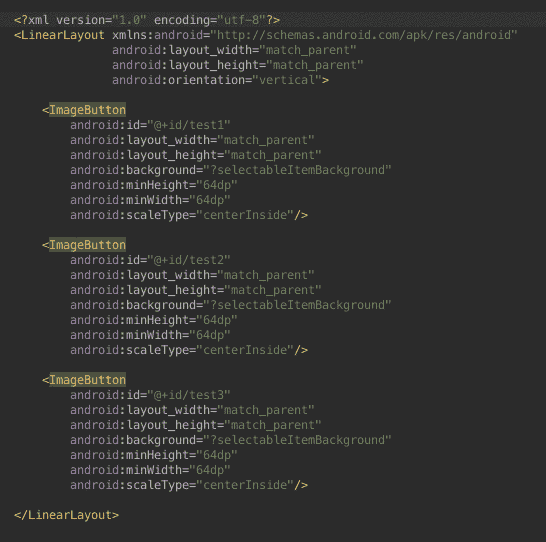

## Butterknife 的 OnClick

这个例子是几天前发生在我身上的一件事。

我在复合视图中有 5 个按钮，我使用另一个 Android Studio 插件(生成@Bind 语句)将它们添加到类中。但是后来我决定我真的不需要存储对这些按钮的引用。我只需要处理 OnClickListener。在 Multicursor 的帮助下，我是这样处理这个变化的:

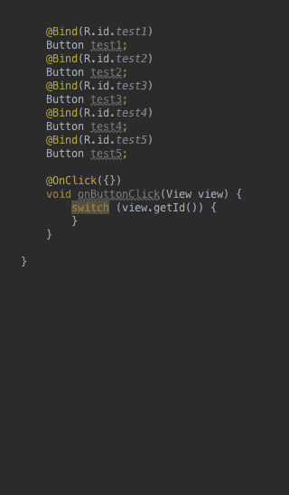

又快又简单。

**还有很多很多……**

这只是三个简单的例子。我还必须将大量(约 3k 行代码)Swift 代码“复制”到 Java 中。多光标功能的痛苦要小得多。我大约在两周前做了这个，如果没有多光标功能，我可能还会继续做下去。

对我来说，这是一个很酷的小技巧，我想我可能会用一两次。但是，就像你学到的大多数新东西一样，随着你的工作，你会发现它越来越多的用途，突然之间，你会无法相信以前没有它你是如何生活的。

如果你还没有使用它，我强烈建议你试试！

# 如果你喜欢这篇文章，请表示你的支持！推荐，关注，评论。这意义重大！

