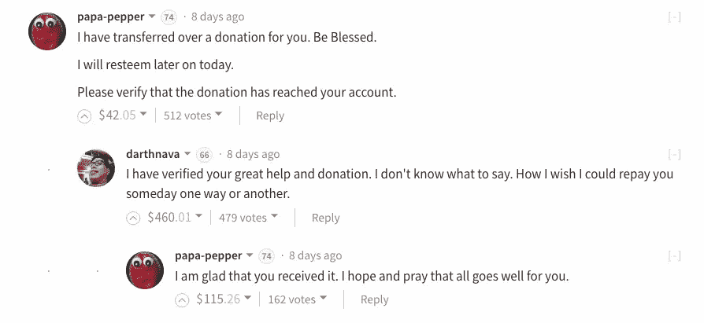
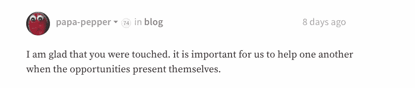
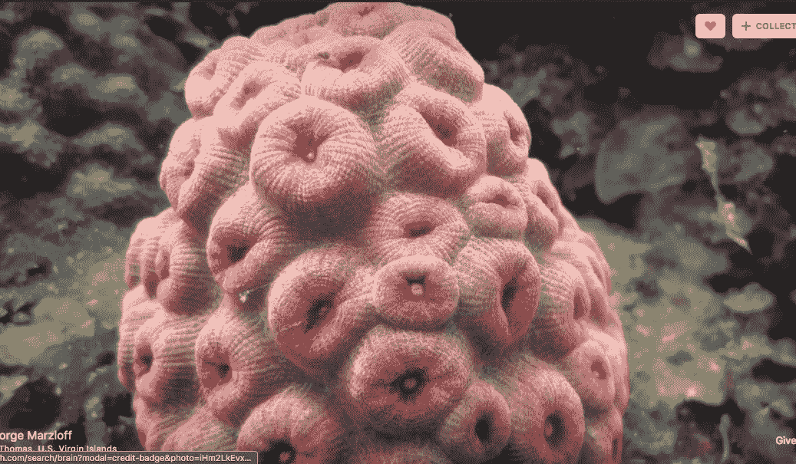
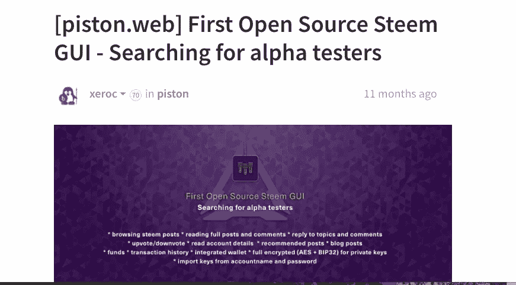
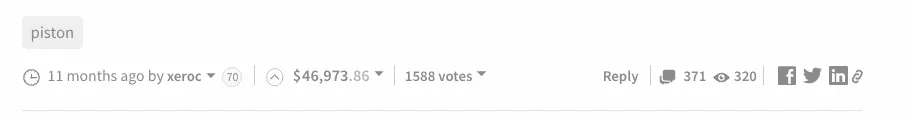

# 文化冲突:你不理解 Steemit 的原因是因为它像一个礼物经济，而不是商品经济

> 原文：<https://medium.com/hackernoon/culture-clash-the-reason-you-dont-understand-steemit-is-because-it-s-like-a-gift-economy-not-a-8d143d38eb9a>

我收到了很多 Steemit 聊天信息，但我现在都没有回复。事实上，我收到了来自社交媒体的消息，询问我对 Steemit 和加密货币的意见。我不习惯这种程度的关注，我发现我现在无法回应每个人。然而，我不想忽视别人，因为我认为那是粗鲁的，所以我开始更多地考虑如何帮助人们更好地理解 Steemit。

## 我现在明白了为什么人们觉得这很难理解:斯提米特具有[礼物经济](https://en.wikipedia.org/wiki/Gift_economy)的特征，我们都生活在欧洲主导的商品经济模式中。我们先来探讨一下礼物经济。

> 一个**礼物经济**是一种根据个人给予他人的东西来给予个人地位的经济，与商品或交换经济相反，在商品或交换经济中，地位给予那些拥有最多的个人(Pinchot 1999)。[*——学习给予*](https://www.learningtogive.org/resources/native-american-culture-giving)

> 本土文化的哲学基础是人类是自然世界的管理者，而不是世界资源的消费者。与欧美价值观不同，美国本土文化中的“财富”不是用净值来衡量的，而是由精神品质、物质和行为的综合来衡量的。领导人是根据他们通过分享智慧和财富来照顾部落的能力而被挑选出来的(Millett 和 Orosz 2002)。- [学习给予](https://www.learningtogive.org/resources/native-american-culture-giving)

## 所以，让我们来看一个礼物经济在 Steemit 上运作的具体例子。

一个著名的、受欢迎的 Steemit 用户， [@papa-pepper](https://steemit.com/@papa-pepper) ，举例说明了这种针对个人的礼物经济行为，@darthnava，他正经历着艰难的生活处境。@darthnava 最近[写了一篇帖子，他在帖子中描述了](https://steemit.com/blog/@darthnava/fellow-steemers-i-need-help-as-my-mri-results-are-not-encouraging)他富有挑战性的医疗状况:他收到了一些危及生命的核磁共振结果，并发现他需要立即进行手术。他还在帖子中透露，他没有资金来支付这场拯救生命的手术。Steemit 社区迅速而积极地做出了回应，绝大多数*鲸鱼*(大账户持有人)投票支持他的职位超过 17，000 美元，这足以支付他的医疗费用。然而，@papa-pepper 想尽办法从自己的口袋里拿出 2000 美元捐给了@darthnava。

conversation between @papa-pepper and @darthnava

## 在@papa-pepper 进行了巨额捐赠后，Steemit 社区再次疯狂地投票，为@papa-pepper 的慷慨精神欢呼，整个社区都举起了@papa-pepper，几乎成为了国王。

这些赞成票也相当于一大笔钱。这种行为更像是美国土著部落文化，而不是欧洲的商品文化:papa-pepper 是出于自己的良心，而不是制度化的慈善模式。他没有捐给慈善机构，他是凭着自己的良心直接捐给一个人的。以下是@papa-pepper 的信仰体系:

这是一个简单的说法，但目前并没有嵌入我们主流的以商品为中心的痴迷的净值文化中:

> "对我们来说，有机会时互相帮助是很重要的。"-爸爸-胡椒

## 当我们看一看@papa-pepper 捐了一大笔钱之后发生了什么时，礼物经济就更容易理解了。

Steemit 社区对他的行为欣喜若狂，他们开始投票支持他对捐赠的评论。这些来自社区的支持票变成了一大笔钱。@papa-pepper 的帐户随后被填充，但真正的推动来自于他作为 Steemit 部落看守人的增强的角色、提高的地位和领导地位。我断言，在这个阶段，它是一个部落。而@papa-pepper 和我一样，来到 Steemit 时一无所有，也没有一个大账户。他的账户是一个中型账户，他被认为是一只海豚。有很多账户比他的大得多。但是由于他的行为和作为权力给予者的地位，他的帐户正在增长。这与目前被吹捧为成功的*kill-it-entrepreneur*bro meme 正好相反:

[http://antiwantrepreneur.tumblr.com/](http://antiwantrepreneur.tumblr.com/)

## @papa-pepper 的行为没有任何制度化，因为它直接来自他的内心，而不是通过一些有组织的慈善基金会。同理心是它的燃料。

这与欧洲主导的财富积累和强调净值的模式直接冲突。

此外，在欧洲模式中，捐赠者不会立即收到一部分捐赠。她/他可能会获得税收减免，但是收到礼物的社区不会立即返还这些资金。

## 当然，许多富人向慈善基金会捐款，并通过捐款获得地位。

但是@papa-pepper 来自一个谦虚的家庭，当他进入 Steemit 时并不是一个富人。他天生的送礼行为是他在斯提米特变得相当富裕的原因。此外，他是一个活跃的博客作者，有着丰富的创造性想法，这些想法都是包容他人的。我相信他的精神是礼物经济的真实例子，也是他在 Steemit 平台上表现如此出色的主要原因。因此，为什么新手很难理解他的成功。理解他的成功需要巨大的思维范式转变，没有人真正解释或分解成可消化的指令*(直到现在:)*。

这意味着有一种给予的文化，给予他人可以增加一个人的地位、财富和在 Steemit 的地位。一个人以有用的能量的形式给予社会越多，他以金钱的形式得到的就越多。

## 在 Steemit，是超级书呆子掌控着钱袋子，而不是没有实质内容的卑鄙的营销人员。

这个例子中的另一个不同之处是@papa-pepper 的行为是如此直接，并以直接和即时的方式影响了社区。这部分是因为银行业的摩擦已经消除。一个瞬间的同情可以在不到两分钟的时间里促成一次救命的捐赠。

## 这就是开源程序员的帖子在 Steemit 上获得如此高报酬的原因。

创建开源软件和其他编程项目是一项非常耗时、细致的工作。如果它是开源的，那么代码本身就没有真正的货币化机制。Steemit 认可并在金钱上奖励这些开源程序员的天赋，从而为这些程序员创造了一个稳定的方式来继续开发他们的 Steem 软件项目。Steemit 完成了长期以来被打破的循环，程序员和其他创造性类型的人产生了不可货币化的头脑天赋。

# 大自然和我们的想象力丰富得超乎我们的想象。正是因为那些心胸狭窄、贪婪的人，今天大多数人类都在受苦。

## Steemit 为超级书呆子以及其他创造和分享财富的人提供了一个可持续的模式，我不知道互联网上还有其他类似的东西。

这可能是第一次真正的智慧被认为是主要的赚钱商品。当然，也有赚很多钱的流行乏味的帖子，但有史以来票房最高的帖子是由程序员创造的。这里有一个 46，973 美元的 Steemit 帖子的截图，详细介绍了开源 Steem GUI:

@xeroc’s all-time [highest paid Steemit post](https://steemit.com/piston/@xeroc/piston-web-first-open-source-steem-gui---searching-for-alpha-testers)

以下是支付和追加投票的截图:

yes, it’s real money, and Steem value is displayed in US dollars

在 Steemit 上取得成功与你在一个运作良好的礼物经济中的导航能力有关。是时候抛弃陈旧的范式，学习一些对现在和未来非常有价值的东西了。

*关于作者:*

**Stellabelle 写了一本书，**[***Un-Crap Your Life***](https://www.amazon.com/Crap-Your-Life-Navigating-Situations-ebook/dp/B017PBLZPA)**，亚马逊上有售。大多数日子都能在斯提米特找到她，所以跟着她去吧:**[**https://steemit.com/@stellabelle**](https://steemit.com/@stellabelle)**。她还为 Dash DAO 担任编辑、作家和视频创作者。**

> [黑客中午](http://bit.ly/Hackernoon)是黑客如何开始他们的下午。我们是 T21 家庭的一员。我们现在[接受投稿](http://bit.ly/hackernoonsubmission)并乐意[讨论广告&赞助](mailto:partners@amipublications.com)机会。
> 
> 如果你喜欢这个故事，我们推荐你阅读我们的[最新科技故事](http://bit.ly/hackernoonlatestt)和[趋势科技故事](https://hackernoon.com/trending)。直到下一次，不要把世界的现实想当然！

