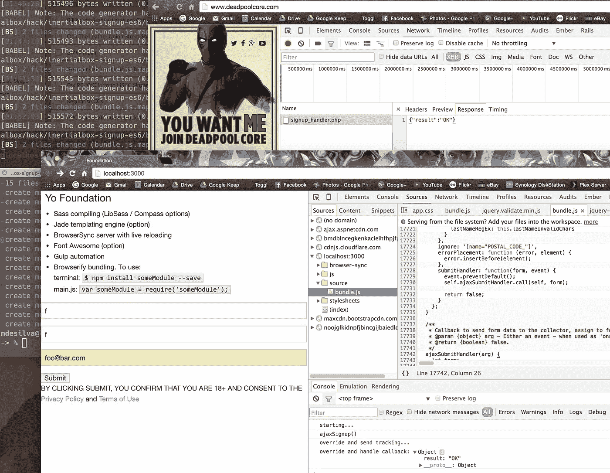

# 好奇心让我意识到福克斯电影公司正在使用 AWS SQS，感谢死侍

> 原文：<https://medium.com/hackernoon/curiosity-lead-me-to-realise-that-fox-movies-are-using-aws-sqs-thanks-to-deadpool-aa0d896ce063>

看了几部由范·怀尔德主演的新片《T2》的预告片后，我有了一个有趣的发现。它在 http://www.deadpoolcore.com/[举办](http://www.deadpoolcore.com/)

我天生好奇，每当我偶然发现一些有趣的东西时，我倾向于用我的 Chrome 检查员开始挖掘。我认为一些花哨的网络字体被使用，我最初的挖掘带我到一些 CSS，然后到检查器的“元素”标签下的页面主体。

我的眼睛立刻被吸引住了

```
<script type=”text/javascript” src=”//forms.foxfilm.com/signupv231.js”></script> 
```

这段 JS 将设置全局*构造函数* FoxSignup，它允许一个人用最少的代码设置表单

```
var foxSignup = new FoxSignup();$(“#signup-form”).validate(foxSignup.formValidatorOptions());
```

一个[方便的评论透露](https://github.com/bsodmike/inertialbox-signup-es6/blob/master/src/js/signup.js#L182)注册有效载荷被发布到一个单独的端点——我计划用 Sinatra 或 Rails 的缩小版来构建这个端点——它又将有效载荷推送到 [AWS SQS(一个消息队列服务)](https://aws.amazon.com/sqs/)。

本周早些时候[我发布了一个升级版的约曼生成器](https://www.npmjs.com/package/generator-gulp-foundation-sass-babel-browserify)，它通过 Babel.js“开箱即用”支持 ES6，我决定用它来引导一个真正快速的测试。在下面的例子中，我尝试向 Fox 服务器发送相同的有效载荷，我仍然收到成功响应。



你会在 Github 的‘fox-clone’分支中找到[最终结果，尽管我计划在 master 分支中为个人使用做一些修改。](https://github.com/bsodmike/inertialbox-signup-es6/blob/fox-clone/src/js/signup.js)

已经切换到 ES6，有一些我正在烘烤的细节，如容易覆盖

```
var foxSignup = new FoxSignup();FoxSignup.prototype.sendTracking = function(response) {
  console.log('override and send tracking...');
}FoxSignup.prototype.ajaxCallback = function(response) {
  console.log('override and handle callback: %O', response);
}$("#signup-form").validate(foxSignup.formValidatorOptions());
```

我还想清理一下验证方面，它目前依赖于与 Fox 用例相关的一个非常特殊的有效载荷。

如果你觉得这篇文章有趣，请在评论中告诉我你的想法，并在 twitter 上联系我！

[](http://bit.ly/HackernoonFB)[](https://goo.gl/k7XYbx)[](https://goo.gl/4ofytp)

> [黑客中午](http://bit.ly/Hackernoon)是黑客如何开始他们的下午。我们是 [@AMI](http://bit.ly/atAMIatAMI) 家庭的一员。我们现在[接受投稿](http://bit.ly/hackernoonsubmission)，并乐意[讨论广告&赞助](mailto:partners@amipublications.com)机会。
> 
> 如果你喜欢这个故事，我们推荐你阅读我们的[最新科技故事](http://bit.ly/hackernoonlatestt)和[趋势科技故事](https://hackernoon.com/trending)。直到下一次，不要把世界的现实想当然！

[](https://goo.gl/Ahtev1)