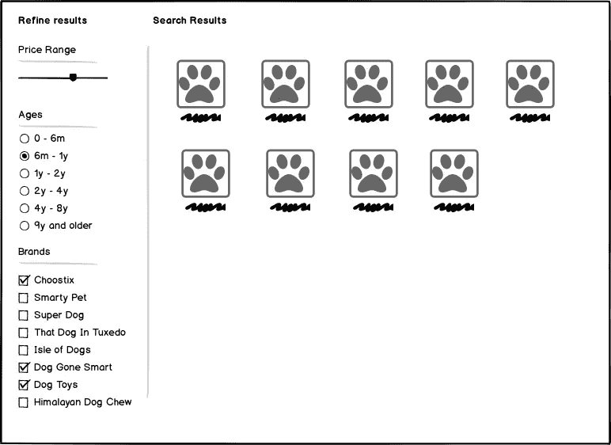
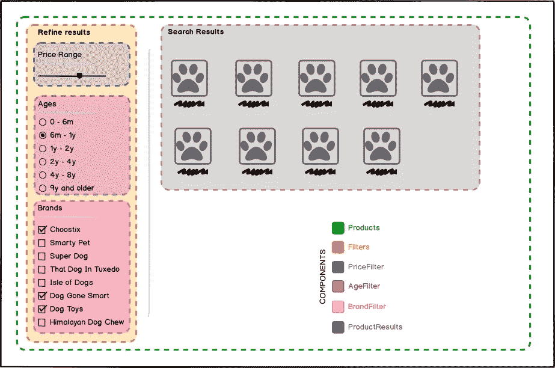

# 柯里反应过来

> 原文：<https://medium.com/hackernoon/curry-away-in-react-7c4ed110c65a>


Disclaimer: You may or may not have improved your curry making skills by the end of this blog

因此，你将建立一个销售狗用品的下一代电子商务公司，你已经决定使用 React 来建立它，因为，你知道，它现在非常流行，选择前端框架是建立任何成功的在线业务的“第一步，也是最重要的一步”。

我想分享我在建立自己的电子商务网站时学到的一个巧妙的技巧，显然是下一代的 coz React！

基于各个方面过滤产品是任何购物网站的主要功能，因此让我们在产品结果页面中添加一些过滤器。



This is where our customers filter and find the right products for their dogs :)

正如任何“优秀”的 React 开发人员所做的那样，让我们将这个 UI 分解成[个组件](https://reactjs.org/docs/thinking-in-react.html)，这在我们的例子中非常简单。



This is what React developers see when they visit any webpage :D

接下来，让我们识别应用程序中的*状态*。这里可能被视为状态的唯一数据片段是过滤器选择。其他数据，产品列表可能会作为*道具*传递下去，不会发生变化。

`filterSelections`是一个对象，包含页面中每个过滤器的选定值。

```
filterSelections = {
  price: ...,
  ages: ...,
  brands: ...,
}
```

因为`Products`组件是包含需要`filterSelections`(`Filters`和`ProductResults`组件)的组件的公共父组件，所以它将是这个*状态*的合适位置。

在接收到作为道具的`filterSelections`之后，`Filters`组件将把相关的过滤器值传递给它的每个子组件。

`filterSelections`也将被传递到`ProductResults`组件中，以便可以应用过滤器，并且只显示相关产品。

这些过滤器不能只是静态控件，我们需要它们在客户调整过滤器时更新`filterSelections`。

我们将`filterSelections`作为*道具*传递给过滤器，我们知道道具在 React 中是不可变的。那么我们在哪里变异`filterSelections`呢？答案应该是`Products`组件，因为它是`filterSelections`的所有者，它的状态是*。*

让我们继续添加一组更改处理程序函数，这样对过滤器选择的任何更改都会传播到发生实际变化的`Products`组件。

这里是`Products`组件。

和`Filters`组件。

这非常简单，而且可行。但是我们在`Filters`组件中有一堆函数，它们似乎都在做非常相似的事情。

如果我们将来添加一种新的过滤器，我们将需要在这个组件中编写另一个类似的函数。

## 去营救

这就是诀窍所在，这是一个流行且听起来很有趣的功能性[编程](https://hackernoon.com/tagged/programming)概念，叫做 **currying。**

在讨论 curry 之前，我想向您展示它如何帮助清理我们的组件。你自己看看—

整洁对吗？现在`updatedSelections`功能据说被*柯里化了。对于函数式编程爱好者来说，这是一个非常简单明了的概念。但是对于像我这样一直生活在强制性的面向对象方面的人来说，这很难理解。所以让我们打开它。*

当我说`updatedSelections()`函数已经被 curried 时，你可能想知道这个函数的“未被 curried”版本会是什么样子。这里是如何—

如果我们要使用这个而不是我们的 curried 版本，我们需要让每个过滤器组件子组件自己调用`updateSelections`，因此必须让它们知道它们需要更新的`filterSelections`中的属性名，这是一个太多的耦合。

另一种方法是为每个滤波器组件使用一个专用函数，这将导致我们已经看到的混乱局面。

我们的解决方案是*库里*这个功能。

## 什么是 currying？

Currying 将一个函数`f`转换成一个函数`f'`，该函数接受`f`最初需要的参数的一部分，并返回另一个函数，该函数可以接受其余的参数，返回`f`的结果，或者可以自己 curry。

具体来说，用这个简单的`add`函数，

```
add = (x, y) => x + y;
```

当咖喱出现时，它变成了—

```
curriedAdd = (x) => {
  return (y) => {
    return x + y;
  }
}
```

因此，我们可以调用返回新函数的`curriedAdd(1)`，而不是调用`add(1, 2)`，我们可以随后使用`add`的另一个参数调用它，就像`curriedAdd(1)(2)`一样，并获得最终结果`3`。

从技术上来说，`curriedAdd(x)`被称为“部分应用”，因为我们只应用了原始函数`add(X, y)`需要的部分参数。

> 使用常规函数，让我们对它执行部分应用。

这是一个天真的玩具例子，没有太多的效用。

现在，如果我们回到最初的例子—

我们可以看到`updateSelections`函数的部分应用——

```
updateSelections('ages');
updateSelections('brands');
updateSelections('price');
```

帮助我们清理组件并减少耦合。那是 currying:)

像软件中的所有问题一样，这不是这个问题的唯一解决方案。这里有一个替代方案—

我希望您发现这种技术很有用。如果你在你的 [JavaScript](https://hackernoon.com/tagged/javascript) / React 项目中使用了 currying，请在下面的评论中分享一些片段，也欢迎你的其他评论和反馈，❤.

*您是否打算雇佣 JavaScript、React 或 Ruby 开发人员来完成您的项目？访问 spritle.com 的*[](http://spritle.com)**，雇佣我们的一流团队，让您的想法变成现实。**