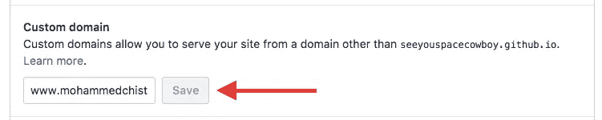
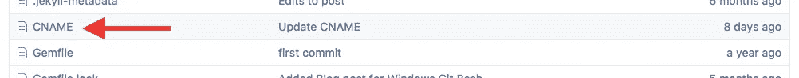
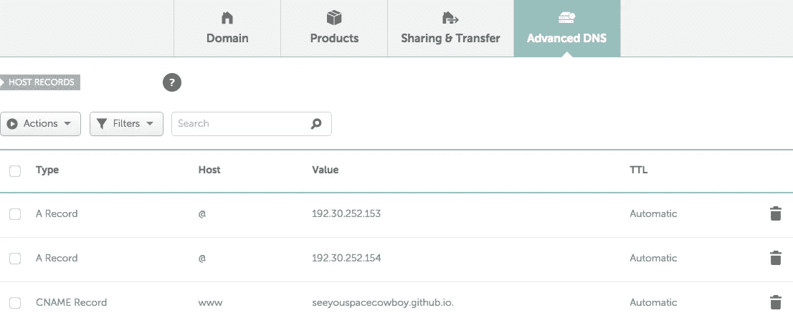

# 使用 Namecheap 在 Github 页面上定制域教程

> 原文：<https://medium.com/hackernoon/custom-domain-on-github-pages-tutorial-using-namecheap-7112bf2b8882>

如果你已经有了一个 Github 页面，并且想把你的域名从`username.github.io/repo`改成`customDomain.com`，这是一个快速教程。如果你还没有，从 [*Namecheap*](https://namecheap.com) 购买一个域名，我推荐它，因为你通常支付大约 1-10 美元一年，而且用户界面很漂亮。

## 将 Github 页面配置为使用自定义域

首先，进入你的 Github 页面 repo，点击**设置**，然后向下滚动，直到你看到**自定义域**。在输入框中，输入你刚买的域名来设置你的 Github 页面，例如`[www.yourDomainName.com](http://www.yourDomainName.com.)` [。](http://www.yourDomainName.com.)

让我们返回到 repo 的 **Code** 选项卡，您现在应该看到一个名为`CNAME`的新文件被创建。

如果你没有，那么创建一个新文件，命名为`CNAME`，输入`www.yourDomainName.com`，保存并推送到你的 repo。

## 配置廉价域名 DNS 设置

让你的域名指向你的 Github 页面服务器。

进入*域名便宜*，点击导航栏中的**域名列表**，然后点击你的域名 url 旁边的**管理**，再点击**高级 DNS** 。

现在创建我从下图中列出的以下记录，除了用`yourGithubUsername.github.io`替换`seeyouspacecowboy.github.io`。

## 等待游戏

一切都准备好了，你所要做的就是等待 5-30 分钟让它工作。

*感谢阅读！请分享推荐给其他感兴趣的读者！*

*查看我的作品集*[*http://mohammedchisti.com*](http://mohammedchisti.com)*。(托管在 Github 页面和从 Namecheap 购买的域名上):p*