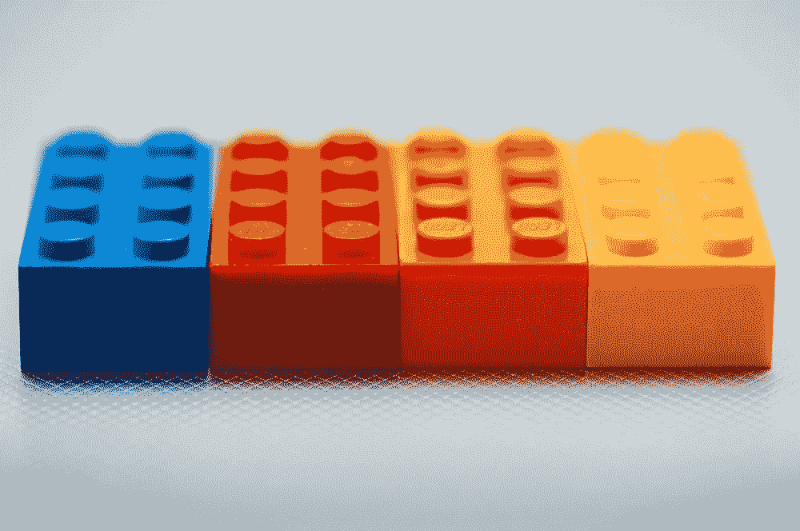

# HTML 中的自定义元素、阴影 DOM 和模板示例

> 原文：<https://medium.com/hackernoon/custom-elements-shadow-dom-templates-in-html-by-examples-f641d3ed651c>

credit: blog.teamtreehouse.com/create-custom-html-elements-2

**创建自定义元素**

下面是一个演示如何创建自定义元素示例:

Creating custom elements by example

**使用带有自定义元素的 ShadowDOM】**

Shadow [DOM](https://hackernoon.com/tagged/dom) 是一种封装自定义组件 DOM 的方式。这种封装意味着我们应用程序的样式表和 [javascript](https://hackernoon.com/tagged/javascript) 逻辑被合并到这个影子 DOM 元素中。

Creating custom elements with ShadowDOM by example

**使用带有自定义元素的 ShadowDOM 模板**

Creating custom elements with ShadowDOM and template by example

ShadowDOMs 也可以提供 HTML 模板，如下所示:

[来源](https://www.youtube.com/watch?v=aQxccPmNhHw)

*最初发布于*[*xameeramir . github . io*](http://xameeramir.github.io/Custom-Elements-Shadow-DOM-Templates-in-HTML-by-Examples/)*。*