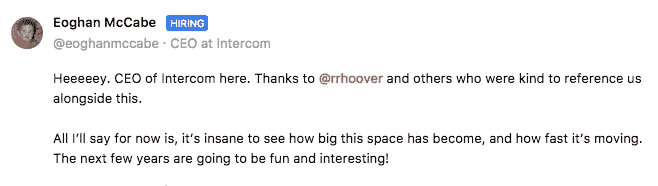

# 客户聊天:脸书 vs 对讲机 vs 漂移

> 原文：<https://medium.com/hackernoon/customer-chat-facebook-vs-intercom-vs-drift-7a6e78d4f32c>

## 这是一场有趣的比赛…

Photo by [Braden Collum](https://unsplash.com/photos/9HI8UJMSdZA?utm_source=unsplash&utm_medium=referral&utm_content=creditCopyText) on [Unsplash](https://unsplash.com/?utm_source=unsplash&utm_medium=referral&utm_content=creditCopyText)

Facebook Messenger 团队刚刚宣布，他们将与 Intercom 竞争。在推特上。你没看错。

所以现在他们正全力以赴地与对讲机、T2、漂移和其他公司竞争。任何优秀的 T4 聊天机器人开发者都知道，每个客户都问过这个著名的问题

> 这个聊天机器人也能在我的网站上工作吗？

到目前为止，答案一直是:“是的，但是。”

“是的，但是我们需要更多的工作…”

“是的，但是旋转木马可能看起来不一样……”

“是的，但是……”

Heck， [smooch.io](https://smooch.io/) 为了恰当地回答这个问题(以及更多)，筹集了 1000 万美元。从今天起，开发商可以告诉他们的客户

> 是的，开箱即用。我们需要在你的网站上使用脸书的插件。

这对于许多用例来说可能是合理的。对于很多其他用例来说完全不合理。鉴于监管框架，对于银行、金融机构和任何担心私人数据通过其网站聊天流动的组织来说，这似乎是不可行的。

对于我们这样的创业公司来说，可能限制太多了。Intercom 提供了一系列非常非常有用的功能，例如类似 CRM 和自动消息传递功能。当然，[脸书](https://hackernoon.com/tagged/facebook)可能会开发新功能并迎头赶上；但其广泛的受众和野心通常会限制添加到产品中的功能的深度和复杂性。

仍然是一个非常有趣的举动。虽然仍处于测试阶段，但你可以在 Chatfuel 主页上浏览一下最终的用户体验。

比赛现在正式开始。正如 Intercom 首席执行官今天在 ProductHunt 上发布的那样，这将是有趣的一年

From [https://www.producthunt.com/posts/messenger-customer-chat](https://www.producthunt.com/posts/messenger-customer-chat)