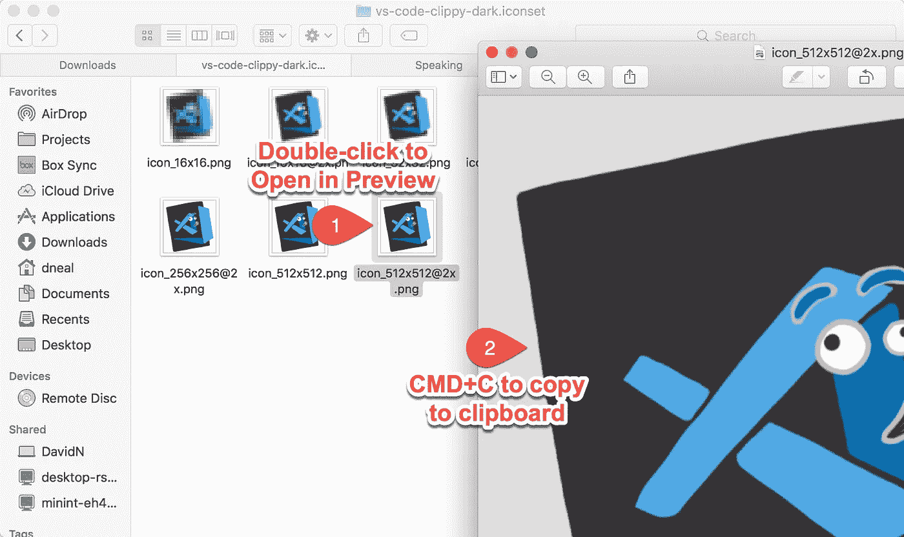
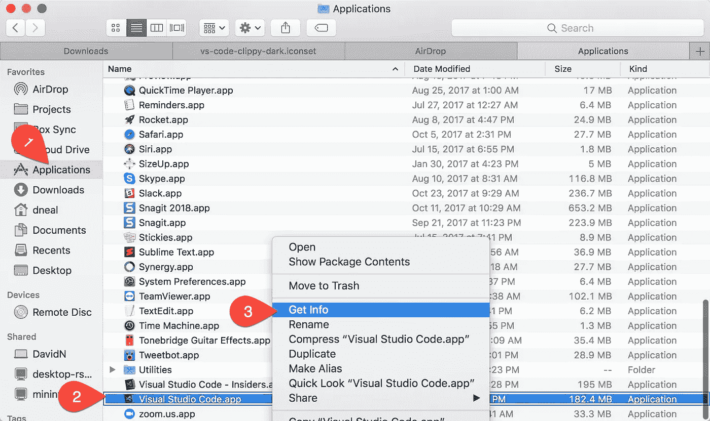
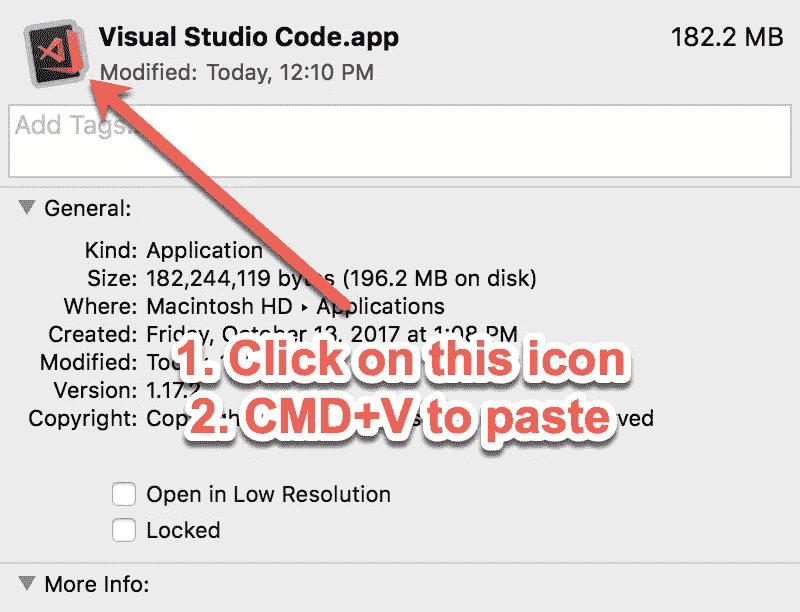
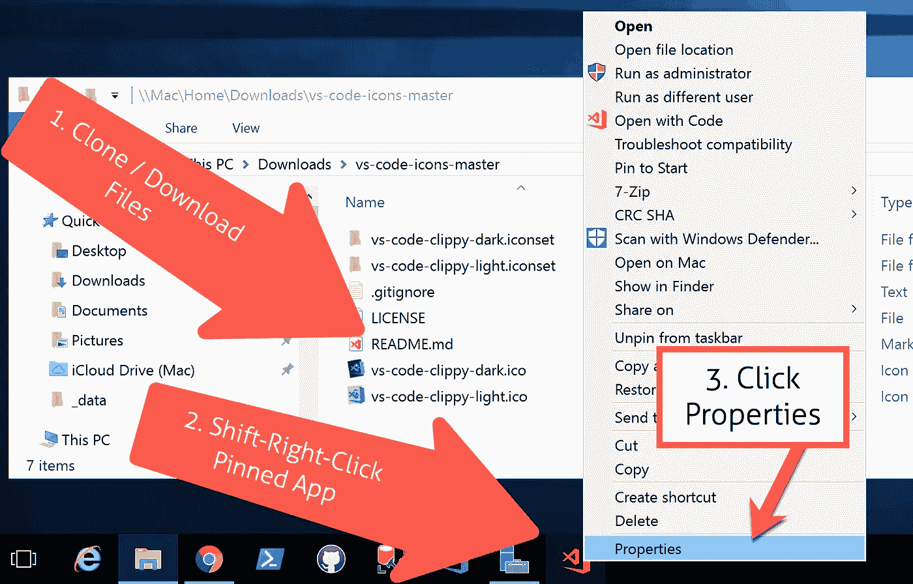
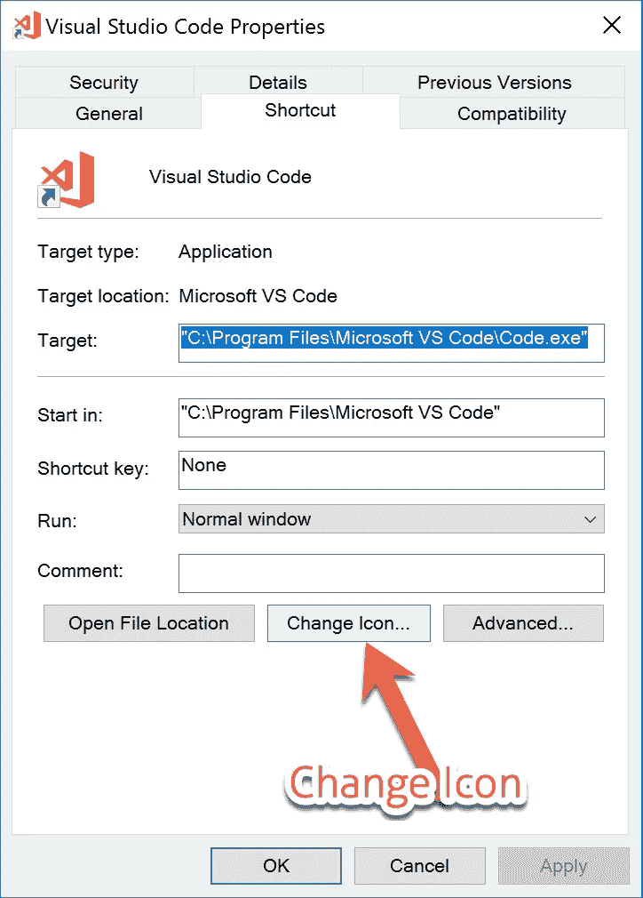
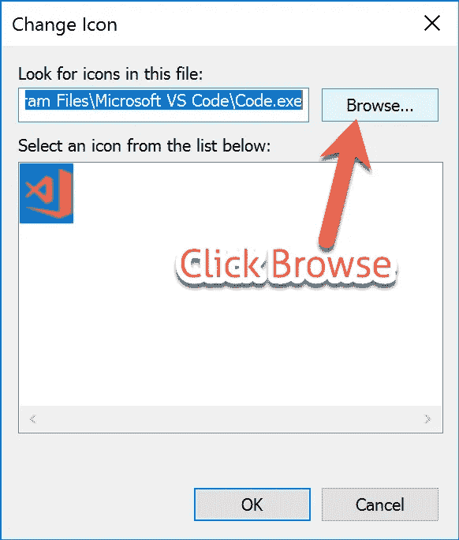
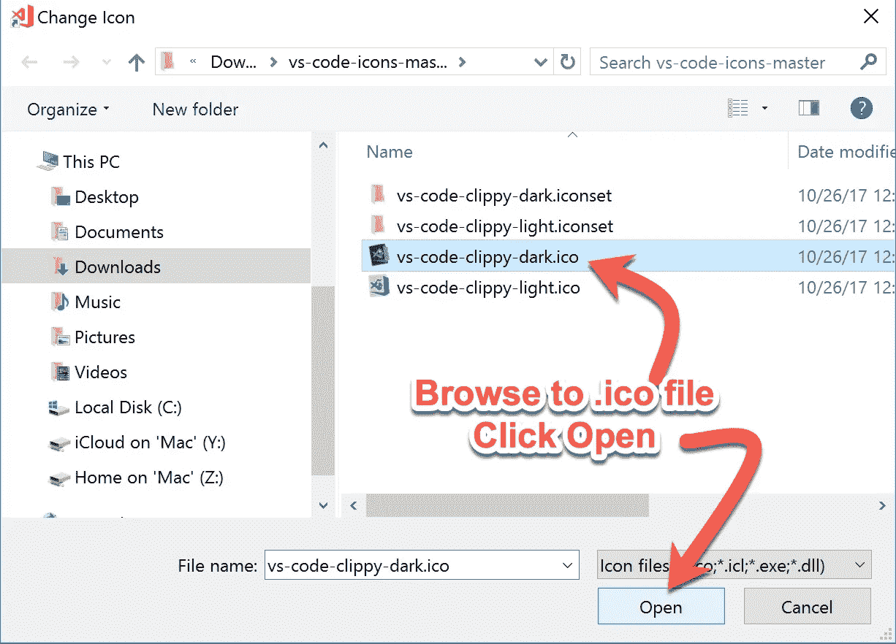

# 自定义您的 VS 代码图标

> 原文：<https://medium.com/hackernoon/customize-your-vs-code-icon-fc34fc52c522>

(或任何应用程序图标，就此而言。)

橙色的 Visual Studio 代码图标似乎惹恼了很多人。以至于，[微软](https://hackernoon.com/tagged/microsoft)正在[在下一个版本中改变它](https://code.visualstudio.com/blogs/2017/10/24/theicon)。

一些人对“[南瓜香料](https://hackernoon.com/tagged/pumpkin-spice)图标非常不满，他们开始用其他东西来代替它。

我想出了几个我自己的变体，让人想起我们在微软办公室的老朋友 Clippy。

你可以在 https://github.com/reverentgeek/vs-code-icons[下载 Windows 或 Mac 版的文件](https://github.com/reverentgeek/vs-code-icons)

如果您对自己的自定义图标有任何建议或要求，请告诉我！

# 如何在 macOS 上更改应用程序图标

*   下载或克隆 [GitHub 库](https://github.com/reverentgeek/vs-code-icons)
*   打开所需的。图标集文件夹
*   双击最大的。要在预览中打开的 png 文件
*   按 CMD+C 将图像复制到剪贴板

*   打开您的应用程序文件夹
*   右击 Visual Studio 代码应用程序
*   点击“获取信息”

*   单击左上角的应用程序图标
*   按 CMD+V 粘贴自定义图像

你现在在野兽模式下操作。

# 如何更改 Windows 上的应用程序图标

虽然在技术上可以通过仔细修改`.exe`文件来改变 Windows 中应用程序的图标(不适合胆小的人！)，你唯一能做的实际的事情就是改变捷径。

*   下载或克隆 [GitHub 库](https://github.com/reverentgeek/vs-code-icons)
*   启动 VS 代码应用程序
*   右键单击正在运行的应用程序，并将该应用程序固定到任务栏上(如果您还没有这样做)
*   关闭应用程序
*   shift+右键+单击任务栏上锁定的应用程序
*   单击“属性”

*   单击“更改图标”按钮

*   单击“浏览…”按钮

*   找到所需的`.ico`文件并点击“打开”

至少你的钉住应用看起来很牛逼！

*原载于 2017 年 10 月 27 日*[*reverentgeek.com*](http://reverentgeek.com/customize-your-vs-code-icon/)*。*