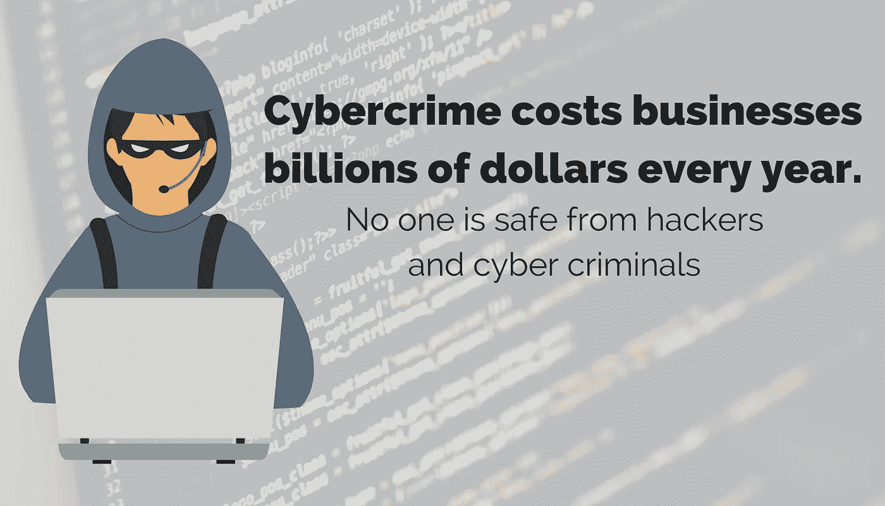

# 网络安全意识月:挫败网络罪犯的 5 个最佳实践

> 原文：<https://medium.com/hackernoon/cyber-security-awareness-month-5-best-practices-for-thwarting-cyber-criminals-7682eaa0d782>

10 月是国家网络安全意识月。这是最好的时机。正如上个月 Equifax 的巨大漏洞所证明的，没有人能免受黑客和网络罪犯的攻击。那次入侵影响了 1 . 43 亿美国人。总会有人试图智胜最好的安全系统，并试图智胜使用这些系统的人。(事实证明最后一部分并不难做到。人类是你的网络安全计划中最薄弱的环节，我们也将更多地讨论如何解决这个问题。)

由[美国国土安全部](https://www.dhs.gov/national-cyber-security-awareness-month)和[国家网络安全联盟](https://staysafeonline.org/ncsam/)发起的网络安全意识月是一年一度的活动，旨在教育和提高人们对网络犯罪给世界各地的组织和个人带来的真实威胁的认识。

虽然我们喜欢科技在开展业务和管理日常生活方面带来的便利、效率和速度，但同样的科技也将我们和我们的个人信息置于风险之中。**网络犯罪每年给企业带来数十亿美元的损失。即使是一个小公司的漏洞也会造成数十万美元的损失。如果你是一家中小型公司，这种成本加上对你声誉的打击可能会毁了你的生意。**

作为一家软件公司，我们总是向客户强调安全的重要性。在这次重大事故后，我们有很多疑问。网络安全，或者现在更常用的网络安全，归结为常识和持续的警惕。这就是我们庆祝网络安全意识月的原因，我们用五个最佳实践来挫败网络犯罪，保护您的组织。

# 让您的软件保持最新

软件更新并不总是关于新奇的新功能。他们还删除过时的功能，更新驱动程序，修复漏洞，最重要的是，**修复软件的安全漏洞。尤其是这些安全更新，让您在收到更新通知时立即更新软件变得非常重要。始终使用最新版本的软件是一种最佳实践和常识。**

# 点击前请三思

黑客进入并造成破坏的另一种方式是有针对性的网络钓鱼欺诈。网络钓鱼诈骗无所不包，但通常都是以同样的方式运作。骗子发送的电子邮件看起来像是来自您信任的人。它可能是供应商、国税局、您的银行，甚至是您组织中的一个部门，如人力资源或会计。有些骗子甚至冒充公司老总！

典型的网络钓鱼电子邮件通常会要求您提供敏感信息，或者包含提示您登录某个帐户的链接。虽然该链接可能会将您带到一个看起来像您习惯看到的登录页面的页面，但该页面实际上可能是一个虚假的登录页面，记录并保存您的信息以供以后使用。这封邮件通常表达了紧急情况，威胁说如果你不马上采取行动，就会关闭你的账户并收取高额罚款。这些策略旨在吓唬你，让你不假思索地迅速行动。

为了避免成为这些骗局的牺牲品:

*   首先，一定要仔细查看发件人的邮件。诈骗者擅长将电子邮件地址伪装成与您认识并信任的地址非常相似的地址，但通常会有一些泄漏。你知道的网址，比如 www.yourbank.com 的[，](http://www.yourbank.com,)会稍微偏离一点。也许是 www.your-bank.com 的[或 www.newURL.yourbank.com 的](http://www.your-bank.com)或——或者甚至是像一个字母一样微妙的东西:[www.yourbanks.com。](http://www.yourbanks.com.)
*   如果出于任何原因要求您点击任何链接(例如，领取奖品、登录帐户、检查订单状态、接受好友请求)，请在点击前将鼠标光标悬停在相关链接上。应该会弹出一个文本框，向您显示链接将带您到哪里。看起来眼熟吗？是简单直白还是冗长复杂？链接中的主网址是什么？你认出来了吗？如果它看起来很可疑，不要点击。提示:缩短的网址是电子邮件是一个骗局的危险信号。
*   如果要求您登录帐户，请直接前往该帐户的网站登录，而不是通过电子邮件中的链接登录。
*   如果电子邮件来自你信任的人，但看起来不太对劲，打电话给那个人，确认他们给你发了邮件。

要了解更多关于网络钓鱼诈骗的工作原理，以及它们如何轻易地欺骗你，[查看这篇关于复杂的网络钓鱼诈骗的文章](https://rtslabs.com/phishing-scams-are-getting-sophisticated-are-you-at-risk-of-taking-the-bait/)。

# 创造网络安全文化

你可以拥有最好的防火墙和安全软件，但仍然会被黑客攻击。您的人员和流程是网络安全的关键。事实上，根据 IBM 的一份报告， [95%的安全漏洞是由人为错误](https://www-03.ibm.com/press/us/en/pressrelease/47705.wss)造成的。

让网络安全成为企业文化的一部分是防范攻击的最佳方式。要做到这一点，您需要将安全最佳实践嵌入到您的流程中，并让您的员工了解攻击是如何发生的以及如何防范攻击。

员工应该知道:

*   勒索软件的工作原理
*   [网络钓鱼骗局如何运作](https://rtslabs.com/phishing-scams-are-getting-sophisticated-are-you-at-risk-of-taking-the-bait/)
*   [如何创建强密码](https://rtslabs.com/forget-what-you-know-about-password-security-and-do-this-instead/)
*   安全漏洞的严重后果(成本、声誉损失、个人风险)
*   公司计算机的可接受和不可接受的使用
*   从未知来源下载东西的危险

您的组织应该有适当的策略和流程来:

*   确保操作系统和软件保持最新
*   管理谁有权访问管理帐户
*   确保适当共享文件、目录和网络权限
*   定期备份数据并检查其完整性
*   评估连接到网络的所有设备

# 使用声誉良好的网络安全软件

您还需要尽职调查，使用现有技术保护您的组织免受网络攻击。网络安全计划的基础应该包括安装防火墙和防病毒软件。拥有这些东西是至关重要的，因为它们是你抵御攻击的第一道防线。不要只买最便宜的。进行研究以寻找信誉良好的供应商，并找到最适合您组织需求的软件。如果您需要帮助比较选项，有一些机构和顾问可以帮助您，他们可以引导新网络安全软件的选择过程，并在您做出决定时提供客观的第三方观点。

# 有应对计划

最后，您需要能够检测事故，并制定应对计划。在发生网络入侵或攻击时，每一分钟都很重要。从检测漏洞到全面攻击，一旦发生违规，您需要快速响应。与安全专家一起制定涵盖所有可能情况的计划。一旦你有了计划，就要对你的员工进行程序培训。

# 保护你自己

网络安全是一个真正的威胁。根据国家网络安全联盟的数据，[在过去的 12 个月里，50%的中小型企业遭到攻击](https://staysafeonline.org/cybersecure-business/)。遵循这些网络安全最佳实践将有助于确保您的组织不会成为下一个头条新闻。

# 更多精彩的网络安全文章:

[你的电子商务网站安全吗？关于 TLS](https://rtslabs.com/is-your-e-commerce-website-secure-what-you-need-to-know-about-tls/)
[你需要知道的 11 条安全提示每个 SaaS 初创公司都应该牢记在心](https://rtslabs.com/11-security-tips-every-saas-startup-take-heart/)
[你的服务器够安全吗？](https://rtslabs.com/is-your-server-secure-enough/)
[你的网站是黑客的活靶子吗？](https://rtslabs.com/website-sitting-duck-hackers-cybersecurity-best-practices/)