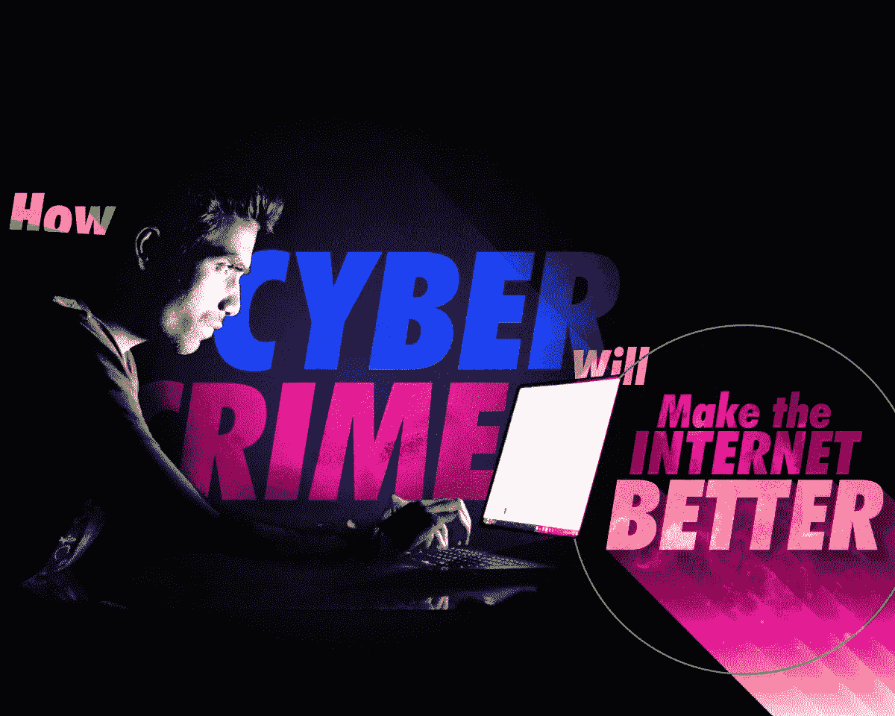
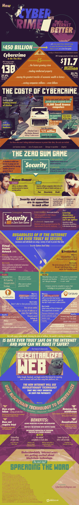

# 网络犯罪实际上让互联网变得更好。原因如下。

> 原文：<https://medium.com/hackernoon/cybercrime-actually-makes-the-internet-better-heres-why-f8edbdf6da8b>

我们都听说过这样一句话，杀不死你的只会让你变得更强。虽然这句话经常引起激烈的争论，但当它被应用于网络安全时，听起来再真实不过了。

网络犯罪是增长最快的犯罪。在一个数字化的世界里，我们几乎把整个生活都放在电脑上，我们的一切都可能处于危险之中。从金融信息，到个人数据，到知识产权和艺术品，没有什么不会成为黑客的目标。2017 年，网络安全的年度成本为 1170 万美元，比 2016 年增长 22.7%。

随着数百起网络攻击夺走了数百万人的隐私数据，人们不禁要问:互联网真的会安全吗？网络安全的未来在于一个去中心化的网络。使用基于比特币等加密货币的区块链技术，去中心化的互联网将使我们不必依赖脸书或谷歌等数据库来保护我们的信息安全。用于安全的区块链技术将控制权放回用户手中，并将使犯罪分子无法通过大公司的数据泄露同时窃取数百万美元。

你对网络安全的[未来有什么想法？请看这张信息图，了解应对网络犯罪如何有助于让互联网变得更加安全。](https://cybersecuritydegrees.com/faq/cyber-crime-infographic/)

