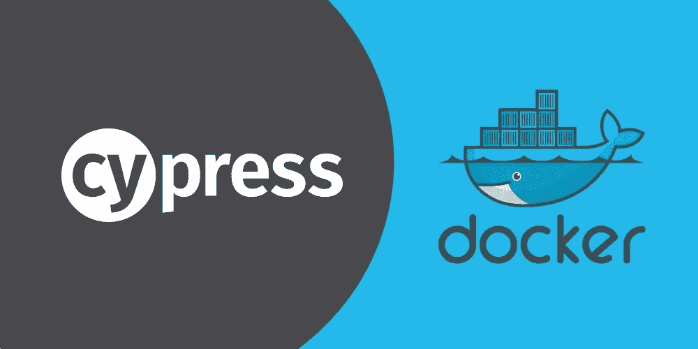
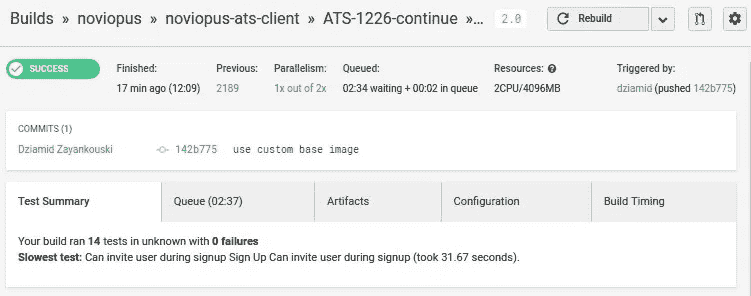
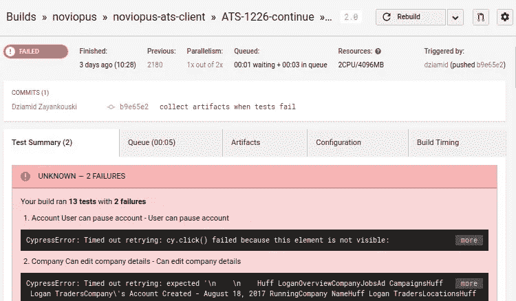

# Cypress.io & Docker:终极 E2E 堆栈

> 原文：<https://medium.com/hackernoon/cypress-io-docker-the-ultimate-e2e-stack-a20ee25654b1>



# 爱达荷（Idaho 的缩写）

人们对端到端测试又爱又恨，这是有充分理由的。我已经看到许多项目(包括我自己的)着迷于自动化端到端测试，并逐渐达到测试用例变得古怪、缓慢和完全被忽略的程度。让我们看看为什么以及如何让 E2E 测试成为一个好的开发者体验和软件回归的坚固防火墙。

出于演示的目的，我们将测试一个 [**React\Node.js 应用程序**](https://dashbouquet.com/viewcase/hr-software-mvp) ，这是一个人力资源机构的招聘平台。到本文结束时，我们将实现这些测试用例:

*   用户可以注册
*   用户可以登录
*   用户可以发布招聘广告
*   用户可以看到候选人出现在职务公告板上

# 使用 Cypress.io

很长一段时间以来，在 E2E web 应用程序测试领域有一个主要参与者——selenium。大多数解决方案基本上都是在 selenium 之上构建 API，所以它们都面临着 selenium 所面临的相同问题。Cypress.io 是一个新的播放器，不依赖于 selenium，旨在解决其前任的缺点。

让我们看看 Cypress API 在我们的测试用例中会是什么样子。

```
describe('Smoke tests', () => {
  it('User can sign up', () => {
    cy
      .signup()
      .get('body').contains('Create Your First Job');
    });

  it('user can login', () => {
    cy
      .login()
      .get('body').contains('Create Your First Job')
  });
});
```

好吧，这里没有神奇的 signup()或 login()方法，但是有一个很好的 API 可以用自定义方法扩展' **cy** '全局:

```
Cypress.addParentCommand("login", (email, password) => {
    cy
      .visit('/')
      .get('form input[name="email"]').clear().type(email)
      .get('form input[name="password"]').clear().type(password)
      .get('form button').click()
  });

  Cypress.addParentCommand("signup", (name, email, password) => {
    cy
      .visit('/')
      .get('body').contains('Sign Up').click()
      .submitSignupForm(name, email)
      .followLinkFromEmail()
      .submitProfileForm(name, email)
      .get('body').contains('Create Your Company')
      .submitCompanyForm()
      .get('body').contains('Add Team Members')
      .get('button').contains('Skip').click()
      .get('body').contains('Create Your First Job')
  });
```

# 为每个测试用例设计初始状态

如果我们要使测试快速，我们将需要从应用程序的预定义状态开始每个测试用例。让我们定义每个测试用例的初始状态:

*   **“用户可以注册”**。我们并不真的需要数据库中任何与用户相关的数据。尽管可能存在一些只读数据来支持应用程序。姑且称之为“**空**状态。
*   **“用户可以登录”**、**用户可以发布工作广告**都表示用户已经经历了注册流程，所以最小初始状态是——“**已注册**
*   最后**“用户可以看到候选人出现在工作公告板上”**需要工作出现，因此为“**工作发布**”状态。

因此，让我们更新我们的测试用例来明确定义状态:

```
describe('Smoke tests', () => {
  it('User can sign up', () => {
    cy
      .state('empty')
      .signup()
      .get('body').contains('Create Your First Job');
    });

  it('user can login', () => {
    cy
      .state('signed-up')
      .login()
      .get('body').contains('Create Your First Job')
  });
});
```

state 函数向 API 发出一个 XHR 请求，API 将其状态重置为某个预定义的状态。

```
Cypress.addParentCommand("state", (...states) => {
  cy
    .request({
      url: `${Cypress.env('BASE_API')}/integration/state`,
      method: 'POST',
      headers: { 'content-type': 'application/json' },
      body: JSON.stringify({ states: states })
    });
});
```

我们确实需要一些支持代码来帮助设置状态，但是所付出的努力在测试的性能和可维护性方面是值得的。在后端，我们使用 MongoDB native，因此有问题的代码可能如下所示:

```
const stateLoaders = {
  'empty': require('./states/empty'),
  'signed-up': require('./states/signed-up'),
  ...
};

export const loadState = async (db, states = ['empty']) => {
  await clean(db);

  for (let state of states) { //many states? well sometimes you need to test complex scenarios
    await stateLoaders[state].load(db);
  }
};

const clean = async (db) => {
  const collections = await db.listCollections().toArray();
  const names = collections
    .filter(c => c.name.indexOf('system.') !== 0)
    .map(c => c.name);

  return Promise.all(names.map(name => db.collection(name).remove()));
};
```

有人可能会争辩说，既然可以有一个适用于所有情况的大州，为什么还要有多个州。答案是可维护性和性能。首先，不加载不需要的数据可以节省大量时间。但更重要的是可维护性。您的应用程序声明，您将需要测试可能会相互冲突。

例如，您想要测试一个用户提交了一个注册表单但没有验证他的电子邮件的情况，因此您需要一个特殊的用户，现在我们在您的数据库中有两个用户，您必须在测试中区分他们。您将很快注意到您所在州的数据量很难推理。然而，如果您选择针对最小可能状态运行测试用例，那么跟踪状态变化就很容易了。

# 二。

在本文的第一部分，我们看到了如何使用 ypress 和选择正确的模拟策略来帮助我们编写高性能、可靠且易于使用的端到端测试。想感受一下这种快速的感觉，看看赛普拉斯在试运行期间为我们录制的视频。在这一部分中，我们将关注 E2E 测试的另一个实际方面——在 CI 上运行测试。

# 使用 docker-compose

通过 E2E 测试，我们希望引入尽可能多的应用方(微服务、API、传输),这样我们就可以确保最佳的覆盖和集成。理想情况下，我们应该测试一个生产克隆，但是这会带来很大的性能开销——我们不想在每个构建的部署上浪费时间和资源。我们想要的是给开发者一个快速的反馈，无论他的提交是否引入了回归。Docker 来了。Docker-compose 为您提供了这种能力，以声明的方式将您的应用程序需要的所有微服务集合在一起，在 CI 上运行它们以及您的测试。

让我们在一个漂亮的 docker-compose.yml 文件中组装我们的测试应用程序。对于演示，我们仍然使用这个典型的 React/Node.js 应用程序，其中包含 4 个图像:

*   frontend——是 react 应用程序，带有一个提供静态文件的服务器
*   API —是 Node.js API
*   MongoDB —持久性
*   cypress——是我们的测试运行程序，它将在浏览器中打开前端图像 URL，但也可以向 API 发送请求来重置应用程序的状态

```
#docker-compose.yml
version: '2'
services:
 cypress:
   build:
     context: .
     dockerfile: Dockerfile.cypress
   links:
     - frontend
     - api
   command: /app/wait-for-it.sh frontend:3000 -t 60 -- npm run test
 frontend:
   environment:
     - NODE_ENV=integration
   build:
     context: .
     dockerfile: Dockerfile.frontend
   ports:
     - 3000:3000
   expose:
     - 3000
   links:
     - api
   command: /app/wait-for-it.sh api:4000 -t 60 -- npm run start
 api:
   environment:
     - NODE_ENV=integration
   image: 'noviopus/api-dev:latest'
   ports:
     - 4000:4000
   expose:
     - 4000
   links:
     - mongodb
 mongodb:
   image: mongo:3.2
```

**这里有一些值得注意的事情**。

首先，我们在这里使用最新版本的 API 映像。主要思想是，API 是以向后兼容的方式开发和部署的，所以当新版本的 API 出来时，我们知道所有部署的前端将继续工作(在特定的环境中)。这允许我们在不依赖于构建版本的情况下发展应用程序。

其次，我们使用这个简单而有用的 [**脚本**](https://github.com/vishnubob/wait-for-it) 明确地等待映像的依赖项准备好接受连接，这样我们就知道在运行第一个测试之前所有的服务都准备好了。

以下是使用 Docker-compose 时 Circle CI 2.0 配置文件的外观:

```
version: 2
jobs:
 build:
   docker:
     #run all commands in this image:
     - image: dziamid/ubuntu-docker-compose #ubuntu + docker + docker-compose
     - checkout
     - setup_remote_docker
     - run:
         #need to login so we can pull private repos from hub in the following runs
         name: Login 
         command: docker login -u $DOCKERHUB_USER -e $DOCKERHUB_EMAIL -p $DOCKERHUB_PASSWORD
     - run:
         name: Build
         command: docker-compose -p app build
     - run:
         name: Test
         command: docker-compose -p app run cypress
     - run:
         name: Collect artifacts
         command: |
           docker cp app_cypress_run_1:/app/cypress/artifacts $(pwd)/cypress/artifacts
         when: always #execute this run command on success or failure of previous run
     - store_test_results:
	#expose test results so you can see failing tests on the top of the page
         path: cypress/artifacts
         when: always
     - store_artifacts:
	#expose video and screenshots from cypress
         path: cypress/artifacts
         when: always
     - run:
         name: Deploy
         command: |
	# deployment is out of scope of this article
```

运行`**docker-compose-p app-f bundle . yml run cypress**`显示了 Docker-compose 的荣耀。该命令将:

1.  启动 Cypress 图像并附加到其输出
2.  找到 Cypress 图像的所有依赖项，并在后台启动它们
3.  当 Cypress image 中的进程退出时，它将优雅地终止后台的所有进程
4.  所有进程终止后，您可以访问

通过显示测试结果，您将在页面顶部看到测试摘要。



结果，我们将 E2E 集成到了开发工作流程中。现在，我们可以发展我们的微服务，并确信它们可以相互集成，并且最关键的应用程序流正在按预期工作。

[*作者 Dziamid Zayankouski*](https://github.com/dziamid)

*想了解更多？* [*在这里查看*](https://dashbouquet.com/blog)