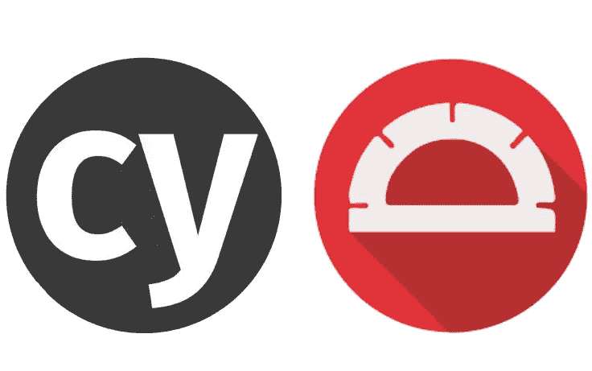
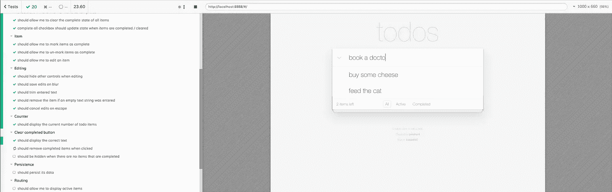
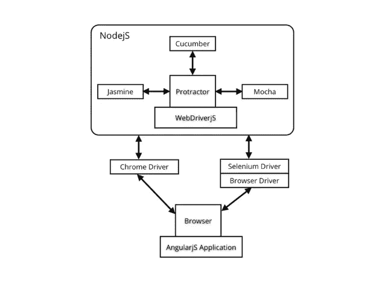

# Cypress.io vs 量角器:e2e 测试战

> 原文：<https://medium.com/hackernoon/cypress-io-vs-protractor-e2e-testing-battle-d124ece91dc7>



无论你构建什么，你都将面临通过自动化部分或整个体验来优化测试的问题。

# 短篇小说

> *大企业项目:* ***量角器***
> 
> *宠物项目或小型 web 应用:* ***柏树***

# 为什么要写 e2e 测试？

简单来说。您可以定义一个*契约行为*来确保您的核心功能总是按预期工作。

虽然单元测试让我们对我们所做的事情有一个很好的感觉，但是集成测试帮助我们确保整个画面是好的。

> ***警告*** *:如果你每周都在更换系统，情况可能就不一样了。*

# Cypress.io 新气息还是新炒作？



## 柏树优点:

1.  **没有依赖。你把它放在你的“package.json”里，就这样**
2.  **自动重新加载。它节省了大量的时间**
3.  **调试。当您在 Cypress GUI 中看到每个步骤时，您可以记录/调试序列中的任何步骤**
4.  **自动等待。没有睡眠，就没有等待。获取您的元素并设置用户友好的超时。赛普拉斯会完成剩下的。**

```
cy.get(‘.async-element’, { timeout: 5000 }).click()
```

**默认情况下，** `cy.get` **等待元素出现在 DOM** 中，但是你可以设置任何合理的超时。

## 基于观点的优势:

1.  **清晰语法**

很好读。你会喜欢的！

2.**单元测试+ E2E**

我是独立于平台的技术的忠实粉丝。一旦你学会了某个[工具](https://hackernoon.com/tagged/tool)你就不想换另一个了，因为你的生态系统已经改变了。

Cypress 是平台独立的，这意味着你可以编写和覆盖任何框架/栈。你甚至可以导入你的 **ES6** 和 **JSX** 并为其编写单元测试。

## 柏树缺点:

1.  **社区**。没什么好说的，是商业公司。你永远不知道未来的货币化计划。
2.  **特性。**不支持文件上传。没有跨浏览器测试。谁知道这些东西什么时候会被覆盖，对于大项目来说，这些特性是至关重要的。
3.  **页面对象模型。**是已经被时间证明的东西。赛普拉斯支持一种可能会引起争议的不同方法。更多细节在这里:[柏树果](https://docs.cypress.io/faq/questions/using-cypress-faq.html#Can-I-use-the-Page-Object-pattern)。

# 量角器:屡试不爽

## 量角器优点:

1.  **社区**。在 [Github](https://github.com/angular/protractor) 上的 **7000 颗**左右。未结/已结债券 200/3000。面对现实吧，Angular 社区完成了他们的工作。
2.  **不仅有角**。量角器为测试角度应用程序提供了额外的优势，但你的应用程序不一定要使用它。
3.  **你可以选择试题库。虽然量角器已经在游戏中存在一段时间了，但是你可以在 libs 中选择来编写你的测试。一些受欢迎的选择有[茉莉](https://jasmine.github.io/)、[摩卡](https://mochajs.org/)、[黄瓜](https://cucumber.io/docs/reference/javascript)。除此之外，还有大量的插件和库来扩展量角器的功能。**
4.  **通过多个浏览器进行并行测试**。它支持跨浏览器测试。甚至更多——您可以同时运行几个浏览器实例！



## 量角器缺点:

1.  **调试**。我个人觉得调试量角器很棘手。
2.  **耗时。**可能需要一些时间来掌握所有的 API 和工艺。

# 结论

**柏树**看起来很有希望。但是面对它的现状，你应该三思而后行。**量角器**被时间证明了。它在 Gitter 上有很大的社区和支持。此外，无论你使用什么样的技术，量角器都会是你简历的一个很好的补充。

> 感谢阅读！如果你想让我写更多类似的故事，推荐这篇文章(点击❤按钮)。
> 
> 把你的想法写在评论里，订阅我的媒介，寻找更多的故事。