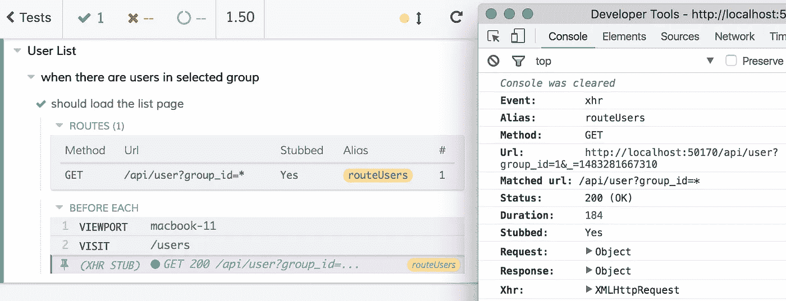

# 赛普拉斯将改变你的发展方式

> 原文：<https://medium.com/hackernoon/cypress-will-change-the-way-you-develop-47a194d2a33f>

## 用 Cypress 让 TDD 成为你的前端新年决心


2015 年 11 月，我看到 Brian Mann 在 [Cypress.io](https://cypress.io) 上做了一个演示。它立刻感觉像是未来。

当时，我向自己和同事提出挑战，要改进我们的测试。我在为[提线木偶](http://marionettejs.com)做代码覆盖，我把我在那里学到的东西带到了日常工作中。Mocha 中的单元测试很好，它对木偶很有效，但是它几乎不能覆盖我们正在开发的应用程序。我们进行了硒测试，但这些测试经常是不可靠的，而且是在开发后作为一个额外的步骤进行的。将 Selenium 测试与我们的开发人员工作流集成的尝试失败了。有太多的摩擦，一切都感觉有点粗糙。

> "最后一个让我的工作流程发生如此巨大变化的工具是 git . "

到了 5 月份，我已经提前接触到了 Cypress 的测试版，并编写了我的第一个测试。很明显，我不知道自己在做什么。Cypress 感觉非常熟悉，它使用 Mocha 和 Chai 进行测试编写，但是知道从哪里开始我的成熟应用程序是令人生畏的。我的第一个错误是把柏树当作硒的替代品。虽然它可以取代 Selenium，但我强烈建议暂时搁置端到端测试，开始集成测试。

在我们开始剔除我们的服务器 API 之后，我们立即看到了工作流的改进。我们甚至还没有编写测试，但是我们能够轻松地处理复杂的数据场景。我们不需要接触数据库或设置服务器。通过一些简单的 javascript，我们可以设置开发新功能所需的每一个场景，然后通过 cypress，在我们的应用程序中与它进行交互，对浏览器中实际发生的事情有很好的可视性。很快，我停止打开 chrome 来测试我的工作，并且只使用 Cypress 进行开发。最后一个让我的工作流程发生如此巨大变化的工具是 git。

让我们看看这在实践中是什么样子的。

```
**describe**('User List', function() {
  **describe**('when there are users in selected group', function() {
    **beforeEach**(function() {
      cy.server()
        .route('/api/users?group_id=*', 'fixture:users')
        .visit('/users');
    });

    **it**('should load the list page', function() {});  
  });

  **describe**('when there are no users in group', function() {
    **beforeEach**(function() {
      cy.server()
        .route('/api/users?group_id=*', [])
        .visit('/users');
    });

    **it**('should load the empty page', function() {});
  });
});
```

在这个 Cypress 示例中，我们为不同的 API 结果设置了两个数据场景。在实践中，我们可能会将`describe.only`添加到一个场景中，这样我们就可以在那个环境中进行开发。运行“测试”后，Cypress 是一个完全交互式的 Chrome 实例，带有控制台。



The code example in Cypress. The left side is the interactive test results.

虽然这并没有触及 Cypress 的承诺和潜力的表面，但如果这就是它所做的一切，那就足够了。在一月的第一周，我很高兴地宣布我们将推出我们的第一个主要功能，包括 Cypress 测试的各个方面。此外，我正在与木偶团队合作，可能用 Cypress 测试木偶，虽然它不是专门为测试库而设计的，但一切看起来都很有希望。我希望很快能分享更多我在这一路上学到的东西。

Cypress 应该在不久的将来公开，我相信我们很快就会质疑没有它我们是如何运作的。现在就加入吧，把 Cypress 和 TDD 作为你的新年决心。Cypress 有一个活跃且不断发展的社区，虽然你不需要访问来运行 cypress，但是在测试期间可以通过邀请来访问 GUI。然而，获得访问是容易的；去他们的休息室问问就知道了。

**相关链接:**

*   [https://cypress.io](https://cypress.io)
*   [https://gitter.im/cypress-io/cypress](https://gitter.im/cypress-io/cypress)
*   【2015 年 11 月柏树简报

[](http://bit.ly/HackernoonFB)[](https://goo.gl/k7XYbx)[](https://goo.gl/4ofytp)

> [黑客中午](http://bit.ly/Hackernoon)是黑客如何开始他们的下午。我们是阿妹家庭的一员。我们现在[接受投稿](http://bit.ly/hackernoonsubmission)并乐意[讨论广告&赞助](mailto:partners@amipublications.com)机会。
> 
> 如果你喜欢这个故事，我们推荐你阅读我们的[最新科技故事](http://bit.ly/hackernoonlatestt)和[趋势科技故事](https://hackernoon.com/trending)。直到下一次，不要把世界的现实想当然！

