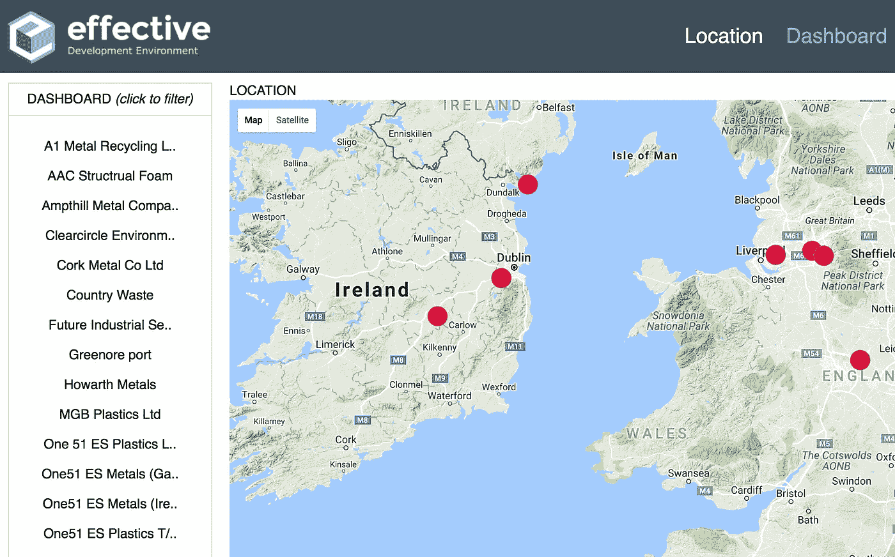
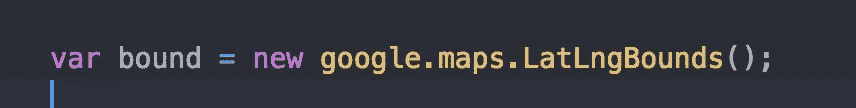
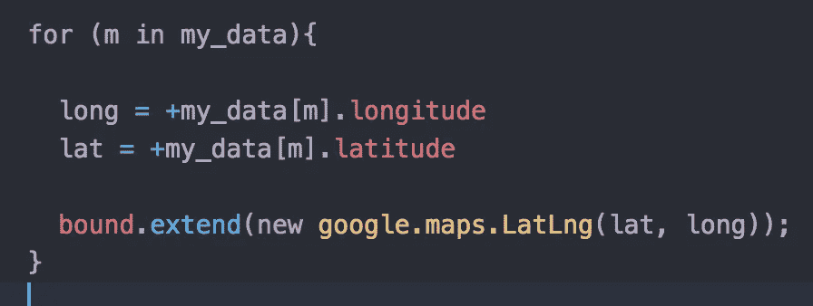
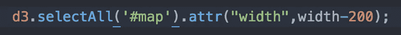
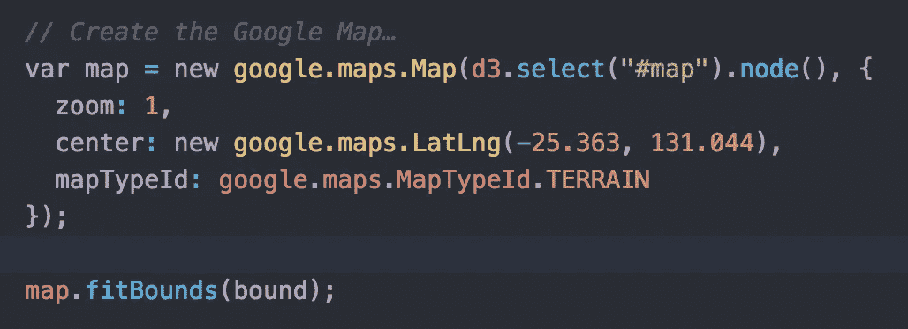
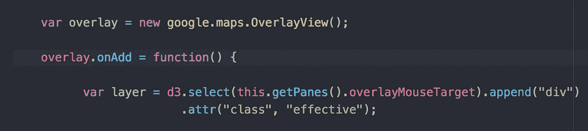
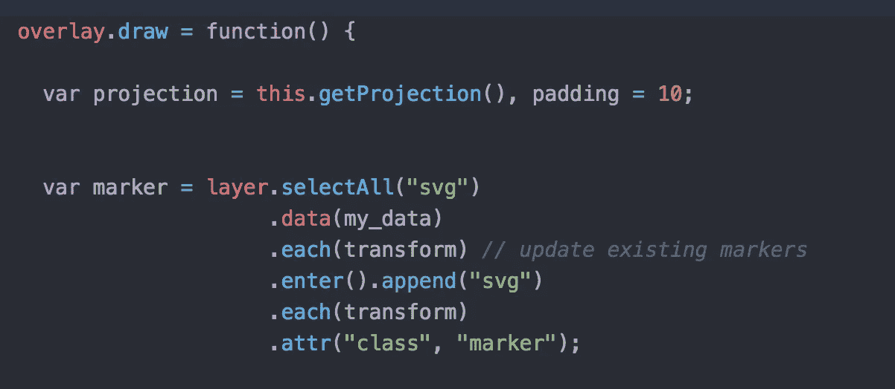
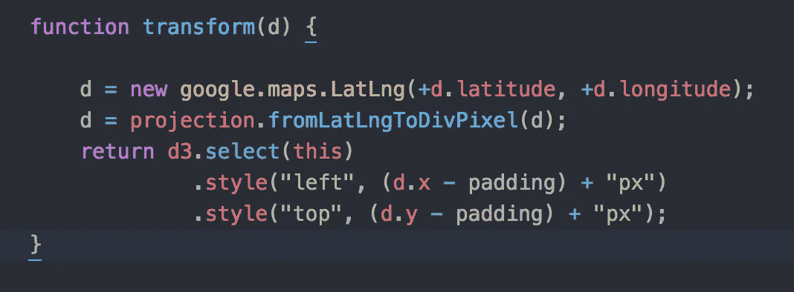
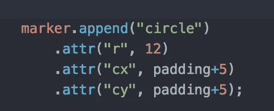
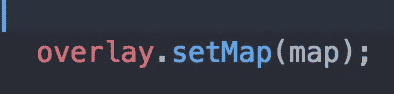

# d3.js 和 Google Maps API 的 11 个简单步骤

> 原文：<https://medium.com/hackernoon/d3-js-and-google-maps-api-in-10-easy-steps-4f258323525b>

最近的一个挑战是将数据与经度和纬度坐标联系起来，这是我在开发[培训](https://hackernoon.com/tagged/training)合规仪表板时使用的。这是[的最终视觉化](http://www.bmdata.co.uk/effective/index_map.html)。

我以前用过静态的[谷歌](https://hackernoon.com/tagged/google)地图，但是客户想要使用对内容有反应的实时地图。以下是我如何在迈克·博斯托克的[启动代码](https://bl.ocks.org/mbostock/899711)的巨大帮助下，用 10 个简单的步骤做到的。

1.  **第一步** —准备好你的资料。my_data 是一个包含经度、纬度和任何你可能需要的变量的列表。您可以重置数据并再次调用代码，地图将在适当的边界内重新绘制。
2.  **第二步** —声明边界。

3.**第三步** —扩展数据中每一行的界限。

4.**第四步** —选择要放置地图的<格>或< td >。

5.**步骤 5** —创建地图并拟合边界

6.步骤 6——声明一个覆盖图，一个 onAdd 函数并添加图层。

7.**第 7 步** —在 onAdd 函数中，声明一个 draw 函数，设置投影，然后绘制每个附加数据的标记。

8.**步骤 8** —变换(见上文)是定位每个 SVG 的功能

9.第九步——现在画圆。如果需要，您可以添加工具提示功能。

10.**步骤 10** —将覆盖图绑定到地图上。

11.最后，你需要设置各个层的 CSS。

。层，。图层 SVG { position:absolute；}

。图层 svg {
宽度:60px
高度:60px
右填充:100px
字体:10px 无衬线；
}

您还可以为设置样式属性。层圈，要么在 CSS 里，要么在你的 D3.js 代码里。

> [黑客中午](http://bit.ly/Hackernoon)是黑客如何开始他们的下午。我们是 [@AMI](http://bit.ly/atAMIatAMI) 家庭的一员。我们现在[接受投稿](http://bit.ly/hackernoonsubmission)并乐意[讨论广告&赞助](mailto:partners@amipublications.com)机会。
> 
> 如果你喜欢这个故事，我们推荐你阅读我们的[最新科技故事](http://bit.ly/hackernoonlatestt)和[趋势科技故事](https://hackernoon.com/trending)。直到下一次，不要把世界的现实想当然！

