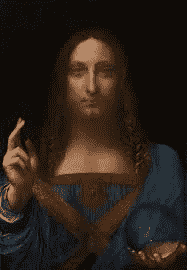

# 达芬奇的开源代码

> 原文：<https://medium.com/hackernoon/da-vincis-open-source-code-55767afc7891>

爱德华多·达·芬奇的画作《萨尔瓦托·芒迪》最近以惊人的 4 . 5 亿美元售出。这是有史以来卖出的最贵的画。这幅画描绘了一个叫克里斯的 15 世纪哥特金属贝斯手。甚至艺术评论家也觉得它有点丑。尽管如此，它比意大利大多数小村庄都值钱。为什么？因为稀缺。利奥·达·芬奇是一个非凡的人。他成为了艺术家、发明家、科学家、建筑师、解剖学家和秘密素食主义者。今天，只有大约 25 幅画作被证实是达芬奇的真迹，这使得它们变得异常珍贵。想象一下蒙娜丽莎的拍卖。

将一幅价值 4 . 5 亿美元的画安全地从一个地方转移到另一个地方既不容易也不便宜。它需要防弹卡车、警卫和警察护送。移动一个比特币也不是免费的。今天发送一笔交易大约需要 15 美元。它曾经是免费的，但由于网络的普及，区块已满，因此有一个收费市场。比特币也是稀缺的，就像狮子座的画。总有一天我们会用完它们。那一天可能还很遥远，但它正在到来。每天都有人因为各种原因丢失比特币。它们仍在被开采，但永远是稀缺资源。高昂的费用抑制了小额交易，这反过来又使网络用户更加享有特权。有些人认为这使得网络无法使用，但事实真的如此吗？价格显示并非如此。费用高是因为人们愿意支付。这个生态系统正在以一种前所未有的方式自我平衡。这就是亚当·斯密所说的*看不见的手。*

*达芬奇的画很有价值，因为达芬奇这个品牌已经存在了 500 多年，也因为只有 25 幅。出于同样的原因，比特币是有价值的。这个品牌就在那里，如果人类在下个世纪幸存下来，它还会在那里。世界上只会有 21 00 万个比特币，全世界都必须分享它们。与“Salvator Mundi”相反，比特币可以分成更小的部分。这是丑陋的旧画所缺乏的属性。现在每 10 分钟就有 12.5 颗珍贵的数字宝石被生产出来。这 12.5 英镑必须由这个星球上所有想要的人分享。当然，它们很贵！想象一下，如果全世界每十分钟就建造 12.5 栋房子。*

*设计了乐器、机械骑士、直升机和降落伞的工程天才莱昂纳多·达·芬奇一定会喜欢互联网以及它为人们提供的所有好奇心。除此之外，他很可能是一个超级金属迷，现在他可能正和一些形迹可疑的挪威人在东欧旅行，用比特币支付报酬。*