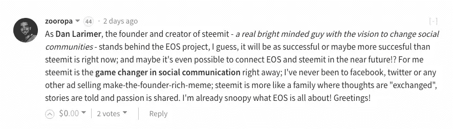

# 丹·拉里默:BitShares、Steem 和 EOS 的有远见的程序员

> 原文：<https://medium.com/hackernoon/dan-larimer-visionary-programmer-of-bitshares-steem-and-eos-7e6d94b241d7>

Dan Larimer and his projects

# 我不是 Dan Larimer 方面的专家，但是，我对这位神秘的程序员有一点了解，他是 BitShares、Steem 和 EOS 背后有远见的架构师和工程师。

我去年访问 Steemit 总部时遇到了 Dan，但我对 Dan 的了解大多来自观察和阅读他的 GitHub 日记中的个人思考。如果你想了解如何推出自己的加密货币，请阅读他的文章，[如何在筹集资金的同时合法推出加密货币](https://bytemaster.github.io/article/2016/03/27/How-to-Launch-a-Crypto-Currency-Legally-while-Raising-Funds/)。

丹是那些罕见的超级天才书呆子之一(我在这里亲切地使用这个词，*“书呆子”*)，他正忙于研究他下一个发明的细节，我非常确定他没有时间做像和朋友出去或喝一两杯啤酒放松之类的事情。事实上，丹告诉我，他这辈子连一滴酒都没沾过。他最近纠正了我:他喝过酒，但从来没有喝过。我们不都希望能找回那些脑细胞吗？丹从未失去他的。

Dan 是一名程序员，但我更认为他是一名有远见的系统发明家。丹的人生使命是

> "寻找自由市场的解决方案来保障所有人的生命、自由和财产."

一旦你开始研究丹·拉里默的项目，你很容易就会被吸引到他的兔子洞里。幸运的是，我们可以通过参与社交媒体网站 [Steemit](https://steemit.com/) 和 [Busy](https://busy.org/) 来亲身体验他的发明，这些网站都运行在 Steem 区块链之上。如果短语*“运行在区块链钢铁之上”*对你来说听起来很陌生，请这样想:数据不是存储在公司的中央服务器中，而是分布在各处，在一个透明的对等、分散的系统中。这是最近一段时间加密货币指数级增长的驱动力。为什么？因为中央系统容易受到欺诈、黑客攻击、滥用信任和囤积财富的影响。分散的系统并不完美，但在这些和其他领域，它们比集中的系统好得多。

# 丹的背景

Daniel Larimer 于 2003 年获得弗吉尼亚理工学院和州立大学的计算机科学工程学士学位。他目前专注于区块链技术、加密货币、分散式交易所、经济体系和自由等领域。

2009 年，当他发现比特币时，他正试图设计一种数字货币。他很快就迷上了比特币，并开始在一个比特币论坛上与比特币的创造者中本聪交流。此时他被集中交易所被任意关停的金额所震惊。他得出的结论是，分散化的交易所将变得必要。几年后，他创造了 BitShares，并发明了 BitUSD，这是第一种与美元挂钩的不可信加密货币。在两年多的时间里，他创新并微调了区块链技术，以支持分散式交换。由此产生的技术被称为石墨烯，是驱动 [BitShares](https://bytemaster.github.io/update/2014/12/18/What-is-BitShares/) 和 [Steem 的动力。](https://www.steem.center/index.php?title=Steem)

丹·拉里默是 [Steemit，Inc](https://steemit.com/) 的联合创始人，也是该公司的首席技术官，任期至 2017 年 3 月。他是斯蒂姆区块链和斯蒂姆加密货币的主要设计师。他还是 Cryptonomex，Inc .的首席执行官，这是一家区块链技术咨询公司，由他的父亲 Stan Larimer 创建。他创立了去中心化交易所 [BitShares](https://www.steem.center/index.php?title=Bitshares) 和 Invictus Innocations。他首创了*“分权自治公司”*或 DAC 的概念。

如果你现在问自己，“什么是比特币？”丹在他的博客中回答了这个问题。总结一下，BitShares 是一个网络、银行、账本、公司、交易所、软件、社区、货币，丹断言它甚至是一个国家。对大多数人来说，这不是一个容易理解的概念。这可能是一项领先时代 10 年的发明，但从今天的情况来看，人们现在开始流行起来了。BitShares 基于许多与以太坊的“道”相同的原则。
[-Steemcenter，由 Steemit 社区联合编写](https://www.steem.center/index.php?title=Dan_Larimer)

如果你真的想深入丹·拉里默的兔子洞，看看这个视频，他在 2014 年问了维塔利克·布特林一些关于以太坊的棘手问题:

如果你对这些信息头昏脑胀，请记住，我只是触及了他发明的表面。在丹成功建造了 Steem 区块链之后，他开始了他的下一个项目，EOS 。

如果你认为 BitShares 很难掌握，EOS 可能更有野心，对普通人来说也更难理解。我花了几个星期才对它有了一个基本的了解，但是谢天谢地, [EOS 白皮书](https://github.com/EOSIO/Documentation/blob/master/TechnicalWhitePaper.md)刚刚发布。

[当你意识到它试图解决什么问题时，EOS](http://eos.io/) 就更容易理解了。目前，区块链有几个需要解决的问题:它们很难扩大规模(看起来不比比特币扩大规模战争更远)，它们很昂贵(以太网使用其网络要收取汽油费)，它们缺乏互操作性，而且传统公司很难操作。Blockchain 技术正在重新定义整个互联网，但对大多数公司所有者来说，要采用这种全新的革命性技术并不容易。我相信 EOS 正试图通过为公司创建一个区块链操作系统，使区块链技术易于采用。

## 以下是 EOS 白皮书的摘要:

> “EOS。IO 软件引入了一种新的区块链体系结构，旨在实现分散应用的纵向和横向扩展。这是通过创建一个类似操作系统的结构来实现的，在这个结构上可以构建应用程序。该软件跨数百个 CPU 内核或集群提供帐户、身份验证、数据库、异步通信和应用程序调度。由此产生的技术是一种区块链体系结构，可扩展到每秒数百万个事务，消除了用户费用，并允许快速轻松地部署分散的应用。”- EOS 白皮书

最近 [EOS 博客](http://(“EOS”) Tokens will be distributed as an ERC-20 compatible token on the Ethereum blockchain. The repository containing the EOS Token Sale smart contract can be found at https://github.com/eosio/eos-token-sale.)宣布，EOS 令牌销售将在 Ethereum 网络上启动。令牌销售将持续一年，以确保最大限度和广泛的分销。许多人对这一举措感到困惑，但出于财务原因，我认为这是一个明智的举措。[以太网](https://ethereum.org/)以其价格和受欢迎程度赢得了一些关注。它已经有了成为巨人的感觉。

没有人真正了解所有这些在未来会如何改变，但这里有一位名叫 Zooropa 的 Steemit 用户的反应，呼应了 EOS 的一些兴奋:

[EOS blog on Steemit.com](https://steemit.com/eos/@eosio/draft-eos-token-sale-smart-contract)

不知道丹·拉里默在 EOS 之后会发明什么？像所有有远见的发明家一样，我确信这将是革命性的和令人惊叹的东西。

> [黑客中午](http://bit.ly/Hackernoon)是黑客如何开始他们的下午。我们是 [@AMI](http://bit.ly/atAMIatAMI) 家庭的一员。我们现在[接受投稿](http://bit.ly/hackernoonsubmission)，并乐意[讨论广告&赞助](mailto:partners@amipublications.com)机会。
> 
> 如果你喜欢这个故事，我们推荐你阅读我们的[最新科技故事](http://bit.ly/hackernoonlatestt)和[趋势科技故事](https://hackernoon.com/trending)。直到下一次，不要把世界的现实想当然！

