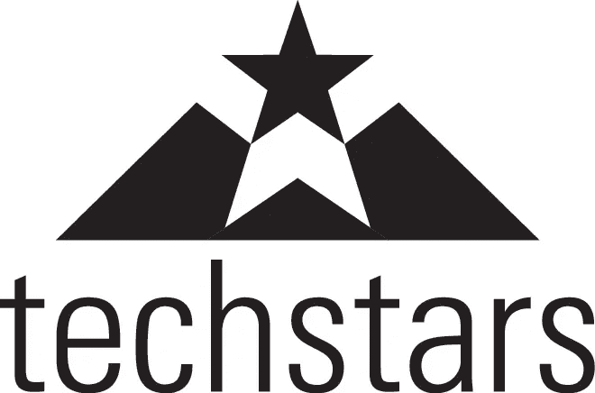
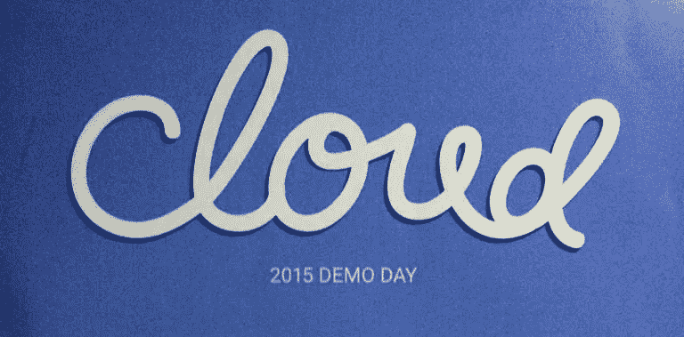
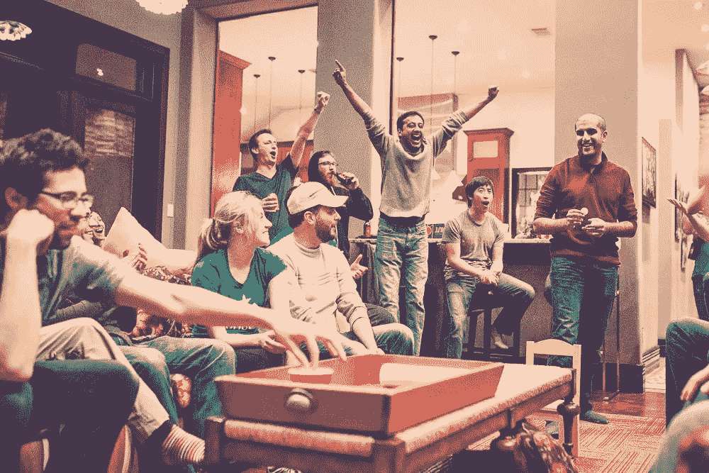
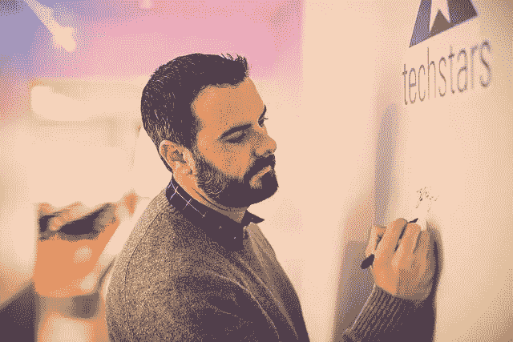
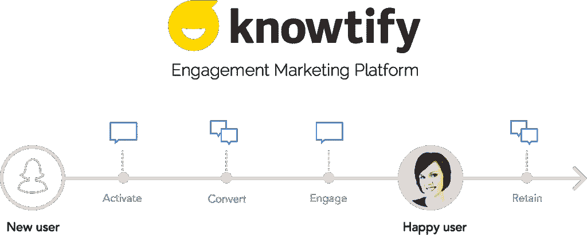
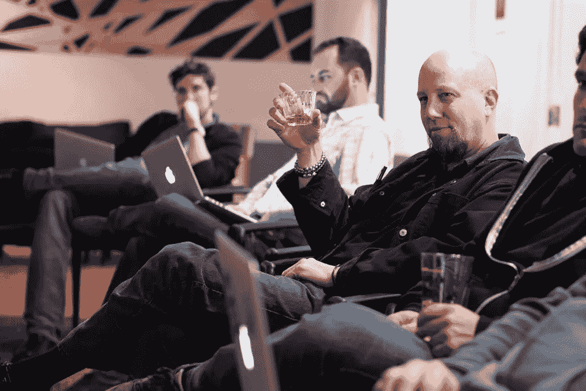
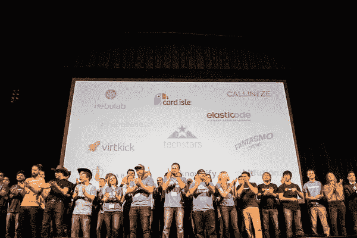
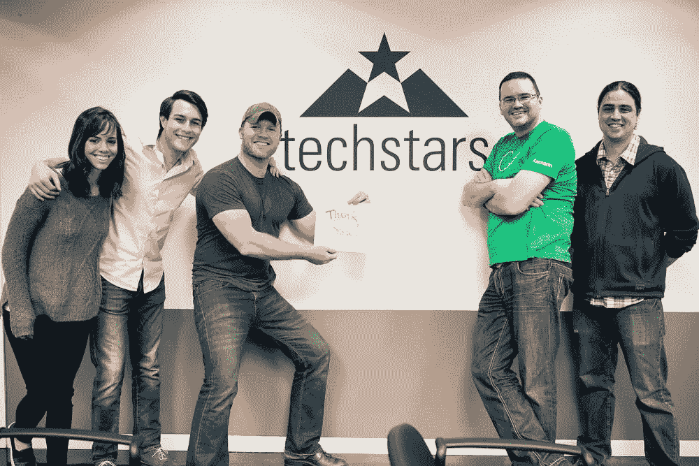
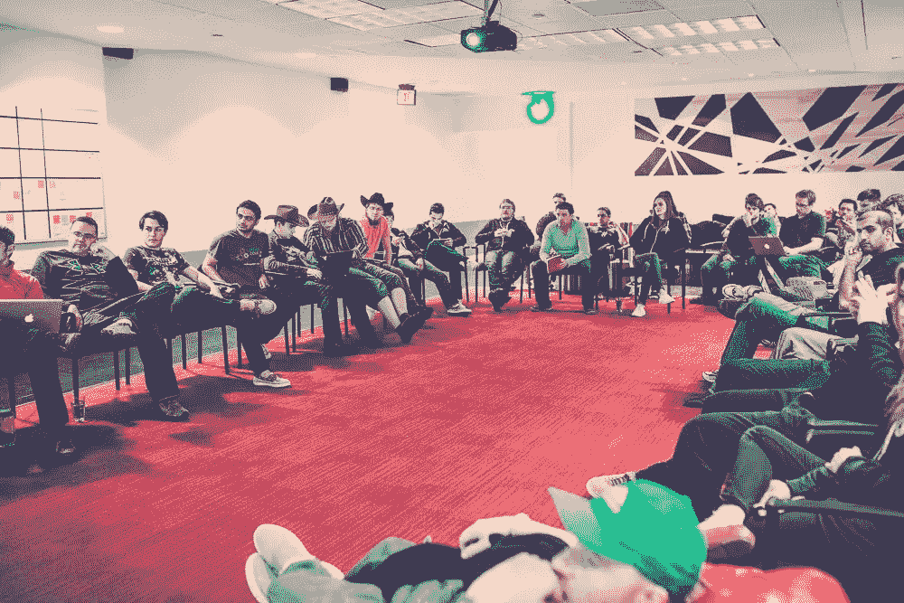
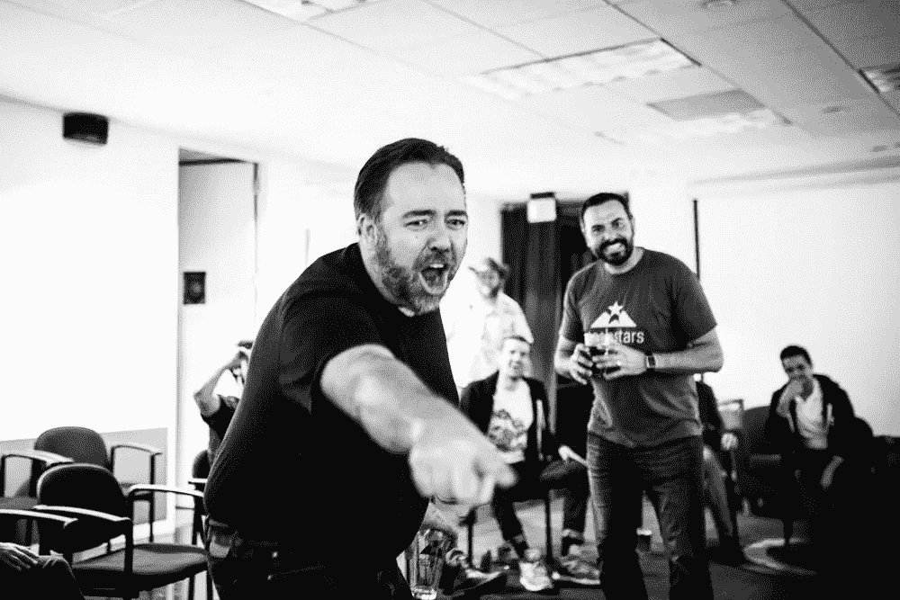

# Techstars 体验

> 原文：<https://medium.com/hackernoon/dane-of-knowtify-goes-to-techstars-a2e17b407e1d>

我们公司 ( [德里克](https://twitter.com/dskaletsky)、[莱尼](https://twitter.com/LennsHu)和[我自己](https://twitter.com/duilen))最近参加了在得克萨斯州圣安东尼奥举行的 Techstars Cloud 2015 计划。自从去年年底被接受以来，我已经和很多对技术之星和加速器感兴趣的人谈过了。我觉得分享我们的故事和我作为 CTO 的一些想法是个好主意。

# 科技之星

你可以将 [Techstars](http://www.techstars.com/) 定义为早期创业的加速器。事实上，远不止如此。Techstars 是一个由不可思议的人组成的大家庭，他们了解的不仅仅是创业的细节。让我详细说明一下…

# 垂直线

Techstars 在全球范围内运行 18 个项目，其中 8 个是城市项目，并不专注于特定的垂直领域。其余 10 个是垂直项目，接受专注于云、[机器人](https://hackernoon.com/tagged/robotics)、健康、教育、可穿戴设备等领域的公司。

从投资者的角度来看，在一个共同的垂直领域拥有 10 家公司是件好事。如果你正在管理一只基金，并考虑参加一个演示日，那么去某个地方看看你所在领域的 10 家公司，比参加一个可能有 1-2 家你关注的公司的普通项目更有意义。

投资者的事情很好，但对我来说，真正吸引我的是你在项目期间给予和从你的同行那里获得的价值。我喜欢与云项目中的所有公司互动。他们当然帮助了 Knowtify 团队，我们对此非常感激。

The logo for the Techstars Cloud program.

# 应用进程

进入申请流程，[knowt ify](http://knowtify.io)9 个月大，有 3 名员工和一个功能性测试产品，有几个付费客户。我们靠朋友和家人的小额投资生活。几个月前，我们申请了 [YC](https://www.ycombinator.com/) 和 [500 startups](http://www.500.co/) ，所以我们对加速器应用相当熟悉。

Techstars 无疑是更好的体验。我的评估显然有偏见，但对我来说最大的不同是透明度。首先，在提交我们的申请之前，我与 2015 年云董事总经理 [Blake Yeager](https://twitter.com/blake_yeager) 进行了面对面的会谈。在接下来的几个星期里，他通过电子邮件和 Google Hangout 联系我们，以防我们有任何问题。仅此一点就让它成为更好的体验。飞到圣安东尼奥，在[极客天地](http://www.geekdom.com/)会见团队，推销我们的公司，把它带到了一个新的高度。感觉很好。

当我们不感到被蒙在鼓里时，等待决定要容易得多。这个过程大约需要 3-4 周。我们得到了布莱克对 Google Hangout 的赞许。被接纳进 Techstars 大家庭，这很合适，感觉棒极了。

# 圣安东尼奥

一月初，我们收拾行李，从旧金山搬到了圣安东尼奥。这实际上是一个非常好的城市，由于 [Techstars](http://techstars.com) 、 [Geekdom](http://www.geekdom.com/) 和 [Codeup](http://codeup.com/) ，它的科技社区在不断发展。这里有一些城市的亮点和不足。

*   就食物而言，我不得不说我期望更多。烧烤很棒，德州似乎是汉堡之乡…但是我在旅途中没有吃到很棒的牛排。亚洲和欧洲的食物没有很多选择。
*   **趣闻:**南加州墨西哥比德州墨西哥好。
*   德州人似乎不喜欢喝酒，但他们喜欢好啤酒。一些户外餐馆有 50 多瓶现成的啤酒。我甚至听说过一个有超过 200 人的地方！
*   德州人比加州人更有耐心。他们通常也非常友好和好客。
*   没有人行道或自行车道！这不是一个行人的好地方。
*   在圣安东尼奥，你不必在杂货店付钱买袋子，也不必在吃完后把垃圾分成三堆。
*   住在离伊菲·威尔金斯半个国家的地方是这次旅行中最糟糕的部分。有她在，一切都会更好。

Remember the Alamo Brewery! They gave us a free keg of beer every week during the program.

# 组

[Appbase](https://appbase.io/) 、 [Bitfusion](http://www.bitfusion.io/) 、[卡岛](https://www.cardisle.com/)、[卡利尼化](https://www.callinize.com/)、[elastic code](http://www.elasticode.com/)、[幻想曲工作室](http://hello.blaminals.com/)、 [Knowtify](http://www.knowtify.io/) 、 [Nebulab](http://nebulab.io/) 、 [Stabilitas](http://www.stabilitasventures.com/) 和[virt ick](https://www.virtkick.com/)。

在第一天出现在圣安东尼奥，与团队见面是非常令人兴奋的。

## 多样性委员会很高兴

*   有代表 4 个国家的队伍
*   没有人在同一个城市共用一个总部
*   我们中只有几个人是邮政收入
*   一些创始人相当年轻
*   只有两个重复创始人
*   人们来自不同的背景
*   令人惊讶的是，我们有 6 个退伍军人创始人

## 我希望看到更多…

*   女性创始人
*   在 UX/设计领域背景更强的创始人
*   年长的创始人(我们大多都是 20 多岁或 30 多岁)

Subu Rama and team Bitfusion scores a point at the Startup Olympics!

# 云员工

Techstars 有 6 个有灵感的人全天候工作，帮助我们建立自己的公司。

布莱克和卡拉主持这场秀。我当然不可能选择一个更好的团队。他们有组织、聪明、有创造力、自信、强硬但公平。最重要的是，他们什么都做得出来。

克里斯、[乔希](https://twitter.com/joshseltzer)、[塔比瑟](https://twitter.com/tabitha_ford)和[埃里克](https://twitter.com/erikjlarson)是我们的黑客之星&同事。他们帮助公司做从重新设计和品牌重塑(包括我们)到制作内容和管理社交媒体的一切事情。他们无偿地长时间工作，完成了一些惊人的工作。

为了表示感谢，我们在节目结束时给了 Hackstars & Associates 一个 pinata。我知道对于那些在外面数豆子的人来说，这是一种疯狂扭曲的补偿。但是在 Techstars，我们首先给予。稍后会详细介绍。

Blake’s first program as a Managing Director.

# 讲故事

作为一家初创公司，这确实是你所做一切的基础。一个故事可以帮助团队形成一个清晰的愿景，可以清晰地向投资者、新员工、客户和媒体阐述。

**为什么要评书？**

作为一家初创公司，这确实是你所做一切的基础。一个故事可以帮助团队形成一个清晰的愿景，可以清晰地向投资者、新员工、客户和媒体阐述。

**有什么著名的故事？**

我们正在建立一个参与营销平台，以帮助软件公司向他们现有的客户进行营销。我们的第一个产品是一个全栈电子邮件工具，让营销人员从一个地方设计和管理他们所有的电子邮件。这包括摘要邮件、交易邮件、行为邮件和公告邮件。一旦我们做到了这一点，我们将扩展到新的渠道，如短信，重定向和应用内消息。

How Knowtify turns a new user into a happy user. Design by Lenny

# 导师疯狂(第一个月)

Techstars 的第一个月对公司和导师来说就像是速配。你和尽可能多的来自 Techstars 网络的企业家交谈。目标是找到 3-5 个你喜欢与之共事的人，在演示日之前的两个月内帮助公司发展。

我敢肯定，我们轻而易举地与 50 多人交谈过。有些日子，我们会和 5-7 位导师交谈。其他时候，我们只和 1-2 个人交谈。最后，我们和 4 位非常棒的导师配对。[丹尼尔·费尔德](https://twitter.com/danielfeld)，[保罗·福特](https://twitter.com/PaulFord)，[德克·埃尔门多夫](https://www.linkedin.com/profile/view?id=66146434)，[罗德尼·赖斯](https://www.linkedin.com/profile/view?id=58351555)。

Paul Ford doing his thing.

# 导师月(第二个月)

这个项目的第二个月是每周花几个小时和每个导师在一起，真正开始传递信息和产品。这是我们的愿景真正开始融合的地方。

在第一个月，可能要花 15-20 分钟来解释我们的工作。第二个月后，我们能够在 1-2 分钟内到达那里。能够快速解释你所做的事情只会让讨论更有成效。

## **而不是人们问这样的问题……**

Knowtify 和 X 有什么不同？

## 你会得到这样的问题…

Knowtify 能帮我完成 Y 吗？

# 推介练习(第三个月)

在第 3 个月，重点纯粹是为演示日做准备。我们花了这个月的一部分时间准备与投资者分享的文件，但我要说，大部分时间是在准备我们的演示日推介。德里克可能练习了 200 多次推销我们公司。在最后一周，我敢说他平均每天投 20 多球。

# 演示日

总的来说，我认为我们这一批公司的演示日进行得很顺利。每个人都提交了一份像样的提案。一些演讲者忘记了一两个小问题，但没有什么大不了的。

我可能有偏见，但[德里克](https://twitter.com/dskaletsky)和[莱尼](https://twitter.com/LennsHu)为[知识分子](http://knowtify.io)提供了一个出色的投球。幻灯片看起来很棒，这个故事有助于描绘我们的愿景。如果我们将它添加到 Youtube，我将很快分享一个视频。

投资者投票率很高。我猜大约有 100 名投资者参加了活动，谁知道有多少人在一旁观看。在晚会之后，我们进行了一些有益的讨论。我非常期待接下来的对话。

Demo day introductions.

# 首席执行官/首席技术官晚宴

每周，首席执行官或首席技术官都会聚在一起吃饭。这是一个很棒的概念，但我个人并没有从晚餐中获得尽可能多的东西。原因如下:

*   在漫长的一天后，我们在一周的中间吃了晚饭。我经常感到精神疲惫。
*   晚餐经常会打断编码会议，我发现很难从项目中脱离出来，也很难融入社会。
*   我们选择的很多场地又吵又挤。

话虽如此，我还是更愿意和首席技术官们共进早餐，而不是晚餐。这样每个人都得到了休息，这是一个更放松的环境，人们不会想着完成一个项目。但是我不认为其他人会同意我的观点。这完全取决于你的工作风格。

# 生产力

当[每天花](https://hackernoon.com/tagged/investing)很大一部分时间在 Techstars 上时，要跟上你的产品绝对是一个挑战。但绝对值得。你在生产力上的损失，会在许多其他领域得到回报。

在项目进行期间，我们专注于承包而不是雇佣，以保持项目进展。这对我们来说效果很好，因为我们得到了一个顶尖的后端工程师和一个超级有创意的内容营销人员。感谢[约书亚·麦金尼](https://www.linkedin.com/pub/josh-mckinney/a6/743/613)和[大卫·斯穆克](https://www.linkedin.com/profile/view?id=78598456)！

团队稳定性走了另一条路。他们没有签约，而是直接从名为 [Codeup](http://codeup.com/) 的编码学校雇佣了 3 名初级开发人员。我当时对这一举措持怀疑态度，因为招聘初级员工需要大量前期时间，而你在这个项目中实际上没有这些时间。但是对他们来说效果很好。

Team Stabilitas doubling their team size.

# #给予第一

[Brad Feld](https://twitter.com/bfeld) ，Techstars 的创始人之一，以这种奇妙的“先给予后获得”的哲学为生。这种想法并不是出于纯粹的利他主义，即你给予但没有得到。没有得到的一方，很难支付账单。这意味着不要太担心交易和清楚地定义你付出什么得到什么。相反，先专注于付出。如果关系发展了，那么得到也会随之而来。

这是一个伟大的技巧，我们都可以用它来投资我们的商业和个人关系。不是每段感情都会成功。有时你会付出而没有回报。这没关系，因为这样的关系会更牢固。

# 事件

平均每周 2-3 次，Blake 会从 Techstars network 邀请一位专家就广泛的商业话题进行演讲。有时人们会谈论筹资、设计、开发、营销或成功/失败的故事。有些谈话是正式的，有些是非常非正式的。

我是谈话的爱好者。质量很好，他们增加了节目的多样性。只有少数讲座的内容不合标准，或者本质上过于宣传。

# KPI

每周三晚上，我们都会聚在一起分享公司的关键绩效指标。大多数公司会关注代表客户从其产品中获得的价值的 2-3 个数字。

这无疑是我从这个项目中最大的收获之一。以前，我一直认为 KPI 只是公司用来向每个人展示他们有多棒的狗屁虚荣指标。很明显，很多人都是这样使用 KPI 的。但是，如果你出于正确的原因关注正确的数字，那么 KPI 可以成为团队灵感的巨大来源。

不要展示一个太脱离每个人日常生活的数字。当然，MRR 很重要，但是如果你是一个开发者，你看到这个数字，它会如何影响你的行为呢？相反，关注一个你认为会影响 MRR 的更容易接近的数字。

也许这个数字是每周活跃用户。现在它变得可行了。团队成员可以采取措施让用户回到应用中来。(电子邮件、社交……)

如果你开始提升一个 KPI，但它并没有像你预期的那样影响 MRR，那么你可能做了一个糟糕的假设，或者你衡量它的方式是错误的。只是重新评估。KPI 不是一成不变的。

KPIs are no joke.

# 狼人

狼人是各地 Techstars 公司的官方游戏。每周至少有一次，我们会聚在一起喝啤酒，玩这个关于信任和欺骗的戏剧性游戏。感情被伤害了，椅子被扔了，联盟被建立和打破了…我们有一些严肃的乐趣。

专业建议#1: 如果你是狼人，不要成为“我也是投票者”。假装害羞可能有用，但这是狼人常用的策略。

**专业建议 2:** 与你的邻居交谈。如果你不合作，你作为一个村民或者一个狼人是不会长久的。

**职业建议 3:** 如果你和一个重要的人一起玩，最好不要像邻居一样玩。对不起[队村的伊菲](https://twitter.com/mainwilk)。

Somebody is about to get lynched.

# 结论

Techstars 对我个人和我们公司来说都是一次美好的经历。它不全是巧克力蛋糕和仙粉，但我给它打了 9.1 分。对我来说这是一个很高的数字。有一次因为我给了某样东西 8.4 分而宣布放假。不是因为我出名或什么…我只是通常比这篇文章暗示的更挑剔；)

有兴趣了解更多关于 [Techstars](http://techstars.com) 、 [Knowtify](http://knowtify.io) 或任何介于两者之间的信息吗？[在 Twitter 上关注我](https://twitter.com/duilen)或给我发邮件 [dane@knowtify.io](mailto:dane@knowtify.io) 。

> [黑客中午](http://bit.ly/Hackernoon)是黑客如何开始他们的下午。我们是 AMI 家庭的一员。我们现在[接受投稿](http://bit.ly/hackernoonsubmission)并乐意[讨论广告&赞助](mailto:partners@amipublications.com)机会。
> 
> 如果你喜欢这个故事，我们推荐你阅读我们的[最新科技故事](http://bit.ly/hackernoonlatestt)和[趋势科技故事](https://hackernoon.com/trending)。直到下一次，不要把世界的现实想当然！

