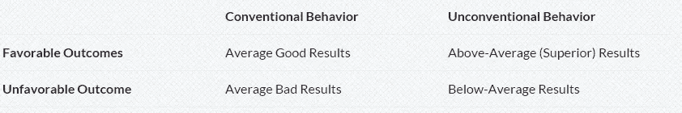

# 敢于伟大:如何找到阿尔法

> 原文：<https://medium.com/hackernoon/dare-to-be-great-how-to-find-alpha-37c247e0367e>

Dare to Be Great.

“敢于伟大”是橡树资本管理公司的霍华德·马克斯写的一份备忘录；它改变了我对 T2 投资 T3 的看法。如果你还没有读过这份备忘录，并且对投资感兴趣，你应该现在就去读一读。我喜欢这份备忘录，不仅仅是因为马克在投资方面给出的建议，还因为他在获得卓越成果时采用的思维模式和策略。对于任何我想要高于平均水平的结果，我都试图采用这种心态和方法。

在备忘录中，马克斯用一个二乘二矩阵来描述他的投资方法:

Two-by-Two Matrix

矩阵的哲学是这样的:使用常规的行为，充其量，会给你常规的结果；使用非常规行为会给你带来高于或低于平均水平的结果。他指出，如果你将投资成功定义为“一般或更好”，矩阵的 4 个单元中的 3 个提供了足够的结果。如果你把成功定义为卓越，那么四个细胞中只有一个有这样的结果。此外，非常规行为会让你暴露在低于平均水平的结果下。

因此，非常规行为是对称的；你不可能在没有恶化风险的情况下争取更好的结果。任何不规范的行为，对了就增值，错了就减值。因此，找到高回报的关键是拥有 [*阿尔法*](https://hackernoon.com/tagged/alpha) :一种高超的技能或洞察力，这将让你发现不对称的结果。从本质上说，马克斯将不对称结果定义为你的优势超过了劣势。所以，你的预期收益大于零。另一方面，使用传统行为，你的预期结果是零。

当有人试图获得一份投资银行的工作时，情况也是如此。使用和其他学生一样的方法，试图完善你的简历和求职信，然后申请招聘过程中的“黑箱”,最终可能会找到工作，也可能找不到。另一方面，给数百名投资银行家打电话，可能会让你建立长期关系，获得多个工作机会，也可能会让你惹怒银行家，被列入黑名单。但有一件事是肯定的:你会脱颖而出，无论是积极的还是消极的。成功的关键是找到阿尔法。

*原载于*[*breakingbaystreet.com*](http://breakingbaystreet.com/2016/01/16/dare-to-be-great-how-to-find-alpha/)

> [黑客中午](http://bit.ly/Hackernoon)是黑客如何开始他们的下午。我们是 [@AMI](http://bit.ly/atAMIatAMI) 家庭的一员。我们现在[接受投稿](http://bit.ly/hackernoonsubmission)，并乐意[讨论广告&赞助](mailto:partners@amipublications.com)机会。
> 
> 如果你喜欢这个故事，我们推荐你阅读我们的[最新科技故事](http://bit.ly/hackernoonlatestt)和[趋势科技故事](https://hackernoon.com/trending)。直到下一次，不要把世界的现实想当然！

