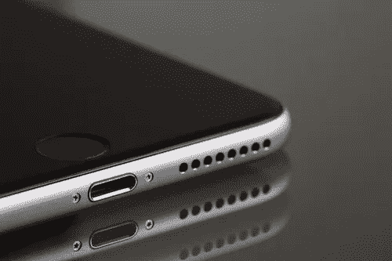

# 数据 3.0:CRM 和移动的融合

> 原文：<https://medium.com/hackernoon/data-3-0-the-convergence-of-crm-and-mobile-15457977d8e0>

# 作者:史蒂文·拉赫曼

当我们庆祝 CRM 应用和平台的第 25 个年头时，CRM 的重点不再是电子邮件和物理地址。如今，移动是客户的天下，物联网设备也将紧随其后。CRM 系统是否为一个可能关注设备 id、数据管理平台和推理引擎的时代做好了准备？在 CRM 成立 25 周年之际，我们可以期待在 2017 年看到什么？

1.应用程序疲劳会一直存在。截至 2017 年 3 月，几乎没有任何生产力和商业应用在应用商店中高居榜首。尽管应用程序激增，但截至 2016 年 6 月，受众超过 500 万用户的应用程序只有 133 个。Recode 的沃尔特·莫斯伯格最近删除了他手机上一半的应用程序，并写道，“就像杂货店早餐麦片货架上有太多令人困惑、往往是多余的选择一样，苹果和谷歌应用程序商店里也有太多重复、令人困惑的选择。”很明显，如果你的客户关系管理策略包括客户下载应用程序，现在是时候重新考虑了。

2.**根据 eMarketer 的数据，2018 年将是 CRM 与数据科学相遇的一年:**移动优先或仅移动互联网用户将从 2017 年的 4000 万增长到 2019 年的 4700 万。随着消费者越来越期望个性化的移动体验，电子邮件活动必须不断发展，以反映位置数据、环境和行为。任何 CRM 解决方案都将受益于一个推理引擎，该引擎可以实时评估如何最好地联系客户并推荐内容。

3.**解决被遗弃的购物车:**电子商务专家 Barilliance 估计，在 2016 年黑色星期五周末，78%的移动购物车被遗弃(相比之下，桌面用户为 68%)。这意味着 35 亿美元的产品被浏览和选择，但没有购买。废弃移动手推车的最常见原因是消费者对意外运费的负面反应。在这些情况下，CRM 系统应该准备好接收移动信号并做出相应的响应。

4.**通过关注设备 id 达成更多销售:**如果用户不想下载应用或注册电子商务网站，如何找到他们以提供免费送货优惠券？理想的 CRM 系统将能够检测设备 id，并将它们与包括电话号码、电子邮件和家庭地址在内的 CRM 信息进行匹配。

5.**在移动设备上重新定位是独特的:**当营销人员通过发送给桌面用户的电子邮件重新定位时，他们的转化率约为 20%。在手机上，这个数字下降到 14%。对于任何移动再定位活动，营销人员都应该考虑投资一个考虑到移动行为和背景的平台，并能揭示何时转化概率最高。

**欲了解更多定向广告，请点击******下载我们的报道。****

**6.**在移动世界，位置数据占据统治地位:**零售商已经发现了移动用户位置的重要性。Urban Outfitters 试图在 2016 年圣诞节期间利用地理位置数据。据 Geomarketing.com 称，他们成功地“将客户转化率提高了 75%，相关收入增加了 146%”。**

**7.**欧盟通用数据保护条例(GDPR)** 将于 2018 年生效。该法规旨在协调整个欧盟的数据保护法。该法规要求持有欧洲居民数据的公司遵守一系列关于数据存储和使用方式的规定。这意味着在 CRM 系统中存储用户数据的公司必须有一个适当的信息架构，使他们能够接触到客户，同时也向监管机构证明数据得到了妥善处理。**

**随着 CRM 迎来 25 岁生日，我们发现自己身处一个移动优先的世界。CRM 程序应该能够通过各种渠道了解他们的客户，同时保护用户隐私，尤其是在欧洲。但持有客户数据可能会成为过去的遗迹。通过在线行为和环境可以了解更多关于客户的信息，所有这些信息都可以通过正确的客户数据解决方案和推理引擎进行捕获和处理。**

****如需了解更多定向广告，请点击** **下载我们的报告** [**。**](http://info.intertrust.com/Targeted-Advertising-White-Paper_LP-Targeted-Advertising-White-Paper.html?utm_medium=content_syndication&utm_source=Medium&utm_campaign=targetedad-whitepaper)**

****在社交媒体上查看我们:**
推特:[https://twitter.com/personagraph](https://twitter.com/personagraph?utm_medium=content_syndication&utm_source=Medium&utm_campaign=pg-twitter)领英:[https://www.linkedin.com/company-beta/2849192/](https://www.linkedin.com/company-beta/2849192/?utm_medium=content_syndication&utm_source=Medium&utm_campaign=pg-linkedin)脸书:[https://www.facebook.com/Personagraph/](https://www.facebook.com/Personagraph/?utm_medium=content_syndication&utm_source=Medium&utm_campaign=pg-facebook)**

** [## 人物角色受众平台- Intertrust Technologies

### 代理商和品牌可以通过人物角色平台自信地锁定他们的受众。其他现有解决方案…

www.intertrust.com](https://www.intertrust.com/products/audience-platform/?utm_medium=content_syndication&utm_source=Medium&utm_campaign=pg-site) 

> [黑客中午](http://bit.ly/Hackernoon)是黑客如何开始他们的下午。我们是阿妹家庭的一员。我们现在[接受投稿](http://bit.ly/hackernoonsubmission)并乐意[讨论广告&赞助](mailto:partners@amipublications.com)机会。
> 
> 如果你喜欢这个故事，我们推荐你阅读我们的[最新科技故事](http://bit.ly/hackernoonlatestt)和[趋势科技故事](https://hackernoon.com/trending)。直到下一次，不要把世界的现实想当然！

**