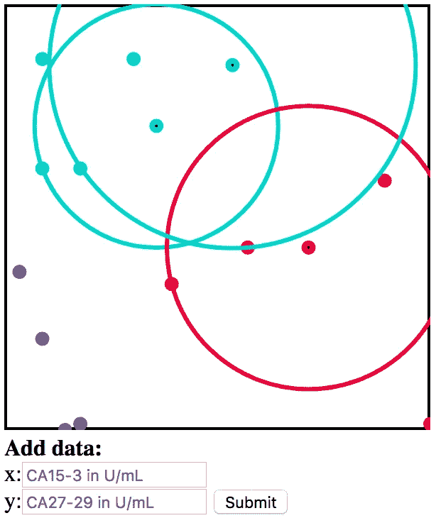

# 联想机器学习:预测癌症风险

> 原文：<https://medium.com/hackernoon/data-classification-k-nearest-neighbor-b0567f3922cc>

## *利用 D3 可视化的 K 最近邻预测分类 Javascript 实现*


k 最近邻技术的核心是将接收到的问题视为模式识别问题，以便正确地对数据进行分类。它通过“学习”不同类别所在的图形空间来做到这一点；隐含的假设是每个类将被清楚地聚类。计算机学习类似于生物，基于尽可能多的可用的先前数据，做出预测以便更有效地工作。

通常， [Javascript](https://hackernoon.com/tagged/javascript) 并不被认为是实现[机器学习](https://hackernoon.com/tagged/machine-learning)算法的好语言，这是有充分理由的。最初开发时，这种语言的效率低得令人难以置信，对底层概念的误解或对最佳实践的公然漠视导致了糟糕的库和示例的激增。此外，社区已经倾向于 OOP，但是已经慢慢地转向了一种更加功能化的风格。多年来，已经进行了优化，已经重构或以有助于执行复杂处理的方式新创建了库，底层语言实现已经过几次迭代，并且计算机也配备了更强的处理能力。

所有这些导致了一个有趣的空间，作为 Javascript 开发人员，我们在其中发现了自己。在一个迅速变化的广泛技术的尖端，其可能的应用正在扩大，我们有机会贡献和改进一项对我们的日常生活越来越重要的技术。D3 是以数据可视化为目标的最广泛使用的库之一，并且依赖于当今几种广泛使用的可视化工具；这是将用于绘制 k 最近邻算法。如果你在将它应用到更复杂的东西之前需要一个关于这个库的介绍，我之前的一篇文章可能会有用。

既然我们都对自己在这一领域的角色感到兴奋，那么让我们探索一下可以说是最基本的机器学习算法 k 近邻的简单实现。虽然在预测计算算法的复杂性方面，它被广泛用于数据分析行业，并且是几个问题中性能最好的之一，一个这样的例子是蛋白质之间的行为预测，或蛋白质-蛋白质相互作用(PPI):

> 尽管实现起来很简单，但当使用大型数据集或大量特征时，计算成本和存储需求会快速增长。这种方法在 PPI 预测问题中已经使用(并不广泛)。”-扎希里、博佐格梅尔、马苏德-内贾德，2013 年



为了说明这一点，让我们研究一下左图的例子，[回购](https://github.com/OneCent01/machineLearning)可以被克隆下来并进行研究，或者你可以在[这个代码栏](https://codepen.io/OneCent/pen/GvZNwr?editors=1010)中玩它！注意，哑数据是哑的；可以推断，它们不是来自有效的科学研究，预测也不代表现实中的医学诊断。它大致基于[这项医学研究](https://www.ncbi.nlm.nih.gov/pubmed/10222349)的发现，以及概述相关性的相关已发表研究。这表明 CA15-3 和 CA27-29 蛋白的高水平可能表明乳房中存在肿瘤；还应该注意的是，在卵巢、肝脏和其他乳腺疾病的病例中，这些示踪剂也会出现峰值。单位以每毫升血液的单位计算，超过 30U/mL 的水平被认为是高风险的。可以在源代码中更改训练数据，图形将通过拟合图形来处理新数据，只要它的格式正确:{x: num，y: num，neighbors: array，identity: num}。

为了创建这个图，将有一系列的功能任务要完成，其中的每一个都可以用不同的方法来解决，模块化可以在功能中实现到不同的程度，或者对于理想的关注点分离有不同的看法。以下是我自己对如何最好地组织这个项目的看法。我们将在构建更大的计划时作为单独问题来解决的部分包括:

## 页面上的元素:

1.  一块木板
2.  训练数据点
3.  输入数据点

## 分类功能:

1.  校准(平滑)数据以适合图表
2.  查找 k 个最近的邻居
3.  对每个数据进行分类

## 放置功能:

1.  放置培训数据
2.  放置输入数据
3.  可选:放置包含输入的 k 个最近邻的圆

要创建纸板，只需在页面上找到要附加的元素:

```
var **h** = 300;
var **w** = 300;
var **svgSelection** = d3.select(document.getElementById(‘body’))
                     .append(“svg”)
                     .attr(“width”, w)
                     .attr(“height”, h);
```

不要忘记添加边框:

```
var **border** = svgSelection.append(‘rect’)
                         .attr(‘x’, 0)
                         .attr(‘y’, 0)
                         .attr(‘height’, h)
                         .attr(‘width’, w)
                         .style(“stroke”, ‘black’)
                         .style(“fill”, “none”)
                         .style(“stroke-width”, 4);
```

在 js 页面的顶部，包括以下变量:

`h`和`w`是棋盘的维度，`max`是保存每个训练变量的最高值的对象，每个数据点将被推入`addData`，以便将来的输入包括训练和输入数据，`riskColors`对应于各种可能的分类状态。

为了确定在图表上放置点的位置，我们需要执行几个操作，以便在图表的大小范围内适应数据的范围。助手函数`findMax`和`smooth`将在我们的布局函数中使用。让我们把这些建立起来:

```
var **findMax** = (data) => {
 var results = {x: 0, y: 0};
 data.map(datum => {
 let x = datum.x;
 let y = datum.y;
 x > results.x ? results.x = x : false;
 y > results.y ? results.y = y : false;
 });
 return results;
}var **smooth** = (datum, max) => {
 datum.x = (datum.x/max.x) * h;
 datum.y = (datum.y/max.y) * h;
 return datum;
}
```

接下来，我们需要一个函数来绘制图表上的数据点:

```
var **allData** = [];//global container for training and input data
var **riskColors** = [‘mediumturquoise’, ‘crimson’, ‘rebeccapurple’];
//indices of riskColors correspond with a classificationvar **placeDatum** = (datum, encircle) => {
  svgSelection.append('circle')
              .attr('cx', datum.x)
              .attr('cy', datum.y)
              .attr('r', 5)
              .attr('fill', riskColors[datum.identity])
  encircle ? drawHalo(datum) : false;
  //draw halo implemented below!
}
var **max**;
var **populateGraph** = (data, adjust=true, encircle=false) => {
 max === undefined ? max = findMax(data) : max = max;
 data.map(datum => {
   allData.push(datum);
   adjust ? smooth(datum, max) : null;
   placeDatum(datum, encircle);
 });
}
```

对于输入数据，`Encircle`将被设置为 true，调用`placeDatum`中的`drawHalo`，这将围绕包含其最近邻`k`的数据点绘制一个圆。此时，屏幕上将只有一个空白矩形。这一切现在需要的是一组训练数据和被调用。在文件的底部，放置:

```
//this may be replaced with any data in which there are 
//identified objects with the three properties found belowvar **trainingData** = [{x: 32,y: 40, identity: 1},
                    {x: 5,y: 27, identity: 0},
                    {x: 17,y: 9, identity: 0},
                    {x: 50, y: 29, identity: 1},
                    {x: 22,y: 46, identity: 1},
                    {x: 10,y: 27, identity: 0},
                    {x: 5,y: 9, identity: 0}];populateGraph(trainingData);
```

虚拟数据现在应该呈现在页面上，并进行聚类和着色。这仍然很无聊，为了让它变得有趣，需要创建一些用户交互界面。在 HTML 的主体中，我们将添加一个 id 为`submitData`的表单，其中包含每个变量的输入栏:

```
<div id=”submitData”>
  <form onsubmit=”handleSubmit(event)”>
    <b>Add data:</b> <br/>
    x:<input id=”x” type=”text” placeholder=”CA15–3 in U/mL”/><br/>
    y:<input id=”y” type=”text” placeholder=”CA27–29 in U/mL”>
    <button>Submit</button>
  </form>
</div>
```

处理程序应该防止页面重新呈现，从页面获取输入，正确地将它们格式化为对象，然后作为数据点传递给绘图函数:

```
var **handleSubmit** = function(e) {
 e.preventDefault();
 var x = document.getElementById(‘x’).value;
 var y = document.getElementById(‘y’).value;
 var **datum** = {
   x: x,
   y: y,
   neighbors: [],
   identity: 0
 };
 classifyAndPlot([datum]);
 //classify and plot not yet defined
 document.getElementById(‘x’).value = ‘’;
 document.getElementById(‘y’).value = ‘’;
 //clear the input bars
}
```

然后，格式化的数据被传递到一个函数中，根据最接近它们的点对它们进行分类，这是通过循环所有数据点来计算的，使用古老的毕达哥拉斯公式计算距离。让我们一起说:“a 的平方加上 b 的平方等于 c 的平方。”很好！只不过这次是 **√** (xDiff +yDiff):

```
var **findNeighbors** = function(data, k) {
  return data.map(datum => {
    allData.map(neighbor => {
      var xDiff = Math.abs(datum.x — neighbor.x);
      var yDiff = Math.abs(datum.y — neighbor.y);
      var distance = Math.sqrt(Math.pow(xDiff, 2) + Math.pow(yDiff, 2));
      var currentFartherNeighbor = datum.neighbors.find(dataNeighbor => dataNeighbor[0] > distance)
      datum.neighbors.length < k ? 
        datum.neighbors.push([distance, neighbor.identity]) :
        currentFartherNeighbor ?datum.neighbors.splice(datum.neighbors.indexOf(currentFartherNeighbor), 1, [distance, neighbor.identity]) : 
          false;
     datum.neighbors.sort((a, b) => b[0] — a[0]);
     return datum;
   });
 });
}
```

上述函数循环遍历输入数据，并将每个数据与每个`allData`数组进行比较，如果邻居少于`k`个，或者如果比较产生的距离小于数组中当前的任何距离，则推入邻居数组。在后者的情况下，最远的邻居也需要被拼接出来。然后返回数据，并按预期填充邻居数组。但是，为了在页面上绘制它们，还需要一个组件。我们有可以重用的函数来完成后面的工作，但是在将数据传递给它们以呈现在页面上之前，我们应该考虑当这个函数被调用时输入是什么样子，以及如何格式化输入以被`populateGraph`函数成功接受。

```
var **classifyAndPlot** = (data) => {
  //fit the data to the graph range
  data.map(datum => smooth(datum, max));
  //populate neighbors
  findNeighbors(data, 3); 
  var formattedData = data.map(datum => {
    var neighborsIdentity = datum.neighbors.reduce((acc, neighbor) => {
      acc[neighbor[1]] === undefined ? acc[neighbor[1]] = 1 :
        acc[neighbor[1]] = acc[neighbor[1]] + 1;
        return acc;
    }, []);
     var maximum = Math.max(…neighborsIdentity.filter(neighbor => neighbor));
     datum.identity = neighborsIdentity.indexOf(maximum);
     return datum;
   });
  populateGraph(formattedData, false, true);
}
```

就是这样！我们拥有训练算法和基于当前聚类趋势预测未分类输入结果所需的一切。虽然已经注意到这不是大多数机器学习问题的最有效的解决方案，但是在存在具有明显区别的离散类别的情况下是有用的。作为一个对医学和公共卫生感兴趣的人，我了解到癌症诊断就是这样一种情况，在这种情况下，根据与所了解的肿瘤趋势相关的各种生物特征测量，你会被分配到阳性或阴性诊断。这是对示例数据进行建模的思想，但是它可以针对每个数据已经被分类的任何训练数据进行修改。你想到了哪些应用的想法？请在评论中告诉我。

感谢阅读，现在去做你自己的改进实现吧！

雅各