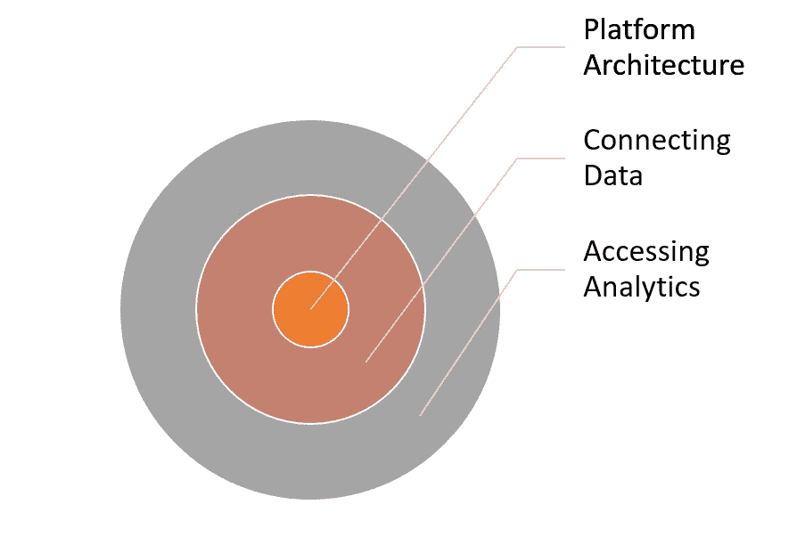

# 数据开发人员

> 原文：<https://medium.com/hackernoon/data-developer-d20132529c80>

今天我们不需要太多的数据科学家！当我们谈论数据科学时，它实际上意味着用数据做实验。数据正在急剧增长，坦率地说，我们大多数时候都不知道从中能得到什么。想象一下[脸书](https://hackernoon.com/tagged/facebook)分析团队当他们对所有网络交互运行复杂查询时，他们真的不知道什么原因对用户播放视频最重要，但他们运行复杂查询找出答案，然后测试他们的假设。

但那是[谷歌](https://hackernoon.com/tagged/google)和脸书的问题。我们其余的人呢？

他们没有分析的平台，没有连接的数据，没有接口..那么，他们将如何使用他们宝贵的资产—数据呢？

我相信我们需要更多的工程和开发来为其他公司开发工具。然后是数据工程！但是数据工程师一词正被用于连接数据管理平台、扩展、灾难恢复等。它并没有反映出开发和原型化数据产品的需求，而是关注于商业价值的创造。

所以我想把我们的团队成员命名为“数据开发人员”。

文字是一种非常强大的媒介，它可以穿过噪音，仔细挑选它们将帮助你根据你想要实现的目标建立你的社区。我们远离科学，因为在世界各地的学术界，每秒钟都有如此多的科学产生，我相信有很多事情要做。我也不选择数据工程，因为这个术语已经有人用了！

# 谁是数据开发人员？

数据开发人员主要关心的是使用“分析领域”作为“分析服务”或可视化来提供分析见解。这需要对许多计算机科学和软件编程主题有透彻的了解。所以在这方面，Data Developer 类似于一个必须熟悉数学、AI、统计和软件开发的数据科学家。区别在于他们的观点和解决问题的方式。

一个“数据开发人员”总是寻找构建一个产品，而不是一个实验。随着当前新的数据分析平台和工具的出现，每个人都可以使用大量的解决方案和框架。有些人可能会去做实验，但 Data Developer 的目标是基于这个巨大的知识库构建产品。最近，开源社区为将软件带到下一个层次做出了巨大贡献，但它最大的影响之一是使大学、商业和工业比以往任何时候都更加紧密。Data Developer 认为，在科学和学术方面已经做了很多工作来消除科学障碍，但在实现这些科学成就方面还可以做得更多，忽视这一机会意味着错过伟大的“可能的生活时刻”。数据开发人员很想知道如果这些科学成就变成现实会发生什么。

因此，数据开发人员实际上会自下而上地构建数据产品:平台架构、连接数据、访问分析。

数据开发人员是一名数据工程师，他也关心商业价值，并从事用户界面的工作。数据开发人员了解业务需求，并且不限于关注数据的存储/检索/流动。数据开发人员拥有评估其生产线中新想法的工具。数据开发人员正在构建的东西被称为数据产品，因此数据开发人员需要了解产品开发的动态，并应仔细选择每个功能或分析及其表示。从这个意义上说，数据开发人员非常关心如何使用数据，以提供使用分析的最佳体验。

Data Developer 构建原型并增量开发它。

# 什么是“分析球”？

“分析领域”就像是数据开发人员工具箱。每个分析球有三个主要层:

平台架构、连接数据、访问分析

平台架构:是分析领域的核心，它存储数据并在其上运行处理。它可以是内存或持久存储、CPU 或 GPU。

连接数据:这一层加载数据并将数据转换成 core 中可能的最佳形状。你可以在这里找到深度学习和人工智能应用程序，它们正在对这一层的数据进行操作，以提取意义或验证和清理它们。这一层可以是网络爬虫或数据流、批处理或流。它还收集关于分析(建议)的反馈，用于进一步分析或个性化分析。

访问分析:这是分析领域的表面，提供“分析服务”，即作为其他应用程序的 web 服务的分析。它可以是分布式队列、REST 服务或只是一个文件，如 Excel 或 Powerpoint。它还将数据可视化，以便通过桌面、网络、移动设备或虚拟现实直接访问

# 谁不是数据开发人员？

数据开发人员不会调整 SVM 算法，使其执行速度提高 2%或更精确，而是致力于构建和连接数据产品中的所有层。

Data Developer 不会为 Map/Reduce 建立一个竞争对手，但会利用 M/R 来了解它如何提供商业价值，或者它在某些情况下如何无用，以及有什么替代方案。

Data Developer 不关心 Hadoop 中的故障转移，至少在开发的最初阶段是这样，但他熟悉这个概念，并指导用户完成他们的选项。

# 为什么又要定义一个新术语？

[Miras](https://www.linkedin.com/company/miras-tech) 正在不同领域组建团队，通过整合大数据实现价值。我们需要清楚地定义每个人的职责，也需要清楚地定义招聘人员，所以我们想出了这个术语来集中注意力并建立一个清晰的愿景。我们认为这可能对其他人也是一个有用的术语。如果您也使用了它，请告诉我们。

> [黑客中午](http://bit.ly/Hackernoon)是黑客如何开始他们的下午。我们是 [@AMI](http://bit.ly/atAMIatAMI) 家庭的一员。我们现在[接受投稿](http://bit.ly/hackernoonsubmission)并乐意[讨论广告&赞助](mailto:partners@amipublications.com)机会。
> 
> 如果你喜欢这个故事，我们推荐你阅读我们的[最新科技故事](http://bit.ly/hackernoonlatestt)和[趋势科技故事](https://hackernoon.com/trending)。直到下一次，不要把世界的现实想当然！

