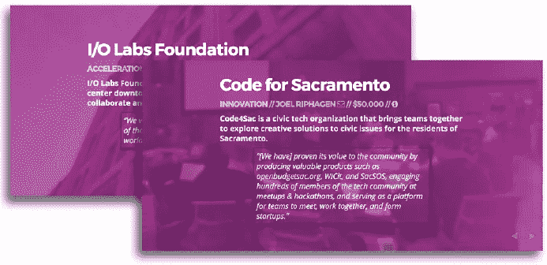
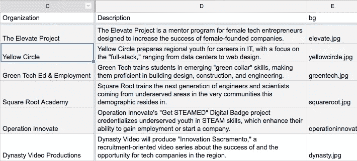
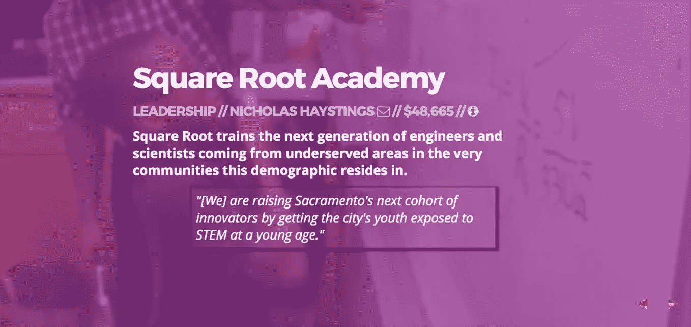

# 穷人的黑客“数据驱动”演示指南

> 原文：<https://medium.com/hackernoon/data-driven-presentations-b97a16caadf4>

答:记得几年前——嗯，现在，可能不止几年——当我在 Code for America 工作时，我们有一个深思熟虑的想法，那就是在年度峰会的介绍中包括那一年以来的每一个伙伴关系应用程序。似乎很容易，不是吗？对于工作仅 11 个月的少数团队来说，这应该只是少数幻灯片，对吗？

不到三十岁。

因此，我们坐在那里，我们人数不多的沟通团队，埋头苦干，用 Powerpoint 拼凑出 30 张幻灯片，内容各不相同，但基本布局都一样。使用 PPT 的自动格式化——弊大于利，字体大小歪斜，屏幕截图分辨率不同，等等。然后，当然，来自那些团队、工作人员和任何有意见的人的编辑。

有一次，我想给我的笔记本电脑一个[的办公空间待遇](https://www.youtube.com/watch?v=N9wsjroVlu8)。

所以今年，当我被要求整理幻灯片向市议会推荐[铁路资助项目](https://sacmoie.github.io/RAILS/)的 15 条建议时，我说:

**不会再来了。**

今年，我带着一个明显的偏见开始:在线而不是离线，合作而不是不合作。很容易，任何熟悉 HTML5 的人都会跳到为可爱的在线演示提供框架的伟大开源项目的数量上；由于许多都是在 github 上托管的，协作是内置的。

问题:不是每个和我一起工作的人都知道 HTML5 或 github 是什么——更不用说两者都知道了。

因此，我后退一步，思考理想的体验，让我来做“繁重的”设计和格式化工作，让我的同事来编辑和调整。实际上，我意识到我想要一个非常简单的幻灯片内容管理系统(CMS ),或者换句话说，一个“数据驱动”的演示。

The spreadsheet used for the “database” for the presentation

然后我想起了我们在洛杉矶如何处理类似的问题[dashboard-ing](/@abhinemani/government-dashboards-what-ought-we-do-b0dcc58f299d#.j7i2hkcyy):**Google Spreadsheets**和一个叫做[desktop](https://github.com/jsoma/tabletop)的 JS。将这两者连接起来，让我在当时和现在都能实现干净、一致、优雅的设计，以及一般的非技术性访问和编辑。

这就是我们所做的:

*   分叉的 [Reveal.js](https://github.com/hakimel/reveal.js/) (似乎是 HTML5 演示的旗手)
*   在一些 CSS 中添加了“项目”幻灯片的通用外观——这些幻灯片需要包含通用信息，如项目名称、描述、截图等。(当然，你仍然需要其他带有介绍性和结论性幻灯片的幻灯片。)
*   在 Google 电子表格中设置一个文档，将这些字段作为标题，发布到 web 上，记录电子表格的惟一 ID，并输入一些占位符内容
*   将[table t . js](https://github.com/jsoma/tabletop)脚本添加到 repo 中——带有电子表格 ID——并设置一些 javascript 来提取适当的单元格，用适当的 CSS 标签进行支撑
*   在我的主 html 文件中插入一个虚拟 div 并指向它的桌面脚本
*   打开 gh-pages，然后*瞧*:我有了一个“数据驱动的演示，完全移动响应，可打印，可共享

Example “project page” slide

自己看:[https://sacmoie.github.io/RAILS/2016/index.html#/](https://sacmoie.github.io/RAILS/2016/index.html#/)

当然，真正的好处来自于能够与所有 15 个被推荐获得资助的组织以及与我合作的城市工作人员分享谷歌电子表格。而不是让一打又一打的电子邮件塞满我的收件箱，问“你能把这张照片换成那张吗？”或者“我们的风格指南不推荐使用&符号”，我只是在谷歌文档上分享给每个人，让他们自己看。我以开放、版本控制的方式众包幻灯片“创作”。

首先，我们现在还有一个闪亮的面向公众的网站要发布，已经建成，并普遍同意以 API 可访问的格式复制。(阅读:这个“演示”基本上提供了我们进行持续营销和推广可能需要的大部分内容。)

你可以看看这里的代码:[https://github.com/SacMOIE/RAILS/tree/gh-pages/2016](https://github.com/SacMOIE/RAILS/tree/gh-pages/2016)

分享这个故事不是虚荣心作祟——这真的不是非常聪明或好的代码。不，我这样做是为了下一个穷人的黑客要求用 50 个编辑生成 30 个一致的幻灯片。

要有信心，你不需要把棒球棒带到你的笔记本电脑上。

至少在会议结束之前不会:)

> [黑客中午](http://bit.ly/Hackernoon)是黑客如何开始他们的下午。我们是 [@AMI](http://bit.ly/atAMIatAMI) 家庭的一员。我们现在[接受投稿](http://bit.ly/hackernoonsubmission)，并乐意[讨论广告&赞助](mailto:partners@amipublications.com)机会。
> 
> 如果你喜欢这个故事，我们推荐你阅读我们的[最新科技故事](http://bit.ly/hackernoonlatestt)和[趋势科技故事](https://hackernoon.com/trending)。直到下一次，不要把世界的现实想当然！

