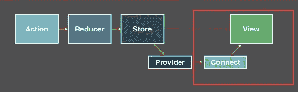

# 反应堆中的数据流

> 原文：<https://medium.com/hackernoon/data-flow-in-reactjs-c682edc95106>

我的初级开发人员系列的第二部分。关于我，我来自非传统的计算机科学背景，是一名活动家，倡导为技术空间的多样性和包容性而奋斗。我写关于技术主题的博客，这些主题与 [JavaScript](https://hackernoon.com/tagged/javascript) 、 [ReactJS](https://hackernoon.com/tagged/reactjs) 和技术包容相关。


本周我写的是 React 生态系统中的数据流。在解释和实现之前，我们需要了解一些术语:

[**道具**](https://facebook.github.io/react-native/docs/props.html) —是可以传递给 [**表现组件**](/@dan_abramov/smart-and-dumb-components-7ca2f9a7c7d0) 的数据。通常，这些是 [**容器组件**](/@dan_abramov/smart-and-dumb-components-7ca2f9a7c7d0) 的 [**子**](http://mxstbr.blog/2017/02/react-children-deepdive/#child-components) 。这种单向数据流(从上到下/从父到子)是 ReactJS 编程的主要原则。当这个数据被传递时，它不会改变。

[**状态**](https://www.tutorialspoint.com/reactjs/reactjs_state.htm) —存储可以改变的数据。我们可以读写`state`。这个对象来自 [**Redux**](http://redux.js.org/docs/basics/UsageWithReact.html) 或者 [**有状态组件**](https://toddmotto.com/stateful-stateless-components) 。

在大多数 JavaScript 生态系统中，有多种方法可以实现。我将向您展示在您的 [**表示组件**](/@dan_abramov/smart-and-dumb-components-7ca2f9a7c7d0) 中显示数据的三种不同方式。

***一种方式是将其作为默认道具传递:***

```
**import** React, { Component } **from** 'react';class Address extends Component {
  render () {
    return (
      <div>
        
        <h4>{this.props.streetLineOne}</h4>
        <h4>{this.props.streetLineTwo}</h4>
        <h4>{this.props.state}</h4>
        <h4>{this.props.zip}</h4>
      </div>
    );
  }
}Address.defaultProps = {
  imgUrl: '/images/icons/map_marker.svg',
  streetLineOne: '1234 This Way Street',
  streetLineTwo: 'Apt. 1',
  state: 'CA',
  zip: 94703,
}**export default Address**
```

***另一种，是通过父组件*** 传递道具

步骤 1:构建将从其父组件接收道具的子组件。这个过程中涉及的小步骤有:导入 React 内置，将数据映射到要返回的 JSX 代码中，检查每个属性返回的数据类型，最后导出子组件。

*导入内置的 React】*

```
import React from 'react';
import PropTypes from 'prop-types';
```

*将您的数据映射到您返回的 JSX 代码中*

```
const Address = (props) => {
  return (
   {props.showIcon && 
     
   }
    <address>
      <div>
        <span itemProp="streetAdress">{props.location}</span>
      </div>
      <div>
         <span itemProp="addressLocality">
           {props.location.city},
         </span>
         <span itemProp="addressRegion">
           {props.location.state}
         </span>
         <span itemProp="postalCode">
           {props.location.zipCode}
         </span>
       </div>
     </address>
   );
}
```

上面的代码乍看起来似乎很密集，但分解起来却非常简单。`<Address />`内有 3 个反应元件

1.  图像组件，仅当布尔值`showIcon`返回`true`时才显示。
2.  一个包含`props.location`街道地址的`div`
3.  另一个`div`，包含`props.location.city` `props.location.state` `props.location.zipCode`中位置的地点

因此`<Address />`组件需要一个位置属性。那么道具对象是哪里来的呢？正如您将看到的，这个数据对象是从它的父对象`<LocationInfoCard />`传递下来的。

*检查每个道具返回什么类型的数据*

```
Address.propTypes = {
  location: PropTypes.object.isRequired,
  showIcon: PropTypes.bool,
  iconClassName: PropTypes.string,
};
```

*导出您新构建的子组件*

```
**export default** Address;
```

步骤 2:构建它的父组件。涉及的小步骤:导入根样式表，CSS 工具，声明新的父组件，并通过 props 向其传递要显示的数据，导出新的父组件。

*导入 React 内置、样式表和 CSS 工具*

```
**import** React **from** 'react';
**import** withStyles **from** '../../../core/isomorphic-style-loader/withStyles';
**import** s **from** './LocationInfoCard.scss';
**import** Address **from** '../../Location/Address';
**import** Phone **from** '../../Location/Phone';
```

*声明你的新父组件，并把你想通过 props 显示的数据传递给它。*

```
const LocationInfoCard = (props) => {
  const { location } = props //location is a key in the props objectreturn (
    <div>
      <Phone
        location={ location }
        iconClassName={ s.phoneIcon }/>
      <Address
        location={ location }
        showIcon
        iconClassName={ s.mapMarkerIcon} 
      />
    </div>
  );
}
```

*导出新的父组件*

```
**export default** withStyles(s)(LocationInfoCard)
```

我们的道具/数据对象现在被动态地传送到`<LocationInfoCard />`。我们将在最后一个例子中看到这个父组件是如何获取这个对象的。

`<LocationInfoCard />`是一个[无状态功能组件](https://toddmotto.com/stateful-stateless-components)。它接收的 props 对象参数中有一个名为`location`的键。我们可以通过对象析构来访问`location` [，这将帮助我们编写更短的语法。这里有一个来自 Mozilla 文档的清晰解释。](https://developer.mozilla.org/en-US/docs/Web/JavaScript/Reference/Operators/Destructuring_assignment)

```
var myObj = {p: 42, q: true};
var {p, q} = myObj;console.log(p) = 42
```

在上面的例子中，我们可以把`myObj.p`写成`p`。类似地，在`props.location`中，我们现在可以通过使用它的键`location`来访问这个相同的属性。

在`<LocationInfoCard />`里面有两个自定义组件:`<Phone />`和`<Address />`。我们只传递了`location`属性，这可能会让人感到困惑，但是请记住，我们在编写子组件`<Address />`时映射了那些数据对象属性，尽管我没有向您展示示例，但是您可以想象这同样适用于`<Phone />`

***最后但并非最不重要的是，我要向您展示的第三个示例是如何使用 Redux 这样的数据存储来传递*** `***props***` ***。***



react-redux

在上面的信息图中，我们可以看到[单向数据流](http://redux.js.org/docs/basics/DataFlow.html)，这是 React 应用程序的基础。为了保持简单、高水平并巩固对 React 中数据流的理解，我们将重点关注红框中突出显示的流程。

步骤 1:将容器组件连接到 Redux

```
npm install --save react-redux
```

我们将需要一个名为`connect`的函数。React-redux 允许我们将 React 应用程序连接到 redux，这将允许我们连接到 Redux 的数据存储，在那里我们可以访问`state`。

**状态—** 表示正在被跟踪且可被更改的输入*。状态变化的一些例子是变量重新分配和用户交互(点击、提交表单、鼠标移动—事件)。

```
**import** React **from** 'react';
**import** { connect } **from** 'react-redux';
```

通常你必须创建**动作**和**减速器。**在我们的应用程序中，让我们假设这已经为我们构建好了，这样我们就可以一点一点地了解数据流是如何反应的。

步骤 2:导入将要接收`location` prop 的组件。

```
**import** LocationInfoCard **from** './LocationInfoCard';
```

步骤 3:声明您的 [mapStateToProps](http://redux.js.org/docs/basics/UsageWithReact.html) 函数(参见下面 ReduxJS 文档的定义)

> 要使用`connect()`，您需要定义一个名为`mapStateToProps`的特殊函数，它告诉您如何将当前的 Redux 存储状态转换为您想要传递给正在包装的表示组件的 props。

```
**const** mapStateToProps = state => ({
  location: state.location,
});
```

这里我们可以看到`mapStateToProps`函数正在创建一个新的对象，它有一个名为`location`的属性，然后我们将这个属性传递给`<LocationInfoCard />`

```
**export const locationInfoCard** = {
  path: '/location-info',
  action: () => {
    **const** ConnectedLocationInfoCard =  
       connect(mapStateToProps(LocationInfoCard);
    **return** {
      component: (
        <ConnectedLocationInfoCard route="location-info" />
      ),
    };
  },
};
```

不要被上面密密麻麻的代码搞得不知所措。我们将一行一行地理解发生了什么。我们可以看到一个名为`locationInfoCard`的新常量正在使用 [ES6 语法](https://developer.mozilla.org/en-US/docs/Web/JavaScript/Reference/Statements/export)导出。

这个常量包含一个对象，该对象有一个名为`path`的属性和一个名为`action`的[方法](https://softwareengineering.stackexchange.com/questions/20909/method-vs-function-vs-procedure)。`/location-info`是我们将看到`<LocationInfoCard />`的子组件显示的地方。

更有意思的是`action`法。这是我们新连接的容器组件的核心。`mapStateToProps`以`LocationInfoCard`为参数，返回新的路由组件。现在，当我们走这条路时，我们将能够访问我们的应用程序的状态以及它的属性。

概括地说，我向您展示了将数据传输到 React 组件的 3 种方式:

1.  使用默认属性传入数据
2.  将数据从父组件向下传递到子组件
3.  使用 react-redux 将状态映射到道具

希望我的解释有所帮助。欢迎通过评论联系我。