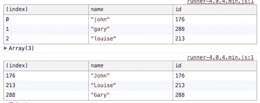

# 普通 JavaScript 的数据不变性

> 原文：<https://medium.com/hackernoon/data-immutability-with-vanilla-javascript-63834a65a6c9>

## 与 JavaScript 世界中的大多数*趋势*不同，数据不变性必定会伴随我们一段时间，这是有充分理由的:首先，因为它不是*一种趋势:*它是一种编码方式(和用代码思考),促进了清晰性、易用性和对数据流的理解，并使代码更不容易出错。

尽管新版本的 JS 语言给了我们一个比以前更健壮的工具集，而没有使用像 [**Immutable.js**](https://facebook.github.io/immutable-js/) 这样的库，但是当你把它们放在一起时，事情看起来还是有点可怕。熟悉阅读和编写最常见的用例非常有帮助。

在这篇简短的帖子中，我们将看看纯 JS 的方式(使用 ES2015++，是的，我可能刚刚发明了这种符号)来添加、删除和更新对象、数组中深度嵌套的属性，并找到通用模式来重现这些操作。

*游乐场:* [*直接链接到 JS Bin*](http://jsbin.com/kikajon/edit?js,console)

# 目标

让我们以一个初始对象`person`为例，我们可以把它看作是一段应用程序状态，我们希望对它进行变异。àlàredux 思考，我们应该总是返回这个状态的新副本，**永远不要直接改变它**。

```
const person = { 
  name: 'Ricardo', 
  location: 'Berlin', 
  interests: { coffee: 9, climbing: 9, wasps: 0 } 
};
```

# 更改简单对象属性

使用`Object.assign`修改顶级属性非常简单。我们将探索它的更多用例(和替代品),但现在让我们简单地创建一个修改过的对象副本，将`name`设置为“道格拉斯”。

```
const updatedPerson = Object.assign({}, person, { 
  name: 'Douglas' 
});
```

*简单的*。我们告诉 Object.assign 给*取这个空{}，在上面应用 person，并修改 name 属性*。我们物体的其余部分看起来是一样的。

# 更改深度嵌套的属性

这里有一个使用`Object.assign`复制对象时常见的错误:忘记复制我们试图变异的**内部对象**。假设我们要将*咖啡*兴趣改为 *10* 和`location`从“柏林”到“月球”(柏林的一条普通火车路线)。如果我们尝试以下应用程序会怎么样:

```
const updated = Object.assign({}, person, { 
  location: 'Moon', 
  interests: { 
    coffee: 10 // **Crap! Only this one is copied** 
  } 
});
```

从表面上看，这似乎行得通，但这并没有复制`interests`对象的其余部分。它会给我们留下更新的`{coffee: 10}`和`location: 'Moon'`，但不会复制`climbing`或`wasps`。反正没人需要黄蜂。但是我们如何解决这个问题呢？

相反，我们还需要深入复制`interests`对象，就像这样:

```
const updated = Object.assign({}, person, { 
  location: 'Moon', 
  interests: **Object.assign({},** person.interests, { 
    coffee: 10 // All other interests are copied 
  }) 
});
```

注意双`Object.assign`。实际上有点冗长，因为为了不丢失属性，所有对象都需要被赋值。

# 扩展运算符

我们可以通过使用`spread`操作符让这个看起来更整洁，它采用`...`的形式——事实上，前面的例子可以改写为:

```
const updated = { 
  ...person, 
  interests: { 
    **...person.interests,** 
    coffee: 10, 
  } 
}
```

好看多了！Spread 操作符是如此的不可思议，你绝对应该在 MDN 上阅读更多关于它们的内容。

# 删除属性

现在，从对象中删除属性。关键字`delete`是一个变异动作，所以当我们考虑不可变数据时不能使用它。

有几种不同的方法可以解决这个问题，有些方法比其他方法更有效。一种(缓慢的)方法是重新创建我们的整个对象，但是忽略我们想要移除的属性。让我们创建一个函数，它接受我们的对象，以及我们希望删除的属性的名称:

```
const removeProperty = (obj, property) => { 
  return Object.keys(obj).reduce((acc, key) => { 
    if (**key !== property**) { 
      return {**...acc, [key]: obj[key]}** } 
    return acc; 
  }, {}) 
}
```

*注意:为了便于阅读，本文采用了长格式。您可以省略一些 return 语句。*

这看起来有点复杂，但是发生的事情非常简单:对于每个不是我们传递的键，我们不断将它们添加到累加器中，由函数返回。所以现在，如果我们想要从我们的`person`对象中移除`interests`属性，我们可以这样使用:

```
const updated = removeProperty(person, 'interests');
```

这将为我们提供对象的全新副本，除了一个被忽略的属性:

```
{ name: 'Ricardo', location: 'Berlin', }
```

# 旁白:使用 lodash

如果你在你的项目中使用了 **lodash** ，那么你可以利用它的一些方法来帮助你改变对象。**然而，你应该注意到，缺省情况下，lodash 的一些方法改变了原始对象**，这通常会弄乱你的不可变数据。然而，一个例外是`[_.omit](https://lodash.com/docs/4.17.4#omit)`[方法](https://lodash.com/docs/4.17.4#omit)，它可以用来从对象中删除属性。

再一次，让我们像以前一样尝试删除`interests`属性，但是使用 lodash。这一次，我们将把它写成一个 reducer 风格的函数，只是作为一个例子:

```
import { omit } from lodash; const reducer = (state, action) => { 
  switch (action.type) { 
    case 'DELETE_KEY': 
    return omit(state, action.key); 
    default: 
    return state; 
  } 
}
```

这将工作，即使没有 lodash 的 */fp* 子集。所以如果你已经在用 lodash，你会免费得到这个。我们可以这样使用它:

```
const newState = reducer(person, { 
  type: 'DELETE_KEY', 
  key: 'interests' 
});
```

那会给我们同样的结果。再次，在重新分配数据时厌倦使用一些 lodash 方法，因为 ***他们的大多数方法都是对原对象*** *的变异。考虑使用*[*/FP*](https://github.com/lodash/lodash/wiki/FP-Guide)*子集变异。*

# 更复杂的更新

很难理解如何混合和匹配对象的这些操作。重组属性，同时更新它们，是 Redux reducers 非常常用的模式。为了练习，让我们看一个更复杂的操作的例子。

考虑我们的原始数据，一组有名字和 ID 的用户:

```
const users = [ 
  {name: 'john', id: 176}, 
  {name: 'gary', id: 288}, 
  {name: 'louise', id: 213} 
];
```

在 **Redux** 中，通常的做法是[规范化你的应用程序状态](http://redux.js.org/docs/recipes/reducers/NormalizingStateShape.html)，通过将数据按 ID 分组以便于查找。假设这就是我们想要做的:我们想要一个新的**数组**，它包含按 ID 分组的用户**。为了好玩，让我们也把他们名字的第一个字母大写。**

简而言之，我们想从第一张表转到第二张表:



但是，我们如何将`object.id`作为一个键返回呢？这是您将看到`[item.id]: something`符号的地方。它允许您动态地获取值，并将其用作键。所以记住这一点，让我们写我们的`byId`函数，它也大写第一个字母:

```
const byId = (state) => state.reduce((acc, item) => ({ 
  ...acc, 
  **[item.id]**: Object.assign({}, item, { 
    name: *item.name.charAt(0).toUpperCase() + item.name.slice(1)* 
   }) 
}), {})
```

如果这个方法会说话，它会说:

*嘿，你:对于我的状态，应用* `*reduce*` *方法，这将给你一个以空{}开始的累加器，以及我的所有项目。对于每一个，扩展累积的属性，但是添加一个具有每个[item.id]的值的新键。在每一个里面，复制一个* `*item*` *，同时修改它的* `*name*` *属性。*

这将**返回一个新的对象，将每个用户的 ID 作为键**，将他们的所有值分散到每个对象中，并将他们的`name`属性修改为第一个字符大写。

如果我们想更新更多的属性，而不仅仅是用户名，该怎么办？在这里，您将考虑组合**纯函数**，以便根据需要操作数据，但总是返回一个新的副本。让我们稍微重构一下，创建一个`updateUser`函数:

```
const **updateUser** = (user) => Object.assign({}, user, { 
  name: user.name.charAt(0).toUpperCase() + user.name.slice(1) 
}); const byId = (state) => state.reduce((acc, item) => ({ 
  ...acc, 
  [item.id]: **updateUser**(item), 
}), {})
```

我们现在需要获得一个新的状态，将用户按 ID 分组，只需:

```
const usersById = byId(users);
```

# 数组

酷，那么数组中的不变性呢？让我们考虑一个原始的不可变数据:

```
const original = ['a', 'c', 'd', 'e'];
```

有了数组，您通常会希望执行以下操作之一:

*   按索引插入项目
*   按索引删除项目
*   按项目删除
*   在末尾插入一个项目

# 按索引插入

我们很方便地忘记了在索引中的`a`值旁边添加`b`。哦，不，这对我们的 alphabet 应用程序是一个巨大的灾难！我们如何以不可变的方式在给定的索引处插入一个条目？一种思考方式是:

1.  *复制数组* ***直到*** *指定的索引*
2.  插入我们的项目
3.  *将数组* ***的剩余部分从*** *复制到指定的索引*

所以我们可以用下面的签名写一个助手函数:

`insertByIndex = (state, newItem, insertAt)`

> *其中* `*state*` *是原始数组，* `*newItem*` *是我们要添加的项的值，* `*insertAt*` *是我们要插入* `*newItem*` *的位置的数字(索引)。*

编写这样一个助手函数的简单方法如下:

```
const insertByIndex = (state, **newItem**, insertAt) => [  
  ...state.slice(0, insertAt), 
  **newItem**, 
  ...state.slice(insertAt) 
]
```

等等，什么？

好吧，我们来分析一下。我们已经看到了`spread`操作符(...)复制值，这正是我们在这里所做的。首先，我们返回一个新的数组；从头开始复制它，直到我们的索引，插入我们的新值(`b`)，然后从那里复制数组的其余部分。

因此，它的用法示例如下:

```
insertByIndex(original, 'b', 1) 
// ["a", "b", "c", "d", "e"]
```

# 按索引删除

幸运的是，通过索引移除数组要简单得多，只要我们能够使用`Array.filter`。让我们想想:`filter`方法给了我们索引值作为第二个参数，这意味着我们想要返回*所有没有 N* 索引的值。

```
const removeByIndex = (arr, at) => arr.filter((item, idx) => **idx !== at**);
```

# 按项目移除

如果您想直接删除一个项目(比如说，`b`，而不是它的索引)，我们仍然可以像以前一样使用`filter`，但是我们将过滤掉项目本身，并忽略索引:

```
const removeByItem = (arr, value) => arr.filter((item) => **item !== value**);
```

# 添加项目

在数组末尾加一个项也挺简单的，但是**你敢想 push！**其实，老好人`concat()`才是你不变的朋友。使用`.push`会改变原始数组，这将不可避免地导致不可预测的行为。

```
const addItem = (arr, value) => arr.**concat**(value);
```

因此，如果我们想将`banana`添加到我们的字母数组中(为什么不呢？)，我们可以做:

```
addItem(original, 'banana') // ["a", "c", "d", "e", "banana"]
```

# 引人深思的事

即使您使用的是不可变库，如 Immutable.js 或 lodash 的 [fp 风格，很好地掌握不变性如何与简单的](https://github.com/lodash/lodash/wiki/FP-Guide) [JavaScript](https://hackernoon.com/tagged/javascript) 一起工作仍然是一个很好的主意。不可变的. js 作为一个依赖项有很大的权重，还有其他的选择，比如同样流行的[点-prop-不可变的](https://github.com/debitoor/dot-prop-immutable)。

什么时候应该使用库实现不变性，或者使用 JavaScript？这实际上取决于您的数据变更的复杂性，您可以为您的代码库和您的团队带来的开销(这是*需要学习的另一件事*)。我认为了解大多数模式的准系统实现是有益的，尤其是在使用 Redux 或任何其他类似的在代码不变性方面很流行的模式时。

**非常有用的资源:**

*   [immutable . js 简介](https://www.sitepoint.com/immutability-javascript/)
*   [还原不可变模式](http://redux.js.org/docs/recipes/reducers/ImmutableUpdatePatterns.html)
*   [更多 ES2015 示例](https://wecodetheweb.com/2016/02/12/immutable-javascript-using-es6-and-beyond/)
*   [传播语法:MDN](https://developer.mozilla.org/en/docs/Web/JavaScript/Reference/Operators/Spread_operator)

有什么我可能忽略或弄错的吗？不要害怕在推特上联系我。

*原载于我的个人博客*[*blog.ricardofilipe.com*](http://blog.ricardofilipe.com/post/immutable-changes-in-js)