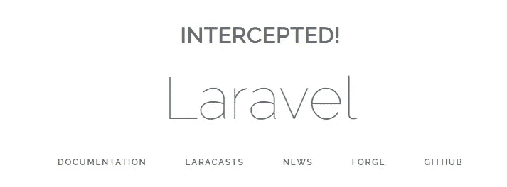

# 视图的数据拦截器— Laravel 5.5

> 原文：<https://medium.com/hackernoon/data-interceptor-for-your-views-laravel-5-5-c973a96bb45a>


几天前，我在 Laravel Internals 上看到一条来自 Colin Viebrock 的消息，询问如何拦截从控制器传到视图的数据。我是这样做的。

## 1-扩展视图服务提供者

使用 artisan 我们可以`php artisan make:provider ViewServiceProvider`让我们开始。在新的服务提供者中，我们将扩展默认的服务提供者，并简单地覆盖方法`createFactory`

```
**<?php

namespace** App\Providers;

**use** App\Support\View\MyViewFactory;
**use** Illuminate\View\ViewServiceProvider **as** BaseViewServiceProvider;

**class** ViewServiceProvider **extends** BaseViewServiceProvider
{
    **protected function** createFactory($resolver, $finder, $events)
    {
        **return new** MyViewFactory($resolver, $finder, $events);
    }
}
```

## 2-不要忘记交换服务提供商设置

在**application/config/app . PHP**中有一个将启动的提供者列表。让我们删除默认的`Illuminate`，用我们在第一步中创建的来替换它。应该是`\App\Providers\ViewServiceProvider`。

## 3-创建自定义视图工厂

我决定在**应用程序/应用程序/支持/视图**中创建我的，如下所示:

```
**<?php

namespace** App\Support\View;

**use** Illuminate\View\Factory;

**class** MyViewFactory **extends** Factory
{
    **protected function** viewInstance($view, $path, $data)
    {
        **return new** MyView($this, $this->getEngineFromPath($path), $view, $path, $data);
    }
}
```

## 4-在您的自定义视图中实现数据拦截

在向视图提供数据之前，将调用`gatherData`方法。这是截取所有数据的最佳位置。

```
**<?php

namespace** App\Support\View;

**use** Illuminate\View\View;

**class** MyView **extends** View
{
    **protected function** gatherData()
    {
        $data = **parent**::*gatherData*();

        **return** array_merge($data, ['intercepted' => **true**]);
    }
}
```

## 5-看结果！

现在只需打开`welcome.blade.php`文件，并添加一个允许您测试拦截的代码片段:

```
**@if(**$intercepted**)** <h1>INTERCEPTED!</h1>
**@endif**
```

一旦你打开页面，你就能看到它。

