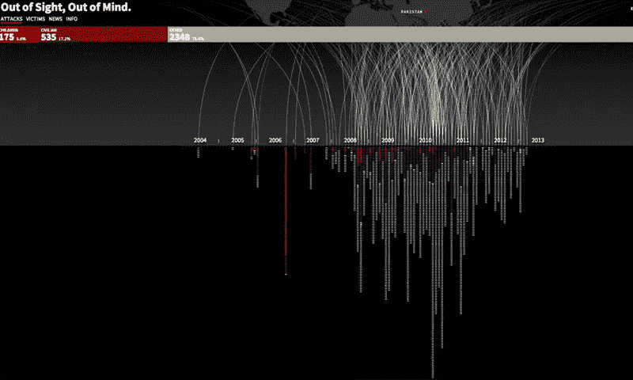
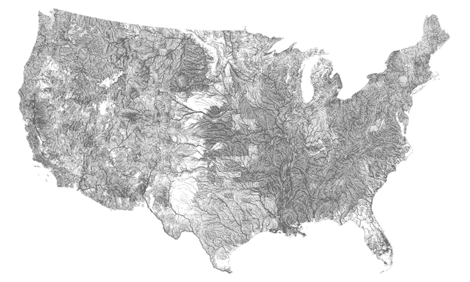
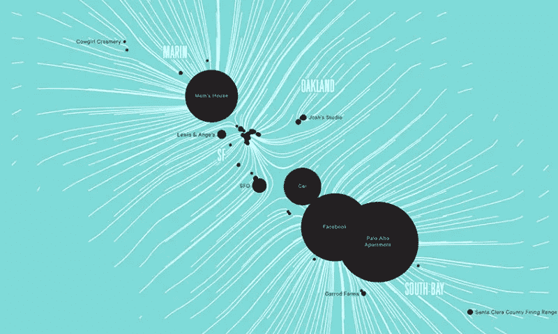
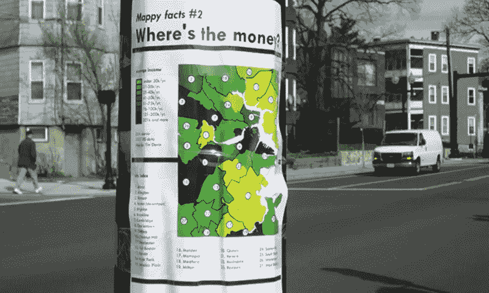
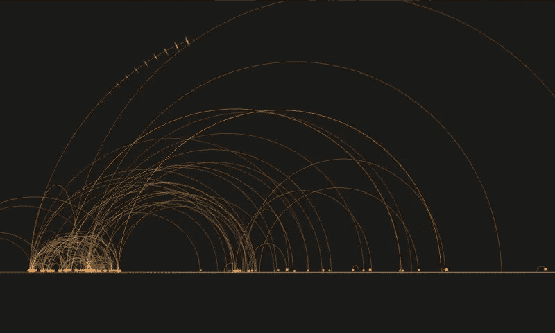
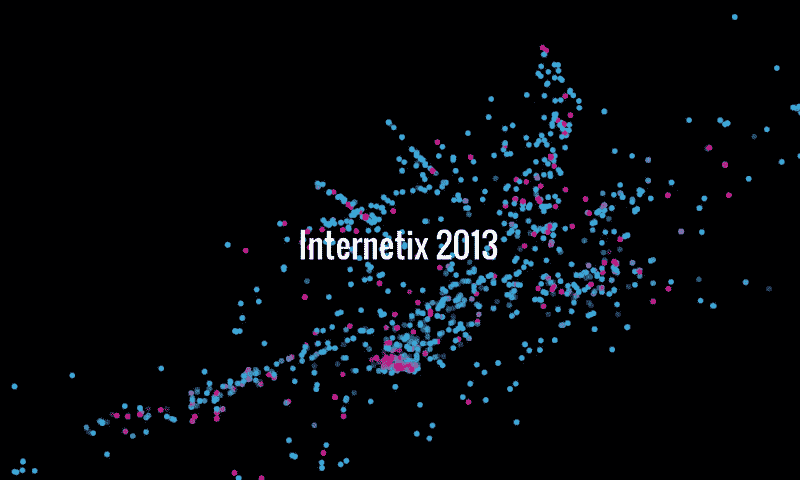
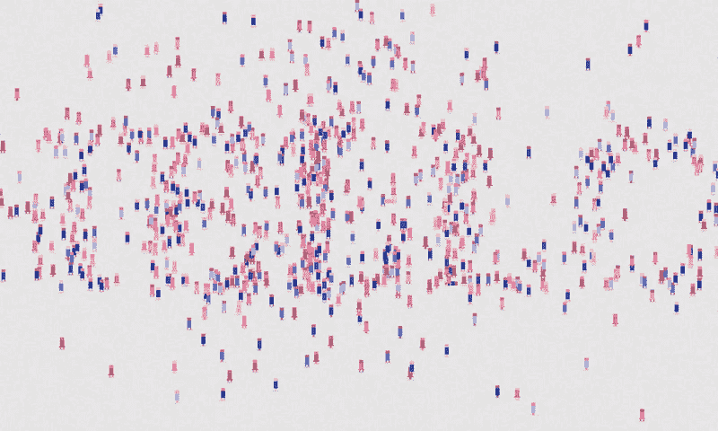
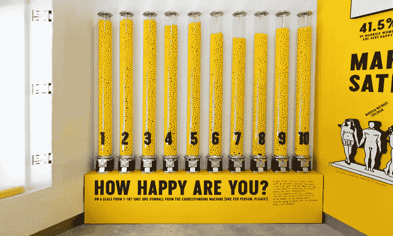

# 数据是美丽的

> 原文：<https://medium.com/hackernoon/data-is-beautiful-6a7adfceb0db>

## 广告、社交、城市游戏和人机互动中的灵感和中断的不定期汇总。

加州大学伯克利分校的计算机科学家乔·赫勒斯坦称之为“数据工业革命”。数据无处不在。而且很漂亮。

[数据](https://hackernoon.com/tagged/data)正在[改变我们的生活](http://www.telegraph.co.uk/technology/7963311/10-ways-data-is-changing-how-we-live.html)，[重新发明在线讲故事](http://adage.com/article/digitalnext/data-visualization-reinventing-online-storytelling/135313/)并且影响几乎每个行业——商业、艺术、娱乐、音乐、[科技](https://hackernoon.com/tagged/technology)。

这里有一些最喜欢的…

# **信息新闻学:**

一个绝对精彩和恐怖的信息图表和新闻报道，[眼不见，心不烦](http://drones.pitchinteractive.com/)，是 2004 年 7 月至 2013 年 12 月巴基斯坦无人机袭击的时间表
[http://drones.pitchinteractive.com/](http://drones.pitchinteractive.com/)

如果不提到[D3 . js](http://d3js.org/)——由前《纽约时报》数据编辑 [Mike Bostok](http://bl.ocks.org/mbostock) 创建的令人惊叹的 javascript 库，任何关于网络数据的对话都不会真正完整。今天你在网上看到的大多数数据项目都是用 d3.js 构建的，或者是这个库的一个子集。

每个记者都应该知道的一个科技术语:

 [## 每个记者都应该知道的一个科技术语

### 对于新闻编辑室来说，创作互动故事可能会很痛苦，但读者对它们的期待越来越高。作为…

www.fastcolabs.com](http://www.fastcolabs.com/3020994/the-one-tech-buzzword-every-journalist-should-know)  [## 通往白宫的 512 条路

### 探索通过选举战场的路线，并为任何一方策划胜利。

www.nytimes.com](http://www.nytimes.com/interactive/2012/11/02/us/politics/paths-to-the-white-house.html) 

[今年早些时候不幸去世的汉斯·罗斯林](https://en.wikipedia.org/wiki/Hans_Rosling)，在他现在著名的 Ted 演讲中让数据变得很酷，他展示的数据揭穿了关于世界发展的几个神话:

他也有自己的 BBC 节目，统计的快乐:

1945 年以来每次核爆炸的延时地图。吓人:

更多伟大的 D3 例子:
描绘美国枪支死亡:[http://data.huffingtonpost.com/2013/03/gun-deaths](http://mapping%20us%20gun%20deaths%20http//data.huffingtonpost.com/2013/03/gun-deaths)

2012 NBA 总决赛可视化:[http://www . nytimes . com/interactive/2012/06/11/sports/basketball/NBA-shot-analysis . html](http://www.nytimes.com/interactive/2012/06/11/sports/basketball/nba-shot-analysis.html)

你还能活几年:[http://flowing data . com/2015/09/23/years-you-left-to-living-probably/](http://flowingdata.com/2015/09/23/years-you-have-left-to-live-probably/)

著名创意人的日常:[https://podio.com/site/creative-routines](https://podio.com/site/creative-routines)

谷歌牛逼音乐时间轴:[http://research.google.com/bigpicture/music/](http://research.google.com/bigpicture/music/)

# **量化自我:**

《脸书时间线》的首席设计师之一尼古拉斯·费尔特龙(Nicolas Feltron)花了数年时间追踪关于自己的一切(最初以模拟方式一丝不苟地记录自己的生活，后来[通过开发一个应用](http://feltron.com/apps.html))，并将它们转化为年度报告，在许多方面引领了当前的生活日志/量化自我运动。

点击这里查看美丽的报道:[http://feltron.com/](http://feltron.com/)

更量化的自我:
[http://ericboam.com/Seven-Months-of-Sleep-1](http://ericboam.com/Seven-Months-of-Sleep-1)
[http://ericboam.com/2014-A-Year-In-New-Music](http://ericboam.com/2014-A-Year-In-New-Music)
[https://jehiah.cz/one-four/](https://jehiah.cz/one-four/)

费德里科·赞尼尔(Federico Zannier)使用 Kickstarter 以每天 2 美元的价格出售他的数据，并设法赚了 2733 美元，分享他的击键、鼠标移动，甚至每 30 秒提供一张截图。[https://www . kickstarter . com/projects/1461902402/a-bit-e-of-me/description](https://www.kickstarter.com/projects/1461902402/a-bit-e-of-me/description)

数据妙招帮你卖个人数据[https://datacoup.com/](https://datacoup.com/)
个人数据价值计算器:[http://www . ft . com/CMS/s/2/927 ca 86 e-d29b-11e 2-88ed-00144 feab 7 de . html # ax ZZ 2 z 2 agbb 6 r](http://www.ft.com/cms/s/2/927ca86e-d29b-11e2-88ed-00144feab7de.html#axzz2z2agBB6R)

# **数据作为行动主义:**

我喜欢 Tim Devin 的作品的简单性，这是一个公共艺术项目，它只是简单地张贴包含波士顿和洛杉矶数据的小海报以及街头调查，以鼓励公共对话。
http://timdevin.com/broadsides.html

我之前提到过[戈兰·莱文](https://en.wikipedia.org/wiki/Golan_Levin)和 [F.A.T .实验室](http://fffff.at/)(因为我是一个超级粉丝，很遗憾这个艺术项目已经关闭了)。Infoviz 涂鸦帮你打造属于你自己的 infographic 街头艺术:
[http://www.flong.com/blog/2011/on-infographic-street-art/](http://www.flong.com/blog/2011/on-infographic-street-art/)
[http://fffff.at/infoviz-graffiti-stencil/](http://fffff.at/infoviz-graffiti-stencil/)

克里斯·乔丹是一位用大尺度摄影来呈现数据的艺术家。上图来自他的展览“[运行数字](http://www.designboom.com/art/chris-jordan-running-the-numbers/)”，用一叠叠的囚服代表美国被监禁的人数。

更多公共艺术和行动主义信息图:
社区数据可视化为街头艺术:[http://visualisingmillroad.com/](http://visualisingmillroad.com/)

《熊 71》是一部第一人称纪录片，讲述了在加拿大班夫国家公园[http://bear71.nfb.ca/#/bear71](http://bear71.nfb.ca/#/bear71)追踪一只灰熊的故事

艾莉·巴尔克的公共艺术即:[http://elliebalk.com/#/cityofemotion/](http://elliebalk.com/#/cityofemotion/)

# **GPS 和跟踪:**

刚刚着陆是人们乘飞机环游世界的 Twitter 可视化。可视化搜索包含短语“刚刚抵达…”或“刚刚抵达…”的推文，然后根据推文的位置和一个人的家庭位置绘制旅程。它是由数据艺术家兼 NYU ITP 项目讲师 Jer Thorp 开发的，他也是我最喜欢的数据人之一。
[http://data visualization . ch/showcases/just-landed-a-Twitter-visualization-in-processing/](http://datavisualization.ch/showcases/just-landed-a-twitter-visualization-in-processing/)

**更多关于 Jer Thorp:**
探索银河系使用一个类似少数派报告的界面:[http://www . fastcodesign . com/1669702/Explore-the-galaxy-using-the-actual-Minority-Report-interface](http://www.fastcodesign.com/1669702/explore-the-galaxy-using-the-actual-minority-report-interface)
进入奥卡万戈之前，如果你还没有看过的话，也值得一探:[http://intotheokavango.org/](http://intotheokavango.org/)

**微地理定位:**

玩微地理定位，通过 wifi 追踪会议代表，并可视化他们的运动和联系，这是我几年前做的一个项目。有趣的是，无线网络实际上可以用来精确定位人们的位置。
[http://radarboy.com/george/internetix.php](http://radarboy.com/george/internetix.php)

**更多 GPS 善良:**
出租车生活中的一天:【http://nyctaxi.herokuapp.com/】T21

想象纽约的 MTA:

用 GPS 绘图:[http://urban tick . blogspot . SG/2009/06/GPS-data-visualization-variations . html](http://urbantick.blogspot.sg/2009/06/gps-data-visualization-variations.html)

看不见的城市使社交网络活动可视化:[https://www.schemadesign.com/invisiblecities/](https://www.schemadesign.com/invisiblecities/)

用乐高积木重建萨凡纳城并让运动可视化:[http://www . coryimig . com/projects/24 vxlnrcuk 3 zix 354 lzdds 0 hzvxw 4 u](http://www.coryimig.com/projects/24vxlnrcuk3zix354lzdds0hzvxw4u)

**数据如评书:**

英国广播公司第四频道的《性经验》以一种美丽而迷人的方式进行性教育，这是一部老掉牙但却是真正的好东西，是一部可过滤的英国性经验百科全书。不幸的是，他们最近关闭了该网站，但这里有一个概述:[https://www.youtube.com/watch?v=Yka077KbbH8&ab _ channel = core 77 Inc](https://www.youtube.com/watch?v=Yka077KbbH8&ab_channel=core77inc)

[下面是今天的](http://hereistoday.com/)是一个简单却卓有成效的时间数据可视化:【http://hereistoday.com/】T4

同样，虽然不那么漂亮，但令人印象深刻的是宇宙的规模:[http://htwins.net/scale2/](http://htwins.net/scale2/)

**更多数据讲故事:**

一个分裂的国家:[http://zeit.de/feature/german-unification-a-nation-divided](http://zeit.de/feature/german-unification-a-nation-divided)

《纽约时报》2013 年综合报道:[http://www . nytimes . com/news graphics/2013/12/30/year-in-interactive-storyling/# dataviz](http://www.nytimes.com/newsgraphics/2013/12/30/year-in-interactive-storytelling/#dataviz)

**数据为艺术:**

艺术家和媒体黑客和 [F.A.T 实验室](http://fffff.at/)联合创始人 [Evan Roth 的](https://en.wikipedia.org/wiki/Evan_Roth) Skymall Liberation 是一个可视化飞行目录的项目。
http://www.evan-roth.com/work/skymall-liberation/T21
http://ni9e.com/skymall_liberation.php

狄龙·马什使用合成来可视化南非矿山的产量:[http://www.dillonmarsh.com/](http://www.dillonmarsh.com/)

Sensible Data 是一台开玩笑地解释和泄露你的个人数据的机器
[http://www . creative applications . net/arduino-2/sensible-Data-a-machine-that-playfully-interpret-and-leaks-your-personal-Data/](http://www.creativeapplications.net/arduino-2/sensible-data-a-machine-that-playfully-interprets-and-leaks-your-personal-data/)

Stefan Sagmeister 的《快乐秀》( Happy Show ),一个使用大量数据来定义和控制快乐的展览:[http://www . this is spool . com/2013/08/the-Happy-Show-by-Stefan-sag meister/](http://www.thisiscolossal.com/2013/08/the-happy-show-by-stefan-sagmeister/)

我们感觉很好，由 [Jonathan Harris](http://number27.org/) 从博客世界中收集情感表达。它搜索单词“feel ”,并提取整个句子，以及博客作者的详细信息，如性别、年龄和位置。

 [## 我们感觉很好/乔纳森·哈里斯和塞普·卡姆瓦尔

### 乔纳森·哈里斯和塞普·卡姆瓦在《六个乐章》中对人类情感的探索

www.wefeelfine.org](http://www.wefeelfine.org/) 

最后，我最喜欢的交互设计工作室和公共艺术家之一， [Greyworld](http://greyworld.org/) ，在伦敦证券交易所开发了 Source，这是一个大规模的公共装置，用于可视化股票市场的运动:
[http://greyworld.org/archives/31](http://greyworld.org/archives/31)

好吧，那么，这是一个大规模(和宝库)的东西涉水通过。希望你喜欢。

请跟我来

**insta gram:**[**www.instagram.com/radarboy3000/**](http://www.instagram.com/radarboy3000/) **网站:**[**radarboy.com/george/**](http://radarboy.com/george) **中:**[**https://medium.com/@radarboy3000/**](/@radarboy3000/) **推特:**[**https://twitter.com/radarboy_japan**](https://twitter.com/radarboy_japan)