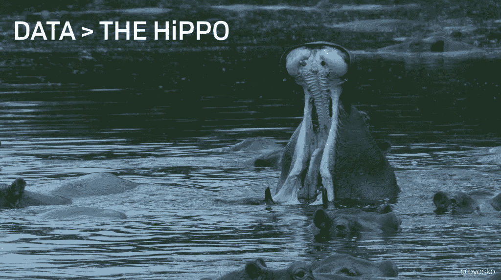

# 数据是复杂的，但我们如何沟通它并不一定

> 原文：<https://medium.com/hackernoon/data-is-complex-but-how-we-communicate-it-doesnt-have-to-be-73094b41001>

最近，我在布达佩斯的一个会议上发表了讲话。这是一次很棒的经历。对于对[数据](https://hackernoon.com/tagged/data)感兴趣的人(如数据分析师、科学家、产品经理等)来说，本次会议是一个绝佳的机会。)话虽如此，我并不是数据科学家。我不会把大部分时间花在存储、组织和筛选数据上。我还不够聪明！

我也喜欢简单的事情，或者更好地说，我喜欢尽可能地简化事情。我越是想起我和 Alistair 年前写的《T4 精益分析》(Lean Analytics)这本书，就越是意识到这本书的核心信息是:数据是关于简化和沟通的。我不知道书中是否充分表达了这一点，但这就是为什么我们要写博客，以调整和发展我们对各种主题的想法。

因此，在为我在 CrunchConf 的演讲做准备时，我问自己:*“我如何利用我所掌握的关于产品管理和数据的知识，以及* [*与*](https://hackernoon.com/tagged/communicate) *进行有效而简单的沟通，从而让数据专家听众不必看起来像个笨蛋？”*

这就是我想出的办法。(你可以当法官。)这里没有背景音乐，幻灯片上的文字也很少，但希望演示文稿本身能有所帮助。

以下是我希望传达的关键信息:

*   **答案不是更多的数据，而是更多的过程。**我知道“过程”这个词很吓人，但我真的相信打造更好产品的答案就在过程中……这只是*什么是*过程*以及*我们如何实现的问题。要做一件事，需要经历一个痛苦而漫长的千步过程，这显然不是答案。从根本上说，这就是为什么我认为 Lean Startup 如此受欢迎，因为它提供了一个更简单、更快速的工作流程。
*   但是精益创业并不像我们希望的那么容易。多么令人震惊，没有灵丹妙药。没有简单的答案。狗屎是很难的，它需要大量的工作。如果你尝试过在你的组织中实施精益创业，你就会知道我在说什么。Build- > Measure- > Learn 看起来如此简单而优雅(在某些方面确实如此)，但要实现起来却很难。我这次演讲的目标是打破这个循环的某些部分(特别是围绕想法产生和分类)，希望让这个过程更清晰。
*   **你不能忽视定性数据。**定性数据是大多数产品决策的无名英雄。如果你过于依赖直觉，没有真实的数据，你就有被自己的偏见蒙蔽的风险；但是如果你完全忽视你的直觉，你将会从产品制造过程中吸取魔力。
*   **客户的意见非常重要。**客户不能告诉你要造什么(因为他们其实不知道)，但是他们有痛苦。客户/用户有问题。你需要倾听这种痛苦，并深深地欣赏/理解它，这样你就可以将这种痛苦转化为解决方案。您将在第 29 张幻灯片中看到，我将“客户输入”作为围绕构建- >衡量- >学习的一个循环。这不仅仅是在一个时间点的单一输入，你应该不断地收集客户的输入。但是要做好。
*   企业目标有好有坏。你不能忽视公司目标。好的团队让每个人都围绕着一个共同的使命和目标。差的是错位的，不会为客户创造真正的价值。如果你曾经在生活中的任何地方工作过，这应该会引起你的共鸣，因为几乎每个公司都有好的和坏的企业目标。它们是等式中必要的输入，但是很难管理。
*   **数据是产品开发流程的关键输入和过滤器。**参见幻灯片 39–41。数据是一个关键的输入，它给了我们建造什么的想法。如果你正在使用数据，你会知道这是如何工作的。但数据也是一个过滤器，用来平衡流程中的其他输入，其中大部分是定性的。所以数据既是输入又是过滤器。您将在第 40 张幻灯片中看到，我将“数据”作为一个圆圈，围绕着构建- >衡量- >学习。我不是可视化专家，但我想说的是，它无时无刻不在，而且对帮助做出好的决定是必要的。
*   **数据也是一种交流工具。**我之前提到了这一点，但我认为这很关键。我认为这是数据科学家和分析师的重要一课，他们可能会发现自己迷失在数据中。如果你不能有效地沟通数据，没人会在乎。更糟糕的是，他们会竭尽全力忽略这些数据(见幻灯片 47)。如果我们希望数据被有效地用作输入，并过滤到产品管理/开发过程中，那么我们有责任让数据简单易懂。

**演示的标题幻灯片上有“数据+勇气”的字样，因为我真诚地相信你需要两者的结合来构建伟大的产品。**你不可能单独和他们中的一个人赢。关键是，由于大多数人/公司今天过于依赖他们的勇气(或河马的声音/最高收入的人的意见！)，就是让数据平易近人，人人可用。让数据对每个部门都有意义，以便他们希望在日常决策过程中使用这些数据。

**数据是复杂的，但我们交流的方式不一定如此。**

*PS。*[*Unsplash*](http://unsplash.com/)*是一个令人敬畏的照片来源。*

> [黑客中午](http://bit.ly/Hackernoon)是黑客如何开始他们的下午。我们是阿妹家庭的一员。我们现在[接受投稿](http://bit.ly/hackernoonsubmission)并乐意[讨论广告&赞助](mailto:partners@amipublications.com)的机会。
> 
> 如果你喜欢这个故事，我们推荐你阅读我们的[最新科技故事](http://bit.ly/hackernoonlatestt)和[趋势科技故事](https://hackernoon.com/trending)。直到下一次，不要把世界的现实想当然！

