# Javascript 开发人员的数据科学—教程

> 原文：<https://medium.com/hackernoon/data-science-for-javascript-developers-2cc3fb1fbefc>

我喜欢 Javascript。我认为它是一种伟大的编程语言。它是一种通用的、不断发展的、不断成长的语言。它实际上是唯一一种既能在客户机上运行又能在服务器上运行的语言。NPM，节点的包装系统，是伟大的。对于许多人来说，Javascript 是他们的第一种(有时是唯一的)编程语言。但是说到数据科学，就全是 Python(或者 R)了。虽然 Python 是一种很棒的编程语言，但我看不出 Python 比 Javascript 更适合数据科学的任何理由。它们都是解释型、非类型化的编程语言。它们都可以包装计算密集型代码的 C 库。然而，今天，数据科学是用 Python 完成的。

本教程的目标是打开使用 Javascript 进行数据科学编程的大门。本教程面向没有任何数据科学经验的 Javascript 程序员。我的下一篇文章是关于文本分析的。这里可以看[。](/@elshor/learning-to-talk-about-wine-using-javascript-7b59d0e0a0f)

# Jupyter 笔记本

最初为 Python 开发的一个伟大的数据科学工具是 [Jupyter Notebook](http://jupyter.org/) 。我喜欢把它看作是一个结合了 REPL 编程的真正复杂的控制台。笔记本是一系列的单元。每个单元格可能包含代码，可以执行这些代码并在代码后显示其输出。上下文从一个单元到另一个单元保存，即在第一个单元中声明的变量可以从后续单元中访问。神奇的是，虽然游戏机只能显示基于字符的输出，但笔记本可以显示视觉效果，如 HTML、SVG 和图像。这对于数据科学极其重要，因为可视化是理解数据的关键。笔记本用于数据科学时，通常显示表格、图表和其他数据可视化。使用简单的旧命令行是做不到的

这只是最基本的。以下是一些让笔记本变得非常酷的功能:

*   您可以执行和重新执行代码。输出存储在笔记本中
*   您可以添加减价单元格，记录您所做的工作。这使得笔记本成为展示代码和编程思想的一个非常好的工具
*   您可以在开发笔记本时设置检查点，如果您的操作破坏了笔记本，可以回滚到这些检查点
*   你可以下载各种格式的笔记本(HTML，PDF 等。)并分享出来。你可以点击查看这篇文章中代码的 HTML 下载[。](https://elshor.github.io/Data+Science+in+Javascript.html)

Jupyter notebook 最初是为 python 环境开发的，所以单元格中的代码只能由 Python 编写。随着平台的发展，[增加了额外的语言(称为内核)](https://github.com/jupyter/jupyter/wiki/Jupyter-kernels)。在本教程中，我们将使用 Javascript 内核 [IJavascript](https://github.com/n-riesco/ijavascript) ，它使得运行 Javascript 代码成为可能。用 Javascript 开发笔记本的另一个可能选项是带有[节点插件](https://github.com/ibm-watson-data-lab/pixiedust_node)的[pixedust 内核](https://github.com/ibm-watson-data-lab/pixiedust)。如果你想走“PixieDust 之路”，我推荐[https://github.com/n-riesco/ijavascript#installation](https://medium.com/u/aa2d4b99093e#installation)的指示。注意，您需要使用`ijsinstall`实用程序来允许 Jupyter 使用 Javascript 内核。

## 创建 Javascript 笔记本

安装完 IJavascript 内核后，单击 Jupyter 服务器主页中的“New”按钮，将显示创建“Javascript (Node.js)”笔记本的选项。选择该选项并创建 Javascript 笔记本。它将打开一个只有一个空代码单元的空笔记本。

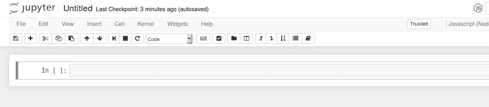

将以下完全不可预测的代码写入单元格:

```
console.log('Hello World');
```

文本将出现在您的笔记本中。

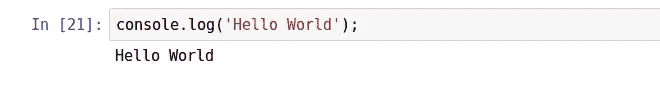

如您所见，输出打印在代码单元之后。

这对于纯文本来说是一个很好的选择，但是笔记本是用来可视化的。IJavascript 内核提供了一个全局对象`$$`,可用于笔记本通信和显示。例如，下面的代码打印 HTML 输出。这是代码单元及其输出的屏幕截图:

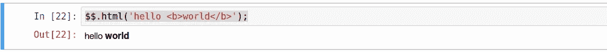

我们不会深入讨论 IJavascript API 的细节。你可以在这里阅读更多信息[。](http://n-riesco.github.io/ijavascript/doc/custom.ipynb.html)

## 正在安装 dstools 包

我们需要`dstools`包来运行这个教程。软件包应该从笔记本的同一个目录安装。使用 npm 简单安装它。

```
$ npm install dstools
```

编辑笔记本非常简单。您可以使用按钮、菜单或快捷键。使用 Ctrl+Enter 执行选定的单元格。如果由于某种原因内核卡住了，或者你只需要重启内核，使用内核菜单项来重启。

如果您愿意，您可以在自己的计算机上查看、下载和运行该笔记本。笔记本在 [github](https://github.com/elshor/notebooks/blob/master/Data%20Science%20in%20Javascript.ipynb) 上或者你可以查看[静态 HTML 下载](https://elshor.github.io/Data+Science+in+Javascript.html)。

所以让我们开始吧。

## 加载数据

没有数据，数据科学就没有多大意义。在本教程中，我们使用 Kaggle 托管的房价数据集。从[https://www . ka ggle . com/c/house-prices-advanced-regression-techniques/data](https://www.kaggle.com/c/house-prices-advanced-regression-techniques/data)下载 train.csv 文件。查看数据字段描述，以便更好地理解数据。下载文件并将其存储在您的文件系统中。

大多数数据集以 csv 格式存储。我们将使用 dstools 包来加载数据。

```
ds = require('dstools');
train = ds.Collection().loadCSV('/path/to/data/houseprices/train.csv')
```

`ds.Collection`函数创建一个集合包装器对象。然后可以将各种 dstools 函数链接到包装器对象，就像将 jQuery 函数链接到 jQuery 对象一样。我们在这里使用`loadCSV`函数来加载数据。它作为对象数组存储在包装器中，每个对象代表一个数据点。对象属性是数据点要素(或字段)。

查看前几行对了解数据很有用。head 函数返回前 n 行的集合。`show`功能显示数据表。

```
train.head(5).show();
```

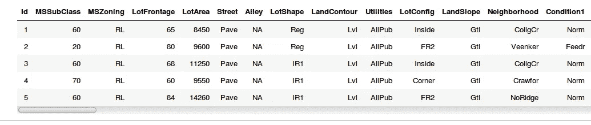

每一行都是代表房屋销售的数据点。每个数据点都有相当多的字段(特征)。最重要的字段是最后一个，SalePrice。数据字段的描述可以在数据存储库中的“data description.txt”文件中找到。有些字段是定量的，即它们有一个数值，如销售价格。Others 表示 PavedDrive 之类的类别，可以是 Y(是)、P(部分)或 N(否)之一。每个字段的可能类别的描述可以在“description.text”文件中找到。

## 分析分布

接下来，我们想更好地理解我们的数据收集的房价特征。统计学中的一个重要概念是分布。

> 概率分布是一个数学函数，简单来说，它可以被认为是提供了实验中不同可能结果出现的概率。例如，如果随机变量 X 用于表示掷硬币的结果(“实验”)，那么 X 的概率分布将取值 0.5 表示 X =正面，0.5 表示 X =反面(假设硬币是公平的)。

首先，我们将使用 dstools 函数`describe`对房价分布有一些基本的了解。`describe`功能显示了最重要的分配措施。

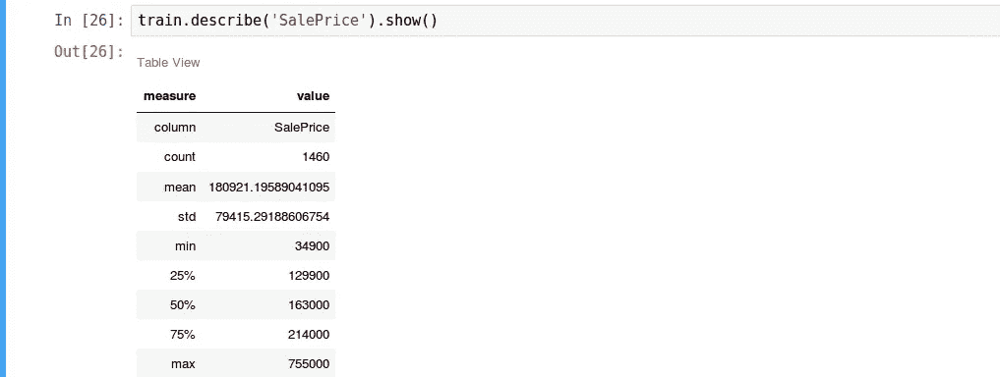

我们可以看到平均值约为 180，921，标准偏差为 79，415。四分位数让我们更好地理解大部分房屋的售价。50%的房屋售价在 129，900 至 214，000 英镑之间(25%至 75%四分位数之间)。

describe 函数让我们对分布有了一个大致的概念，但是我们真的希望将分布可视化。眼见为实是理解的。为此，我们使用**直方图**。

对于数据可视化，我们使用包装在 dstools 包中的优秀的 [plotly](https://plot.ly/) Javascript 库。显示数据的可视化是通过将`plotly`函数链接到数据包装器来完成的。你可以在这里找到使用 plotly [的文档。当使用 plotly 和 dstools 时，`plotly`函数创建 HTML 可视化。你需要用`show`函数链接它来显示情节。`plotly`函数用列数据替换`x`和`y`属性(在我们的例子中，列为‘销售价格’)。如果`x`的值为`this`，则其值被设置为包含的数据本身。这在包装矢量而不是数据集时很有用。](https://plot.ly/javascript/)

```
train.plotly([{type:'histogram',x:'SalePrice'}]).show();
```

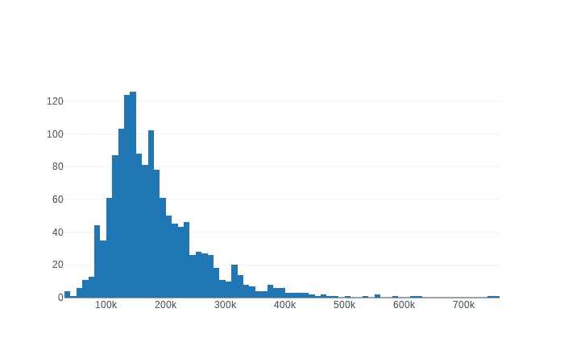

直方图对所有房价进行排序，并将其放入箱中。每个框代表一个价格范围。Y 轴显示每个箱中有多少个数据点。

dstools 模块为本教程中的所有可视化(包括直方图)提供了方便的函数。直方图`function`接受一个参数，即要在直方图中显示的字段的名称。

```
train.histogram('SalePrice').show();
```

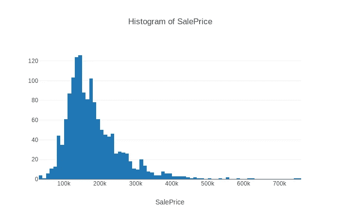

通过查看直方图，我们可以看到销售价格分布以 126K 为中心。我们还可以看到分布是偏斜的，或者说不对称的。下面是维基百科关于**偏斜度的说法:**

> 在概率论和统计学中，偏度是实值随机变量关于其均值的概率分布的不对称性的度量。偏斜值可以是正的或负的，也可以是未定义的。

偏斜值为 0 表示分布不偏斜。负偏度表示分布是左偏的，正偏度表示分布是右偏的。

我们可以使用偏斜度函数来测量偏斜度。偏斜度是一个原始值(数字)，所以不需要链`show`函数。

```
train.skewness('SalePrice');//1.8809407460340324
```

另一个有趣的分布度量是**峰度**，测量分布的尾密度。用维基百科的话说:

> 在概率论和统计学中，峰度(来自希腊语:κυρτός，kyrtos 或 kurtos，意思是“弯曲的，拱形的”)是对实值随机变量概率分布的“尾部”的度量

值越高，尾部的数据点越多，尾部越长。正态分布的值为 0。

```
train.kurtosis('SalePrice');//6.509812011089419
```

当然，可以显示分类字段的直方图，如 PavedDrive。直方图将显示每个路面驱动类别的数据点数。毫不奇怪，几乎所有的销售都是有铺面车道的房子。

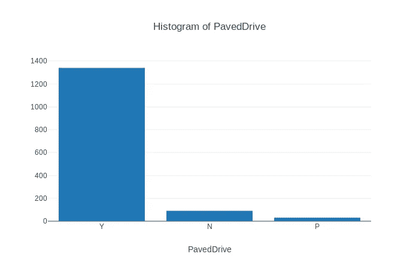

# 查找特征之间的关系

我们现在了解了房价的分布，但我们真正感兴趣的是探索不同特征之间的**关系**。我们想了解房屋的价格与其他特征的关系，如地段面积、房屋建造年份或房屋是否有壁炉。

## 相关图

我们将使用的第一个工具是**关联图**。让我们从维基百科对相关性的定义开始:

> 在统计学中，相关性或关联性是两个随机变量或二元数据之间的任何统计关系，无论是否是因果关系。相关性是一大类包含相关性的统计关系中的任何一种，尽管在通常的用法中，它通常指的是两个变量彼此之间有多接近线性关系。依赖性现象的常见例子包括父母及其子女的身体状况之间的相关性，以及对产品的需求与其价格之间的相关性。

关联图是显示所有数据点特征之间关联的热图。`corrmap`函数为所有数据字段生成关联图

```
train.corrmap().show()
```

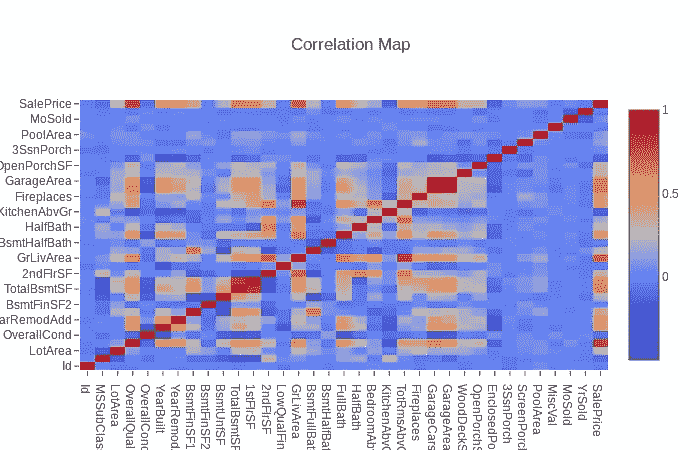

相关性可以在-1 和 1 的范围内。值为 1 表示要素正相关，即它们向同一方向移动。零相关意味着特征不相关。负相关意味着当一个特性的值上升时，另一个特性的值下降。红色表示正相关。负相关用蓝色表示。两个相同特征之间的相关性始终为 1。你可以在地图上看到这条红色的斜线。

从相关图中我们可以看到，“地下室总面积”和“首层面积”是正相关的。这是因为地下室通常在一楼。特征“地上总面积”、“居住面积”和“整体质量”与“销售价格”正相关。居住面积越大，房子越贵。特征“建造年份”与特征“封闭门廊面积”负相关。这意味着，新房子的门廊更小。

## 散点图

关联图非常有助于将我们的注意力引向特征之间的有趣关系。我们使用**散点图**来理解特征之间关系的本质。我们注意到了居住面积和房价的相关性。让我们来看一下这两个特性的散点图。

```
train.scatterPlot('SalePrice','GrLivArea').show();
```

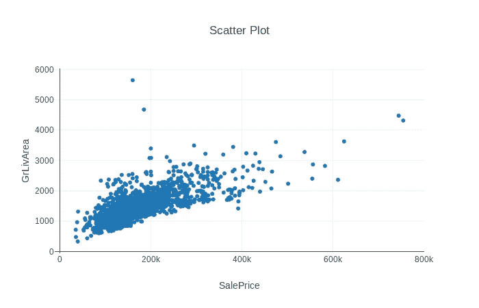

X 轴代表销售价格。Y 轴，地上生活区。这种关联现在已经很清楚了。您可以想象一条代表销售价格和面积之间关系的线。你也可以看到离线很远的特定点，比如顶部 100k 到 200k 之间的两个点。这些数据点不遵循一般规律。

## 箱形图

散点图适用于比较两个连续特征，但不适用于分类特征。为此我们可以使用**箱线图**。

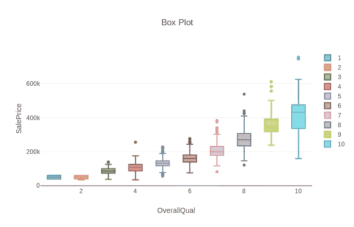

在本例中，每个方框代表具有特定质量分数(1 到 10)的所有数据点。盒子中心的线是中间值。底部框线是 25%的百分位数，顶部框线是 75%的百分位数。这让我们很好地了解了 50%的数据点在哪里(在盒子里面)。胡须代表最大值和最小值，不包括异常值。异常值是指与其余数据相距甚远的数据点(高于或低于方框 1.5 倍四分位范围)。它们是单独呈现的。您可以看到，总体质量为 8 的数据点有 4 个异常值，3 个在顶部晶须上方，1 个在底部晶须下方。阅读[此处](http://www.physics.csbsju.edu/stats/box2.html)获得更详细的方框图解释。

请注意，连接这些盒子会产生一条假想的线，但这条线不是直的。它更像是一根原木线。这表明两个特征之间的关系不是线性的，而是更像对数。我们可以用函数代替字符串`SalePrice`来绘制销售价格的日志，而不是实际销售价格。

```
train.boxPlot('OverallQual',(data)=>Math.log(data['SalePrice'])).show()
```

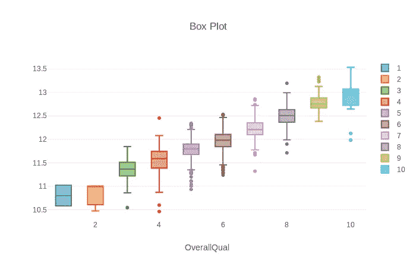

现在我们可以看到盒子更接近一条假想的直线。

# 最后的话

在本教程中，我们仅仅触及了基础。重要的一课是，使用 Javascript 数据科学是可能的。可视化可以使用 plotly 和 Highchart 等前端库来完成。NPM 上有很多统计分析和机器学习的软件包。我的下一篇文章讨论[文本分析和 word2vec 模型](/@elshor/learning-to-talk-about-wine-using-javascript-7b59d0e0a0f)。在 Javascript 中提供所有这些工具使得数据科学和机器学习可以被更大的开发人员社区所使用。