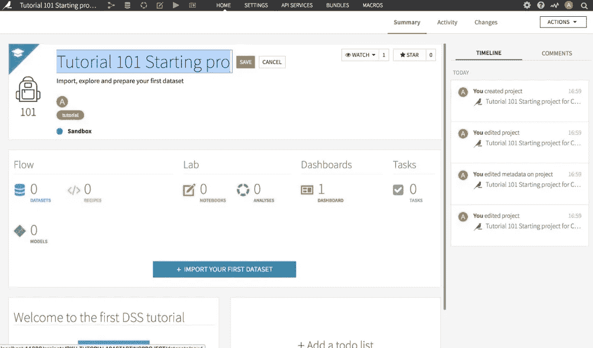
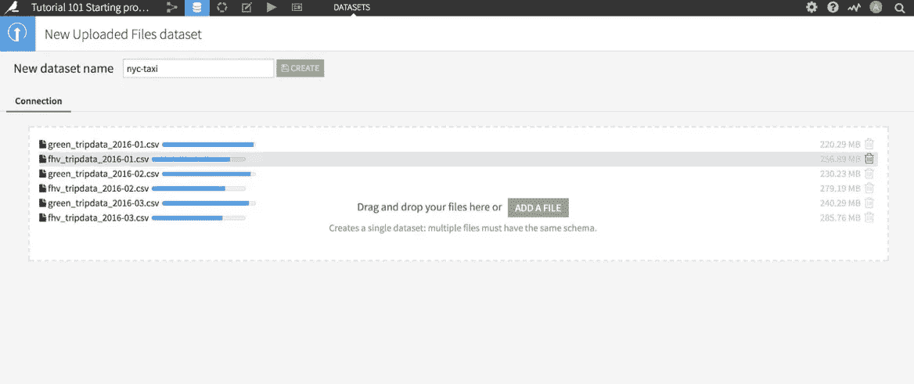
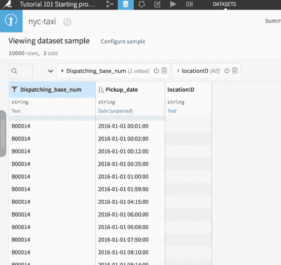
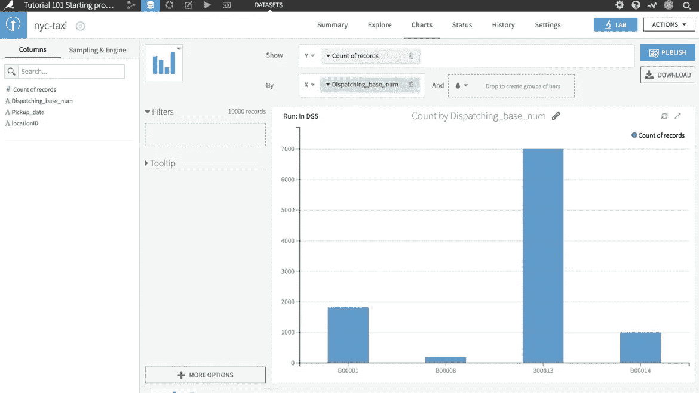
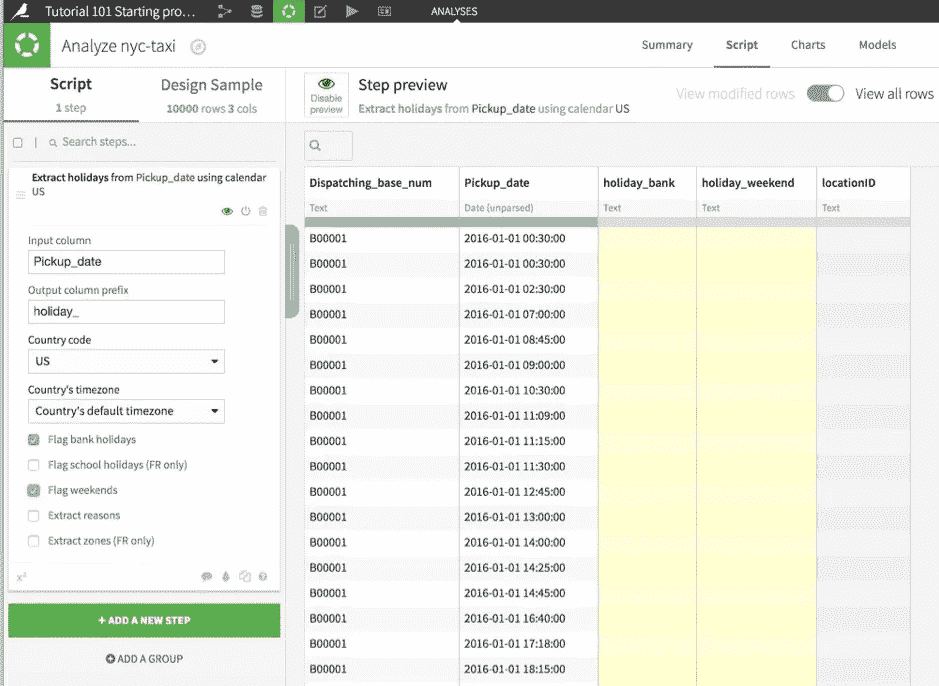
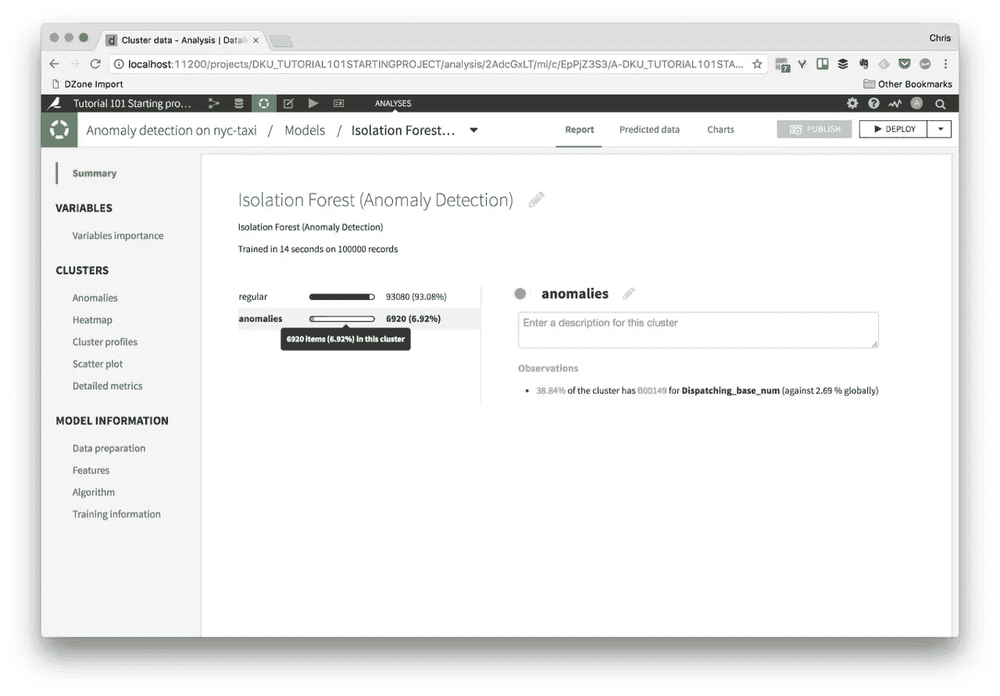

# 数据科学与 Dataiku

> 原文：<https://medium.com/hackernoon/data-science-in-a-box-with-dataiku-8ee10910fe79>

数据科学是一个新的热点，数以千计的职位发布(其中一些真的不是数据科学)，几十个平台承诺帮助该领域的专业人员更有效地工作。通常，并非所有这些工具都是新的，而是重新用于新的用例，由于数据科学的“新”领域，Python、R 和 Hadoop 等工具经历了新的兴趣热潮。

我见过的构思最好、最具凝聚力的工具之一是 Dataiku。它旨在将数据科学家及其团队可能需要的所有工具打包在一个应用程序中。

为了对数据库进行实验，你需要一个相当大的数据集，我选择了历史悠久的[纽约市出租车旅行记录](http://www.nyc.gov/html/tlc/html/about/trip_record_data.shtml)，但为了我笔记本电脑的健康，我使用了几千兆字节的数据。

Dataiku 由一些开源组件组成(其中许多你可能认识)，但该软件是与专有代码绑定在一起的闭源软件，[有免费版和企业版](https://www.dataiku.com/dss/editions/)，你可以在本地或云中安装。对于这篇评论，我将使用 Mac 版的免费桌面客户端。

下载应用程序，运行它，你的浏览器会自动打开到 [http://localhost:11200。](http://localhost:11200.)然后前往*新项目*部分，选择其中一个助手让你开始，我选择了“教程 101 开始项目”

您可以从本地或服务器文件系统、Hadoop、各种 SQL 和 NoSQL 源、云存储提供商以及[插件](https://www.dataiku.com/dss/plugins/)提供的更多选项中导入数据。扫描完数据后，Dataiku 提供了一个预览和一些调整导入和模式的选项，然后您可以通过单击绿色的 *create* 按钮来创建数据集。

接下来，您将看到*数据浏览*屏幕，您可以在其中查看、过滤、排序和分析(提供基于列的概览)您的数据。也有用于特定数据类型的处理器，例如地理编码位置数据。您可以通过拖放字段或在预览类型之间切换来创建各种图表。

到目前为止是有用的，但是你也可以将 GUI 界面与 Python、R 和 SQL 混合搭配，如果你曾经使用过 Jupyter 笔记本，那么这种风格你会很熟悉。我不是 Python 程序员，但谢天谢地还有一个内置的控制台和调试器来帮助我找出问题所在。

对于非编码人员，Dataiku 提供了内置的机器学习模型，用于预测和聚类数据，并能够创建自己的学习模型并训练它们。同样，创建你自己的是一个点击，拖动和选择选项的问题，例如，我创建了一个模型来显示在美国的周末和公共假期有哪些出租车接送。

最后，将所有这些组件组装在一起的是工作流部分，在这里您可以定义运行哪些步骤，以什么顺序运行，手动触发，或者通过 REST API 以编程方式触发。

这只是任何需要处理和分析大型数据集的人使用 Dataiku 可以完成的事情的皮毛，你可以在他们的网站上找到更多细节，或者听听我对该公司产品经理 Claude Perdigou 的采访。

https://soundcloud.com/gregarious-mammal/dataiku-interview

【dzone.com】最初发表于**。**